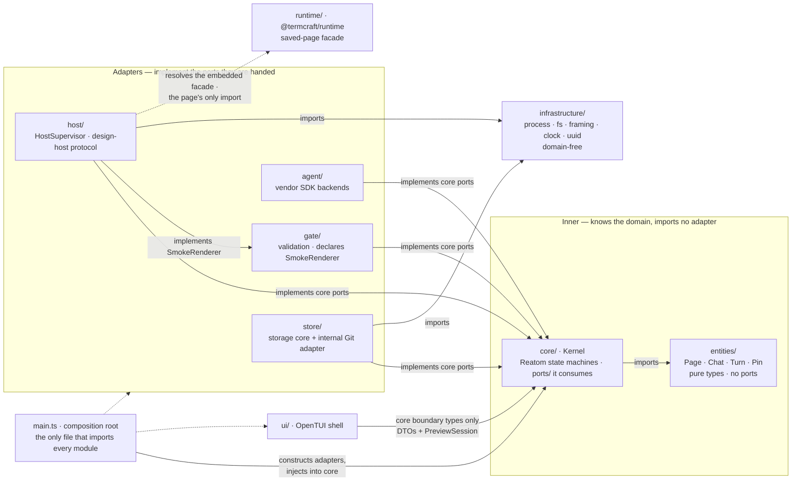

termcraft groups source by entity and feature, and applies clean-architecture
layering *inside* modules rather than across the repository. This document fixes
where a file goes, which direction its imports may point, and which shapes are
forbidden. It is the one document in `docs/architecture/` written for a reader who
*does* read the source language; the others deliberately are not.

No source exists yet. This is the contract new modules are written against, and its
source anchors move to real paths as they land.



## Walkthrough

1. **Top-level layout.** The seven modules of the design spec (§4.1) survive intact
   as the unit of extraction; `entities/`, `infrastructure/`, and the composition
   root are the additions this convention makes.

   ```text
   src/
     main.ts            composition root — the only file that imports every module
     entities/          pure domain types; no ports, no I/O
       page/  chat/  turn/  pin/
     core/              Kernel — the only domain decision-maker
       ports/           contracts core consumes: GitHistory, GitCommitter, AgentBackend…
       turns/  versions/  export/  chats/
       types.ts
       index.ts
     store/             project state; implements core ports
       chats/  pages/  pins/  transactions/  git/
       types.ts
       index.ts
     agent/             AgentBackend over the vendors' official TypeScript SDKs
     gate/              validation; declares the SmokeRenderer port it consumes
     host/              HostSupervisor, PreviewSession, design-host protocol
     ui/                OpenTUI shell; imports core's boundary types only
     runtime/           @termcraft/runtime — saved-page facade; leaf
     infrastructure/    domain-free technical capabilities
       process/  fs/  framing/  clock/  uuid/
   ```

2. **Feature-first, recursively.** Grouping is by entity or feature at every level;
   a technical layer never names a top-level folder. Each module — and each
   submodule — takes the shape fixed in `CLAUDE.md`: `ui/`, `model/`, `types.ts`,
   `index.ts`, plus `ports/` where the module declares contracts it consumes. A
   submodule appears when an entity has both its own model and its own boundary, not
   before; a *submodule* holding one file means the split was premature. The layer
   folders inside it are a different matter and are not optional: `CLAUDE.md` puts
   code in `model/` (or `ui/`) even when that folder holds a single file.

3. **`entities/` holds domain types, not domain contracts.** The name is
   deliberately narrower than "domain". In classic DDD the domain layer also holds
   repository interfaces; termcraft does not put them there, and a folder named
   `domain/` would promise otherwise. `core` is the domain layer in the
   architectural sense — [`modules.md`](modules.md) calls it "the only domain
   decision-maker". `entities/` is only its vocabulary: the `Page` slug, `Chat`,
   `Turn`, and pin types that several modules name.

4. **The consumer declares the port.** `core` consumes `GitHistory` and
   `GitCommitter`, so it declares them in `core/ports/`; the Git adapter inside
   `store` implements them. A port lives at the lowest common ancestor of its
   consumers and never higher: one consumer puts it beside that consumer, several
   features inside a module put it in the module's `ports/`. `GitHistory` sits at
   `core/ports/` because project inspection, page history, and Restore all consume
   it. When a second consumer appears the port moves up one floor; it is never
   copied.

5. **Two consumers in different modules mean two narrow ports.** `core` drives
   `PreviewSession` for the live preview; `gate` needs a single smoke render of a
   candidate. They do not share one wide `HostSupervisor` contract: each declares
   the slice it needs, and the `host` module implements both. Interface segregation
   is what replaces a shared contracts pile — there is no folder where unrelated
   modules deposit interfaces, and the port placement rule therefore never runs out
   of floors.

   The names in this document divide in two. `GitHistory`, `GitCommitter`,
   `AgentBackend`, `HostSupervisor`, and `PreviewSession` come from the specs and are
   fixed. `SmokeRenderer`, `GitCliAdapter`, and `CodexBackend` are this document's
   illustrations of the rule; the code may name them otherwise.

6. **`infrastructure/` is domain-free, and the test is mechanical.** Does the file
   know what a `Page`, `Turn`, or `Chat` is? If it does, it belongs to a module. If
   it does not, it belongs to `infrastructure/`. Process spawning, file I/O,
   length-prefixed framing, the clock, and UUIDv7 generation pass. `GitCliAdapter`
   and `CodexBackend` fail — they speak the domain and stay inside `store` and
   `agent`. This keeps `infrastructure/` small and boring by construction, and keeps
   the Git adapter an internal Project-store adapter rather than the eighth
   top-level component the specs forbid.

7. **`core` imports no other module.** It imports `entities/` and its own `ports/`,
   nothing else. `main.ts` constructs the adapters and injects them; the arrows in
   [`modules.md`](modules.md) (`kernel --> pstore`, `kernel --> host`, …) are
   runtime calls, not imports. Three things follow: no import cycle between `core`
   and `store` even though each needs the other's names; `core` is testable against
   fakes without a Git CLI or a host subprocess; and the module graph stays a DAG,
   which is what "extractable into a workspace package later without rewrites"
   (§4.1) actually requires. The cost is real — every new wiring goes through the
   composition root instead of a direct import.

8. **When the choice of implementation is domain state, the port exposes the
   choice.** Not every port binds to one implementation at startup. The agent picker
   (§3.6) lists the model and effort combinations of every installed backend at once
   and lets the user switch between turns, and the stored `(agent, model, effort)`
   triple is domain state the Kernel owns. So `core` consumes a registry — enumerate
   the available backends, take one by id — rather than a single `AgentBackend`;
   `main.ts` supplies the registry with the backends the build knows about, and
   `core` selects from it. The division holds generally: the composition root wires
   *what exists*, the Kernel decides *what is used*. Item 7 is untouched — `core`
   still imports no backend, and `AgentBackend` remains a spec-named port while the
   registry around it is this document's shape.

9. **Two entry points, one binary — per platform, and not everything is inside it.**
   `bun build --compile` ships the shell and the design-host entry together (§4.1).
   `termcraft _host` is a second, much smaller composition root: it wires the
   host-side protocol and the embedded runtime, and never constructs `core`,
   `store`, or `ui`. Two qualifications the packaging story now carries. The
   TypeScript compiler is not callable from inside the binary at the pinned major —
   it is a per-platform native executable that `gate` extracts once to a per-user
   directory and spawns, which makes the build itself per-platform (one build per
   target, each carrying that platform's compiler package). And `host`'s resolution
   of the embedded facade is a runtime resolver plugin registered before the dynamic
   import, serving three specifiers: `@termcraft/runtime` plus the two
   compiler-generated JSX helper subpaths, which must resolve or a real page fails to
   load. Item 10's "only import" is about what a page's *author* may write; the
   helper import is emitted by the transform.

10. **`ui` and `runtime` are the edge cases.** `ui` imports `core`'s boundary types —
    Command/Result/Event DTOs plus the `PreviewSession` facade the Kernel hands it —
    and nothing else from any module: never `store`, never host stdio. `runtime` is a
    leaf that imports no termcraft module: it is the saved-page facade (§5), resolved
    from the binary by design code running inside the host. It also owns the JSX
    helper surface the transform emits against — not authored-public, and no page may
    name it, but a contract the module cannot get wrong all the same.

11. **Forbidden shapes.** These are review-blocking:

    | Shape | Why |
    |---|---|
    | `core` importing `store`, `agent`, `gate`, or `host` | breaks the DAG and the composition root |
    | ports in `entities/` | reintroduces the central contract pile |
    | domain-aware adapters in `infrastructure/` | fails the `Page` test; creates an eighth component |
    | a shared `contracts/` folder | segregation replaces it |
    | layer folders at top level (`services/`, `controllers/`, `models/`) | grouping is by entity, not layer |
    | `ui` importing `store`, `host`, or Git | the Kernel is the only decision-maker |
    | a saved page importing Reatom, React, OpenTUI, or anything but `@termcraft/runtime` | §5.8 import allowlist |

## Source anchors

- `CLAUDE.md` — Code style: the module shape (`ui/`, `model/`, `types.ts`,
  `index.ts`) and the atomic-function rule this document builds on
- `docs/superpowers/specs/2026-07-13-termcraft-design.md` — §4.1 the seven modules,
  strict boundaries, workspace extractability, and the transport-neutral Kernel
  boundary; §4.2 the design host; §5.8 the saved-page import allowlist; §6.1 the
  mechanism-blind `AgentBackend` contract; §3.6 the runtime-selected agent triple
- `docs/superpowers/specs/2026-07-16-git-backed-page-history-design.md` — the
  `GitHistory`/`GitCommitter` port definitions and the Git adapter's placement
  inside the Project store
- `docs/superpowers/specs/2026-07-16-host-supervision-protocol-design.md` —
  `HostSupervisor` and `PreviewSession` ownership, and the Gate's smoke-render path
- `docs/superpowers/specs/2026-07-16-runtime-api-compatibility-design.md` — §3.1 the
  three-specifier resolver and the facade-owned JSX helper contract that fix what
  `runtime/` and `host/` each own
- [`modules.md`](modules.md) — the same seven components as runtime roles, and the
  Kernel's authority this layout encodes
