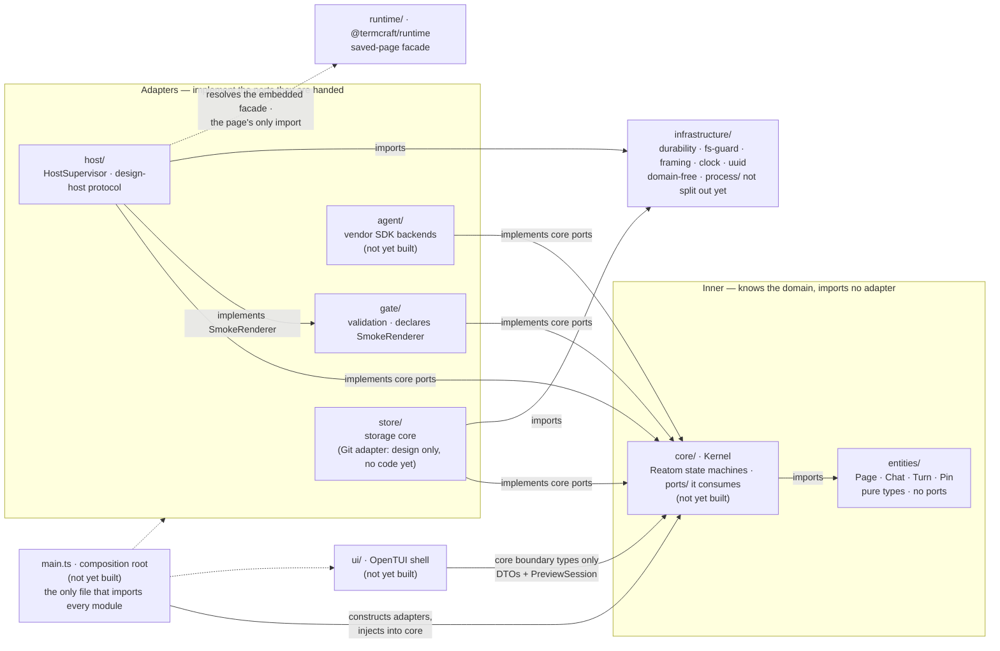

termcraft groups source by entity and feature, and applies clean-architecture
layering *inside* modules rather than across the repository. This document fixes
where a file goes, which direction its imports may point, and which shapes are
forbidden. It is the one document in `docs/architecture/` written for a reader who
*does* read the source language; the others deliberately are not.

Six source modules have landed: `entities/`, `infrastructure/`, `runtime/`,
`host/`, `gate/`, and `store/` are real source today. Four of those are components
the design spec names — [`modules.md`](modules.md) counts the same four (runtime
facade, Gate, HostSupervisor, Project store) — while `entities/` and
`infrastructure/` are additions this convention makes on top of the seven.
`core/` (the Kernel), `agent/`,
`ui/`, and the `main.ts` composition root do not exist yet — this document is still
their contract, and every section below marks the parts that describe them as not
yet built. Source anchors move to real paths as each piece lands; see
`## Source anchors`.



## Walkthrough

1. **Top-level layout.** The seven modules of the design spec (§4.1) survive intact
   as the unit of extraction; `entities/`, `infrastructure/`, and the composition
   root are the additions this convention makes.

   ```text
   src/
     main.ts            composition root — the only file that imports every module
                         (not yet built)
     entities/          pure domain types; no ports, no I/O            [landed]
       page/  chat/  turn/  pin/
     core/              Kernel — the only domain decision-maker         (not yet built)
       ports/           contracts core consumes: GitHistory, GitCommitter, AgentBackend…
       turns/  versions/  export/  chats/
       types.ts
       index.ts
     store/             project state; implements core ports            [landed]
       safe-fs/  lease/  trust/  toml/  jsonl/  transaction/
       sandbox/  migration/  projections/  model/
       types.ts
       index.ts
     agent/             AgentBackend over the vendors' official TypeScript SDKs
                         (not yet built)
     gate/              validation; declares the SmokeRenderer port it consumes [landed]
     host/              HostSupervisor, PreviewSession, design-host protocol    [landed]
     ui/                OpenTUI shell; imports core's boundary types only       (not yet built)
     runtime/           @termcraft/runtime — saved-page facade; leaf            [landed]
     infrastructure/    domain-free technical capabilities                     [landed]
       clock/  durability/  fs-guard/  framing/  uuid/
       (process/ not split out yet — process spawning still lives inside
        host's supervisor, see item 6)
   ```

   `store/` groups by concern (`safe-fs`, `lease`, `trust`, `toml`, `jsonl`,
   `transaction`, `sandbox`, `migration`, `projections`) rather than by the
   `chats/`/`pages/`/`pins/`/`git/` split this document originally sketched. The
   `ManifestStore`/`WorkspaceStateStore`/`ChatStore`/`PinStore`/`PageStore` port
   contracts are assembled from those submodules inside
   `store`'s own composition root (see Source anchors), not held in their own
   top-level folders — and no `git/` submodule exists: the Git adapter item 4
   mentions has no code yet at all.

2. **Feature-first, recursively.** Grouping is by entity or feature at every level;
   a technical layer never names a top-level folder. Each module — and each
   submodule — takes the shape fixed in `CLAUDE.md`: `ui/`, `model/`, `types.ts`,
   `index.ts`, plus `ports/` where the module declares contracts it consumes. A
   submodule appears when an entity has both its own model and its own boundary, not
   before; a *submodule* holding one file means the split was premature. The layer
   folders inside it are a different matter and are not optional: `CLAUDE.md` puts
   code in `model/` (or `ui/`) even when that folder holds a single file.

3. **`entities/` holds domain types, not domain contracts.** The name is
   deliberately narrower than "domain". In classic DDD the domain layer also holds
   repository interfaces; termcraft does not put them there, and a folder named
   `domain/` would promise otherwise. `core` is the domain layer in the
   architectural sense — [`modules.md`](modules.md) calls it "the only domain
   decision-maker". `entities/` is only its vocabulary: the `Page` slug, `Chat`,
   `Turn`, and pin types that several modules name.

4. **The consumer declares the port.** `core` consumes `GitHistory` and
   `GitCommitter`, so it declares them in `core/ports/`; the Git adapter inside
   `store` implements them. A port lives at the lowest common ancestor of its
   consumers and never higher: one consumer puts it beside that consumer, several
   features inside a module put it in the module's `ports/`. `GitHistory` sits at
   `core/ports/` because project inspection, page history, and Restore all consume
   it. When a second consumer appears the port moves up one floor; it is never
   copied.

5. **Two consumers in different modules mean two narrow ports.** `core` drives
   `PreviewSession` for the live preview; `gate` needs a single smoke render of a
   candidate. They do not share one wide `HostSupervisor` contract: each declares
   the slice it needs, and the `host` module implements both. Interface segregation
   is what replaces a shared contracts pile — there is no folder where unrelated
   modules deposit interfaces, and the port placement rule therefore never runs out
   of floors.

   The names in this document divide in two. `GitHistory`, `GitCommitter`,
   `AgentBackend`, `HostSupervisor`, and `PreviewSession` come from the specs and are
   fixed. `SmokeRenderer`, `GitCliAdapter`, and `ClaudeBackend` are this document's
   illustrations of the rule; the code may name them otherwise.

6. **`infrastructure/` is domain-free, and the test is mechanical.** Does the file
   know what a `Page`, `Turn`, or `Chat` is? If it does, it belongs to a module. If
   it does not, it belongs to `infrastructure/`. Process spawning, file I/O,
   length-prefixed framing, the clock, and UUIDv7 generation pass. `GitCliAdapter`
   and `ClaudeBackend` fail — they speak the domain and stay inside `store` and
   `agent`. This keeps `infrastructure/` small and boring by construction, and keeps
   the Git adapter an internal Project-store adapter rather than the eighth
   top-level component the specs forbid.

   Landed today: durable disk writes, the reparse-point/filesystem-identity checks,
   wire framing, the clock, and UUIDv7 generation all live under `infrastructure/`
   and pass the test — "fs" split into two submodules (`durability/`, `fs-guard/`)
   rather than the one `fs/` folder this document sketches. Process spawning does
   not live there yet: it still sits inside `host`'s supervisor (see Source
   anchors). It passes the same domain-free test in place — nothing about it names
   a `Page`, `Turn`, or `Chat` — so this is an unextracted candidate for
   `infrastructure/process/`, not a violation of the rule.

7. **`core` imports no other module.** It imports `entities/` and its own `ports/`,
   nothing else. `main.ts` constructs the adapters and injects them; the arrows in
   [`modules.md`](modules.md) (`kernel --> pstore`, `kernel --> host`, …) are
   runtime calls, not imports. Three things follow: no import cycle between `core`
   and `store` even though each needs the other's names; `core` is testable against
   fakes without a Git CLI or a host subprocess; and the module graph stays a DAG,
   which is what "extractable into a workspace package later without rewrites"
   (§4.1) actually requires. The cost is real — every new wiring goes through the
   composition root instead of a direct import.

8. **When the choice of implementation is domain state, the port exposes the
   choice.** Not every port binds to one implementation at startup. The agent picker
   (§3.6) lists the model and effort combinations of every installed backend at once
   and lets the user switch between turns, and the stored `(agent, model, effort)`
   triple is domain state the Kernel owns. So `core` consumes a registry — enumerate
   the available backends, take one by id — rather than a single `AgentBackend`;
   `main.ts` supplies the registry with the backends the build knows about, and
   `core` selects from it. The division holds generally: the composition root wires
   *what exists*, the Kernel decides *what is used*. Item 7 is untouched — `core`
   still imports no backend, and `AgentBackend` remains a spec-named port while the
   registry around it is this document's shape.

9. **Two entry points, one binary — per platform, and not everything is inside it.**
   `bun build --compile` ships the shell and the design-host entry together (§4.1).
   `termcraft _host` is a second, much smaller composition root: it wires the
   host-side protocol and the embedded runtime, and never constructs `core`,
   `store`, or `ui`. Two qualifications the packaging story now carries. The
   TypeScript compiler is not callable from inside the binary at the pinned major —
   it is a per-platform native executable that `gate` extracts once to a per-user
   directory and spawns, which makes the build itself per-platform (one build per
   target, each carrying that platform's compiler package). And `host`'s resolution
   of the embedded facade is a runtime resolver plugin registered before the dynamic
   import, serving three specifiers: `@termcraft/runtime` plus the two
   compiler-generated JSX helper subpaths, which must resolve or a real page fails to
   load. Item 10's "only import" is about what a page's *author* may write; the
   helper import is emitted by the transform.

   Landed today: the compiler extraction and the three-specifier resolver both
   match this item exactly. The `_host --stdio` argv check and the injectable
   protocol loop it would drive exist too, but nothing wires them to real process
   stdio yet — no `bun build --compile` binary and no `main.ts` exist, so `termcraft
   _host` is not yet a runnable second entry point, only the engine one would drive.

10. **`ui` and `runtime` are the edge cases.** `ui` imports `core`'s boundary types —
    Command/Result/Event DTOs plus the `PreviewSession` facade the Kernel hands it —
    and nothing else from any module: never `store`, never host stdio. `runtime` is a
    leaf that imports no termcraft module: it is the saved-page facade (§5), resolved
    from the binary by design code running inside the host. It also owns the JSX
    helper surface the transform emits against — not authored-public, and no page may
    name it, but a contract the module cannot get wrong all the same.

11. **Forbidden shapes.** These are review-blocking:

    | Shape | Why |
    |---|---|
    | `core` importing `store`, `agent`, `gate`, or `host` | breaks the DAG and the composition root |
    | ports in `entities/` | reintroduces the central contract pile |
    | domain-aware adapters in `infrastructure/` | fails the `Page` test; creates an eighth component |
    | a shared `contracts/` folder | segregation replaces it |
    | layer folders at top level (`services/`, `controllers/`, `models/`) | grouping is by entity, not layer |
    | `ui` importing `store`, `host`, or Git | the Kernel is the only decision-maker |
    | a saved page importing Reatom, React, OpenTUI, or anything but `@termcraft/runtime` | §5.8 import allowlist |

## Source anchors

Six modules landed; `core/`, `agent/`, `ui/`, and `main.ts` have not (item 1). The
anchors below split accordingly: real files for what exists, design-spec sections
for what is still contract only.

**Module shape (item 2) and the alias map**

- `CLAUDE.md` — Code style: the module shape (`ui/`, `model/`, `types.ts`,
  `index.ts`) and the atomic-function rule this document builds on
- `tsconfig.json` (`compilerOptions.paths`) — the alias map item 2 and `CLAUDE.md`'s
  Imports section enforce; it already reserves the `core`, `agent`, and `ui` bare +
  wildcard aliases ahead of those three modules landing
- `src/entities/page/index.ts`, `src/entities/page/types.ts`,
  `src/entities/page/model/slug.ts` — a landed module in the `types.ts` + `model/` +
  `index.ts` shape, with no `ui/` because the module has none
- `src/entities/chat/index.ts`, `src/entities/pin/index.ts` — the same shape for the
  chat and pin vocabularies
- `src/entities/turn/types.ts` — landed vocabulary (`AgentEvent`, `TurnFence`) with
  zero consumers today; the `agent` backends that would produce it and the `core`
  that would consume it (item 8) do not exist yet

**`infrastructure/` and the domain-free test (item 6)**

- `src/infrastructure/clock/index.ts`, `src/infrastructure/framing/index.ts`,
  `src/infrastructure/uuid/index.ts` — domain-free primitives that pass the test as
  this document states it
- `src/infrastructure/durability/index.ts`, `src/infrastructure/fs-guard/index.ts` —
  the two submodules that stand in for the single `fs/` folder this document
  sketches
- `src/host/supervisor/model/spawn.ts` — process spawning as it exists today: inside
  `host`, not yet split out to `infrastructure/process/`

**Ports and the composition boundary (items 4, 5, 7, 9, 10)**

- `src/gate/ports/smoke-renderer.ts` — the real `SmokeRenderer` port this document
  uses as its port-placement illustration (item 5): `gate` declares it, and `host`
  provides the one-shot session an adapter would wrap (`runOneShotSession`) — but
  no code satisfies the `SmokeRenderer` interface itself, and no composition root
  wires the two together, because `main.ts` does not exist
- `src/host/supervisor/types.ts`, `src/host/supervisor/model/supervisor.ts` — the
  real `HostSupervisor`/restart-aware `PreviewHandle` shapes item 5's naming list
  fixes as spec-given
- `src/host/supervisor/model/preview-session.ts` — a second, non-restart-aware
  `PreviewSession` facade over one `HostSession`; both shapes exist with no `core`
  yet to choose between them
- `src/gate/model/import-scan.ts` — the saved-page import allowlist (item 11's last
  forbidden-shape row): only a bare `import ... from "@termcraft/runtime"` is legal
- `src/host/session/model/resolver.ts` — the runtime resolver plugin item 9
  describes; registers three specifiers (`@termcraft/runtime`, `react/jsx-runtime`,
  `react/jsx-dev-runtime`), not yet the single `@termcraft/runtime/jsx-runtime`
  subpath the target design names
- `src/runtime/model/jsx.ts` — the facade-owned JSX helper surface item 10
  describes; its own comment marks the `jsxImportSource: "@termcraft/runtime"`
  end-to-end wiring as still pending (phase 3 + phase 8)
- `src/runtime/index.ts` — the saved-page facade's single public entry point
- `src/gate/model/tsc-extract.ts` — the per-platform `tsc` extraction item 9
  describes (`materializeCompiler`: extracted once to a per-user cache, then
  spawned)
- `src/host/session/model/entry.ts` — `runHostStdio`/`parseHostArgs`: the injectable
  engine the `termcraft _host` second composition root (item 9) would drive; not yet
  wired to real process stdio by any binary entry point

**`store` and the Git adapter (items 1, 4, 6, 11)**

- `src/store/types.ts` — the STORE PORT CONTRACT; its own header comment names it as
  "the shapes `core/ports/` lifts verbatim in phase 6" and documents five deliberate
  divergences from the original port sketch
- `src/store/model/factory.ts` — the composition root inside `store`: assembles
  `safe-fs`/`lease`/`trust`/`toml`/`jsonl`/`transaction`/`sandbox`/`migration`/
  `projections` into the `Store` port, including the `ManifestStore`/
  `WorkspaceStateStore`/`ChatStore`/`PinStore`/`PageStore` facades the store port
  contract declares
- `src/store/toml/model/gitignore.ts` — the only Git-adjacent code that exists
  today, and explicitly not the `GitHistory`/`GitCommitter` adapter: its own comment
  calls the generated `.gitignore` a "courtesy mirror," not the live commit-scope
  planner

**Design-spec anchors kept — no code yet, or the spec is the authority for a detail
the code does not encode**

- `docs/superpowers/specs/2026-07-13-termcraft-design.md` — §4.1 the seven-module
  split, strict boundaries, workspace extractability, and the transport-neutral
  Kernel boundary (`core/`, `agent/`, `ui/`, and `main.ts` remain unbuilt); §6.1 the
  mechanism-blind `AgentBackend` contract; §3.6 the runtime-selected agent triple
- `docs/superpowers/specs/2026-07-16-git-backed-page-history-design.md` — the
  `GitHistory`/`GitCommitter` port definitions and the Git adapter's placement
  inside the Project store; no code implements either side of this yet
- `docs/superpowers/specs/2026-07-16-host-supervision-protocol-design.md` — the
  slice of the protocol surface `host` has not landed: `forwardInput`/`setTweak`/
  `setTheme`/geometry `query()`, the bounded control-queue/mailbox wiring into the
  live path, and the conformant `capture` export reply
- `docs/superpowers/specs/2026-07-16-runtime-api-compatibility-design.md` — §3.1 the
  target single-facade JSX specifier (`@termcraft/runtime/jsx-runtime`) the current
  three-specifier resolver stands in for
- [`modules.md`](modules.md) — the same seven components as runtime roles, and the
  Kernel's authority this layout encodes
