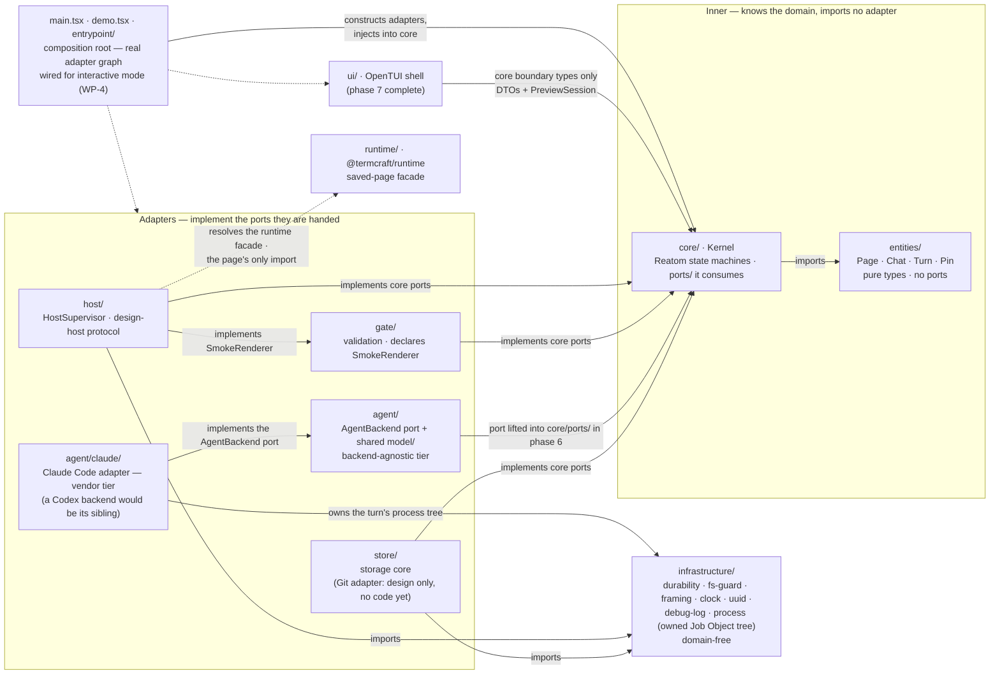

termcraft groups source by entity and feature, and applies clean-architecture
layering *inside* modules rather than across the repository. This document fixes
where a file goes, which direction its imports may point, and which shapes are
forbidden. It is the one document in `docs/architecture/` written for a reader who
*does* read the source language; the others deliberately are not.

Nine source modules have landed: `entities/`, `infrastructure/`, `runtime/`,
`host/`, `gate/`, `store/`, `agent/`, `core/`, and `ui/` are real source today.
Seven of those are components the design spec names — [`modules.md`](modules.md)
counts the same seven — while `entities/` and `infrastructure/` are additions this
convention makes on top. The executable roots (`main.tsx`, `demo.tsx`) and the
`entrypoint/` ring that owns their lifecycle have landed, `core`'s own Kernel is
fully self-assembled behind a public `core/index.ts` boundary (kernel-assembly
WP-1) — `createKernel`, the seven-machine/mailbox/capability wiring, and a real
command handler registry answering all 43 command kinds — and the production
adapter graph mapping `store`/`agent`/`gate`/`host` onto `core/ports/` has landed
too (MVP gap closeout WP-2). `src/entrypoint/model/create-shell.ts` (WP-4) is the
composition root that builds a real `KernelDeps` from that graph and constructs a
real `KernelPort` for interactive mode; `demo` mode alone still runs `ui`'s
in-memory kernel. Source anchors move to real paths as each piece lands; see
`## Source anchors`.



## Walkthrough

1. **Top-level layout.** The seven modules of the design spec (§4.1) survive intact
   as the unit of extraction; `entities/`, `infrastructure/`, and the composition
   root are the additions this convention makes.

   ```text
   src/
     main.tsx           interactive root + `_host`/`export` argv dispatch [landed]
     demo.tsx           demo root, in-memory kernel                       [landed]
     entrypoint/        shell selection, terminal lifetime, signals       [landed]
                         (interactive mode wires the real adapter graph, WP-4;
                          headless `export` driver, WP-5 Phase D)
     entities/          pure domain types; no ports, no I/O            [landed]
       page/  chat/  turn/  pin/
     core/              Kernel — the only domain decision-maker         [landed]
       ports/           contracts core consumes: GitHistory, GitCommitter, AgentBackend…
       turns/  versions/  export/  chats/
       types.ts
       index.ts
     store/             project state; implements core ports            [landed]
       safe-fs/  lease/  trust/  toml/  jsonl/  transaction/
       sandbox/  migration/  projections/  model/
       types.ts
       index.ts
     agent/             AgentBackend over the vendors' official TypeScript SDKs [landed]
       confinement/     SHARED tier — the deny-by-default confinement RULE
       session/         SHARED tier — session-scope derivation, resume/fresh prompt
       health/          SHARED tier — backend-agnostic health-probe policy
       run/             SHARED tier — the run loop: terminal latch, event queue,
                         both exit-confirmation ladders
       claude/          VENDOR tier — the Claude Code backend (a future Codex
                         backend is a sibling folder here, not a fork of the
                         shared tiers above)
         backend/  query/  run/  tools/  errors/  types.ts  index.ts
       types.ts         the mechanism-blind AgentBackend port every tier faces
       index.ts
     gate/              validation; declares the SmokeRenderer port it consumes [landed]
     host/              HostSupervisor, PreviewSession, design-host protocol    [landed]
     ui/                OpenTUI shell; imports core's boundary types only       [landed]
     runtime/           @termcraft/runtime — saved-page facade; leaf            [landed]
     infrastructure/    domain-free technical capabilities                     [landed]
       clock/  debug-log/  durability/  fs-guard/  framing/  process/  uuid/
   ```

   `agent/` splits in two on purpose. `agent/types.ts` is the port — the
   mechanism-blind contract (start a fenced attempt, cancel it, health-check,
   report models × efforts, derive a session scope) that names no vendor and
   imports no vendor SDK; `core/ports/agent-backend.ts` now carries the Kernel-side
   counterpart consumed by phase-6 orchestration.
   Four sibling folders are the shared tier every backend may reuse:
   `confinement/` (the deny-by-default rule, parameterized over a table of tool
   names rather than hard-coding any), `session/` (session-scope derivation and
   the resume/fresh prompt), `health/` (the health-probe policy — deadline,
   process-tree close, ambiguity classification), and `run/` (the run loop
   itself — the terminal latch, the event queue, and both exit-confirmation
   ladders). None of the four imports a vendor SDK. `agent/claude/` is the one
   vendor tier that exists — the Claude Code adapter, which supplies its own
   tool table, its own SDK option building, and a driver that feeds the shared
   run loop, but owns no run loop of its own. A future Codex backend becomes a
   sibling of `claude/` supplying its own tables and driver, and reuses the
   four shared folders unchanged; it never edits them to make room for itself.

   `store/` groups by concern (`safe-fs`, `lease`, `trust`, `toml`, `jsonl`,
   `transaction`, `sandbox`, `migration`, `projections`) rather than by the
   `chats/`/`pages/`/`pins/`/`git/` split this document originally sketched. The
   `ManifestStore`/`WorkspaceStateStore`/`ChatStore`/`PinStore`/`PageStore` port
   contracts are assembled from those submodules inside
   `store`'s own composition root (see Source anchors), not held in their own
   top-level folders — and no `git/` submodule exists: the Git adapter item 4
   mentions has no code yet at all.

2. **Feature-first, recursively.** Grouping is by entity or feature at every level;
   a technical layer never names a top-level folder. Each module — and each
   submodule — takes the shape fixed in `CLAUDE.md`: `ui/`, `model/`, `types.ts`,
   `index.ts`, plus `ports/` where the module declares contracts it consumes. A
   submodule appears when an entity has both its own model and its own boundary, not
   before; a *submodule* holding one file means the split was premature. The layer
   folders inside it are a different matter and are not optional: `CLAUDE.md` puts
   code in `model/` (or `ui/`) even when that folder holds a single file.

   `src/runtime/generated/` is a sanctioned exception to that shape, not drift. It
   still obeys "never loose at the module root" — its contents sit inside a named
   subfolder rather than scattered at `runtime/`'s top level — and `generated/` names
   what the folder actually holds more precisely than `model/` would: content that is
   machine-emitted, never hand-edited, and guarded by its own drift test rather than
   authored logic. The one file in it today, `RUNTIME_DTS` (see Source anchors), is
   deliberately not re-exported from `src/runtime/index.ts`, the module's public
   `@termcraft/runtime` facade an authored design page imports from (item 10):
   folding a build artifact into that facade would widen the authored-source import
   surface the design spec's §5.8 allowlist exists to keep narrow.

3. **`entities/` holds domain types, not domain contracts.** The name is
   deliberately narrower than "domain". In classic DDD the domain layer also holds
   repository interfaces; termcraft does not put them there, and a folder named
   `domain/` would promise otherwise. `core` is the domain layer in the
   architectural sense — [`modules.md`](modules.md) calls it "the only domain
   decision-maker". `entities/` is only its vocabulary: the `Page` slug, `Chat`,
   `Turn`, and pin types that several modules name.

4. **The consumer declares the port.** `core` consumes `GitHistory` and
   `GitCommitter`, so it declares them in `core/ports/`; the Git adapter inside
   `store` implements them. A port lives at the lowest common ancestor of its
   consumers and never higher: one consumer puts it beside that consumer, several
   features inside a module put it in the module's `ports/`. `GitHistory` sits at
   `core/ports/` because project inspection, page history, and Restore all consume
   it. When a second consumer appears the port moves up one floor; it is never
   copied.

5. **Two consumers in different modules mean two narrow ports.** `core` drives
   `PreviewSession` for the live preview; `gate` needs a single smoke render of a
   candidate. They do not share one wide `HostSupervisor` contract: each declares
   the slice it needs, and the `host` module implements both. Interface segregation
   is what replaces a shared contracts pile — there is no folder where unrelated
   modules deposit interfaces, and the port placement rule therefore never runs out
   of floors.

   The names in this document divide in two. `GitHistory`, `GitCommitter`,
   `AgentBackend`, `HostSupervisor`, and `PreviewSession` come from the specs and are
   fixed. `SmokeRenderer`, `GitCliAdapter`, and `ClaudeBackend` are this document's
   illustrations of the rule; the code may name them otherwise. Two of the five have
   now landed with their spec names intact — `SmokeRenderer` as a real port in
   `gate/ports/`, `AgentBackend` as a real interface in `agent/types.ts` — and the
   Claude adapter is built by a `createClaudeBackend` factory rather than a class of
   that name, which is exactly the latitude this paragraph reserves.

6. **`infrastructure/` is domain-free, and the test is mechanical.** Does the file
   know what a `Page`, `Turn`, or `Chat` is? If it does, it belongs to a module. If
   it does not, it belongs to `infrastructure/`. Process spawning, file I/O,
   length-prefixed framing, the clock, and UUIDv7 generation pass. `GitCliAdapter`
   and `ClaudeBackend` fail — they speak the domain and stay inside `store` and
   `agent`. This keeps `infrastructure/` small and boring by construction, and keeps
   the Git adapter an internal Project-store adapter rather than the eighth
   top-level component the specs forbid.

   Landed today: durable disk writes, the reparse-point/filesystem-identity checks,
   wire framing, the clock, and UUIDv7 generation all live under `infrastructure/`
   and pass the test — "fs" split into two submodules (`durability/`, `fs-guard/`)
   rather than the one `fs/` folder this document sketches.

   `infrastructure/process/` is the newest member and the cleanest illustration of
   the test. It is one owned process tree — a Windows Job Object created with
   kill-on-close, addressed over `bun:ffi` — exposing exactly five operations:
   adopt a spawned process id, read the live owned-process count from the OS,
   hard-terminate the tree, release the handle, and record/report whether an
   adoption was ever confirmed. Ask it the mechanical question and the answer is
   immediate: it does not know what a `Page`, `Turn`, or `Chat` is, and nothing in
   its vocabulary could be rephrased in domain terms — it owns OS processes and
   counts them. The agent backend is what knows that a given tree belongs to one
   turn's attempt; the primitive itself is domain-free and is injected into the
   backend as a factory. Process spawning for the *design host* remains separate
   and still sits inside `host`'s supervisor (see Source anchors) — it passes the
   same test in place, so that is an unextracted candidate, not a violation.

7. **`core` imports no other module.** It imports `entities/` and its own `ports/`,
   nothing else. `main.tsx` constructs the adapters and injects them; the arrows in
   [`modules.md`](modules.md) (`kernel --> pstore`, `kernel --> host`, …) are
   runtime calls, not imports. Three things follow: no import cycle between `core`
   and `store` even though each needs the other's names; `core` is testable against
   fakes without a Git CLI or a host subprocess; and the module graph stays a DAG,
   which is what "extractable into a workspace package later without rewrites"
   (§4.1) actually requires. The cost is real — every new wiring goes through the
   composition root instead of a direct import.

8. **When the choice of implementation is domain state, the port exposes the
   choice.** Not every port binds to one implementation at startup. The agent picker
   (§3.6) lists the model and effort combinations of every installed backend at once
   and lets the user switch between turns, and the stored `(agent, model, effort)`
   triple is domain state the Kernel owns. So `core` consumes a registry — enumerate
   the available backends, take one by id — rather than a single `AgentBackend`;
   `main.tsx` supplies the registry with the backends the build knows about, and
   `core` selects from it. The division holds generally: the composition root wires
   *what exists*, the Kernel decides *what is used*. Item 7 is untouched — `core`
   still imports no backend, and `AgentBackend` remains a spec-named port while the
   registry around it is this document's shape.

   Landed today: the Kernel-side registry contract and model-selection logic, the
   backend port, and one backend behind it. `agent/index.ts` exports the port types
   plus a single `createProductionClaudeBackend()` that assembles the real wiring
   (the SDK query, the Job Object tree factory, a real sleep, and the Windows
   reparse-point backstop), and `agent/adapters/agent-registry.ts`'s
   `createProductionAgentRegistry()` is the one-entry `AgentRegistry` over it
   (MVP gap closeout WP-2). `src/entrypoint/model/create-shell.ts` (WP-4) now
   constructs that registry and every other adapter, and injects the whole graph
   into `createKernel` for interactive mode — the composition root this item
   describes is real, not merely a runnable root.

9. **Three argv modes, one installed entry — resolved from `node_modules`, nothing
   per-platform.** termcraft is an npm package run under Bun ≥1.3.14 (§4.1):
   `src/main.tsx` is the package's `bin` target, and an argv scan on it dispatches
   the interactive shell, the `_host --stdio` design-render child, or the headless
   `export` CLI. `termcraft _host` is the second, much smaller composition root: it
   wires the host-side protocol and the runtime-facade resolver, and never
   constructs `core`, `store`, or `ui`. Two qualifications the packaging story
   carries. The TypeScript compiler at the pinned major is still a per-platform
   native executable, but it is no longer embedded and extracted: `gate`'s
   `resolveCompilerPath()` (`gate/model/tsc-extract.ts`) resolves it from the
   installed `typescript` package's own platform layout under `node_modules` — an
   ordinary dependency npm already picked the right platform package for, so there
   is no per-user extraction step and no per-platform build. And `host`'s resolution
   of the runtime facade is a runtime resolver plugin registered before the dynamic
   import, serving three specifiers: `@termcraft/runtime` plus the two
   compiler-generated JSX helper subpaths, which must resolve or a real page fails to
   load. Item 10's "only import" is about what a page's *author* may write; the
   helper import is emitted by the transform.

   Landed today: the three-specifier resolver matches this item exactly; the
   compiler's `node_modules` resolution is phase 8's WP-1 work. `main.tsx`'s first
   branch now recognizes a `_host --stdio` argv (`parseHostArgs`) and runs
   `runHostStdio` against real process stdio before the interactive bootstrap, so
   `termcraft _host --stdio` — the installed entry run through Bun (`bun <srcRoot>
   _host --stdio`, the same shape `package.json`'s `start`/`dev` scripts use) — is a
   runnable second entry point. `createHostSpawnCommand`
   (`src/host/supervisor/model/spawn-command.ts`) builds that ONE argv shape — the
   earlier compiled-vs-dev `isCompiled` branch is gone, because there is no compiled
   artifact left to branch on (phase 8, master §4.1) — and
   `src/entrypoint/model/create-shell.ts` (WP-4) now constructs it and spawns it
   against a real `HostSupervisor` for interactive mode — the composition-root
   wiring this item names has landed.

   A third `main.tsx` branch (M8, WP-5 Phase D) adds `termcraft export [dir]` as a
   THIRD runnable entry point, scanned the same way as `_host` (`parseExportArgs`).
   Unlike the interactive root, it never constructs `ui` or acquires a
   renderer: `src/entrypoint/model/run-export.ts`'s `runHeadlessExport` composes the
   SAME real adapter graph `create-shell.ts`'s `interactiveShell` builds, then drives
   `runExport` — dispatch `project.open`, dispatch `export.start`, await the terminal
   event — directly at the resulting `KernelPort`, closing the shell on every exit
   path. `main.tsx` stays thin: `formatExportOutcome` decides the stream/text/exit
   code (destination on stdout and exit 0 on success; the message — including the
   §3.1 trust-refusal wording on an untrusted project — on stderr and a non-zero exit
   otherwise), and `main.tsx` only resolves the root argument, writes, and exits.

10. **`ui` and `runtime` are the edge cases.** `ui` imports `core`'s boundary types —
    Command/Result/Event DTOs plus the `PreviewSession` facade the Kernel hands it —
    and nothing else from any module: never `store`, never host stdio. `runtime` is a
    leaf that imports no termcraft module: it is the saved-page facade (§5), resolved
    through the host's `Bun.plugin` runtime resolver by design code running inside
    the host. It also owns the JSX
    helper surface the transform emits against — not authored-public, and no page may
    name it, but a contract the module cannot get wrong all the same.

11. **Forbidden shapes.** These are review-blocking:

    | Shape | Why |
    |---|---|
    | `core` importing `store`, `agent`, `gate`, or `host` | breaks the DAG and the composition root |
    | ports in `entities/` | reintroduces the central contract pile |
    | domain-aware adapters in `infrastructure/` | fails the `Page` test; creates an eighth component |
    | a shared `contracts/` folder | segregation replaces it |
    | layer folders at top level (`services/`, `controllers/`, `models/`) | grouping is by entity, not layer |
    | `ui` importing `store`, `host`, or Git | the Kernel is the only decision-maker |
    | a saved page importing Reatom, React, OpenTUI, or anything but `@termcraft/runtime` | §5.8 import allowlist |

## Source anchors

`core/` (phase 6), `ui/` (phase 7), the executable roots plus their `entrypoint/`
ring, and the production adapter graph those roots compose (MVP gap closeout
WP-2/WP-4, item 1) have all landed. The anchors below are real source files almost
throughout; the few design-spec sections that remain are kept for one of two reasons
only — the code does not exist yet (the `GitHistory`/`GitCommitter` page-history
adapter), or the spec stays the authority for a detail the code does not encode (the
final group's own heading spells out which is which).

**Module shape (item 2) and the alias map**

- `CLAUDE.md` — Code style: the module shape (`ui/`, `model/`, `types.ts`,
  `index.ts`) and the atomic-function rule this document builds on
- `tsconfig.json` (`compilerOptions.paths`) — the alias map item 2 and `CLAUDE.md`'s
  Imports section enforce; the `agent`, `core`, and `ui` bare + wildcard pairs are
  live, and cross-module imports use those boundaries rather than climbing paths
- `src/entities/page/index.ts`, `src/entities/page/types.ts`,
  `src/entities/page/model/slug.ts` — a landed module in the `types.ts` + `model/` +
  `index.ts` shape, with no `ui/` because the module has none
- `src/entities/chat/index.ts`, `src/entities/pin/index.ts` — the same shape for the
  chat and pin vocabularies
- `src/entities/turn/types.ts` — landed vocabulary (`AgentEvent`, `TurnFence`); the
  Claude backend produces both and `src/core/ports/agent-backend.ts` consumes them
- `src/runtime/generated/runtime-dts.ts` — the landed example of the `generated/`
  exception this item records: machine-emitted by `scripts/gen-runtime-dts.ts`,
  guarded by `src/runtime/generated/runtime-dts.test.ts`'s drift check, and never
  re-exported from `src/runtime/index.ts` (verified: that file's export list carries
  the page contract, Reatom bindings, theme tokens, the JSX helper surface, and the
  component catalog — no `RUNTIME_DTS`). The design spec that introduced this folder
  names `scripts/tsc-libs.generated.ts` as the naming precedent it follows
  (`docs/superpowers/specs/2026-07-25-mvp-phase-8-design.md`, WP-2); that file is
  itself deleted by the same phase's distribution cleanup (WP-1), so it is cited here
  as the convention's documented origin, not as a second surviving example

**Kernel and UI boundaries (items 1, 4, 7, 8)**

- `src/core/index.ts`, `src/core/types.ts` — the landed Kernel public boundary:
  `createKernel` plus every Command/Result/Event DTO boundary type `ui` imports
  (`core/index.test.ts` proves nothing internal leaks through it)
- `src/core/kernel/index.ts`, `src/core/kernel/model/kernel.ts`,
  `src/core/kernel/model/kernel.integration.test.ts` — `createKernel`'s own assembly
  (the seven machines, the command mailbox, the capability-growth event bus, the
  handler registry) and the package's own end-to-end integration gate (kernel-assembly
  WP-1 Task 11)
- `src/core/mailbox/index.ts`, `src/core/machines/index.ts`,
  `src/core/capabilities/index.ts` — the command mailbox (decode/dedupe/revision-
  guard/capability-guard/dispatch/publish), the seven state-machine factories, and the
  capability guard/projector the mailbox and the Kernel's own snapshot are built from
- `src/core/ports/`, `src/core/turns/`, and `src/core/protocol/` — the consumed ports
  (+ their full in-memory `fakes/` set), turn orchestration, and closed command/event
  DTO surface
- `src/ui/index.ts` — the landed leaf UI public boundary, including `App`,
  `createUiRoot`, `createUiDeps`, and the UI-declared `KernelPort`
- `src/ui/app/model/root.tsx`, `src/ui/app/ui/App.tsx` — the disposable OpenTUI
  root seam and reactive application root that phase 8 composes
- `src/ui/app/model/keymap.ts`, `src/ui/app/model/intent.ts`, and
  `src/ui/preview/model/interaction.ts` — the interaction ownership boundary from
  terminal input through exact Kernel commands and displayed-frame geometry tokens

**`agent/` and the shared-vs-vendor split (items 1, 5, 8)**

`agent/` is now four shared sub-modules (`confinement`, `session`, `health`, `run`)
plus one vendor sub-module (`claude`, itself split into `backend`/`query`/`run`/
`tools`/`errors`). None of the four shared sub-modules imports the Claude SDK — a
second backend (Codex) would add only a sibling of `agent/claude` supplying its own
stream driver, message classifier, tool vocabulary, and options builder, never a
change to `confinement`/`session`/`health`/`run`. The run loop itself moved with the
split: `agent/run/model/engine.ts` now owns the terminal latch, the event queue, and
both exit-confirmation ladders, and a vendor supplies only a driver that reads its
stream and calls back into that engine — before the split this all lived inside the
vendor tier's own pre-split run-loop file.

- `src/agent/types.ts` — the mechanism-blind `AgentBackend` port: `startTurn`,
  `cancel`, `healthCheck`, `capabilities`, `sessionScope`, plus `AgentTask`,
  `AgentRun`, `AgentRunOutcome`, `SessionPlan`, and `BackendCapabilities`. Its own
  header states the phase-6 rule this document's item 8 relies on — the file
  imports no vendor SDK so it can be lifted verbatim into `core/ports/`
- `src/agent/index.ts` — the module's public entry: the port types plus
  `createProductionClaudeBackend`; deliberately vendor-neutral, with all
  Claude-specific construction re-exported from `agent/claude`
- `src/agent/confinement/model/policy.ts` — `createConfinementPolicy`, the SHARED
  deny-by-default rule, parameterized over a `ConfinementTables` record so it holds
  no vendor tool names itself
- `src/agent/confinement/model/path-containment.ts` — the SHARED staging-containment
  test (`isInsideStaging`) plus the reparse-point backstop it accepts
- `src/agent/session/model/session-scope.ts` — the SHARED opaque `sessionScopeId`
  derivation for the store checkpoint key; effort is deliberately excluded
- `src/agent/session/model/prompt.ts` — `buildPrompt`, the SHARED resume-delta /
  fresh-seed prompt assembly; moved out of the vendor tier because nothing about
  assembling this string is Claude-specific
- `src/agent/prompt/index.ts` — the agent-prompt library (phase-8 WP-3):
  `createProductionAgentPromptSource`, implementing `core/ports/agent-prompt.ts`'s
  `AgentPromptSource`. Composes the turn's SYSTEM prompt (role, §5.8 design-code
  rules including the slug mask, the page-file layout, answer-style guidance, plus
  the live `AgentPromptContextV1`) and returns the two runtime-doc files
  (`RUNTIME.md`, `runtime.d.ts`) as paths into the installed package. Distinct
  from, and does not replace, `agent/session/model/prompt.ts` above — that file
  composes the per-attempt USER message; this one composes the SYSTEM prompt
- `src/agent/health/model/errors.ts` — `AgentHealthProbeError`, the one
  backend-generic error in the shared tier
- `src/agent/health/model/probe.ts` — `runHealthProbe`, the SHARED probe policy: the
  bounded deadline, closing the adopted process tree on every path, and the
  never-report-ready-on-ambiguity classification; a backend supplies only a `read`
  callback typed to its own message vocabulary
- `src/agent/health/model/deadline.ts` — `withProbeDeadline`, the injectable
  deadline race and its `ProbeDeadlineAbortError`
- `src/agent/run/model/engine.ts` — `startAgentRun`, the SHARED run loop: the single
  terminal latch that decides between natural completion and cancellation, the
  event-queue wiring, and both exit-confirmation ladders (including the documented,
  assessed-and-rejected-as-unimplementable §6.5 rung 3 on Windows)
- `src/agent/run/model/event-queue.ts` — the single-reader async queue bridging a
  driver to `AgentRun.events`, decoupled so `outcome` settles even if nobody reads
- `src/agent/run/model/exit-confirm.ts` — `confirmExit`/`escalateAndConfirm`, the
  process-tree poll and hard-kill escalation shared by both ladders
- `src/agent/run/model/degraded-run.ts` — `createDegradedRun`, a run that failed
  before it ever started (no owned process tree obtained) — one error event then a
  matching `backend-error` outcome, never an unconfined run
- `src/agent/run/model/unconfirmed-exit-latch.ts` — `createUnconfirmedExitLatch`,
  the sticky per-backend §6.5 lockout after an unconfirmed exit; previously inline
  inside the vendor tier's pre-split backend factory, now shared so a second
  backend gets it for free
- `src/agent/run/types.ts` — the `RunSink`/`RunDriver` contract the shared engine and
  a vendor driver meet at; carries no vendor type by design
- `src/agent/claude/index.ts` — the VENDOR tier's entry and production wiring
  (`createProductionClaudeBackendDeps`: real SDK query, Job Object tree factory,
  real sleep, reparse backstop)
- `src/agent/claude/backend/model/backend.ts` — `createClaudeBackend`: the factory
  that satisfies the port; owns the per-run tree lifetime and wires the shared
  `createUnconfirmedExitLatch`/`createDegradedRun` policy pieces in
- `src/agent/claude/backend/model/backend-id.ts` — the single `CLAUDE_BACKEND_ID`
  constant fed to both the reported `backendId` and the session-scope material, so
  a second backend cannot desync the two by only updating one call site
- `src/agent/claude/backend/model/probe.ts` — `probeClaudeHealth`: the vendor half
  of health — the isolated probe's query options and classification of Claude's own
  message vocabulary — delegating the deadline/close/ambiguity policy to the shared
  `agent/health`
- `src/agent/claude/backend/model/capabilities.ts` — `claudeCapabilities`, the MVP
  model catalog and the `sessionWorkspaceBinding: "rebindable"` declaration
- `src/agent/claude/tools/model/vocabulary.ts` — `CLAUDE_TOOLS`, the vendor half of
  the confinement split: the single table Claude's own tool names, path rules, and
  denials all now derive from (collapsing the five separate tables its pre-split
  vendor-only predecessor held). A Codex backend supplies its own file here rather
  than editing `agent/confinement/`
- `src/agent/claude/tools/model/tool-op.ts` — `mapToolUse`: an SDK `tool_use` block
  into the UI's op + target
- `src/agent/claude/query/model/query-fn.ts` — `createRealQueryFn`: the production
  seam assigning the SDK's real `query` without a cast, so a future signature drift
  fails the typecheck instead of being silently absorbed
- `src/agent/claude/query/model/query-options.ts` — `buildQueryOptions`: the
  per-attempt SDK options — workspace as cwd and only writable root, no external
  settings sources, the `canUseTool` veto, and the spawn hook that makes the CLI ours
- `src/agent/claude/query/model/session-options.ts` — `planToSessionOptions`: the
  vendor half of session planning, turning a `SessionPlan` into SDK `resume`/
  `forkSession` options (the prompt half lives in the shared `agent/session/model/prompt.ts`)
- `src/agent/claude/query/model/can-use-tool.ts` — `createCanUseTool`: adapts the
  shared confinement policy's `PermissionResultLike` to the SDK's `CanUseTool`
  callback shape — the one place the vendor permission shape is put back on
- `src/agent/claude/query/model/spawn-adopt.ts` — `createSpawnAndAdopt`: the spawn
  hook that adopts the CLI into the owned tree, shared verbatim by a real turn and
  the health probe
- `src/agent/claude/run/model/drive-stream.ts` — `createClaudeDriver`: the vendor
  stream reader — reads `SDKMessage`s, normalizes them, and claims the natural
  outcome; the terminal latch, queue, and exit confirmation now belong to the shared
  `agent/run/model/engine.ts`, not this file
- `src/agent/claude/run/model/normalize.ts` — vendor messages into `AgentEvent`s
  (reasoning, tool, tool-failed, final, error, usage), dropping anything with no
  mapping; the tool-failure kind is read off a vendor `user` message's error-marked
  tool-result blocks
- `src/agent/claude/errors/model/sdk-error.ts` — `ClaudeSdkError`, the internal code
  for a failure at the SDK boundary (spawn/stream), mapped to `AgentRunOutcome`/
  `AgentEvent` and never rethrown past the adapter's own surface

**`infrastructure/` and the domain-free test (item 6)**

- `src/infrastructure/clock/index.ts`, `src/infrastructure/framing/index.ts`,
  `src/infrastructure/uuid/index.ts` — domain-free primitives that pass the test as
  this document states it
- `src/infrastructure/durability/index.ts`, `src/infrastructure/fs-guard/index.ts` —
  the two submodules that stand in for the single `fs/` folder this document
  sketches
- `src/infrastructure/durability/model/probe.ts` — `probeDurability`: composes the
  cheap `assertDurableVolume` gate with a real `flushDir` write-through probe into
  the one pre-flight check `store/model/factory.ts`'s `openProject`/`createProject`
  run before any mutation of the target volume
- `src/infrastructure/process/types.ts`, `src/infrastructure/process/index.ts` —
  the `ProcessTree`/`ProcessTreeFactory` contract and public entry: the newest
  domain-free member, five process-level operations and no domain vocabulary
- `src/infrastructure/process/model/job-object.ts` — the `bun:ffi` Windows Job
  Object implementation (kill-on-close limit flags, `QueryInformationJobObject`
  accounting reads, `TerminateJobObject`) plus the deterministic test double
- `src/infrastructure/debug-log/index.ts` (`model/sink.ts`, `model/console-tee.ts`) —
  the opt-in JSONL trace sink and console tee every layer may call: a `channel` name
  plus an arbitrary data object per line, and no domain vocabulary of its own, so it
  passes the same test. It exists because a TUI owns the terminal, which means a
  `console.log` is not a diagnostic channel here — without a file to write to, a
  producer/consumer seam like "the Kernel published the event but the mirror ignored
  it" has nowhere to be observed. Each run writes its own file into a run directory,
  named for the run's start instant and pid, and the directory is trimmed to a
  retention cap — so a run can be compared against the one before it, which a single
  overwritten file made impossible. A test run is excluded from that directory rather
  than writing into it: it used to, and an investigation's log came back interleaving
  real diagnostics with test fixtures that read exactly like production failures. The
  resolved path is passed to child processes, which is what puts the design host's own
  trace in the same file as the turn that spawned it — a child resolving the variable
  for itself defaulted to its own working directory, and the host child's is a
  throwaway scratch directory, so those diagnostics were written where nobody would
  ever read them. The tee also gates whether it still calls the writer it replaced:
  `src/ui/app/model/root.tsx` suspends that pass-through for exactly as long as the
  interactive renderer owns the terminal — from before `createCliRenderer` is
  awaited, since OpenTUI enters the alternate screen inside it — because the same
  `consoleMode: "disabled"` that keeps the tee alive also leaves nothing between a
  `console.warn` and the screen, and a live run painted a Kernel warning raw across
  a rendered panel. Nothing is discarded while it is engaged: a line goes to the
  trace file, or, when no file is capturing it, into a bounded hold buffer that is
  released to the writer on resume (overflow drops the oldest and the flush says how
  many). That is why the tee installs even when tracing is off — leaving it
  uninstalled meant there was no gate at all, and the frame tore exactly as before.
  Every path that gives the terminal back resumes it: the renderer that never came
  up, the two mount-failure branches, `dispose()`, and
  `src/entrypoint/model/process-boundary.ts`'s `restoreTerminal`, which is the only
  one a panic reaches — a fatal message that reached the trace file and nothing else
  would leave the operator with a blank terminal, which is worse than the torn frame
  the suspension prevents. The three paths that first have to tear a renderer down —
  the two mount-failure branches and `dispose()` — put the resume in a `finally`, so
  a throwing `destroy()`/`unmount()` cannot strand the gate; the other two have no
  teardown to throw ahead of them and resume with a plain statement. The gate covers `console.*` only; a direct
  `process.stderr.write` or the runtime's own uncaught-exception printer bypasses it
- `src/host/supervisor/model/spawn.ts` — the design host's own process spawning,
  still inside `host` and not routed through `infrastructure/process/`

**Ports and the composition boundary (items 4, 5, 7, 9, 10)**

- `src/core/ports/agent-prompt.ts` — `AgentPromptContextV1`/`AgentPromptSource`
  (phase-8 WP-3): `core` declares the port, `agent/prompt/` implements it,
  mirroring the `AgentBackend`/`GateRunner` placement precedent this section
  already documents
- `src/gate/ports/smoke-renderer.ts` — the real `SmokeRenderer` port this document
  uses as its port-placement illustration (item 5): `gate` declares it, `host`'s
  `src/host/adapters/smoke-renderer.ts` satisfies it over `runOneShotSession`
  (MVP gap closeout WP-2), and `src/entrypoint/model/create-shell.ts` (WP-4)
  constructs and wires the two together for interactive mode
- `src/host/supervisor/types.ts`, `src/host/supervisor/model/supervisor.ts` — the
  real `HostSupervisor`; blocker B4 (phase 6 slice 6D) resolved the former
  restart-aware-`PreviewHandle`-vs-non-restart-aware-`PreviewSession` split —
  `preview()` now returns a `SupervisedPreviewSession` composing both: the stable
  identity/frames/retry/close a `PreviewHandle` used to provide, plus
  `resize`/`setMode`/`query`/`interactionMode` rebound to whichever incarnation is
  currently live (`supervisor.ts`'s `sessionFor`). There is no separate
  `PreviewHandle` type anymore
- `src/host/supervisor/model/preview-session.ts` — `createPreviewSession`, a
  single-incarnation (no restart) `PreviewSession` facade; its header comment
  records why `supervisor.ts` follows the same interactionMode/resize/setMode/query
  pattern rather than reusing this function directly
- `src/gate/model/import-scan.ts` — the saved-page import allowlist (item 11's last
  forbidden-shape row): only a bare `import ... from "@termcraft/runtime"` is legal;
  the same scan also fatally rejects dynamic-code use (`eval`, `new Function`, and
  their common evasions), skipping identifier/bracket tokens `./jsx`'s `scanJsx`
  confirms are genuine JSX children text so a page's own display copy is never
  mistaken for a live reference
- `src/host/session/model/resolver.ts` — the runtime resolver plugin item 9
  describes; registers three specifiers (`@termcraft/runtime`, `react/jsx-runtime`,
  `react/jsx-dev-runtime`), not yet the single `@termcraft/runtime/jsx-runtime`
  subpath the target design names
- `src/runtime/model/jsx.ts` — the facade-owned JSX helper surface item 10
  describes; `jsxImportSource: "@termcraft/runtime"` is now set on the Gate side
  (`src/gate/model/type-check.ts`'s synthesized tsconfig), but this module's own
  comment still marks the OTHER half — the host resolver serving a
  `@termcraft/runtime`-qualified `jsx-runtime` subpath instead of the underlying
  `react/jsx-runtime` specifiers — as pending (phase 7 + phase 8, see
  `src/host/session/model/resolver.ts` below)
- `src/runtime/index.ts` — the saved-page facade's single public entry point
- `src/gate/model/tsc-extract.ts` — the `node_modules` `tsc` resolution item 9
  describes (`resolveCompilerPath`: resolves the installed `typescript` package's
  compiler executable; no per-user extraction)
- `src/runtime/generated/runtime-dts.ts` — `RUNTIME_DTS`, the generated ambient
  `@termcraft/runtime` declaration text (`scripts/gen-runtime-dts.ts` emits it from
  `src/runtime/index.ts`'s real public surface; `src/runtime/generated/runtime-dts.test.ts`
  is the drift test that fails the gates when the committed artifact and a fresh emit
  disagree). Two readers exist today: that drift test, and
  `src/gate/model/type-check.test.ts`'s `realChecker`, whose own comment names it "the
  one place `gate` reaches into `runtime` — a TEST-ONLY edge," importing
  `{ RUNTIME_DTS } from "runtime/generated/runtime-dts"` to type-check a fixture page
  against the real declaration rather than a hand-written stub. Production `gate`
  never imports `runtime`: `src/gate/model/type-check.ts`'s `TypeCheckerConfig
  .runtimeDts: string` takes the declaration as injected configuration, and
  `src/gate/adapters/gate-runner.ts`'s `GateRunnerAdapterDeps.runtimeDts` is now
  supplied by the composition root — `src/entrypoint/model/create-shell.ts`'s
  `interactiveShell` resolves `tscExePath` via `resolveCompilerPath()` and passes
  `RUNTIME_DTS` as `runtimeDts` on every construction, so `typeCheck` runs live in
  the shipped configuration (phase-8 Task 7; a failed compiler resolution aborts
  shell construction as a `ShellCompositionError` rather than shipping a Gate that
  silently skips the check). This test-only edge is not a
  leaf-rule violation: item 10's "`runtime` is a leaf that imports no termcraft
  module" constrains `runtime`'s OUTGOING imports only, and item 11's
  forbidden-shapes table carries no "X importing `runtime`" row — nothing in this
  document restricts who may import `runtime`
- `src/host/session/model/entry.ts` — `runHostStdio`/`parseHostArgs`: the injectable
  engine the `termcraft _host` second composition root (item 9) drives; wired to
  real process stdio by `src/main.tsx`'s first `import.meta.main` branch
- `src/host/supervisor/model/spawn-command.ts` — `createHostSpawnCommand`: builds
  the one npm-distribution argv shape (item 9) `HostSupervisor` spawns the `_host
  --stdio` child with; called by `src/entrypoint/model/create-shell.ts` (WP-4)
- `src/entrypoint/model/run-export.ts` — `runExport`/`runHeadlessExport`/
  `parseExportArgs`/`formatExportOutcome` (M8, WP-5 Phase D): the headless
  `termcraft export` driver `src/main.tsx`'s third argv branch calls; dispatches
  `project.open` then `export.start` at the real composed `KernelPort` (no
  renderer), maps `export.start`'s own guard rejections
  (`PROJECT_UNTRUSTED`/`TURN_RUNNING`) to the §3.1 trust-refusal wording and a
  running-turn refusal, and checks the page count once `export.start` is accepted
  (its handler emits no terminal event for a zero-page project) rather than
  duplicating any guard logic
- `src/host/protocol/model/embedded-declaration.ts` — `EMBEDDED_RUNTIME_DECLARATION`
  / `SUPPORTED_KIT_API_VERSIONS`: this process's ONE in-module runtime-declaration
  bundle (an in-memory handshake-identity literal, unrelated to npm distribution),
  read by `src/main.tsx`'s `_host` branch and by every
  `HostSupervisorDeps`/`SmokeRendererAdapterDeps`/`ExportRenderAdapterDeps.
  runtimeDeclaration` the composition root builds (WP-4), so the exact-equality
  handshake check (`handshake.ts`'s `declarationsEqual`) can never diverge from a
  retyped copy; lives in `host/protocol` (which owns the
  `RuntimeDeclarationBundleV1` type and validator) rather than in `runtime`, so
  `runtime` stays the leaf item 10 requires

**`store` and the Git adapter (items 1, 4, 6, 11)**

- `src/store/types.ts` — the STORE PORT CONTRACT; its own header comment names it as
  "the shapes `core/ports/` lifts verbatim in phase 6" and documents five deliberate
  divergences from the original port sketch
- `src/store/model/factory.ts` — the composition root inside `store`: assembles
  `safe-fs`/`lease`/`trust`/`toml`/`jsonl`/`transaction`/`sandbox`/`migration`/
  `projections` into the `Store` port, including the `ManifestStore`/
  `WorkspaceStateStore`/`ChatStore`/`PinStore`/`PageStore` facades the store port
  contract declares
- `src/store/toml/model/gitignore.ts` — the only Git-adjacent code that exists
  today, and explicitly not the `GitHistory`/`GitCommitter` adapter: its own comment
  calls the generated `.gitignore` a "courtesy mirror," not the live commit-scope
  planner

**Design-spec anchors kept — no code yet, or the spec is the authority for a detail
the code does not encode**

- `docs/superpowers/specs/2026-07-13-termcraft-design.md` — §4.1 the seven-module
  split, strict boundaries, workspace extractability, and the transport-neutral
  Kernel boundary, now including the production adapter graph behind `main.tsx`
  (MVP gap closeout WP-2/WP-4). §3.6 remains the design authority for the
  runtime-selected agent triple, whose landed Kernel selection code is anchored
  above
- `src/entrypoint/model/run-app.ts`, `src/entrypoint/model/create-shell.ts`,
  `src/entrypoint/model/bootstrap.ts`, `src/entrypoint/model/process-boundary.ts`,
  `src/main.tsx`, `src/demo.tsx` — `docs/superpowers/specs/2026-07-22-application-
  entrypoints-design.md`'s terminal lifetime, signal-driven shutdown, mode
  selection, and the commands, now including the production dependency
  composition `createShell("interactive", …)` builds (WP-4) and the
  `uncaughtException`/`unhandledRejection` panic-recovery boundary M9 asked for
  (`process-boundary.ts`'s `restoreTerminal()`, followed by an injectable
  `ProcessExit` seam that terminates the process — restoring alone left the
  process hanging with the renderer free to re-corrupt the terminal and the
  project lease/host children still held; round-1 fix on WP-4's own review)
- `docs/superpowers/specs/2026-07-16-git-backed-page-history-design.md` — the
  `GitHistory`/`GitCommitter` port definitions and the Git adapter's placement
  inside the Project store; no code implements either side of this yet
- `docs/superpowers/specs/2026-07-16-host-supervision-protocol-design.md` — blocker
  B1 (phase 6 slice 6D) closed the geometry `query()` wire kind, correlation, and
  real `checkHit`/`rectOf`/`describe`/`layoutTree` backing (§4.2, §7.1); the bounded
  control-queue/mailbox are now wired into `session.ts`'s live path. Still not
  landed: `forwardInput`/`setTweak`/`setTheme`, resize/mousemove/hover coalescing
  (the queue wiring is discrete-only for now), and the conformant `capture` export
  reply. `describe`/`layoutTree`'s semantic kind/label vocabulary awaits
  `@termcraft/runtime`'s component catalog (§5.2), which does not exist yet either
- `docs/superpowers/specs/2026-07-16-runtime-api-compatibility-design.md` — §3.1 the
  target single-facade JSX specifier (`@termcraft/runtime/jsx-runtime`) the current
  three-specifier resolver stands in for
- [`modules.md`](modules.md) — the same seven components as runtime roles, and the
  Kernel's authority this layout encodes
