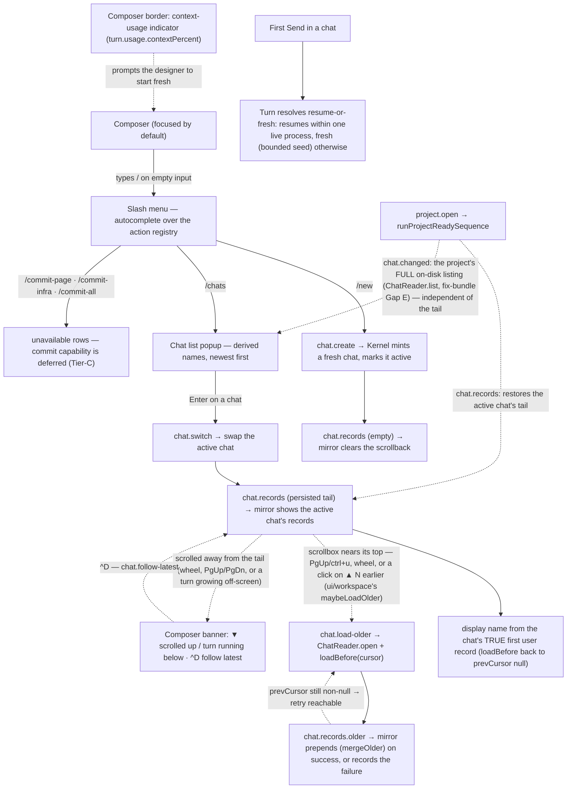

How a designer runs several conversations over one project: the slash menu in the composer, creating and switching chats, per-chat agent sessions, and the context-usage indicator that prompts starting fresh.

## Walkthrough

1. A chat is only a conversation line. Switching (`chat.switch`) swaps the visible history and the agent session and touches nothing else — active page, preview state, selection, and pins stay put. Pages are shared state: each turn's staging is assembled from the whole canonical design tree at send time, so changes made from another chat are immediately part of later turns (see `flows/generation-turn.md`) — a turn's finalization targets a page by slug alone, with no per-chat scoping. The live UI holds only the ACTIVE chat's window: the mirror's `Mirror.history` atom (`{records, prevCursor, totalRecordCount}`, one slice, not three) MERGES `chat.records` in by `recordId` rather than bulk-replacing — a post-turn tail refresh supersedes same-id records and appends new ones, but never erases a page loaded further back via `chat.records.older` (chat-scroll spec §6.5). The held, further-back cursor survives that merge only while its OWN generation still matches the fresh tail's — a rebuild-from-byte-zero (§7.4: a truncated trailing record, a same-length branch switch) bumps the chat index's generation, and the store hard-refuses a stale-generation cursor, so a held cursor from before the rebuild is DISCARDED in favor of the fresh tail's own cursor rather than re-served forever (review finding I4). `chat.records.older` itself prepends whatever it returns ahead of what the mirror already holds and moves `prevCursor` further back on success; on failure the window and cursor are left exactly as they were, and only the sibling `Mirror.lastOlderPageFailure` atom records the outcome, so a retry can pick up where it left off (spec §7). Both `history` and `lastOlderPageFailure` are cleared when `activeChatId` moves, so a re-switch reloads the tail rather than showing a cached copy — and the UI-local `olderPage` loading/failure latch (`ui/app/model/deps.ts`) now recognizes that same reset: it used to only ever transition OUT of `"loading"`, so a failure banner from the chat just left rode into whatever the designer switched to next and stuck there permanently (review finding C1); it now reads the reset window itself and returns to `idle`. In v1, a Git Restore likewise changes the shared canonical source rather than a chat-local state (Restore has no MVP caller — see step 8).
2. The slash menu: typing `/` as the first character of an empty composer opens an autocomplete list rendered from the action registry (`ui/actions`) — the same registry that drives hotkeys and status-bar hints. A non-`available` command still renders (never hidden), showing the hint the status bar would give in place of its description. The set is small by design: `/new`, `/chats`, `/export` (all wired), then `/model` and `/commit-page`, `/commit-infra`, `/commit-all`. `/model` renders but is inert (agent/model/effort selection is a later slice); the three commit rows map to the deferred `commit.plan` capability, so they always render `unavailable`, each owning its own dirty dot, changed-file count, and clean-scope state. While a turn runs, every non-`/commit-*` row goes `locked` (the registry's turn-lock) — a kernel-temporary state, distinct from a permanently `unavailable` row.
3. `/new` dispatches `chat.create`: the Kernel calls `ChatMutations.create` (the store's `TransactionEngine.createChat`), which mints a UUIDv7-named chat header with a typed shape and no records inside one ordinary project-mutation transaction, and marks it active machine-locally. The handler publishes `chat.changed` (an `added` summary whose `displayName` is `null` until a user record lands) plus an empty `chat.records` event that clears any stale scrollback. That `null` is resolved by the first Send, not by a later reopen: `turn.start` checks — before admission — whether the target chat is still empty, and if it is, republishes the summary as `chat.changed.updated` with the name derived from the turn's own text once `turn.attemptStarted` fires (`handlers/turn.ts`'s `resolvePendingChatNaming`/`publishChatNaming`). Without it the `/chats` popup keeps showing the design's fresh-chat label (`new chat — fresh context`, `design/termcraft-engine.js:1078`'s own `wsChatFresh` placeholder) for the rest of the session. Project creation still mints the project's first chat header together with `project.toml`/`workspace.local.toml` in a single transaction (`flows/launch.md`). The first later Send appends that chat's first user record through turn admission, which is its own transaction (paired with the finalization/terminalization transactions that later close a turn — `flows/generation-turn.md`).
4. `/chats` opens the chat list popup: derived names (the first line of each chat's first user record, via `deriveChatDisplayName`/`truncateChatDisplayName`), newest first, the active chat marked; `↑↓` moves the selection and Enter dispatches `chat.switch` for the selected chat (`ui/app`'s intent handler). The list is windowed to the design's fixed six rows, with `▲ N earlier`/`▼ N more` edges and a right-aligned `N–M of T` readout, and the selection is followed centred-then-clamped so it is always inside the window. The WHEN column is the design's own relative vocabulary (`now`, `Nm ago`, `Nh ago`, `yesterday`, `Nd ago`, `Nw ago`) rather than a raw timestamp, computed against a clock passed in so it is deterministic in tests; an unparseable timestamp renders an em-dash rather than a fabricated "now". A chat with no first user record yet shows the design's own placeholder wording for an empty chat rather than a hex fragment of its id — and, per step 3, stops showing it as soon as the first Send names it. The popup shows every chat the project holds on disk: on open, `runProjectReadySequence` publishes the project's FULL chat listing via `chat.changed` (`ChatReader.list()`, fix-bundle Gap E) — the fix for a previously reported "three chats on disk, one row after a restart" — independently of which chat's tail is restored, so a listing failure degrades to the active chat alone rather than losing the whole popup. `chat.create`/`chat.switch` continue to upsert into the same mirror-side set as they happen during the session.
5. Switching to a chat and sending in it resumes the previous SDK session when the gate says it may, and the live turn path now consults it (phase-8 WP-7). The storage half is implemented (`evaluateSessionResume`: chat identity, an opaque session-scope string, and a record-count-plus-prefix-hash comparison against a checkpoint persisted in `workspace.local.toml`). The backend half is implemented (`deriveSessionScope` mints the opaque scope from backend identity plus account, model, and workspace identity — effort deliberately excluded, with a per-process fallback account when the backend cannot name a stable one). `turn.start` derives `sessionScopeId` from a durable `workspaceIdentity` read off the project manifest, evaluates it through `evaluateSessionPlan`, and advances the checkpoint after every committed turn — so the second and later turns of one live process resume. **Resume across a process restart stays unreachable** for Claude specifically: its own account discriminator is always `null`, so the scope's account component falls back to a per-process random value and the first turn of each new process honestly evaluates "fresh" (`flows/generation-turn.md` step 11). A fresh plan is seeded via `SessionCheckpointService.selectSeed`, which is exactly the gate's bounded fresh-session excerpt: at most 32 records and 64 KiB of text, newest whole records first, and no seed at all when the chat log is unreadable or its header names a different chat.
6. Context usage: the composer-border indicator now renders. The producer is built — the Claude backend emits a `usage` event (`deriveUsage`) with input and output token counts and the share of the context window they occupy, and emits it on a failed turn as well as a successful one (the case where the indicator matters most is an attempt that burned most of the window and then errored). When no model reports a usable window size, the percentage is absent rather than guessed. The UI renders it: the mirror carries `turn.usage`, and while a turn runs the composer shows a `ctx NN%` tag (fed from `turn.usage.contextPercent`), which flips to amber-hi bold caution at `>= 80` and is hidden when the percent is `null`. termcraft never compacts a conversation itself — starting a new chat is the designer's context management.
7. Commit commands: `/commit-page`, `/commit-infra`, and `/commit-all` dispatch through the action registry, but commit is still out of scope. The `commit.plan` capability is Tier-C deferred (`CAPABILITY_UNAVAILABLE`), there is no Git port in the Kernel's deps and no Git-scope planner, so the three rows always render `unavailable` and no confirmation dialog opens. No Git status is stored in a chat and no commit is correlated with a prompt.
8. One turn runs at a time per project regardless of chat — enforced by a single in-process write permit (`WriteMutex`) that every admission/finalization/terminalization call acquires before writing, chat-agnostic by construction, and now also surfaced to the UI by the capability guard plus the slash menu's turn-lock. User/agent/system records have UUIDv7 `recordId`; turn records share `turnId` — enforced by the entity schemas' decoders, including the `turnId`/`actionId` mutual-exclusion rule on system records. For Restore, accepted confirmation would capture `targetChatId` and bind a UUIDv7 `restoreActionId` to that chat, `pageSlug`, full commit id, and pre-Restore hash; `buildRestoreTransaction` persists this plan (a canonical-source replace plus exactly one captured-chat append) before commit intent, and the shared transaction engine's crash-recovery protocol lets both roll forward across ambiguous acknowledgement and process restart. That machinery is built and unit-tested, but Restore stays out of MVP scope: no live path calls it, so no `system:restore` record is ever written, and `ChatSystemRestoreRecord` exists for reader completeness only. Changing machine-local active chat never retargets an action, and Git commits remain unrelated to prompts.
   - *Turn-time command mode:* ordinary message sending, chat creation/switching, export, and model changes lock while a turn runs. On an otherwise empty composer `/` still opens the menu; the three commit rows keep their `unavailable` scope-state and the other rows go `locked` with their refusal hints — now genuinely enforced by the capability guard and the registry's turn-lock, not just latent at the write-mutex level.
9. `chat.load-older` (chat-scroll spec §6.4) pages a chat backwards past whatever `Mirror.history` already holds — step 1 states the merge semantics; this step states the mechanics. `ui/workspace`'s `maybeLoadOlder` (`Workspace.tsx`) is the single dispatcher behind all three UI paging routes the spec names — PgUp/`ctrl+u` through the `ChatViewport` adapter's `scrollByPage`, a mouse-wheel scroll, and a click on `ChatScrollback`'s `▲ N earlier messages` row — and it fires only once four guards all clear: the live scrollbox reports it is within one row of its own top, the mirror's `prevCursor` is non-null, no page is already loading, and the mirrored capability reports `chat.load-older` available (it is not among the three commands §7.1 exempts from untrusted-read-only, so paging is genuinely unavailable in that mode). The Kernel handler (`handleChatLoadOlder`, `handlers/chat.ts`) holds no paging state of its own — the accumulated window lives entirely in the mirror, so the handler is stateless between calls — and simply opens the chat (`ChatReader.open`) and calls `ChatHandleV1.loadBefore(cursor)` with the cursor the client was last given, then publishes exactly one `chat.records.older` either way: a loaded page plus the next `prevCursor` on success, or the same event shaped as a failure when either port call errors. Unlike `chat.switch`'s best-effort tail read (`handlers/chat.ts`'s own doc comment, "TAIL DELIVERY"), this failure is never silent — the UI is holding a loading latch waiting specifically for this event, so both the open failure and the load failure still publish it to retire that latch. The mirror folds the event by `mergeOlder` (step 1): a success prepends whatever came back ahead of the held window and advances `prevCursor`; a failure changes neither the window nor the cursor and only updates the sibling `Mirror.lastOlderPageFailure` atom, so a retry — another PgUp, another click — picks up exactly where it left off. `<scrollbox>` does not hold scroll position across a prepend on its own (Task 2's own probe finding), so `Workspace.tsx` restores the pre-load distance from the bottom once the new rows actually land, off the renderable's own `content.onSizeChange` rather than a React re-render.
10. Whether the pane is pinned at the tail is a real, tracked fact — `WorkspaceLocalState.chatFollowing` (design iteration 10 answers 2/6, review findings I2/I3/I5) — not merely inferred. `Workspace.tsx` recomputes it from the live `ScrollBoxRenderable`'s own scroll position after every gesture that can move it: `maybeLoadOlder` (the shared entry point behind the wheel, the keyboard's `scrollByPage`, and the indicator-row click, step 9's own "single dispatcher"), and `^D`'s own `scrollToBottom`, which always lands exactly at the tail. `^D` (`chat.follow-latest` in the action registry) is `chat`-scoped, not global (focus-scoped-hotkeys §5, 2026-08-10) — it resolves through the registry only while the chat zone owns focus, and resolves to none in the preview zone (including fullscreen); the scroll pair (`chat.scroll-up`/`chat.scroll-down`) shares the same scope. Within the chat zone, it is the composer's attach-line slot and the status-bar key row that decide WHEN to draw it. While `!following`, the composer's meta line shows the design's own banner — `▼ scrolled up · ^D follow latest`, or `▼ turn running below · ^D follow latest` while a turn runs — outranking the selection chip, the open-pins line, and every turn-time line below it (the engine's own draw order checks `following` before any of them), though read-only still wins over it (a project-only concept the engine does not model). The status-bar key row mirrors the same fact: `^D follow` is drawn only while `!following`; `PgUp` drops at the true start of chat (nothing above to page to); a failed older-page load relabels `PgUp` to `retries`; and a running turn while scrolled away shows `PgUp/PgDn scroll · ^D follow · esc cancel` in place of the ordinary running turn's disabled-send hint, since there is somewhere to scroll back to even though the composer itself stays locked. `ctrl+d` is `chat.follow-latest`'s own alias, not `chat.scroll-down`'s (review finding I3) — an earlier version aliased it to page-down purely on C0-control-byte encoding grounds, missing that the design already assigns `^D` a different meaning.

## Source anchors

- `src/entities/chat/types.ts` — the chat record/header vocabulary: `ChatHeader` (typed header, no records), `ChatUserRecord`/`ChatAgentRecord` sharing `turnId`, `ChatSystemErrorRecord`/`ChatSystemCancelledRecord` (mutually exclusive `turnId`/`actionId`), and `ChatSystemRestoreRecord` (reader-side only — DEFINED for forward-compat, no MVP writer, matching Restore's out-of-scope status).
  `ChatWarningSnapshot` — the residual Gate warnings an accepted turn's agent record carries — gained optional TREE-relative `file`/`line`; `.optional()` keeps every already-persisted record decodable, which is why the widening needed no migration.
- `src/entities/chat/model/decode.ts` — `decodeChatHeader`/`decodeChatRecord`: the Zod-backed schema validation, including the `turnId`/`actionId` mutual-exclusion `superRefine` system records must satisfy.
- `src/entities/turn/types.ts` — `TokenUsage`/`AgentEvent`'s `usage` kind: the normalized token-usage shape a backend reports through to "feed the composer's context indicator" (its own doc comment).
- `src/agent/claude/run/model/normalize.ts` — `deriveUsage`/`normalizeMessage`: where the usage event of step 6 is computed, including the context-window percentage, the null when no window is reported, and the deliberate emission of usage on error results as well as successes.
- `src/agent/session/model/session-scope.ts` — `deriveSessionScope`: the backend half of step 5's resume gate — the opaque scope string over backend, account, model, and workspace identity, effort excluded, with the per-process fallback account (`UNRESUMABLE_ACCOUNT`) that is exactly why cross-restart resume stays unreachable for Claude.
- `src/agent/session/model/prompt.ts` — `buildPrompt`: how a fresh session's bounded seed is prepended as leading context, or the delta is sent on resume.
- `src/agent/claude/query/model/session-options.ts` — `planToSessionOptions`: how a resume verdict becomes vendor SDK `resume`/`forkSession` options.
- `src/store/jsonl/model/checkpoint.ts` — `evaluateSessionResume`/`computeSessionPrefixHash`/`selectSeedRecords`: the storage-side resume gate (chat identity, opaque session-scope string, record-count-plus-prefix-hash match) and the bounded fresh-session seed (≤32 records, ≤64 KiB) built on a miss.
- `src/store/toml/model/workspace-toml.ts` — `workspace.local.toml`'s `session_checkpoints`/`active_chat_id`/`backend`/`model` fields: the machine-local state a chat switch reads and a resume decision would persist into.
- `src/store/transaction/model/wrappers.ts` — `admitTurn` (appends exactly the user record before any agent process starts — the mechanism behind "the first later Send appends... through turn admission"), `finalizeTurn`/`terminalizeTurn` (the agent/system terminal record, and the chat-agnostic design-tree targets the shared-pages invariant relies on), and `buildRestoreTransaction` (source replace plus one captured-chat append in a single plan; built and unit-tested, no MVP caller — Restore stays out of scope).
- `src/store/transaction/model/write-mutex.ts` — `WriteMutex`: the single in-process permit that makes "one turn runs at a time per project regardless of chat" true — every admission/finalization/terminalization call acquires the same project-wide permit.
- `src/store/model/factory.ts` — `createProject` mints the project's first chat header inside the project-creation transaction; `TransactionEngine.createChat` mints a later `/new` chat header; `makeChatStore.open` opens one chat by id (bounded header read, identity check, persisted chat index); `scanOrphanTurns` enumerates every chat file under a project.
- `src/core/chats/model/records.ts` — `chatRecordToDtoV1`/`buildChatRecordsPayload` (the entities → wire mapping the `chat.records` event carries) and `resolveChatDisplayName` (walks `loadBefore` back until `prevCursor` is `null` to reach the chat's TRUE first page, then names it from that page's first user record) — still used by `chat.switch` (`handlers/chat.ts`), which has an already-loaded tail but no listing call of its own.
- `src/core/chats/model/display-name.ts` — `deriveChatDisplayName`: the first line of the first `user` record, trimmed and truncated to ~60 chars, `null` when no user record exists yet or its first line is blank; `truncateChatDisplayName` is the same truncation rule split out for the chat-LISTING path (`ChatReader.list()`'s raw `firstUserText`), which has no already-decoded records to search.
- `src/core/chats/model/chat-directory.ts` — the Kernel-side newest-first chat directory; not wired into the live `chat.create`/`chat.switch`/`project.open` handlers today (they publish `chat.changed` directly), so this module currently has no live caller.
- `src/store/model/chat-listing.ts` — the store's own implementation of that listing: one forward read per chat file for its header plus first user text, which is what makes the popup's names survive a restart without re-walking each chat backwards.
- `src/core/ports/chat-store.ts` — `ChatReader.list(): Promise<FailureDtoV1 | readonly ChatListingEntryV1[]>` (fix-bundle Task 6/Gap E): every chat the project holds, each with `chatId`/`createdAt`/`firstUserText` read FORWARD from that chat's own file start (the opposite direction from `resolveChatDisplayName`'s backward `loadBefore` walk) — the port `handlers/project.ts`'s `listChatSummaries` below consumes to populate `/chats` from the whole project rather than from whatever this process happened to learn.
- `src/core/kernel/model/handlers/chat.ts` — `chat.create`/`chat.switch`/`chat.load-older` handlers. `chat.create`/`chat.switch` each publish `chat.changed` plus a `chat.records` tail (empty for a fresh chat, the loaded persisted tail for a switch), `chat.switch` also persists `activeChatId` via `writeWorkspaceState`, and both derive `displayName` via `resolveChatDisplayName`; the closed v1 registry has no `chat.failed`, so a port failure on either is logged and no event fires. `chat.load-older` (chat-scroll spec §6.4, `handleChatLoadOlder`) is different in kind, not degree: it holds no Kernel-side paging state (the window lives entirely in the mirror), opens the chat via `ChatReader.open` and calls `ChatHandleV1.loadBefore(payload.cursor)`, and ALWAYS publishes exactly one `chat.records.older` — a loaded page (`buildChatRecordsOlderPayload`) on success, or the same event shaped as a failure (`chatRecordsOlderFailurePayload`) when either port call errors — because unlike the other two handlers' best-effort tail reads, this IS the whole operation and the UI is holding a loading latch waiting for its outcome.
- `src/core/kernel/model/handlers/project.ts` — `runProjectReadySequence`/`listChatSummaries`/`restoreActiveChatTail`: once a project reaches `ready`, TWO independent reads run — `listChatSummaries` (`ChatReader.list()`, fix-bundle Gap E) publishes the project's FULL chat listing as `chat.changed.added`, and `restoreActiveChatTail` restores only the active chat's persisted tail as `chat.records` — the relaunch requirement ("reopens the Workspace with the active chat's history restored"). Each has its own failure mode: a listing failure degrades to a one-row `chat.changed` naming the active chat alone (logged); a tail failure costs only the scrollback (`chat.records` skipped, `chat.changed` still publishes).
- `src/core/kernel/model/handlers/turn.ts` — `turn.start` derives `sessionScopeId` from `AgentBackend.sessionScope` over the manifest's own `projectId`, runs the plan through `evaluateSessionPlan`, and advances the checkpoint on a committed turn; it also republishes the admitted chat's summary the moment that chat's first user record lands (`resolvePendingChatNaming`/`publishChatNaming`, step 3).
- `src/core/turns/model/session-plan.ts` — `evaluateSessionPlan`/`fallbackToFreshSession`/`advanceSessionCheckpoint`: the core-side resume-vs-fresh evaluator over `SessionCheckpointService`, now driven by the live `turn.start` path.
- `src/core/protocol/model/event-kind.ts` — the closed 45-kind v1 event registry, including `chat.records` (the 43 → 44 addition that carries the persisted chat tail as a follow-on event) and `chat.records.older` (the 44 → 45 addition, chat-scroll spec §6.2, carrying one backward page or the reason it could not be read — a separate kind from `chat.records` because the mirror folds the two differently, tail-merge vs. prepend, spec §6.5).
- `src/ui/mirror/model/mirror.ts` — the UI read-model: `Mirror.history: Atom<ChatHistoryMirror>` (`{records, prevCursor, totalRecordCount}`, one atom — only the active chat's window), `chat.records` fenced to the active chat and merged in by `recordId` (`mergeTail`, generation-checked before keeping a held cursor over the fresh tail's own — review finding I4) rather than bulk-replaced, `chat.records.older` merged the opposite direction (`mergeOlder`: prepends and moves `prevCursor` further back on success, leaves the window/cursor untouched on failure), the separate `Mirror.lastOlderPageFailure: Atom<FailureDtoV1 | null>` a failed older page updates (`null` on success and after every chat switch), `chat.changed` summaries, and `turn.usage` — the atoms the composer, scrollback, and `/chats` popup read.
- `src/ui/actions/model/registry.ts` — the slash-command registry transcribed from design: `/new`, `/chats`, `/export`, `/model` (inert), `/commit-*` (mapped to the deferred `commit.plan`, always `unavailable`), plus `slashRowState`'s turn-lock that marks every non-`/commit-*` row `locked` while a turn runs. Also the chat-scroll hotkeys (step 10): `chat.scroll-up`/`chat.scroll-down` (`PgUp`/`PgDn`, `ctrl+u` PgUp's own alias) and `chat.follow-latest` (`ctrl+d`, review finding I3 — no longer `chat.scroll-down`'s alias).
- `src/ui/app/model/intent.ts` — beyond the `/chats` navigation (`↑↓`/Enter dispatching `chat.switch`): the keyboard half of chat-scroll (`chat-scroll-up`/`chat-scroll-down`/`chat-follow-latest` effects), each reached through `deps.local.chatViewport()`, a port `Workspace.tsx` publishes so `applyIntent` stays pure of the renderer.
- `src/ui/workspace/types.ts` — `ChatViewport` (`scrollByPage`/`scrollToBottom`/`atBottom`/`anchorFromBottom`/`restoreAnchor`, chat-scroll spec §5.5): the imperative adapter over the live `<scrollbox>` `Workspace.tsx` publishes, and `WorkspaceLocalState.chatFollowing` (step 10): whether that viewport is currently pinned at the tail.
- `src/ui/workspace/model/attach.ts` — `deriveComposerAttach`: the composer's single meta line, priority read-only → not following (step 10, the design engine's own unconditional draw order) → selection → open pins → turn-time line → halted preview → none.
- `src/ui/slash-menu/ui/SlashMenu.tsx` — the non-modal slash-menu autocomplete popup render (`design/23-slash-menu.dc.html`).
- `src/ui/popups/ui/ChatListPopup.tsx` — the `/chats` popup render: rows with the active dot, a 6-row viewport with `▲ N earlier`/`▼ N more` edges and a `N–M of T` position readout, and the `↑↓ select · ⏎ switch · esc close` footer (`design/24-chats.dc.html`, `wsChats`).
- `src/ui/popups/model/chat-list.ts` — the popup's pure model: `computeChatListViewport` (the design's `cap=6` window, centred on the selection and clamped to both ends), `formatChatWhen` (the design's relative-time buckets, over an injected `nowMs`, em-dash for an unparseable timestamp), and `FRESH_CHAT_LABEL` (the design's own empty-chat placeholder, replacing an earlier `chatId.slice(0, 8)` fallback whose design citation did not exist).
- `src/ui/chat/ui/Composer.tsx` — the composer render: the model chip plus the `ctx NN%` tag, hidden when null and flipped to amber-hi bold caution at `>= 80`.
- `src/ui/chat/ui/ChatRecord.tsx` — one persisted record: the role header plus ONE `<text wrapMode="word">` per markdown-lite line, spans rendered as `` text nodes. Not a row of `<text>` per span — a `<text>` is a flex item that wraps inside its own width, which turned every paragraph into independently-wrapping columns. An AGENT record additionally renders the residual Gate warnings its turn was accepted carrying, one red `✗ <message> in design/<file> line N` row each, after the record's own lines — the design's own vocabulary for a per-file diagnostic inside the chat sequence (`design/termcraft-engine.js:807`, `wsCancelled`'s red `✗ …` system line), reused rather than invented. Before this the agent's prose was the ONLY signal a user got, and a measured turn persisted four determinism warnings while the agent's message said the timer was fixed. A warning with no `file` (every record persisted before this, or a genuinely tree-wide warning) renders with no location clause rather than a dangling `in `; the `design/` prefix is added at display time, never persisted, and is guarded against double-prefixing.
- `src/ui/chat/model/text-rows.ts` — `renderedRowCount`/`markdownLineRows`: how many rows a line actually occupies once the renderer wraps it. STALE ROLE, CORRECTED (review finding M3): this used to be "the single ruler the scrollback's tail selection and the workspace row budget share" — both consumers are gone now that `<scrollbox>` clips the persisted tail instead of a computed row window (`ChatScrollback.tsx`/`agent-block-budget.ts` above), so the module has no production caller left; `ChatRecord.test.tsx` still pins it against real rendered output. Distinct from `wrapText` (the design's own `wrapLines`, used by `AgentStatusBlock`, which pre-wraps its own text); the renderer additionally reserves the space after every non-final word.
- `src/ui/chat/ui/ChatScrollback.tsx` — the persisted tail: a plain column over EVERY loaded record, in arrival order (chat-scroll spec §5.2/§5.3) — the row-budget windowing this component used to enforce (`maxRows`/`selectVisibleTail`) is gone now that the `<scrollbox>` `Workspace.tsx` mounts it inside does the clipping. The design's `▲ N earlier messages` row (`design/termcraft-engine.js:1502`) is real CONTENT — the first row of the scroll area, not an overlay — and its count (`unloadedCount`) is records the client has not yet loaded (total minus loaded), never a scroll-position estimate; a `╌╌╌ start of chat ╌╌╌` marker (`design/termcraft-engine.js:1507`) renders once `atStart` is true. The indicator row latches one of three states via the exported `ChatOlderPageState` prop (`idle`/`loading`/`failed`, spec §6.6) and is the click target `onLoadOlder` wires (`ui/workspace`'s `maybeLoadOlder`).
- `src/ui/workspace/model/agent-block-budget.ts` — the chat panel's row allocation. `agentStatusMaxRows` still bounds the ephemeral agent status block to the design's 12-row fold cap (`MAX_TIMELINE_ROWS`), but its own budget calculation shrank (chat-scroll spec §5.2/§5.3): it now subtracts only what physically cannot hold a timeline row inside the block's own frame — the panel border plus `AgentStatusBlock`'s own always-drawn chrome — not every sibling that used to share `ws-chat-stream`'s row pool. `scrollbackMaxRows` is GONE, not merely renamed: the `<scrollbox>` `Workspace.tsx` now mounts inside `ws-chat-stream` around `ChatScrollback` does the history's own clipping, so nothing computes a remaining-rows budget for it any more. `ws-chat-stream` itself still clips (`overflow="hidden"`), matching `chatSeq`'s own `composerTop - 1` stop; the `<scrollbox>` inside it is what makes the persisted tail scrollable rather than truncated.
- `design/23-slash-menu.dc.html` — slash menu open and filtered states.
- `design/24-chats.dc.html` — chat list popup and the fresh-chat state.
