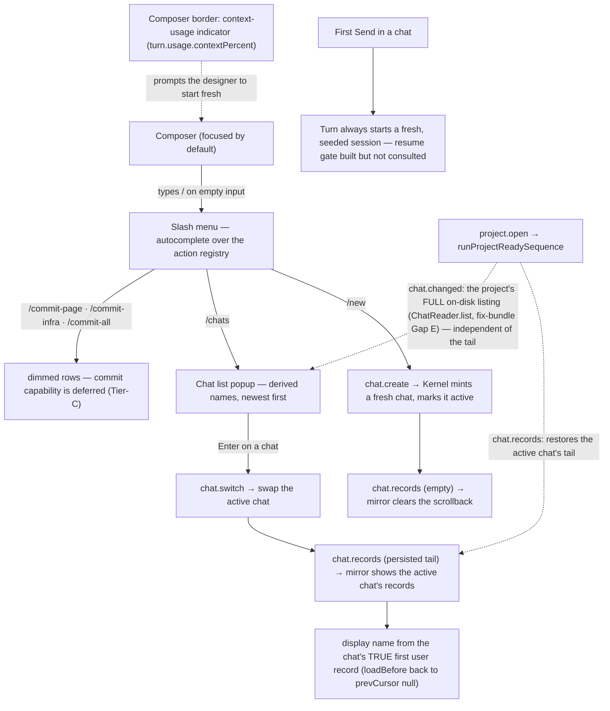

How a designer runs several conversations over one project: the slash menu in the composer, creating and switching chats, per-chat agent sessions, and the context-usage indicator that prompts starting fresh.

## Walkthrough

1. A chat is only a conversation line. Switching (`chat.switch`) swaps the visible history and the agent session and touches nothing else — active page, preview state, selection, and pins stay put. Pages are shared state: each turn's staging is assembled from every page's canonical current `page.tsx` at send time, so changes made from another chat are immediately part of later turns (see `flows/generation-turn.md`) — a turn's finalization targets a page by slug alone, with no per-chat scoping. The live UI holds only the ACTIVE chat's records: the mirror's `records` slice is bulk-replaced from each `chat.records` event and cleared when `activeChatId` moves, so a re-switch reloads the tail rather than showing a cached copy. In v1, a Git Restore likewise changes the shared canonical source rather than a chat-local state (Restore has no MVP caller — see step 8).
2. The slash menu: typing `/` as the first character of an empty composer opens an autocomplete list rendered from the action registry (`ui/actions`) — the same registry that drives hotkeys and status-bar hints. A disabled command shows dimmed (never hidden) with the hint the status bar would give. The set is small by design: `/new`, `/chats`, `/export` (all wired), then `/model` and `/commit-page`, `/commit-infra`, `/commit-all`. `/model` renders but is inert (agent/model/effort selection is a later slice); the three commit rows map to the deferred `commit.plan` capability, so they always render dimmed, each owning its own dirty dot, changed-file count, and clean-scope state. While a turn runs, every non-`/commit-*` row dims (the registry's turn-lock).
3. `/new` dispatches `chat.create`: the Kernel calls `ChatMutations.create` (the store's `TransactionEngine.createChat`), which mints a UUIDv7-named chat header with a typed shape and no records inside one ordinary project-mutation transaction, and marks it active machine-locally. The handler publishes `chat.changed` (an `added` summary whose `displayName` is `null` until a user record lands) plus an empty `chat.records` event that clears any stale scrollback. Project creation still mints the project's first chat header together with `project.toml`/`workspace.local.toml` in a single transaction (`flows/launch.md`). The first later Send appends that chat's first user record through turn admission, which is its own transaction (paired with the finalization/terminalization transactions that later close a turn — `flows/generation-turn.md`).
4. `/chats` opens the chat list popup: derived names (the first line of each chat's first user record, via `deriveChatDisplayName`/`truncateChatDisplayName`) with timestamps, newest first, the active chat marked; `↑↓` moves the selection and Enter dispatches `chat.switch` for the selected chat (`ui/app`'s intent handler). The popup shows every chat the project holds on disk: on open, `runProjectReadySequence` publishes the project's FULL chat listing via `chat.changed` (`ChatReader.list()`, fix-bundle Gap E) — the fix for a previously reported "three chats on disk, one row after a restart" — independently of which chat's tail is restored, so a listing failure degrades to the active chat alone rather than losing the whole popup. `chat.create`/`chat.switch` continue to upsert into the same mirror-side set as they happen during the session.
5. Switching to a chat and sending in it *could* resume the previous SDK session, and the whole resume gate is built and unit-tested end to end — but the live turn path does not consult it yet, so **session resume is always fresh**. The storage half is implemented (`evaluateSessionResume`: chat identity, an opaque session-scope string, and a record-count-plus-prefix-hash comparison against a checkpoint persisted in `workspace.local.toml`). The backend half is implemented (`deriveSessionScope` mints the opaque scope from backend identity plus account, model, and workspace identity — effort deliberately excluded, with a per-process fallback account when the backend cannot name a stable one). Even the core-side evaluator exists (`evaluateSessionPlan`). Despite all that, `turn.start` always builds `{ kind: "fresh", seed }`, honestly seeded via `SessionCheckpointService.selectSeed`, because `core` has no way to derive a stable `sessionScopeId` through its ports today (the scope is minted/persisted machine-locally and `core` cannot read it back — see `handlers/turn.ts`'s own gap note). The seed is exactly the gate's bounded fresh-session excerpt: at most 32 records and 64 KiB of text, newest whole records first, and no seed at all when the chat log is unreadable or its header names a different chat.
6. Context usage: the composer-border indicator now renders. The producer is built — the Claude backend emits a `usage` event (`deriveUsage`) with input and output token counts and the share of the context window they occupy, and emits it on a failed turn as well as a successful one (the case where the indicator matters most is an attempt that burned most of the window and then errored). When no model reports a usable window size, the percentage is absent rather than guessed. The UI renders it: the mirror carries `turn.usage`, and while a turn runs the composer shows a `ctx NN%` tag (fed from `turn.usage.contextPercent`), which flips to amber-hi bold caution at `>= 80` and is hidden when the percent is `null`. termcraft never compacts a conversation itself — starting a new chat is the designer's context management.
7. Commit commands: `/commit-page`, `/commit-infra`, and `/commit-all` dispatch through the action registry, but commit is still out of scope. The `commit.plan` capability is Tier-C deferred (`CAPABILITY_UNAVAILABLE`), there is no Git port in the Kernel's deps and no Git-scope planner, so the three rows always render dimmed and no confirmation dialog opens. No Git status is stored in a chat and no commit is correlated with a prompt.
8. One turn runs at a time per project regardless of chat — enforced by a single in-process write permit (`WriteMutex`) that every admission/finalization/terminalization call acquires before writing, chat-agnostic by construction, and now also surfaced to the UI by the capability guard plus the slash menu's turn-lock. User/agent/system records have UUIDv7 `recordId`; turn records share `turnId` — enforced by the entity schemas' decoders, including the `turnId`/`actionId` mutual-exclusion rule on system records. For Restore, accepted confirmation would capture `targetChatId` and bind a UUIDv7 `restoreActionId` to that chat, `pageSlug`, full commit id, and pre-Restore hash; `buildRestoreTransaction` persists this plan (a canonical-source replace plus exactly one captured-chat append) before commit intent, and the shared transaction engine's crash-recovery protocol lets both roll forward across ambiguous acknowledgement and process restart. That machinery is built and unit-tested, but Restore stays out of MVP scope: no live path calls it, so no `system:restore` record is ever written, and `ChatSystemRestoreRecord` exists for reader completeness only. Changing machine-local active chat never retargets an action, and Git commits remain unrelated to prompts.
   - *Turn-time command mode:* ordinary message sending, chat creation/switching, export, and model changes lock while a turn runs. On an otherwise empty composer `/` still opens the menu; the three commit rows keep their scope-state dimming and the other locked rows dim with their refusal hints — now genuinely enforced by the capability guard and the registry's turn-lock, not just latent at the write-mutex level.

## Source anchors

- `src/entities/chat/types.ts` — the chat record/header vocabulary: `ChatHeader` (typed header, no records), `ChatUserRecord`/`ChatAgentRecord` sharing `turnId`, `ChatSystemErrorRecord`/`ChatSystemCancelledRecord` (mutually exclusive `turnId`/`actionId`), and `ChatSystemRestoreRecord` (reader-side only — DEFINED for forward-compat, no MVP writer, matching Restore's out-of-scope status).
- `src/entities/chat/model/decode.ts` — `decodeChatHeader`/`decodeChatRecord`: the Zod-backed schema validation, including the `turnId`/`actionId` mutual-exclusion `superRefine` system records must satisfy.
- `src/entities/turn/types.ts` — `TokenUsage`/`AgentEvent`'s `usage` kind: the normalized token-usage shape a backend reports through to "feed the composer's context indicator" (its own doc comment).
- `src/agent/claude/run/model/normalize.ts` — `deriveUsage`/`normalizeMessage`: where the usage event of step 6 is computed, including the context-window percentage, the null when no window is reported, and the deliberate emission of usage on error results as well as successes.
- `src/agent/session/model/session-scope.ts` — `deriveSessionScope`: the backend half of step 5's resume gate — the opaque scope string over backend, account, model, and workspace identity, effort excluded, with a per-process fallback account. Built and unit-tested; the live turn path does not consult it yet.
- `src/agent/session/model/prompt.ts` — `buildPrompt`: how a fresh session's bounded seed is prepended as leading context, or the delta is sent on resume.
- `src/agent/claude/query/model/session-options.ts` — `planToSessionOptions`: how a resume verdict becomes vendor SDK session options — part of the built-but-unconsulted resume path.
- `src/store/jsonl/model/checkpoint.ts` — `evaluateSessionResume`/`computeSessionPrefixHash`/`selectSeedRecords`: the storage-side resume gate (chat identity, opaque session-scope string, record-count-plus-prefix-hash match) and the bounded fresh-session seed (≤32 records, ≤64 KiB) built on a miss.
- `src/store/toml/model/workspace-toml.ts` — `workspace.local.toml`'s `session_checkpoints`/`active_chat_id`/`backend`/`model` fields: the machine-local state a chat switch reads and a resume decision would persist into.
- `src/store/transaction/model/wrappers.ts` — `admitTurn` (appends exactly the user record before any agent process starts — the mechanism behind "the first later Send appends... through turn admission"), `finalizeTurn`/`terminalizeTurn` (the agent/system terminal record, and the chat-agnostic canonical-page targets the shared-pages invariant relies on), and `buildRestoreTransaction` (source replace plus one captured-chat append in a single plan; built and unit-tested, no MVP caller — Restore stays out of scope).
- `src/store/transaction/model/write-mutex.ts` — `WriteMutex`: the single in-process permit that makes "one turn runs at a time per project regardless of chat" true — every admission/finalization/terminalization call acquires the same project-wide permit.
- `src/store/model/factory.ts` — `createProject` mints the project's first chat header inside the project-creation transaction; `TransactionEngine.createChat` mints a later `/new` chat header; `makeChatStore.open` opens one chat by id (bounded header read, identity check, persisted chat index); `scanOrphanTurns` enumerates every chat file under a project.
- `src/core/chats/model/records.ts` — `chatRecordToDtoV1`/`buildChatRecordsPayload` (the entities → wire mapping the `chat.records` event carries) and `resolveChatDisplayName` (walks `loadBefore` back until `prevCursor` is `null` to reach the chat's TRUE first page, then names it from that page's first user record) — still used by `chat.switch` (`handlers/chat.ts`), which has an already-loaded tail but no listing call of its own.
- `src/core/chats/model/display-name.ts` — `deriveChatDisplayName`: the first line of the first `user` record, trimmed and truncated to ~60 chars, `null` when no user record exists yet or its first line is blank; `truncateChatDisplayName` is the same truncation rule split out for the chat-LISTING path (`ChatReader.list()`'s raw `firstUserText`), which has no already-decoded records to search.
- `src/core/chats/model/chat-directory.ts` — the Kernel-side newest-first chat directory; not wired into the live `chat.create`/`chat.switch`/`project.open` handlers today (they publish `chat.changed` directly), so this module currently has no live caller.
- `src/core/ports/chat-store.ts` — `ChatReader.list(): Promise<FailureDtoV1 | readonly ChatListingEntryV1[]>` (fix-bundle Task 6/Gap E): every chat the project holds, each with `chatId`/`createdAt`/`firstUserText` read FORWARD from that chat's own file start (the opposite direction from `resolveChatDisplayName`'s backward `loadBefore` walk) — the port `handlers/project.ts`'s `listChatSummaries` below consumes to populate `/chats` from the whole project rather than from whatever this process happened to learn.
- `src/core/kernel/model/handlers/chat.ts` — `chat.create`/`chat.switch` handlers: each publishes `chat.changed` plus a `chat.records` tail (empty for a fresh chat, the loaded persisted tail for a switch), `chat.switch` also persists `activeChatId` via `writeWorkspaceState`, and both derive `displayName` via `resolveChatDisplayName`; the closed v1 registry has no `chat.failed`, so a port failure is logged and no event fires.
- `src/core/kernel/model/handlers/project.ts` — `runProjectReadySequence`/`listChatSummaries`/`restoreActiveChatTail`: once a project reaches `ready`, TWO independent reads run — `listChatSummaries` (`ChatReader.list()`, fix-bundle Gap E) publishes the project's FULL chat listing as `chat.changed.added`, and `restoreActiveChatTail` restores only the active chat's persisted tail as `chat.records` — the relaunch requirement ("reopens the Workspace with the active chat's history restored"). Each has its own failure mode: a listing failure degrades to a one-row `chat.changed` naming the active chat alone (logged); a tail failure costs only the scrollback (`chat.records` skipped, `chat.changed` still publishes).
- `src/core/kernel/model/handlers/turn.ts` — `turn.start` always builds `{ kind: "fresh", seed }` via `SessionCheckpointService.selectSeed`, with its own gap note: session resume is always fresh because `core` cannot derive a stable `sessionScopeId` through its ports today.
- `src/core/turns/model/session-plan.ts` — `evaluateSessionPlan`/`fallbackToFreshSession`/`advanceSessionCheckpoint`: the core-side resume-vs-fresh evaluator over `SessionCheckpointService` — built, but the live `turn.start` path bypasses it and always chooses fresh.
- `src/core/protocol/model/event-kind.ts` — the closed 44-kind v1 event registry, including `chat.records` (the 43 → 44 addition that carries the persisted chat tail as a follow-on event).
- `src/ui/mirror/model/mirror.ts` — the UI read-model: the `records` slice (only the active chat's tail), `chat.records` fenced to the active chat, `chat.changed` summaries, and `turn.usage` — the atoms the composer, scrollback, and `/chats` popup read.
- `src/ui/actions/model/registry.ts` — the slash-command registry transcribed from design: `/new`, `/chats`, `/export`, `/model` (inert), `/commit-*` (mapped to the deferred `commit.plan`, always dimmed), plus `slashRowState`'s turn-lock that dims every non-`/commit-*` row while a turn runs.
- `src/ui/slash-menu/ui/SlashMenu.tsx` — the non-modal slash-menu autocomplete popup render (`design/23-slash-menu.dc.html`).
- `src/ui/popups/ui/ChatListPopup.tsx` — the `/chats` popup render: rows with the active dot, the `↑↓ select · ⏎ switch · /new fresh chat · esc close` footer (`design/24-chats.dc.html`).
- `src/ui/chat/ui/Composer.tsx` — the composer render: the model chip plus the `ctx NN%` tag, hidden when null and flipped to amber-hi bold caution at `>= 80`.
- `src/ui/app/model/intent.ts` — the `/chats` navigation: `↑↓` over the newest-first summaries and Enter dispatching `chat.switch` for the selected chat.
- `design/23-slash-menu.dc.html` — slash menu open and filtered states.
- `design/24-chats.dc.html` — chat list popup and the fresh-chat state.
