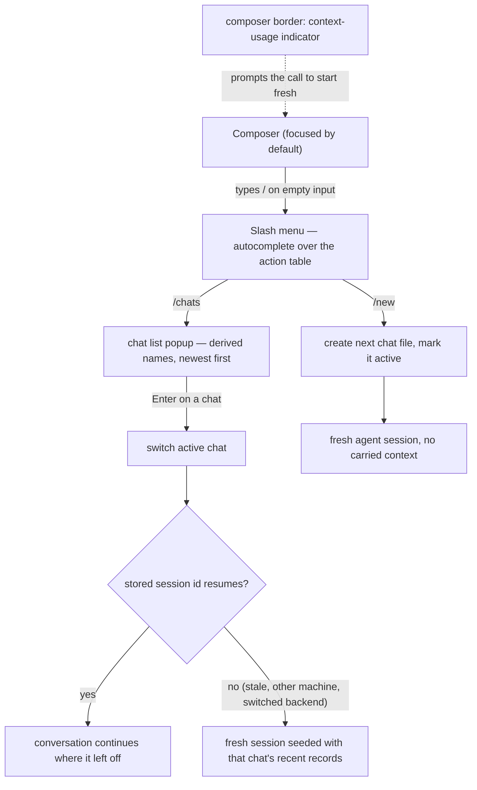

How a designer runs several conversations over one project: the slash menu in the composer, creating and switching chats, per-chat agent sessions, and the context-usage indicator that prompts starting fresh.

## Walkthrough

1. A chat is only a conversation line: switching swaps the visible history and the agent session and touches nothing else — active page, preview state, selection, and pins stay put. Pages are shared state: each turn's staging is assembled from the heads as they stand at send time, so edits made from another chat are picked up exactly as rollbacks are (see `flows/generation-turn.md`).
2. The slash menu: typing `/` as the first character of an empty composer (or the Home prompt) opens an autocomplete list rendered from the action table — the same registry that drives hotkeys and status-bar hints. An unavailable command shows dimmed with the hint the status bar would give; a command meaningless on the current screen is hidden. The set is small by design: `/new`, `/chats`, `/export` (MVP), `/model` (v1.0); live view controls stay on keys, and the composer's model chip and the status bar's version segment keep their clicks.
3. `/new` creates the next chat file (ids are termcraft-assigned, `c1`, `c2`, …), marks it active, and starts a fresh agent session with no carried context — the context-reset gesture.
4. `/chats` opens the chat list popup: derived names (the first line of each chat's first user record) with timestamps, newest first, the active chat marked; Enter switches.
5. Switching resumes the target chat's stored SDK session id.
   - *Failure:* resume fails (a stale session, another machine, a switched backend) — a fresh session starts silently, seeded with a short excerpt of that chat's recent records.
6. Context usage: an indicator on the composer's border renders token usage the backend reports in its event stream; a backend that reports nothing hides the indicator. termcraft never compacts a conversation itself — starting a new chat is the designer's context management.
7. One turn runs at a time per project regardless of chat; system records (rollbacks, errors, cancellations) land in the chat that was active when they happened.
   - *Failure:* chat creation and switching are locked while a turn runs; the refused command shows dimmed in the slash menu with the same status-bar hint.

## Source anchors

- `docs/superpowers/specs/2026-07-13-termcraft-design.md` — §3.9 chats, §3.10 composer commands, §6.2 per-chat sessions, §7.1 chats storage layout
- `design/23-slash-menu.dc.html` — slash menu open and filtered states
- `design/24-chats.dc.html` — chat list popup and the fresh-chat state
