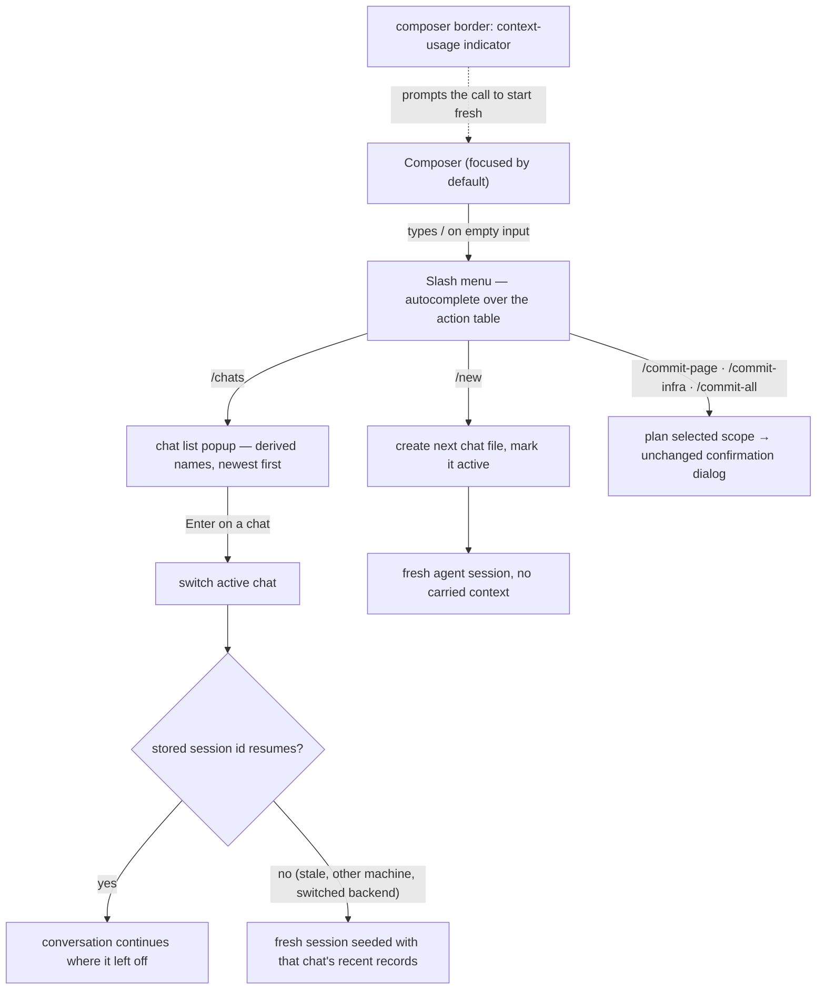

How a designer runs several conversations over one project: the slash menu in the composer, creating and switching chats, per-chat agent sessions, and the context-usage indicator that prompts starting fresh.

## Walkthrough

1. A chat is only a conversation line: switching swaps the visible history and the agent session and touches nothing else — active page, preview state, selection, and pins stay put. Pages are shared state: each turn's staging is assembled from every page's canonical current `page.tsx` at send time, so changes made from another chat are immediately part of later turns (see `flows/generation-turn.md`). In v1, a Git Restore likewise changes the shared canonical source rather than a chat-local state.
2. The slash menu: typing `/` as the first character of an empty composer (or the Home prompt) opens an autocomplete list rendered from the action table — the same registry that drives hotkeys and status-bar hints. An unavailable command shows dimmed with the hint the status bar would give; a command meaningless on the current screen is hidden. The set is small by design: `/new`, `/chats`, `/export` (MVP), then `/model`, `/commit-page`, `/commit-infra`, and `/commit-all` (v1.0). The three commit commands have no persistent button or mouse twin; each row owns its dirty dot, changed-file count, and clean-scope disabled state. Live view controls stay on keys, while the composer's model chip and the v1 current-design/history segment remain clickable.
3. `/new` creates a UUIDv7-named chat with a typed header and no records, updates
   machine-local active chat in the same ordinary project transaction, and starts
   with no vendor session checkpoint — the context-reset gesture. The first later
   Send appends that chat's first user record through turn admission.
4. `/chats` opens the chat list popup: derived names (the first line of each chat's first user record) with timestamps, newest first, the active chat marked; Enter switches.
5. Switching may resume a stored SDK session only when chat UUID, opaque backend/model/credential scope, record-count/prefix-hash checkpoint, and new-workspace binding all match.
   - *Failure:* any mismatch starts a fresh session seeded with a bounded recent-chat excerpt.
6. Context usage: an indicator on the composer's border renders token usage the backend reports in its event stream; a backend that reports nothing hides the indicator. termcraft never compacts a conversation itself — starting a new chat is the designer's context management.
7. Commit commands: `/commit-page`, `/commit-infra`, and `/commit-all` all dispatch through the action table to the Kernel's existing scope planner and open the same editable-message/exact-path confirmation dialog. Status refresh changes the dots, counts, and enabled states on their slash-menu rows; no Git status is stored in the chat and no commit is correlated with a prompt.
8. One turn runs at a time per project regardless of chat. User/agent/system records have UUIDv7 `recordId`; turn records share `turnId`. For Restore, accepted confirmation captures `targetChatId` and binds UUIDv7 `restoreActionId` to that chat, `pageSlug`, full commit id, and pre-Restore hash. `RestoreTransaction` persists this plan before commit intent. Source replacement and exactly-one append to the captured chat roll forward across ambiguous acknowledgement and process restart without repeating Gate or source replacement. The record stores `recordId`, action id, `pageSlug`, and full commit; its containing chat remains the chat identity. Changing machine-local active chat never retargets the action, and Git commits remain unrelated to prompts.
   - *Turn-time command mode:* ordinary message sending, chat creation/switching, export, and model changes stay locked while a turn runs. On an otherwise empty composer `/` still opens the menu; the three commit rows remain enabled according to scope state and the other locked rows show dimmed with their refusal hints.

## Source anchors

- `docs/superpowers/specs/2026-07-16-git-backed-page-history-design.md` — §2 shared canonical page source, §5 `changedPages` chat records, §7 Restore system record and commit independence
- `docs/superpowers/specs/2026-07-13-termcraft-design.md` — §3.9 chats, §3.10 composer commands, §6.2 per-chat sessions, §7.1 chats storage layout
- `docs/superpowers/specs/2026-07-16-production-storage-identity-design.md` — UUID chats/records and session checkpoints
- `docs/superpowers/specs/2026-07-16-turn-durability-staging-design.md` — durable Restore audit finalization
- `design/23-slash-menu.dc.html` — slash menu open and filtered states
- `design/24-chats.dc.html` — chat list popup and the fresh-chat state
