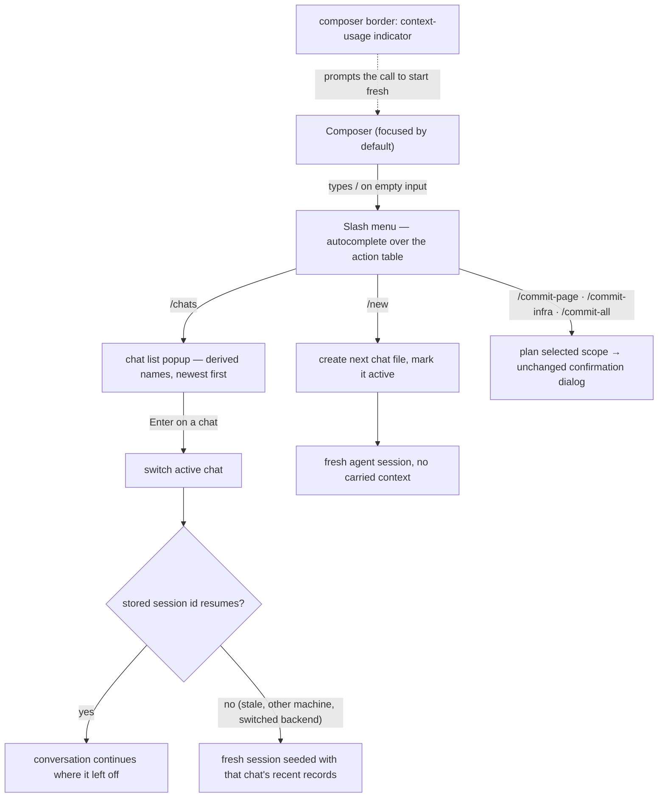

How a designer runs several conversations over one project: the slash menu in the composer, creating and switching chats, per-chat agent sessions, and the context-usage indicator that prompts starting fresh.

## Walkthrough

1. A chat is only a conversation line: switching swaps the visible history and the agent session and touches nothing else — active page, preview state, selection, and pins stay put. Pages are shared state: each turn's staging is assembled from every page's canonical current `page.tsx` at send time, so changes made from another chat are immediately part of later turns (see `flows/generation-turn.md`) — already true at the storage layer, since a turn's finalization targets a page by slug alone, with no per-chat scoping. In v1, a Git Restore likewise changes the shared canonical source rather than a chat-local state. Switching itself — swapping the visible history and the agent session — is Kernel/UI orchestration that does not exist as code yet.
2. The slash menu: typing `/` as the first character of an empty composer (or the Home prompt) opens an autocomplete list rendered from the action table — the same registry that drives hotkeys and status-bar hints. An unavailable command shows dimmed with the hint the status bar would give; a command meaningless on the current screen is hidden. The set is small by design: `/new`, `/chats`, `/export` (MVP), then `/model`, `/commit-page`, `/commit-infra`, and `/commit-all` (v1.0). The three commit commands have no persistent button or mouse twin; each row owns its dirty dot, changed-file count, and clean-scope disabled state. Live view controls stay on keys, while the composer's model chip and the v1 current-design/history segment remain clickable. None of this exists as code yet — there is no `ui` module.
3. `/new` is meant to create a UUIDv7-named chat with a typed header and no records, update machine-local active chat in the same ordinary project transaction, and start with no vendor session checkpoint — the context-reset gesture. That exact shape — a typed chat header written inside one project transaction alongside the machine-local state file — is proven today by exactly one caller: project creation writes the project's first chat header together with `project.toml`/`workspace.local.toml` in a single transaction (`flows/launch.md`). A later `/new` issued during an already-open session has no equivalent caller yet — that orchestration needs the Kernel. The first later Send appends that chat's first user record through turn admission, which is implemented as its own transaction (paired with the finalization/terminalization transactions that later close a turn — `flows/generation-turn.md`).
4. `/chats` is meant to open the chat list popup: derived names (the first line of each chat's first user record) with timestamps, newest first, the active chat marked; Enter switches. Not yet implemented — the storage primitives it would need (enumerating every chat file under a project, and reading a chat's header plus its earliest record) already exist and are exercised internally by the orphan-turn scan, but nothing today assembles them into a list.
5. Switching may resume a stored SDK session only when chat UUID, the opaque backend/model/credential/workspace scope, and the record-count/prefix-hash checkpoint all match. The storage-side half of that gate is implemented and unit-tested: chat identity, an opaque session-scope string, and a record-count-plus-prefix-hash comparison against a checkpoint persisted in `workspace.local.toml`. The backend half is implemented too: the backend is what mints that opaque scope string, from the backend's own identity plus the account, the model, and the workspace identity — and deliberately not from reasoning effort, so raising effort never discards a session. A backend that cannot name a stable account substitutes a value unique to the running process, which quietly disables resume after a restart rather than resuming into the wrong account. Deciding *when* to consult the gate, and handing the verdict to a live session, is Kernel orchestration that does not exist yet.
   - *Failure:* a mismatch starts a fresh session seeded with a bounded recent-chat excerpt — also implemented: at most 32 records and 64 KiB of text, newest whole records first. When the chat log itself is unreadable or its header names a different chat, that trust is absent, so the fresh session gets no seed at all instead.
6. Context usage: an indicator on the composer's border renders token usage the backend reports in its event stream; a backend that reports nothing hides the indicator. termcraft never compacts a conversation itself — starting a new chat is the designer's context management. The producing half is now built: the Claude backend emits a usage event with input and output token counts and the share of the context window they occupy, and emits it on a failed turn as well as a successful one — the case where the indicator matters most is an attempt that burned most of the window and then errored. When no model reports a usable window size, the percentage is reported as absent rather than guessed, which is what "a backend that reports nothing hides the indicator" means concretely. No UI exists to render it.
7. Commit commands: `/commit-page`, `/commit-infra`, and `/commit-all` are meant to dispatch through the action table to the Kernel's scope planner and open the same editable-message/exact-path confirmation dialog. Status refresh changes the dots, counts, and enabled states on their slash-menu rows; no Git status is stored in the chat and no commit is correlated with a prompt. None of this exists as code yet — there is no `core`/Kernel module and no Git-scope planner.
8. One turn runs at a time per project regardless of chat — enforced by a single in-process write permit that every admission/finalization/terminalization call acquires before writing, chat-agnostic by construction. User/agent/system records have UUIDv7 `recordId`; turn records share `turnId` — enforced by the entity schemas' decoders, including the `turnId`/`actionId` mutual-exclusion rule on system records. For Restore, accepted confirmation captures `targetChatId` and binds UUIDv7 `restoreActionId` to that chat, `pageSlug`, full commit id, and pre-Restore hash; `RestoreTransaction` persists this plan (a canonical-source replace plus exactly one captured-chat append) before commit intent, and the shared transaction engine's crash-recovery protocol is what lets both roll forward across ambiguous acknowledgement and process restart without repeating either step. That machinery is built and unit-tested, but Restore stays out of MVP scope: no live path calls it today, so no `system:restore` record is ever written yet. The record stores `recordId`, action id, `pageSlug`, and full commit; its containing chat remains the chat identity. Changing machine-local active chat never retargets the action, and Git commits remain unrelated to prompts.
   - *Turn-time command mode:* ordinary message sending, chat creation/switching, export, and model changes stay locked while a turn runs. On an otherwise empty composer `/` still opens the menu; the three commit rows remain enabled according to scope state and the other locked rows show dimmed with their refusal hints. Not yet implemented — there is no Kernel/UI to enforce it; the one-turn-at-a-time guarantee it would visualize is already true underneath, at the write-mutex level described above.

## Source anchors

- `src/entities/chat/types.ts` — the chat record/header vocabulary: `ChatHeader` (typed header, no records), `ChatUserRecord`/`ChatAgentRecord` sharing `turnId`, `ChatSystemErrorRecord`/`ChatSystemCancelledRecord` (mutually exclusive `turnId`/`actionId`), and `ChatSystemRestoreRecord` (reader-side only — DEFINED for forward-compat, no MVP writer, matching Restore's out-of-scope status).
- `src/entities/chat/model/decode.ts` — `decodeChatHeader`/`decodeChatRecord`: the Zod-backed schema validation, including the `turnId`/`actionId` mutual-exclusion rule system records must satisfy.
- `src/entities/turn/types.ts` — `TokenUsage`/`AgentEvent`'s `usage` kind: the normalized token-usage shape a backend reports through to "feed the composer's context indicator" (its own doc comment); the Claude backend produces it today, and no UI exists yet to render it.
- `src/agent/claude/model/normalize.ts` — `deriveUsage`/`normalizeMessage`: where the usage event of step 6 is computed, including the context-window percentage, the null when no window is reported, and the deliberate emission of usage on error results as well as successes.
- `src/agent/model/session-scope.ts` — `deriveSessionScope`: the backend half of step 5's gate — the opaque scope string over backend, account, model, and workspace identity, with effort excluded and a per-process fallback account when the backend cannot name a stable one.
- `src/agent/claude/model/session-plan.ts` — `planToSessionOptions`/`buildPrompt`: how a resume verdict becomes vendor session options and a delta prompt, and how a fresh session's bounded seed is prepended to the message as leading context.
- `src/store/jsonl/model/checkpoint.ts` — `evaluateSessionResume`/`computeSessionPrefixHash`/`selectSeedRecords`: the storage-side resume gate (chat identity, opaque session-scope string, record-count-plus-prefix-hash match) and the bounded fresh-session seed (≤32 records, ≤64 KiB) built on a miss.
- `src/store/toml/model/workspace-toml.ts` — `workspace.local.toml`'s `session_checkpoints`/`active_chat_id`/`backend`/`model` fields: the machine-local state a chat switch would read and a resume decision would persist into.
- `src/store/transaction/model/wrappers.ts` — `admitTurn` (appends exactly the user record before any agent process starts — the mechanism behind "the first later Send appends... through turn admission"), `finalizeTurn`/`terminalizeTurn` (the agent/system terminal record, and the chat-agnostic canonical-page targets the shared-pages invariant relies on), and the infrastructure-only `buildRestoreTransaction` (source replace plus one captured-chat append in a single plan; built and unit-tested, no MVP caller — Restore stays out of scope).
- `src/store/transaction/model/write-mutex.ts` — `WriteMutex`: the single in-process permit that makes "one turn runs at a time per project regardless of chat" true — every admission/finalization/terminalization call acquires the same project-wide permit.
- `src/store/model/factory.ts` — `createProject` mints the project's first chat header inside the same project-creation transaction as `project.toml`/`.gitignore`/`workspace.local.toml` (the one case today where "typed header, no records, one ordinary project transaction" actually runs — a later mid-session `/new` has no equivalent caller yet); `makeChatStore`/`scanOrphanTurns` open one chat by id and enumerate every chat file under a project — primitives a chat-list view would need, but nothing yet assembles them into one.
- `docs/superpowers/specs/2026-07-16-git-backed-page-history-design.md` — §2 shared canonical page source, §5 `changedPages` chat records, §7 Restore system record and commit independence (v1; Restore has no MVP caller — see `buildRestoreTransaction` above)
- `docs/superpowers/specs/2026-07-13-termcraft-design.md` — §3.9 chats, §3.10 composer commands, §6.2 per-chat sessions, §7.1 chats storage layout — the authority for the composer, slash menu, chat list popup, and commit commands, none of which exist as code yet (no `ui`/`core` module; the backend-side session pieces §6.2 needs are anchored above)
- `docs/superpowers/specs/2026-07-16-production-storage-identity-design.md` — UUID chats/records and session checkpoints, source-of-record for the `entities/chat`/`store/jsonl`/`store/toml` files above
- `docs/superpowers/specs/2026-07-16-turn-durability-staging-design.md` — durable Restore audit finalization, source-of-record for the `store/transaction` files above
- `design/23-slash-menu.dc.html` — slash menu open and filtered states
- `design/24-chats.dc.html` — chat list popup and the fresh-chat state
