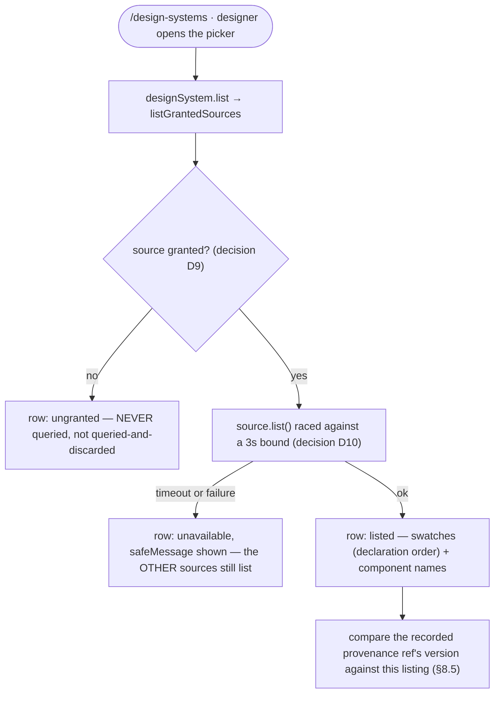
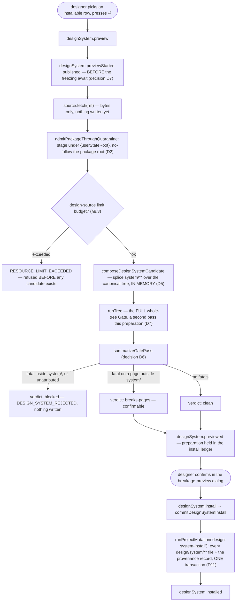

A designer browses the design systems a configured source offers, sees each one's colors and
contents without a single byte of foreign code ever being read or executed, installs one through
quarantine and a full validation pass, and can publish the project's own system back out to their
local library. This document covers the picker, the trust gate every source sits behind, the
install pipeline (fetch → quarantine → immutable candidate → whole-tree Gate → breakage preview →
one recoverable commit), the provenance record, and publishing.

**Status (project-design-systems §8.1–§8.6, §10.1 Wave 3, plan P10 `install-and-picker`):** real
end to end. The `local` source (a directory under `{userStateRoot}/design-systems/`) and its
adapter shipped with plan P3; this plan wires everything downstream of it — quarantine, the
immutable candidate, the install transaction, the provenance record, the picker overlay, and the
breakage-preview/install-confirm dialog — into the composition root. No second source adapter
(e.g. GitHub) exists yet; the port (`core/ports/design-system-source.ts`) is written so one can
join without changing it (§8.1).

## Listing sources



## Preview and install



## Publishing

```mermaid
flowchart TD
    ptrigger(["designer presses p on a canPublish source"]) --> canpublish{"source.canPublish?"}
    canpublish -- "no" --> refused["designSystem.publishFailed — refused BEFORE reading the tree"]
    canpublish -- "yes" --> readown["read the project's OWN system/** off the canonical design tree"]
    readown --> call["source.publish(pkg)"]
    call --> swap["local adapter: three-step swap — never deletes live data first (decision D3)"]
    swap --> published["designSystem.published"]
```

## Walkthrough

1. **Trigger.** The `/design-systems` slash command (`src/ui/actions/model/registry.ts`'s
   `design-system.open` row, capability-gated on `designSystem.list`) is the only reachability
   path — no hotkey is bound, because design draws no key vocabulary here to extend (decision D8,
   below). Selecting the row both opens the overlay and dispatches `designSystem.list`
   immediately (`ui/app/model/intent.ts`'s `open-design-systems` effect), the same shape
   `/design-system.open`'s row comment calls out as unlike `/chats` (whose switch is a separate,
   later dispatch).
2. **Listing is trust-gated per source, and bounded.** `core/design-systems/model/sources.ts`'s
   `listGrantedSources` never calls `list()` on a source its `isGranted` callback refuses —
   "an unrecorded remote source is never queried" (§8.4) is enforced by never making the call, not
   by discarding its answer. The built-in `local` source is granted WITHOUT a prompt on first use
   (it is the designer's own directory under their own `userStateRoot`) but the grant is still
   RECORDED through `trustStore.grantSource` (`src/entrypoint/model/create-shell.ts`), so the
   ledger stays the single authority on what was decided and a later kind or path change is a
   fresh decision, exactly like every other source (decision D9). Every granted source is queried
   concurrently, each against its own `Promise.race` against a 3 second timer (`DESIGN_SYSTEM_LIST_TIMEOUT_MS`,
   decision D10) — the port carries no `signal`, so a timed-out source's own promise is abandoned,
   not cancelled; a `local` listing is bounded by the filesystem regardless, and a future network
   adapter that ignores its own bound is a bug in that adapter, not something this race can fix.
   - *Failure:* a source that times out or fails becomes an `unavailable` row carrying its
     `safeMessage` — the other sources still list. An ungranted source becomes an `ungranted` row.
     Neither failure blocks the picker from opening or from showing every other source.
3. **The update check (§8.5).** `detectDesignSystemUpdate` compares the project's recorded
   provenance (below) against the listing from the SAME source id: a DIFFERENT version at that
   address is an available update, surfaced as `designSystem.listed`'s own `update` field. The
   comparison is deliberately "a different version", never "a newer one" — a reference's version
   is opaque text (`source:system@version`, §8.1), so inventing a semver ordering would make
   `1.10.0` read as older than `1.9.0` for a system that does not use semver. A same-version
   republish is invisible here — `DesignSystemSummaryV1` carries no content hash — and is only
   caught at the next `fetch`, when the content hash is compared for real.
4. **Preview starts the pipeline** (`designSystem.preview`, `core/kernel/model/handlers/design-system.ts`'s
   `designSystemPreview`). `context.publishOperationEvent({ kind: "designSystem.previewStarted" })`
   fires BEFORE `await prepareDesignSystemInstall(...)` — decision D7. `runTree`'s type-check
   stage drives `typescript/unstable/sync` on the calling thread and genuinely freezes it (measured
   in `src/entrypoint/model/design-checker.ts`'s own header: "ZERO ticks of a 10ms interval across
   every run"). This plan does not fix that freeze — it is not P10's defect, and fixing it means
   moving the type check off-thread, which no plan in this feature owns — but it refuses to make
   the freeze look like a hang: the picker has already painted "checking…" by the time the thread
   stops, because the event that draws it left before the freezing `await`.
5. **Fetch never writes anything.** `source.fetch(ref)` returns bytes only (§8.3). The FIRST time
   anything from an untrusted package touches disk is quarantine, next.
6. **Quarantine** (`store/design-systems/model/quarantine.ts`'s `admitPackageThroughQuarantine`,
   decision D4) materializes the fetched package under
   `{userStateRoot}/design-systems/quarantine/<installId>/` — a UUIDv7, create-new via `mkdirNew`
   so a collision is a fault rather than a silent reuse — NEVER inside the project. Staging happens
   at `staging/design/system/<packageRelPath>`; the `design/` prefix is load-bearing, since it is
   what makes `classifyNamespace("workspace", …)` return the `design-source` namespace, so the
   REAL limit budget applies (512 files, 64 MiB aggregate, depth 8, 2 MiB per file) with no new
   namespace and no change to `NAMESPACE_LIMITS`. `store/safe-fs`'s `snapshotToCandidate` then
   enumerates and admits the WHOLE staging tree against that budget and the no-follow walk BEFORE
   creating the candidate directory at all, so an oversized or over-numerous package is refused
   with no candidate ever existing (§11: "rejected before it reaches the candidate"). The resulting
   immutable candidate's bytes are read back EXACTLY ONCE — decision D5 — and that one read feeds
   both the Gate (next) and the install transaction (step 9); the staging tree and the original
   fetched bytes are never read again, which is what closes the TOCTOU window a second read of
   foreign input would open.
   - *Failure:* a package that fails admission (limits, an escaping path, a symlinked package root)
     never reaches the candidate stage, and quarantine discards its own directory on the way out.
   - *Fixed here, decision D2 (P3's parked minor M5):* `fetchLocalPackage` used to reach a
     package through `listDir(localSystemDir(...))`, which follows a symlinked `local/<id>` — a
     link planted in the library was readable through `fetch` even though `list` already refused a
     symlinked library entry. P10 lists the PARENT (`localLibraryDir`) and applies the identical
     symlink-refusal predicate `list.ts` already applied to the `<id>` entry.
7. **The candidate is composed in memory, not on disk** (`core/design-systems/model/candidate.ts`'s
   `composeDesignSystemCandidate`, decision D5). `GateRunner.runTree` takes an in-memory
   tree-relative map, and the canonical tree is already in memory from `readCanonicalTreeIndex`
   — materializing the WHOLE design tree into quarantine just to run the Gate would be pure waste.
   The candidate is the canonical tree's files minus every key `isInsideDesignSystem` accepts, plus
   the candidate snapshot's files read back in step 6.
8. **The full Gate runs on the candidate** — the SAME whole-tree pass every other design-tree
   change goes through (`runTree`: allowlist scan, closure resolution, one `tsc` program, lints,
   the design-system manifest slice). This is the SECOND whole-tree Gate pass this one preparation
   makes (`readCanonicalTreeIndex` already ran one to produce the canonical tree the candidate
   splices over), both freezing the thread per step 4 — accepted, and stated rather than hidden,
   because correctness of the preview is what the whole pipeline exists for.
9. **The Gate's answer becomes a breakage preview** (`summarizeGatePass`, decision D6). §8.3: "the
   designer sees the list and decides" — but that licence is about PAGES, not about a package that
   is itself broken:
   - A `GateErrorV1` whose `file` is inside `system/`, OR whose `file` is absent (a whole-tree
     fatal with no attribution), makes the preview `blocked`. `designSystem.install` refuses with
     `DESIGN_SYSTEM_REJECTED` — the package itself failed the same check every design system must
     pass, and installing it would be installing something the Gate has already said is not a
     design system.
   - Every other fatal is `breaks-pages`: listed in full, confirmable, and installed on
     confirmation exactly like `clean` — §12: "replacing a design system can break pages —
     surfaced before commit, not prevented."
   - `warnings` never block, in either verdict.
10. **The preparation is held, not committed, until confirmed.** `designSystem.previewed` carries
    `installId`, the ref, the summary, and the preview; `context.designSystemLedger` holds the
    prepared install (quarantine deliberately still on disk) until the designer either confirms
    (`designSystem.install`, which commits and discards) or closes the dialog (best-effort
    `discardPreparedInstall`, which abandons and discards). A second preview for a different
    system evicts and discards the first — no quarantine directory is ever leaked across a
    replaced preparation.
11. **The commit is ONE recoverable transaction** (`commitDesignSystemInstall`, decision D11).
    `store/transaction/model/wrappers.ts` appends `"design-system-install"` as a new
    `ProjectMutationKind` — the same closed-registry pattern that added `"chat-creation"`,
    `"page-reorder"` and `"page-remove"`, "without disturbing any already-shipped kind's meaning" —
    and `buildDesignSystemInstallOperations` folds every `nextFiles` entry (`replace`), every
    `removedTreeRelPaths` entry (`delete`), and one `replace` for the provenance record into a
    single operation list `runProjectMutation` commits or refuses as a whole. This reuses the
    engine's existing per-operation CAS, payload/limit pre-check, and idempotent roll-forward
    rather than duplicating any of it in a new transaction kind.
    - *Failure:* a crash before the transaction's `intent.json` is durable leaves the project
      byte-identical — nothing in `design/system/**` or the provenance record has moved. A crash
      after intent is rolled forward by the SAME recovery scan (`recoverTransactions`) that
      `openProject` already runs for every other transaction kind; there is no
      design-system-specific recovery path, because none is needed.
12. **Publishing** (`designSystem.publish`, `readOwnDesignSystemPackage` +
    `core/kernel/model/handlers/design-system.ts`'s `designSystemPublish`) reads the project's own
    `system/**` off the canonical design tree, strips the `system/` prefix to package-relative
    paths, and calls `source.publish(pkg)`. Refused BEFORE either the tree read or the call itself
    when `source.canPublish` is false, or when the tree has no `system/` at all — a precondition,
    not a source-side fault.
    - *Fixed here, decision D3 (P3's parked minor M11):* `publishLocalPackage` used to
      `removeDir(target)` then `renameDir(staging, target)` — a crash between them destroyed an
      already-published system with nothing left to recover. P10 replaces it with a three-step
      swap that never deletes live data before the replacement is in place: rename the live system
      aside to `.retiring-<systemId>` (a `.`-prefixed name `parseDesignSystemId` refuses, so `list`
      cannot see it — the same property the existing `.publishing-` prefix already relies on),
      rename staging into place, then remove the retired copy — plus a pre-flight sweep that
      renames `.retiring-<systemId>` back if a prior publish crashed between steps 1 and 2. The
      window is not zero (no filesystem primitive available here makes it zero, which is why the
      local library is deliberately outside the transaction engine) but data is never destroyed,
      which is the property that was missing.
13. **The provenance record** (`.termcraft/design-system-source.json`, decision D1, §8.5) is the
    project's record of WHERE its design system came from — `source:system@version` plus a
    content hash over the whole package, in project state OUTSIDE `design/`, written by the SAME
    transaction as the files it describes. Not in the manifest: a package published back out would
    then carry a claim about its own origin that stops being true on the first republish. Not in
    `project.toml`: that file is a closed, `z.strictObject` portable manifest gated by
    `PROJECT_MANIFEST_FORMAT_VERSION`, and a new field there costs a format bump and a migration
    step — a competing bump on the same feature branch P4 was already stepping 2 → 3 is exactly the
    collision the wave model exists to avoid. Not in `workspace.local.toml`: that file is
    machine-local and hard-excluded from every Git commit scope, and provenance has to travel with
    the project. Not under `cache/`: gitignored, and discardable by name. Instead: its own small
    file at the top of `.termcraft/`, versioned by its OWN `schemaVersion` (currently `1`) rather
    than by `format_version`, so it needs no migration step. `store/safe-fs`'s `classifyProject`
    admits it as a fourth top-level `.termcraft` file, classified `project-config` alongside
    `project.toml`/`workspace.local.toml`/`.gitignore`. **Absence is meaningful and is never an
    error**: a project whose design system came from the compiled seed — every project P4
    scaffolds or migrates — has no source to record, and says so by having no file; only an
    install writes one.

### Design gaps (CLAUDE.md: recorded, not silently absorbed)

`design/` has no design-system-picker or install-confirm screen — none of the 27 `.dc.html`
screens covers browsing, swatches, or installing a design system, and `termcraft-engine.js` has no
swatch-row helper (decision D8). Nothing here is invented; the two closest existing vocabularies
are used verbatim and the gaps below are the record a future design pass needs:

- **The picker** (`src/ui/popups/ui/DesignSystemPicker.tsx`) borrows
  `design/06-agent-model-picker.dc.html` / `agentPicker(w,h)` verbatim: the amber-bordered modal,
  the `▸`/`●`/`○` row markers, the `pal.sel`/`selFg` selection band, the `├`…`┤` rule (drawn as a
  full-width `─` line inside the box — a flex child cannot reach the box's own border cells the
  way the engine's draw call does, the same divergence `HostCrashPanel`/`HostUnavailablePanel`
  already carry), and the `↑↓ select · ⏎ … · esc close` footer vocabulary.
- **The breakage-preview / install-confirm dialog**
  (`src/ui/popups/ui/DesignSystemInstallPrompt.tsx`) borrows `design/16-wizard-migration.dc.html` /
  `migrate(w,h)`: the `⚠ …` amber headline, the dim lead-in, `• ` bullets, the `pal.faint`
  consequence line, and the `⏎ <verb> · esc <alternative>` footer.
- **The swatch row has no design precedent at all.** It is built from vocabulary the engine
  already uses for coloured cells — a run of `█` (the engine's own filled-cell glyph, `bar()` and
  the cursor block throughout `termcraft-engine.js`), each glyph painted `fg` with one token's own
  `#rrggbb` value, in the manifest's DECLARATION order, truncated to the width available. Recorded
  as a divergence in the component's own header comment, not silently invented.
- **The unavailable-row note reuses `pal.amberHi`** because `agentPicker` has no degraded-row case
  to draw from — the closest existing "something is wrong with this row" colour in the picker's
  own palette.
- **Column widths** (name / version / swatch cell / contents / rule) have no design source at all;
  `DesignSystemPicker.tsx`'s own header comment records them as an implementation-level layout
  choice sized off the header text, explicitly NOT a colour, glyph, or state CLAUDE.md's rule
  governs.

### A plan-level gap, not a design one

Decision D9's own prose says the picker "offers to grant" an ungranted source, and the picker's
ungranted row (`actionHintFor` in `DesignSystemPicker.tsx`) advertises `⏎ add source` — but this
plan defines no grant command among its four (`designSystem.list`/`preview`/`install`/`publish`),
so activating that row today is a no-op. It is UNREACHABLE in practice: `local` is the only source
adapter, and the composition root grants it without ever surfacing an ungranted row. But if a
second adapter (e.g. GitHub) ever lands with no grant flow behind it, that row becomes a dead end —
a hint promising an action nothing services. Recorded here plainly as an open gap, not presented as
resolved; a future plan adding a second source adapter must also add the grant command this row
already advertises.

## Source anchors

- `src/entities/design-system-ref/model/ref.ts` — `DesignSystemRef`, `parseDesignSystemRef`/
  `formatDesignSystemRef` (`source:system@version`), used as the picker's selection, the
  provenance record's own address, and the install/publish commands' payload shape
- `src/core/ports/design-system-source.ts` — `DesignSystemSource`: `list`/`fetch`/`publish` (P3);
  `src/core/ports/fakes/design-system-source.ts` is its in-memory fake
- `src/core/ports/design-system-install.ts` — `DesignSystemQuarantinePort` (`admit`/`discard`) and
  `DesignSystemInstallPort` (`install`/`encodeProvenance`/`readProvenance`), the two ports that
  keep `core/design-systems` free of any `store` import (P10)
- `src/core/design-systems/model/candidate.ts` — `composeDesignSystemCandidate` (splices
  `system/**` over the canonical tree in memory, decision D5) and `summarizeGatePass` (classifies
  the Gate's answer into `clean`/`breaks-pages`/`blocked`, decision D6)
- `src/core/design-systems/model/sources.ts` — `listGrantedSources` (grant-gated, per-source 3s
  bound, decisions D9/D10) and `detectDesignSystemUpdate` (§8.5's update check)
- `src/core/design-systems/model/install.ts` — `prepareDesignSystemInstall`/
  `commitDesignSystemInstall`/`discardPreparedInstall`: the trust → fetch → quarantine →
  candidate → Gate → preview → commit orchestration, threaded through
  `DesignSystemInstallPortsV1`. No direct I/O — every effect crosses a port
- `src/core/kernel/model/handlers/design-system.ts` — the `designSystem.list`/`preview`/`install`/
  `publish` command handlers; `designSystemPreview` publishes `designSystem.previewStarted` BEFORE
  the freezing `runTree` await (decision D7); `context.designSystemLedger` is what makes
  `designSystem.install` a commit of an already-previewed candidate, never a silent re-fetch
- `src/core/protocol/model/{command-kind,command-payload,event-kind,event-payload,failure}.ts` —
  the four `designSystem.*` commands (44 → 48 command kinds), their nine events
  (`listed`/`listFailed`/`previewStarted`/`previewed`/`previewFailed`/`installed`/`installFailed`/
  `published`/`publishFailed`), and the `DESIGN_SYSTEM_REJECTED` failure code
- `src/store/design-systems/model/quarantine.ts` — `admitPackageThroughQuarantine`/
  `discardQuarantine`: the per-install quarantine under `{userStateRoot}/design-systems/quarantine/`,
  the `design/` staging prefix that routes the real limit budget, and the single read-back that
  feeds both the Gate and the commit (decisions D4, D5)
- `src/store/design-systems/model/admission.ts` — `createDesignSourceAdmission`, the real
  `PackageAdmission` over `store/safe-fs`'s `createLimitBudget("workspace")` (decision D2)
- `src/store/design-systems/model/provenance.ts` — `encodeDesignSystemProvenance`/
  `decodeDesignSystemProvenance`, the `DesignSystemProvenanceV1` schema and
  `DESIGN_SYSTEM_PROVENANCE_FILENAME` (decision D1)
- `src/store/design-systems/model/fetch.ts` — `fetchLocalPackage`, fixed (decision D2, P3's M5) to
  no-follow the package ROOT by listing `localLibraryDir` and applying `list.ts`'s own
  symlink-refusal predicate
- `src/store/design-systems/model/publish.ts` — `publishLocalPackage`, rewritten (decision D3,
  P3's M11) to a three-step swap (`target → .retiring-<id>`, `staging → target`, remove
  `.retiring-<id>`) plus a pre-flight sweep that repairs a crash between steps 1 and 2
- `src/store/safe-fs/model/limits.ts` — `classifyProject` admits `design-system-source.json` as a
  fourth top-level `.termcraft` file, classified `project-config` (decision D1)
- `src/store/adapters/design-system-install.ts` — `createDesignSystemQuarantineAdapter`/
  `createDesignSystemInstallAdapter`, the production port pair over quarantine and
  `TransactionEngine.installDesignSystem`
- `src/store/adapters/design-system-source.ts` — the production `DesignSystemSource` port adapter
  (P3)
- `src/store/transaction/model/wrappers.ts` — `"design-system-install"` (`ProjectMutationKind`,
  decision D11) and `buildDesignSystemInstallOperations`
- `src/store/model/factory.ts` — `TransactionEngine.installDesignSystem`, wrapping
  `buildDesignSystemInstallOperations` in `runProjectMutation` under the project's write mutex
- `src/ui/mirror/model/mirror.ts`, `src/ui/mirror/types.ts` — the `designSystems` slice: sources,
  phase (`idle`/`listing`/`checking`/`installing`/…), the held preview/prompt state, folded from
  the nine events above
- `src/ui/popups/model/design-system-picker.ts` — `designSystemRows`, swatch/contents/row
  view-model math, and this feature's own header comment recording the full D8 gap
- `src/ui/popups/ui/DesignSystemPicker.tsx` — the picker overlay: swatch row, system contents,
  `canPublish`-gated publish hint, the ungranted/unavailable degraded states
- `src/ui/popups/ui/DesignSystemInstallPrompt.tsx` — the breakage-preview / install-confirm dialog,
  and the publish confirmation
- `src/ui/actions/model/registry.ts` — the `design-system.open` slash-command row (`/design-systems`,
  `order: 7.5`, no hotkey — decision D8's own reachability note)
- `src/ui/app/model/{deps.ts,keymap.ts,intent.ts}`, `src/ui/app/ui/App.tsx` — the overlay wiring:
  `local.designSystemSelection`/`local.designSystemPrompt` (`UiLocalState`), the picker's
  ↑↓/⏎/p/esc keymap, and `open-design-systems`'s intent effect
- `src/ui/workspace/model/focus.ts` — the design-system overlay's entry in the layered `Esc` stack
- `src/entrypoint/model/create-shell.ts` — composes `designSystemSource` (`createLocalDesignSystemSource`
  over `createDesignSourceAdmission`), `designSystemQuarantine`, `designSystemInstall`, and
  `designSystemIsGranted` (closed over the ONE `local` subject, granted without a prompt but still
  recorded via `trustStore.grantSource`, decision D9)
- `design/06-agent-model-picker.dc.html`, engine `agentPicker(w,h)` — the picker's visual source
  (decision D8)
- `design/16-wizard-migration.dc.html`, engine `migrate(w,h)` — the breakage-preview dialog's
  visual source (decision D8)
- `docs/superpowers/specs/2026-08-11-project-design-systems-design.md` — §8.1–§8.6, §10.1 Wave 3
  (P10), §11 (install tests), §12 — the governing design this whole flow implements
