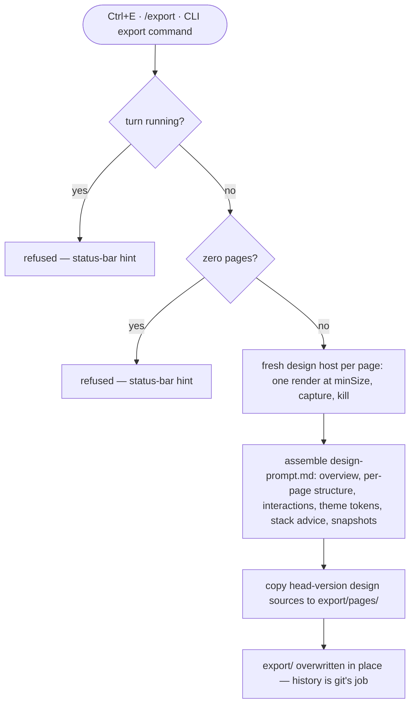

Export turns a design project into a package another coding agent can implement from: an implementation prompt with deterministic text snapshots of every page, plus the exact design sources.

## Walkthrough

1. Trigger: `Ctrl+E` (a global-tier hotkey — works even while typing), the `/export` slash command in the composer, or the CLI export command.
2. Refusal checks, each hinted in the status bar: a running turn, or a project with zero pages.
3. Snapshot rendering: the Kernel spawns a fresh design host per page, mounts the head version at the page's declared minimum size with the page's own theme, renders exactly once at t = 0, captures the frame, and kills the host — independent of the current preview size or theme override. Determinism comes from the recipe (fresh process, single render pass) plus the design-code rules: kit components suppress animation under the export flag, and timers or randomness outside that guard are gate warnings.
4. `design-prompt.md` contents: product overview, per-page structure and behavior, interactions and tweak states, theme/palette tokens, recommended libraries for the configured target stack, and the ASCII snapshot of each page.
5. `pages/*.tsx`: exact head-version design sources — precise enough for an implementing agent in any target stack to read as a spec.
6. Re-export silently overwrites `export/` in place: exports are derived data; their history is git's job.
7. Removed pages are unlisted from the project manifest and therefore invisible to export.

## Source anchors

- `docs/superpowers/specs/2026-07-13-termcraft-design.md` — §3.7 export package, §3.10 the /export command, §5.7 rendering determinism, §5.8 design-code rules, §3.2 turn-time locks, §6.2 manifest visibility
- `design/13-export-feedback.dc.html` — export feedback states
