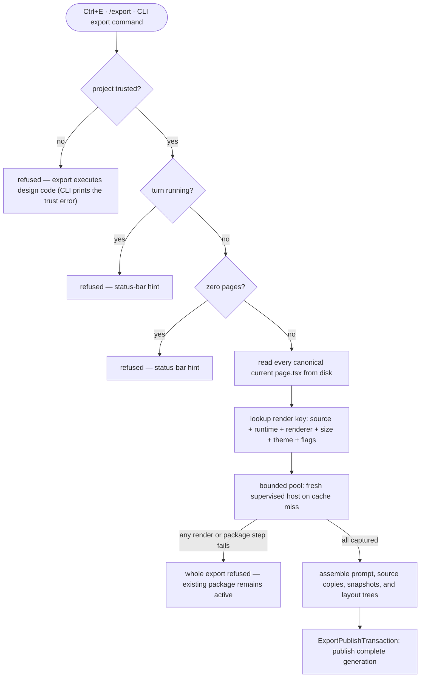

Export turns a design project into a package another coding agent can implement from: an implementation prompt, deterministic text snapshots of every page at several terminal sizes, resolved layout trees, and the exact canonical design sources currently on disk.

## Walkthrough

1. Trigger: `Ctrl+E` (a global-tier hotkey — works even while typing), the `/export` slash command in the composer, or the CLI export command.
2. Refusal checks: an untrusted project (export executes design code — the CLI form prints the trust error and points at the TUI), a running turn, or a project with zero pages; in-app refusals hint in the status bar.
   - *Failure:* export is all-or-nothing — if any page fails to render at any export size, or any package file cannot be assembled, the whole export refuses. A render error names the page, size, and failure; a package with a silently missing page would lie to the implementing agent. The previous `export/current.json` remains active until a replacement generation is ready.
3. Source selection: export takes a short `ProjectWritePermit` to capture one coherent immutable snapshot of the portable manifest and every listed canonical `.termcraft/pages/<slug>/page.tsx`, records its digest, then releases the permit. This is the Current design, including uncommitted changes. Rendering and package assembly run from that snapshot without the project-write mutex; publication reacquires it and revalidates the source plan before durable intent. A historical preview is only a temporary read-only viewing source and is ignored by export; export never substitutes the page copy at Git `HEAD` or the selected historical commit.
4. Export sizes are a fixed ladder: the page's declared minimum size always, plus 120×40 (also a preview preset — what the user saw is what ships) and 160×40; a standard size is included only when it is at least the minimum on both axes (a page is never rendered below its minimum), and duplicates collapse. Several sizes turn resize behavior into data — the frames show which regions stretch and which stay fixed (the 120×40 → 160×40 step grows width only, isolating horizontal stretch), so the implementing agent never simulates the design's layout engine.
5. Capture: a bounded worker pool processes `(page,size)` jobs. A rebuildable local cache is keyed by source hash, `kitApiVersion`, renderer version, size, theme, and export flags. On a miss, `HostSupervisor` opens a fresh one-shot export session, handshakes runtime compatibility, renders once at t = 0, captures frame and layout tree from the same pass, and kills the host. Runtime components suppress animation under export mode; time/randomness violations remain Gate warnings.
6. Package contents, relative to the resolved
   `export/generations/<generationId>/` directory selected by `current.json`:
   - `design-prompt.md` — product overview, per-page structure and behavior, interactions and tweak states, theme/palette tokens, recommended libraries for the configured target stack, the embedded minimum-size frame of each page, and instructions framing the snapshot files as acceptance fixtures ("your implementation at 80×24 must render this; diff against it") plus how to read the layout trees.
   - `pages/*.tsx` — exact copies of the canonical current design sources, precise enough for an implementing agent in any target stack to read as a spec.
   - `snapshots/<page>/<WxH>.txt` — one ASCII frame per export size, as separate files so the agent can diff its own render output against them programmatically.
   - `layout/<page>.json` — the resolved layout tree at every export size: per node its id (as declared in the design, else null), runtime component or low-level primitive kind, computed box in terminal cells, text for text nodes, and children. No styles — colors already live in the frames and theme tokens.
   - `runtime-api.json` — public module identity and each page's parsed `kitApiVersion`; it contains no private Reatom, React, OpenTUI, or JSX-transform versions.
7. Publication: `ExportPublishTransaction` assembles and verifies an immutable generation, persists publication intent, creates every generation file, and replaces `current.json` only after the generation manifest verifies. Capture/assembly failure leaves the previous pointer active; a crash after intent is recovered before Workspace. Cleanup removes the formerly referenced generation only after publication. The active pointer and its one referenced generation remain eligible for `/commit-all`; scratch and render cache are local and hard-excluded.
8. Removed pages are absent from the project manifest and therefore invisible to export.

## Source anchors

- `docs/superpowers/specs/2026-07-16-git-backed-page-history-design.md` — §5 canonical current-source export rule, including uncommitted changes and historical-preview independence
- `docs/superpowers/specs/2026-07-13-termcraft-design.md` — §3.7 export package and all-or-nothing behavior, §3.10 the `/export` command, §5.7 rendering determinism, §5.8 design-code rules, §3.2 turn-time locks, §6.2 manifest visibility
- `docs/superpowers/specs/2026-07-16-runtime-api-compatibility-design.md` — exact page copies and `runtime-api.json`
- `docs/superpowers/specs/2026-07-16-turn-durability-staging-design.md` — recoverable publication
- `docs/superpowers/specs/2026-07-16-projections-observability-scale-design.md` — bounded pool and render cache
- `design/13-export-feedback.dc.html` — export feedback states
