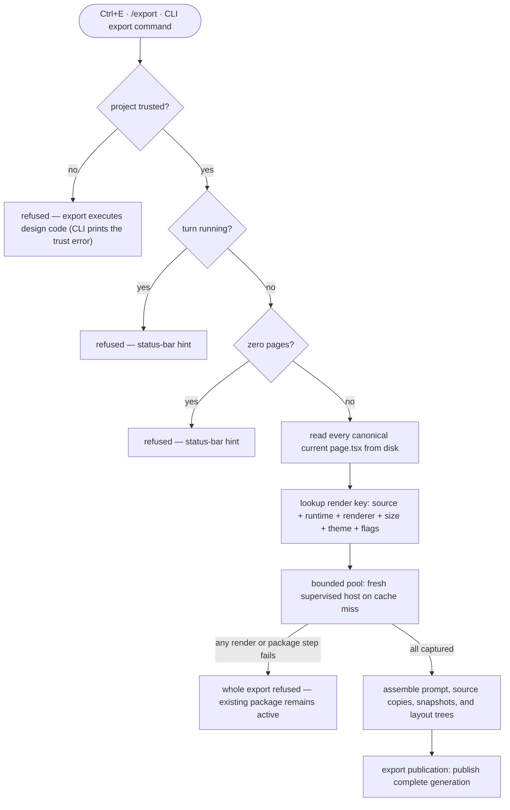

Export turns a design project into a package another coding agent can implement from: an implementation prompt, deterministic text snapshots of every page at several terminal sizes, resolved layout trees, and the exact canonical design sources currently on disk.

This is the v1 target flow. Individually, several of the building blocks below are real,
tested code; what does not exist yet is a caller that wires them together into one export —
no `core`/Kernel module exists to own that orchestration, and no `ui` module —
the UI shell — exists to trigger or report it. Each step below says which half it is.

## Walkthrough

1. Trigger: `Ctrl+E` (a global-tier hotkey — works even while typing), the `/export` slash command in the composer, or the CLI export command. *(v1: none of these exist — there is no UI shell, slash-command dispatcher, or CLI entry point in the codebase yet.)*
2. Refusal checks: an untrusted project (export executes design code — the CLI form prints the trust error and points at the TUI), a running turn, or a project with zero pages; in-app refusals hint in the status bar. Only the trust check is backed today: the durable grant ledger never fails open — a missing, unreadable, corrupt, or tampered grant record reads as "not trusted." Turn-in-progress tracking and the status-bar hint are v1: no Kernel exists yet to own "is a turn running," and no `ui` module exists to render a hint.
   - *Failure:* export is all-or-nothing — if any page fails to render at any export size, or any package file cannot be assembled, the whole export refuses. A render error names the page, size, and failure; a package with a silently missing page would lie to the implementing agent. The previous `export/current.json` remains active until a replacement generation is ready. The bounded export worker pool already implements the all-or-nothing half — on a task's first failure it stops pulling new tasks and reports that failure, never a partial result — but nothing yet calls it as part of a real export, so this refusal is not observable end to end today.
3. Source selection: the primitives are real. A `ProjectWritePermit` acquired from the project's `WriteMutex` guards every mutating step against a stale permit, and the page store returns a canonical page's bytes plus its digest while the manifest store returns the portable page-order list, both through the same safe-filesystem boundary every other read uses. What is not yet built is the export-specific choreography this step describes — taking a short permit only to snapshot manifest+pages, releasing it for rendering, then reacquiring it at publication — because no caller assembles an export turn at all. Historical-preview independence and the Git-`HEAD` exclusion are pure v1: no Git-backed page-history or restore code exists in the repository yet.
4. Export sizes are a fixed ladder: the page's declared minimum size always, plus 120×40 (also a preview preset — what the user saw is what ships) and 160×40; a standard size is included only when it is at least the minimum on both axes (a page is never rendered below its minimum), and duplicates collapse. Several sizes turn resize behavior into data — the frames show which regions stretch and which stay fixed (the 120×40 → 160×40 step grows width only, isolating horizontal stretch), so the implementing agent never simulates the design's layout engine. *(v1: no code computes this ladder yet. A page's minimum size is already a real, typed field on the page contract — the ladder logic that folds it against the two standard sizes does not exist.)*
5. Capture: a bounded worker pool processes `(page,size)` jobs — real and tested: the pool runs `min(4, max(1, floor(cpu/2)))` workers by default (an explicit override clamps to [1, 8]), and always publishes results sorted by `(manifestIndex, w, h)`, never completion order, so scheduling can never change package bytes. The rebuildable local cache keyed by source hash, `kitApiVersion`, renderer version, size, theme, and export flags is also real: it hashes exactly that canonical key (flags sorted before hashing so insertion order can't split an entry), accepts a hit only after every buffer's own checksum verifies, and evicts least-recently-written entries against a 512 MiB default quota. On a miss, a one-shot host session opens a fresh incarnation, handshakes runtime compatibility, and seals one rendered frame — but its own source comment flags this reply as "the documented non-conformant MVP stand-in": it captures only the styled/text frame, not a resolved layout tree, because the conformant correlated `capture` + layout-tree reply is deferred to a later wire-protocol revision. The render cache's storage shape already reserves a `layout` buffer slot for this reason, but nothing populates it yet. Runtime components are meant to suppress animation under export mode — a page-readable `isExport()` flag exists in the runtime facade — but no host code currently sets it from the negotiated mount mode, so this suppression is unwired today. Time/randomness violations remaining Gate warnings is implemented (`unguarded-timer` — raw timers plus wall-clock reads — and `unguarded-randomness` are both real lint checks). None of these pieces has a caller composing them into one export capture yet.
6. Package contents, relative to the resolved
   `export/generations/<generationId>/` directory selected by `current.json`. The managed-path grammar for this location is real — `export/generations/` and `export/current.json` are recognized, size-limited namespaces of the project root — but no code assembles or writes any of the files below yet:
   - `design-prompt.md` — product overview, per-page structure and behavior, interactions and tweak states, theme/palette tokens, recommended libraries for the configured target stack, the embedded minimum-size frame of each page, and instructions framing the snapshot files as acceptance fixtures ("your implementation at 80×24 must render this; diff against it") plus how to read the layout trees.
   - `pages/*.tsx` — exact copies of the canonical current design sources, precise enough for an implementing agent in any target stack to read as a spec.
   - `snapshots/<page>/<WxH>.txt` — one ASCII frame per export size, as separate files so the agent can diff its own render output against them programmatically.
   - `layout/<page>.json` — the resolved layout tree at every export size: per node its id (as declared in the design, else null), runtime component or low-level primitive kind, computed box in terminal cells, text for text nodes, and children. No styles — colors already live in the frames and theme tokens.
   - `runtime-api.json` — public module identity and each page's parsed `kitApiVersion`; it contains no private Reatom, React, OpenTUI, or JSX-transform versions. Its content shape (module identity plus the supported `kitApiVersion` set) is already defined and validated by the wire protocol's runtime-declaration bundle, but nothing writes it as a package file yet.
7. Publication: `ExportPublishTransaction` assembles and verifies an immutable generation, persists publication intent, creates every generation file, and replaces `current.json` only after the generation manifest verifies. The wrapper and the underlying commit/recovery protocol are real and kind-agnostic — the export-publish plan is a thin pass-through proven by the same crash-recoverable engine and startup recovery scan every other transaction kind uses — but it is explicitly infrastructure-only: no MVP code path ever calls it, so no export generation has ever actually been published by a live path. Capture/assembly failure leaves the previous pointer active; a crash after intent is recovered before Workspace opens (true of the generic engine already, independent of export having a caller). Cleanup removes the formerly referenced generation only after publication. *(This whole step is v1 until a caller exists.)* The active pointer and its one referenced generation are meant to remain eligible for `/commit-all`; scratch and render cache being local and hard-excluded is already true today for unrelated reasons — the turn sandbox is created outside the project entirely, and the generated `.termcraft/.gitignore` already excludes the render cache directory.
8. Removed pages are absent from the project manifest and therefore invisible to export — real: the page store's slug listing is defined as exactly the manifest's own ordered page list, so a page absent from `project.toml` cannot be enumerated for export.

## Source anchors

- `src/store/trust/model/trust-store.ts` — `TrustStore.isGranted`/`buildSubject`: the durable, fail-closed grant check behind the "project trusted?" refusal
- `src/store/transaction/model/write-mutex.ts` — `ProjectWritePermit`/`WriteMutex.chain`: the short-lived write permit export's source-snapshot and publication steps would acquire and release
- `src/store/types.ts` — `PageStore.readSource`/`listSlugs`, `ManifestStore.read`: canonical page bytes+digest and the manifest's ordered slug list (also backs "removed pages are invisible to export")
- `src/store/toml/model/project-toml.ts` — `project.toml`'s `pages` array, the manifest's page-order/visibility source of truth
- `src/entities/page/types.ts` — `PageMeta.minSize`: the page contract's declared minimum size the sizing ladder would fold against the standard sizes
- `src/host/supervisor/model/export-pool.ts` — `createExportPool`: the bounded worker pool, its worker-count formula, and manifest/(w,h) publish ordering
- `src/host/supervisor/model/one-shot.ts` — `runOneShotSession`: the one-shot export/smoke host incarnation; its own comment documents the sealed-frame reply as the "non-conformant MVP stand-in" pending a real `capture` + layout-tree reply
- `src/store/projections/model/render-cache.ts` — `createRenderCache`: the content-addressed cache keyed on source hash/`kitApiVersion`/renderer version/size/theme/flags, checksum-verified reads, least-recently-written eviction
- `src/store/projections/types.ts` — `ExportRenderKey`/`RenderEntry`: the cache's canonical key shape and its (currently unpopulated) `layout` buffer slot
- `src/runtime/model/capabilities.ts` — `isExport`/`hostModeAtom`: the export-mode read capability a page checks, declared but not yet set by any host code
- `src/gate/model/lints.ts` — the two implemented determinism warnings (`unguarded-timer`, which also covers wall-clock reads, and `unguarded-randomness`) referenced as "Gate warnings"
- `src/host/protocol/model/bundle.ts` — `RuntimeDeclarationBundleV1`: the module-identity + `kitApiVersion` shape `runtime-api.json` would serialize
- `src/store/safe-fs/model/limits.ts` — the managed-path grammar and size limits for `export/generations/` (the `export-artifact` namespace) and `export/current.json` (`project-config`)
- `src/store/transaction/model/wrappers.ts` — `buildExportPublishTransaction`: the `kind: "export-publish"` plan wrapper, built and unit-tested but with no MVP caller
- `src/store/transaction/model/engine.ts`, `src/store/transaction/model/recovery.ts` — the kind-agnostic commit/roll-forward protocol and startup recovery scan `export-publish` would run through once a caller exists
- `src/store/toml/model/gitignore.ts` — generated `.termcraft/.gitignore`'s `/cache/` rule excluding the render cache; a courtesy mirror, not the authoritative commit-scope policy
- `src/store/sandbox/index.ts` — the per-turn scratch workspace, created outside the project entirely
- `docs/superpowers/specs/2026-07-16-git-backed-page-history-design.md` — §5 canonical current-source export rule, including uncommitted changes and historical-preview independence (no Git-backed history/restore code exists yet)
- `docs/superpowers/specs/2026-07-13-termcraft-design.md` — §3.7 export package and all-or-nothing behavior, §3.10 the `/export` command, §5.7 rendering determinism, §5.8 design-code rules, §3.2 turn-time locks, §6.2 manifest visibility (the trigger surfaces, size ladder, and end-to-end package assembly are still spec-only)
- `docs/superpowers/specs/2026-07-16-runtime-api-compatibility-design.md` — exact page copies and `runtime-api.json`'s full field set (package assembly not yet coded)
- `docs/superpowers/specs/2026-07-16-turn-durability-staging-design.md` — §10 the recoverable publication sequence (generation files → `current.json` → cleanup) that `buildExportPublishTransaction` has no caller assembling yet
- `design/13-export-feedback.dc.html` — export feedback visual states (status-bar hints, refusal presentation); no `ui` module exists to render them yet
