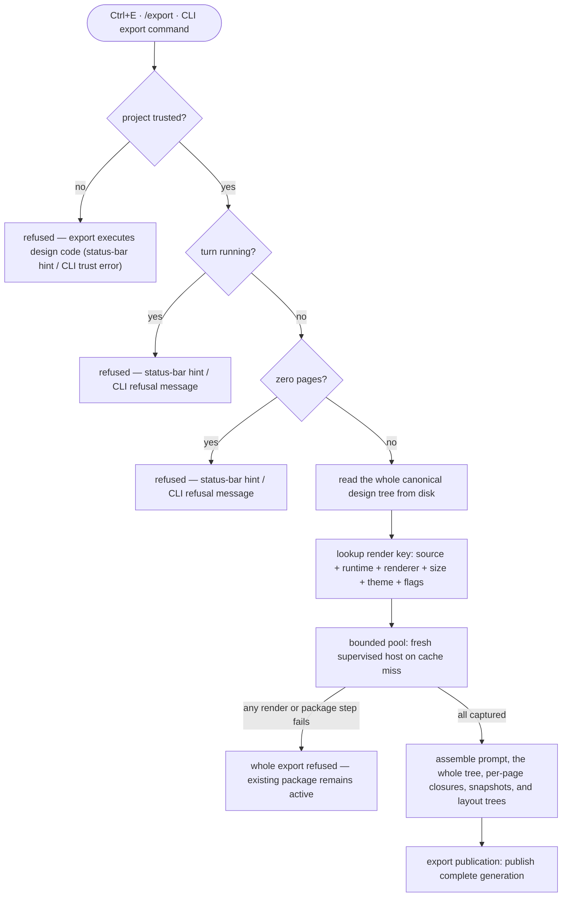

Export turns a design project into a package another coding agent can implement from: an implementation prompt, deterministic text snapshots of every page at several terminal sizes, resolved layout trees, and the exact canonical design tree currently on disk — every file of it, plus a listing of which files each page actually reaches.

## Walkthrough

1. Trigger: `Ctrl+E` (a global-tier hotkey — works even while typing), the `/export` slash command in the composer, or `termcraft export [dir]` — a headless CLI command. All three are wired. The in-app `Ctrl+E` hotkey and `/export` slash command are one `export.start` UI action (`src/ui/actions/model/registry.ts`), capability-gated on `export.start`; firing either dispatches `export.start` at the Kernel (`src/ui/app/model/intent.ts`). The CLI form composes the real Kernel graph with no renderer (`src/main.tsx`'s third `import.meta.main` branch → `src/entrypoint/model/run-export.ts`'s `runHeadlessExport`) and dispatches `project.open` then `export.start` directly at it.
2. Refusal checks: an untrusted project (export executes design code — the CLI form prints the exact §3.1 trust-refusal message and points at the TUI), a running turn, or a project with zero pages; in-app refusals surface as a short status-bar hint, the CLI prints the matching refusal message and exits non-zero. All three are backed for the CLI form: the durable grant ledger never fails open (a missing, unreadable, corrupt, or tampered grant record reads as "not trusted"), a running turn is refused by `export.start`'s own turn-lock guard (`TURN_RUNNING`), and a zero-page project is refused by the CLI driver itself once `export.start` is accepted — its handler's `NO_PAGES` path never emits a terminal event, so the driver checks the page count instead of waiting for one that will never arrive. In-app, those same three refusals gate the `export.start` action's capability, and each maps to a short status-bar hint label (`PROJECT_UNTRUSTED` → "read-only", `TURN_RUNNING` → "turn running", `NO_PAGES` → "no pages") in `src/ui/actions/model/reasons.ts`.
   - *Failure:* export is all-or-nothing — if any page fails to render at any export size, or any package file cannot be assembled, the whole export refuses. A render error names the page, size, and failure; a package with a silently missing page would lie to the implementing agent. The previous `export/current.json` remains active until a replacement generation is ready. The bounded export worker pool implements the all-or-nothing half — on a task's first failure it stops pulling new tasks and reports that failure, never a partial result — and `export.start`'s own composition (`runExportStart`) now calls it for real, so this refusal is observable end to end.
   - *Pre-capture failures (phase-8 WP-8 item 1):* a failure that happens BEFORE any snapshot is captured — resolving the project's page settings, or the snapshot capture itself failing — now publishes a real, schema-valid `export.failed` with `phase: "idle"` rather than being silently swallowed. `EXPORT_PHASES_V1` (`core/protocol/model/event-payload.ts`) was widened to include `"idle"`, a real `ExportState` member, precisely so a client that saw `disposition: "started"` always gets exactly one terminal event for these two branches. The one remaining unreported case is `captureExportSnapshot` returning `"illegal"` (a genuine `NO_PAGES` refusal reaching this deep, or a defensive-only illegal transition) — it carries only a `CommandRejectionCode`, never a `FailureDtoV1`, so it stays a documented post-MVP gap (a logged refusal, never a silent one).
3. Source selection: real end to end. `captureExportSnapshot` (`core/export/model/snapshot.ts`) acquires a short `ProjectWritePermit` from the project's `WriteMutex`, snapshots the manifest's page order, every page's own entry bytes+digest, AND every file of the canonical tree through the design-tree store, then releases it before rendering; the whole tree is captured inside that one window on purpose — a shared module read after the permit released could belong to a different revision than the entry importing it, and the package would describe a design that never existed; `publishExport` reacquires the mutex for publication (kernel-command-contract §12.5's revalidate-then-intent atomicity). A snapshot with zero pages refuses (`NO_PAGES`) without ever touching the machine or the mutex — the CLI's own driver (step 1) checks for this case itself, since the handler emits no terminal event for it. Historical-preview independence and the Git-`HEAD` exclusion are still v1: no Git-backed page-history or restore code exists in the repository yet.
4. Export sizes are a fixed ladder (`computeExportSizeLadder`, real and used by `export.start`): the page's declared minimum size always, plus 120×40 (also a preview preset — what the user saw is what ships) and 160×40; a standard size is included only when it is at least the minimum on both axes (a page is never rendered below its minimum), and duplicates collapse. Several sizes turn resize behavior into data — the frames show which regions stretch and which stay fixed (the 120×40 → 160×40 step grows width only, isolating horizontal stretch), so the implementing agent never simulates the design's layout engine.
5. Capture: a bounded worker pool processes `(page,size)` jobs — the pool runs `min(4, max(1, floor(cpu/2)))` workers by default (an explicit override clamps to [1, 8]), and always publishes results sorted by `(manifestIndex, w, h)`, never completion order, so scheduling can never change package bytes. The rebuildable local cache keyed by source hash, `kitApiVersion`, renderer version, size, theme, and export flags hashes exactly that canonical key (flags sorted before hashing so insertion order can't split an entry), accepts a hit only after every buffer's own checksum verifies, and evicts least-recently-written entries against a 512 MiB default quota. On a miss, a one-shot host session opens a fresh incarnation, handshakes runtime compatibility, and seals one rendered frame PLUS the mounted tree's resolved layout: `handleMount` computes `renderer.layoutTree()` into the export/smoke `ready` body, the one-shot supervisor decodes it onto `OneShotResult`, and the export-render adapter emits it as the render job's `layout` bytes. The one remaining divergence (D-Q6): `LayoutNode` still carries no `text` field for text nodes — the runtime component catalog that would supply node kinds/text has not landed, so `layout/<page>.json` (step 6) ships `id`/`kind`/`box`/`children` only. Runtime components are meant to suppress animation under export mode — a page-readable `isExport()` flag exists in the runtime facade — but no host code currently sets it from the negotiated mount mode, so this suppression is unwired today. Time/randomness violations remaining Gate warnings is implemented (`unguarded-timer` — raw timers plus wall-clock reads — and `unguarded-randomness` are both real lint checks).
6. Package contents, relative to the resolved
   `export/generations/<generationId>/` directory selected by `current.json`. `assembleExportPackage` (`core/export/model/package.ts`) now assembles every file below for real:
   - `design-prompt.md` — product overview, per-page structure and behavior, interactions and tweak states, theme/palette tokens, recommended libraries for the configured target stack, the embedded minimum-size frame of each page, and instructions framing the snapshot files as acceptance fixtures ("your implementation at 80×24 must render this; diff against it") plus how to read the layout trees.
   - `design/<treeRelPath>` — the WHOLE canonical tree, once: every page's entry file and every shared module they import, byte for byte, precise enough for an implementing agent in any target stack to read as a spec. There is no per-page source copy any more: a page is its closure, so one file per page could not describe the shared module that is what actually renders it, and the old `pages/<slug>/page.tsx` path was derived from the slug, which the tree retires.
   - `closures/<page>.json` — which of those files each page reaches: `{ "pageSlug", "entry", "files" }`, every path already prefixed `design/`, so a reader of the package never has to know the tree-relative convention exists. A page whose import graph could not be resolved ships NO listing and `design-prompt.md` says so — a listing naming only the entry would claim the page needs nothing else.
   - `snapshots/<page>/<WxH>.txt` — one ASCII frame per export size, as separate files so the agent can diff its own render output against them programmatically.
   - `layout/<page>.json` — a size-keyed object (one key per rendered `WxH` ladder size, D-Q1) of the resolved layout tree at that size: per node its id (as declared in the design, else null), runtime component or low-level primitive kind, computed box in terminal cells, and children. No `text` yet (D-Q6, step 5) and no styles — colors already live in the frames and theme tokens.
   - `runtime-api.json` — public module identity and each page's parsed `kitApiVersion`; it contains no private Reatom, React, OpenTUI, or JSX-transform versions.
7. Publication: `ExportPublishTransaction` (`buildExportPublishTransaction`, wrapping the store's real crash-recoverable transaction engine) assembles and verifies an immutable generation, persists publication intent, creates every generation file, and replaces `current.json` only after the generation manifest verifies — real and durable now (WP-5 Phases B/C): `buildExportPublishOperations` (`core/export/model/publish-plan.ts`) builds the real create-generation-files → replace-pointer → delete-old-generation-files operation plan `publishExport` hands the production `ExportPublishPort` adapter (`store/adapters/export-publish.ts`), which commits it and can read the pointer back. Startup (both the canonical open sequence and the live project-open path) validates the pointer — a `null` pointer (no export yet) never blocks, a corrupt one does. Capture/assembly failure leaves the previous pointer active; a crash after intent is recovered before Workspace opens. The active pointer and its one referenced generation are meant to remain eligible for `/commit-all`; scratch and render cache being local and hard-excluded is already true today for unrelated reasons — the turn sandbox is created outside the project entirely, and the generated `.termcraft/.gitignore` already excludes the render cache directory.
8. Removed pages are absent from `design/pages.json` and therefore invisible to export — real: the page listing is defined as exactly that manifest's own ordered array, so a page it does not bind cannot be enumerated for export. Its FILE may still ship under `design/` if nothing deleted it, which is correct: the tree is what the design is, and an unreferenced module is a shared module, not a page.

## Source anchors

- `src/store/trust/model/trust-store.ts` — `TrustStore.isGranted`/`buildSubject`: the durable, fail-closed grant check behind the "project trusted?" refusal; for the CLI form, `export.start`'s own guard rejects with `PROJECT_UNTRUSTED` before the handler ever runs
- `src/store/transaction/model/write-mutex.ts` — `ProjectWritePermit`/`WriteMutex.chain`: the short-lived write permit `captureExportSnapshot`/`publishExport` acquire and release
- `src/core/export/model/snapshot.ts` — `captureExportSnapshot`: the real source-snapshot choreography (short permit → manifest + per-page entries + the WHOLE tree → release), the `NO_PAGES` refusal for a zero-page project, and the machine's `idle -> preparing -> rendering` transition
- `src/store/types.ts` — `DesignTreeStore.readSource`/`listSlugs`/`listTree`/`readTreeFile`, `ManifestStore.read`: a page's entry bytes+digest, the manifest's ordered slug list (also backs "removed pages are invisible to export"), and the whole-tree inventory the package ships
- `src/entities/page/types.ts` — `PageMeta.minSize`: the page contract's declared minimum size the sizing ladder folds against the standard sizes
- `src/core/export/model/size-ladder.ts` — `computeExportSizeLadder`/`computePageSizeLadder`: the real fixed size ladder (each page's `minSize` plus the 120×40/160×40 standards, candidates below the page minimum dropped, duplicates deduped, ordered by `(manifestIndex, w, h)`)
- `src/core/export/model/render-jobs.ts` — `runExportRendering`/`buildExportRenderKey`: the batch render dispatch `export.start` composes (one `renderPort.renderOne` per ladder entry, `Promise.all` preserving `(manifestIndex, w, h)` order) and the §10.2 render-cache key, built from the page's whole `closureHash` — a frame depends on every module the page imports, so an entry-hash key served a stale render after any shared-module edit. A page whose closure could not be proved gets NO key (`null`) and skips the cache entirely, on both the read and the write side
- `src/host/supervisor/model/export-pool.ts` — `createExportPool`: the bounded worker pool, its worker-count formula, and manifest/(w,h) publish ordering
- `src/host/session/model/host-state-machine.ts` — `handleMount`: seals `renderer.layoutTree()` into the export/smoke mount's `ready` body (WP-5 Phase A)
- `src/host/supervisor/model/one-shot.ts` — `runOneShotSession`: decodes the one-shot child's real layout tree (`decodeLayoutNode`) onto `OneShotResult.layout`
- `src/host/adapters/export-render.ts` — the production `ExportRenderPort` adapter; emits the real serialized layout tree bytes per render job (WP-5 Phase A)
- `src/store/projections/model/render-cache.ts` — `createRenderCache`: the content-addressed cache keyed on the page's `closureHash`/`kitApiVersion`/renderer version/size/theme/flags, checksum-verified reads, least-recently-written eviction
- `src/core/export/model/package.ts` — `assembleExportPackage`: assembles every package file for real, including `design/<treeRelPath>` for the whole tree, `closures/<slug>.json` per page, and the real per-size `layout/<slug>.json` (D-Q1) — the `text`-field divergence (D-Q6) is the one gap left, documented in this file's own comment
- `src/core/kernel/model/handlers/preview-export.ts` — `resolveExportClosures`: asks the `GateRunner` port for each page's closure over the snapshot's OWN bytes, after the permit is released; a page it cannot resolve ships without a listing rather than with a truncated one
- `src/host/render/types.ts` — `LayoutNode`: the layout-tree shape package.ts serializes; deliberately has no `text` field yet (D-Q6) pending the runtime component catalog
- `src/runtime/model/capabilities.ts` — `isExport`/`hostModeAtom`: the export-mode read capability a page checks, declared but not yet set by any host code
- `src/gate/model/lints.ts` — the two implemented determinism warnings (`unguarded-timer`, which also covers wall-clock reads, and `unguarded-randomness`) referenced as "Gate warnings"
- `src/host/protocol/model/bundle.ts` — `RuntimeDeclarationBundleV1`: the module-identity + `kitApiVersion` shape `runtime-api.json` serializes
- `src/store/safe-fs/model/limits.ts` — the managed-path grammar and size limits for `export/generations/` (the `export-artifact` namespace) and `export/current.json` (`project-config`)
- `src/core/export/model/publish-plan.ts` — `buildExportPublishOperations`: builds the real create-generation-files → replace-pointer → delete-old-generation-files operation plan (D-Q2/D-Q5) `publishExport` hands the store
- `src/core/export/model/publish.ts` — `publishExport`: threads the real operations/payloads through `ExportPublishPort.publish` under the held permit
- `src/core/ports/export-publish.ts` — `ExportPointerV1`/`ExportPublishPort.readPointer`: the `export/current.json` schema (D-Q2) and its read side
- `src/store/adapters/export-publish.ts` — the production `ExportPublishPort` adapter: durably writes a generation through `buildExportPublishTransaction`'s real crash-recoverable engine, and reads/validates `export/current.json` back (shallow structural check, D-Q4)
- `src/store/transaction/model/wrappers.ts` — `buildExportPublishTransaction`: the `kind: "export-publish"` plan wrapper the production adapter above calls
- `src/store/transaction/model/engine.ts`, `src/store/transaction/model/recovery.ts` — the kind-agnostic commit/roll-forward protocol and startup recovery scan `export-publish` runs through
- `src/core/project/model/open-sequence.ts` — `validateProjectContents`: validates the export pointer in the canonical open sequence (turn-durability §12 step 9)
- `src/core/kernel/model/handlers/project.ts` — `runProjectReadySequence`: validates the export pointer on the LIVE project-open path too (D-Q3) — a `null` pointer never blocks
- `src/core/kernel/model/handlers/preview-export.ts` — `handleExportStart`/`runExportStart`: the `export.start` composition — resolves every page's settings, drives `captureExportSnapshot -> runExportRendering -> assembleExportPackage -> publishExport` in fixed order, publishes `export.started`/`export.progress` live, and reports a real pre-capture `export.failed` (phase-8 WP-8 item 1) for the two branches that can name a `FailureDtoV1` before any snapshot is captured
- `src/core/protocol/model/event-payload.ts` — `EXPORT_PHASES_V1`: widened to include `"idle"` (phase-8 WP-8 item 1) so a pre-capture failure has a schema-valid phase to report
- `src/entrypoint/model/run-export.ts` — `runExport`/`runHeadlessExport`/`parseExportArgs`/`formatExportOutcome`: the headless CLI driver (M8) — dispatches `project.open` then `export.start`, maps guard rejections to the §3.1 trust/running-turn refusal messages, and checks the page count itself once `export.start` is accepted (the `NO_PAGES` handler path emits no terminal event)
- `src/main.tsx` — the third `import.meta.main` argv branch (`termcraft export [dir]`), composing the headless driver above with no renderer
- `src/store/toml/model/gitignore.ts` — generated `.termcraft/.gitignore`'s `/cache/` rule excluding the render cache; a courtesy mirror, not the authoritative commit-scope policy
- `src/store/sandbox/index.ts` — the per-turn scratch workspace, created outside the project entirely
- `docs/superpowers/specs/2026-07-16-git-backed-page-history-design.md` — §5 canonical current-source export rule, including uncommitted changes and historical-preview independence (no Git-backed history/restore code exists yet)
- `docs/superpowers/specs/2026-07-13-termcraft-design.md` — §3.7 export package and all-or-nothing behavior, §3.10 the `/export` command, §5.7 rendering determinism, §5.8 design-code rules, §3.2 turn-time locks, §6.2 manifest visibility, §9 "the `termcraft export` CLI form reports the same trust refusal" — all landed
- `docs/superpowers/specs/2026-07-16-runtime-api-compatibility-design.md` — exact page copies and `runtime-api.json`'s full field set (now assembled for real by `package.ts`)
- `docs/superpowers/specs/2026-07-16-turn-durability-staging-design.md` — §10 the recoverable publication sequence (generation files → `current.json` → cleanup), §12 step 9 the pointer-validation-at-open requirement — both now real
- `src/ui/actions/model/registry.ts` — the `export.start` UI action: its `/export` slash command and `ctrl+e` hotkey, both capability-gated on `export.start` (the in-app half of step 1's trigger)
- `src/ui/app/model/intent.ts` — dispatches `export.start` at the Kernel when the hotkey/slash action fires, and drives the `export-dismiss` popup intent
- `src/ui/actions/model/reasons.ts` — maps each refusal code (`PROJECT_UNTRUSTED`/`TURN_RUNNING`/`NO_PAGES`) to its short status-bar hint label
- `design/13-export-feedback.dc.html` — export feedback visual states (status-bar hints, refusal presentation)
