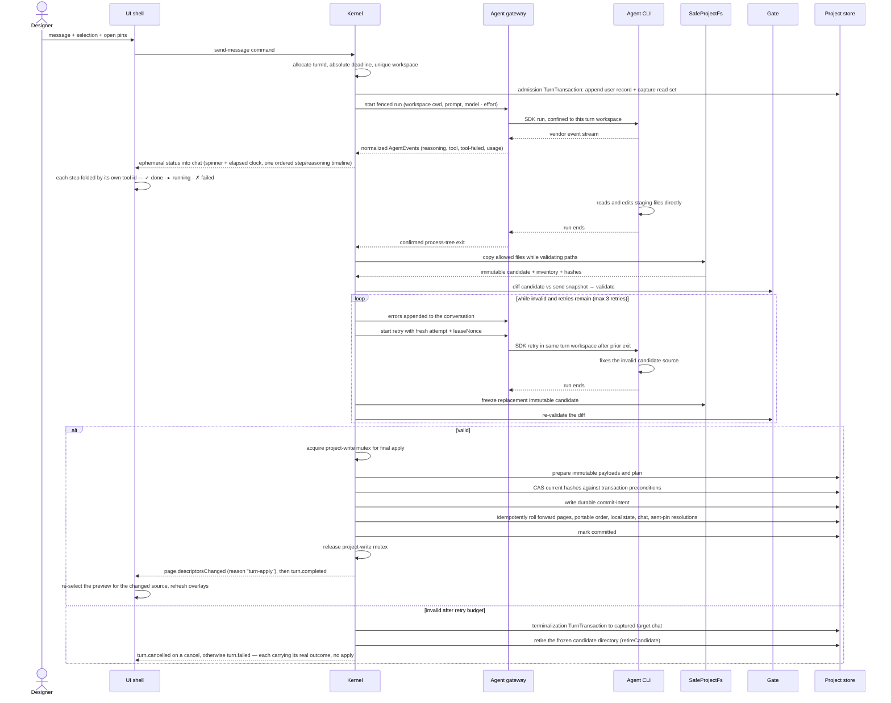

One generation turn: from the designer pressing Enter to validated page-source changes on disk. Covers the staging directory the agent works in, how its edits are confined, the validation Gate with retries, and how changed pages replace their canonical sources.

## Walkthrough

*Every stage below is real, unit-tested code, and the whole sequence is composed and driven
end to end. The turn spine lives in `core/turns` (`runTurn` — admission → the
attempt/freeze/validate retry loop → finalize, or terminalize on any failure branch); the
dispatched `turn.start` command handler (`core/kernel/model/handlers/turn.ts`) builds
`runTurn`'s inputs and runs it inside one operation, and `turn.cancel` drives the same live
attempt's cancel handle. The production adapter graph behind it is wired at the composition
root: `bun start` (`entrypoint/model/create-shell.ts`) builds the real `store`/`gate`/`host`/
`agent` adapters, hands them to `createKernel(deps)`, and the Gate runs against a live host
smoke renderer — no fakes on this path.*

*Honest still-open gaps, flagged where they occur below rather than papered over: the Kernel
resumes a prior SDK session for the second and later turns of one live process (a
durable `workspaceIdentity`, read from the project manifest's `projectId` on every `turn.start` —
`ProjectStore.readManifest()`, the same manifest `core` already reads on every project open —
now feeds `AgentBackend.sessionScope`); cross-restart resume remains structurally unreachable for
Claude, because the backend's own account discriminator is always `null` and the fallback scope is
per-process-random by design (storage-identity §6.2's own escape hatch) — phase-8 WP-7; the
composed system prompt is real (`agent/prompt/`'s `AgentPromptSource`, phase-8 WP-3), but it
still cannot carry two things master §6.2 also lists — source-extracted per-page metadata and
the current selection — because no `core/ports` channel supplies either into
`AgentPromptContextV1` today; the terminal event now names the real outcome — a cancelled turn
publishes `turn.cancelled`/`outcome: "cancelled"` rather than the flat `turn.failed`/`"failed"`
this composer used to hardcode — and `failure.code` distinguishes gate-exhaustion
(`GATE_RETRY_EXHAUSTED`) from a backend failure (`BACKEND_FAILED`) for the branches that can
name a typed reason, while the branches that cannot (the attempt-budget/deadline/gate-fold-error call
sites) still fall back to a generic `PERSISTENCE_FAILED` (phase-8 WP-8 item 4, "CLOSED" per
`core/kernel/model/handlers/turn.ts`'s own header); the Gate's type-check stage is wired live in
the shipped configuration (phase-8 Task 7 — a resolved compiler path plus the generated
`RUNTIME_DTS` are always supplied by the composition root); the frame-token acknowledgement
handshake is wired too (phase-8 Task 16 — `Kernel.acknowledgeDisplay` replaces the old
unconditional `FrameAcknowledgeNotWiredError`); and a retired turn's frozen CANDIDATE directory
is released at finalize and terminalize (`StagingService.retireCandidate`, phase-8 WP-8 item
2), while its writable `turns/<turnId>/workspace/` tree is released on exactly one path — a
`turn.cancel` that races admission's own `finishAdmission` (`runAdmission` calls
`StagingService.retireWorkspace` there, the primitive's first production caller). Every other
exit still leaves the workspace tree behind, so retired workspaces still accumulate on the
ordinary finalize/terminalize arc.*

1. Send: dispatching `turn.start` runs admission (`core/turns/model/admission.ts`), which
   mints `turnId` and arms the silence/absolute deadlines. The message goes out with the
   selection chip (only if its element id resolves in the active page's Current
   design at send time) and open pins whose anchors resolve. An admission
   `TurnTransaction` first appends the user record to the captured `targetChatId`; then —
   and only then — the chat's CAS append-base is read (step 1b in `admission.ts`), because
   reading it any earlier captures the chat one record too early and every finalize would
   fail `APPLY_STALE`/`chat`. The complete source, portable manifest, chat, and comments
   CAS read set is snapshotted into the unique workspace — this admission-and-staging path
   is implemented end to end. Local tab/preview/selection
   values are snapshot context, not freshness preconditions. Tab switching later
   does not change this context. Details: `flows/pins-and-selection.md`.
2. Staging: a stable machine-local sandbox parent contains a unique `turns/<turnId>/workspace/` for every turn; no later turn clears or reuses it. The whole canonical `design/` tree is copied in at the SAME tree-relative paths it has on disk — `pages.json`, every page's own entry file, and every shared module — which is what makes an import specifier identical in the workspace and in `design/`, so nothing is ever rewritten on apply. Alongside it sit three read-only reference files: the generated `@termcraft/runtime` type declaration, a page-authoring guide, and a separate state-authoring guide for the reactive library the runtime re-exports — implemented. The state guide is separate on purpose: the type declaration re-exports the reactive primitives from packages that are NOT staged into the fence, so their signatures are unreachable from inside a turn, and the library's current major differs sharply from the one most training data describes. A turn that had to guess wrote the older API, silenced the resulting type error with an escape-hatch annotation, and shipped a page that threw on its first render. The backend receives this workspace directory as cwd and only writable root — implemented; the Claude backend sets both from the workspace it is handed. Resume is used only when the backend can rebind the session to it; otherwise a fresh session is seeded from chat — the chat-side resume gate, the bounded fresh-seed selection, and the backend side of both are implemented. The Claude backend declares its sessions rebindable, so a resumed session may move to a new turn workspace between attempts, and it turns the Kernel's resume-or-fresh decision into vendor options rather than making that decision itself. The Kernel now makes that decision (`turn.start`) and resumes within one process once the current project's manifest supplies a `workspaceIdentity` (see step 11). The prompt is meant to carry source-derived metadata, current diagnostics independent of active chat, selection, pins, style guidance, and the message; `agent/prompt/`'s `AgentPromptSource` (phase-8 WP-3) now composes a real system prompt — role, the §5.8 design-code rules, the slug mask verbatim, BOTH legal import edges with the exact resolution rules, the design-tree layout (that `pages.json`'s `entry` decides a page's file and every other file is a shared module), the shared-module state rule (state is shared across pages within one design revision and resets when the design changes), answer-style guidance, and the honestly-held context (active page, page order, `kitApiVersion`, open pins) — so `turn.start` sends the user message with that real system prompt rather than a placeholder. Source-extracted per-page metadata and the current selection are still absent from `AgentPromptContextV1`: no `core/ports` channel supplies either today; outstanding diagnostics instead reach the agent through the already-wired retry-time append onto the user message (`core/turns/model/run-turn.ts`), not through the system prompt. The whole tree remains materialized until benchmarks justify an on-demand protocol.
3. Confinement and freezing: Claude (MVP) receives that cwd plus file-tool permission checks and no Bash/web — implemented; Codex (v1.0) receives workspace-write rooted at the turn work, still design only, with no second backend built. Claude's confinement is a deny-by-default veto consulted on every tool call: a shell or web tool is refused outright, a file tool is allowed only when the path it names resolves inside this turn's workspace, and any tool the backend does not recognise is refused for exactly that reason — an unfamiliar tool is a denial, never a default allow. Relative paths are resolved the way the agent itself resolves them — against its own working directory, which is the workspace — so an agent searching `pages` is not accidentally read as searching termcraft's own directory; a file tool that omits an optional path is treated as naming the workspace itself, while a tool whose path is *required* and missing is refused as malformed. On Windows a second check rejects any path segment between the workspace and the target that turns out to be a junction, since a link on a parent directory leaves the final file looking perfectly ordinary. This is defense-in-depth and is deliberately not the wall — the Gate is (step 7), and it validates a candidate the agent cannot reach at all.
   Every attempt is fenced by `{turnId, attempt, leaseNonce}` — the backend stamps every event it emits and every outcome it reports with the fence it was given, and drops its own late events once an attempt has terminated. `core/turns` now both mints that fence per attempt (`fence.ts`'s `createTurnFence`, minted by `attempt.ts`'s `beginAttempt`) and checks it on receipt: `attempt.ts` drops any event whose fence the live lease does not `accept`. After confirmed process-tree exit, `SafeProjectFs` rejects traversal, links, ambiguous Windows paths, non-regular files, and configured limits while copying allowed bytes into an agent-inaccessible immutable candidate — this candidate assembly is implemented. The Gate never reads the writable workspace.
   - *Failure:* if the backend cannot obtain an owned process tree for an attempt at all, it refuses to run that attempt rather than running it unconfined — the run fails immediately with an error event and a matching failed outcome, and no CLI is started.
4. The backend contract is mechanism-blind: a backend's only obligation is to stream events and leave the turn's proposed changes in staging by run end. Agents with native file tools edit staging directly; a future backend whose agent cannot do that fulfills the same contract by writing the model's structured full-file output into staging itself — the Kernel, diff, Gate, and apply are identical either way. That contract is now real code rather than a sketch: it names no vendor, mentions no SDK, and is written so it can move into the Kernel's own port folder unchanged. It splits the module in two — a shared, backend-agnostic tier (session scope, workspace containment, the deny-by-default rule) and one vendor tier per backend, so adding Codex means adding a sibling of the Claude tier with its own tool vocabulary rather than editing the shared one.
5. While the turn runs: normalized events are accepted only from the active fence. Both halves are now built — the backend maps vendor messages into the six neutral event kinds (reasoning, tool step, tool-step failure, final text, error, token usage), stamps each with its attempt's fence, and drops any vendor message it has no mapping for rather than guessing; `core/turns/model/attempt.ts` is the receiving half, dropping any event whose fence the live lease rejects and republishing every accepted event as `turn.progress`. Any event resets the 120-second silence timeout (`deadlines.noteEvent`) but cannot reset the 30-minute default absolute deadline shared by the initial attempt and retries. The UI mirror renders the bounded ephemeral status block from that `turn.progress` stream. A tool step carries the vendor's own tool-call id all the way through — backend event, wire contract, mirror timeline — which is what makes the design's THIRD step state real end to end: a tool-step failure names the step it belongs to by id, so a failure that arrives after several later steps have already started flips its own row rather than the newest one, and the chat block draws `✓ done`, `▸ running`, or `✗ failed` accordingly, with failed winning over the positional "running" the chronologically-last step would otherwise get. That failure signal is mapped from a vendor *user* message's error-marked tool-result blocks — the one hop the backend used to drop entirely, which is why only two of the three states could ever appear before. Ordinary Send remains disabled, while local slash-command mode keeps `/commit-page`, `/commit-infra`, and `/commit-all` available according to Kernel capability; other turn-locked rows go `locked` (readable dim text with an amber reason, per `ui/actions`' three-way availability). Final apply serializes through the project-write mutex — implemented. Scoped commit (`/commit-page`, `/commit-infra`, `/commit-all`) would serialize through the same mutex, but no Git integration exists in the codebase yet. Git hooks may change `.termcraft/`, so final apply later compare-and-swaps its preconditions instead of overwriting drift — also implemented.
6. Page management is file management, and the manifest is what makes a file a page: adding a page means writing its file anywhere in the tree AND adding a `{slug, entry}` binding to `pages.json`; deleting the binding unlists the page; portable reordering or an optional local `requestedActivePage` is a `pages.json` edit; retitling edits the page's own `meta.title` — implemented. A file no binding names is a SHARED MODULE, not a page, and several pages importing one `lib/theme.ts` is the intended shape rather than a workaround. Slugs must match the slug mask and avoid Windows device names — implemented — and never rename an existing page identity — structural, since the finalize step only ever replaces or deletes a slug, never renames one. In a Git repository, deleting a page does not erase its committed path history, and recreating the slug resurrects the same identity — v1 Git-history behavior; no Git integration exists in the codebase yet.
7. The Gate validates the immutable candidate: manifest-slice syntax/order/slugs; the single `@termcraft/runtime` import surface; TypeScript against the generated `@termcraft/runtime` declaration; static meta including supported `kitApiVersion`; default `reatomComponent`; and a disposable supervisor-owned smoke host. Every one of these stages, and the orchestrator's cheap-then-heavy sequencing itself, is implemented. The smoke stage is now wired from a `SmokeRenderer` port: `createSmokeRender` builds a `SmokeRequest` (the staged candidate tree's root, the page's own tree-relative entry, that tree's `(relPath, sha256)` inventory, a locally computed source hash pinned to match the host's own hash of the same bytes, the candidate's declared minimum size, and its `kitApiVersion`) from a candidate's parsed `meta` — the host then mounts the page's WHOLE closure off that tree, so a smoke render proves the shared module the page imports loads too, not only the entry, renders it once through an injected `SmokeRenderer`, and maps the typed result through `smokeResultToErrors`. The renderer is now real: `host/adapters/smoke-renderer.ts` implements `SmokeRenderer` over `runOneShotSession` in smoke mode, and the composition root wires it into `createGateRunnerAdapter`, so a live one-shot smoke render runs on the pages a turn validates. Which pages those are is scoped (design §8 step 8): `runPage` takes a required `smoke: "run" | "skip"` with no default at any layer, and the turn's validation stage passes `"run"` only for the slugs whose CLOSURE hash differs from the turn's send-time read set — plus any page whose closure the whole-tree pass could not prove, since "cannot prove unchanged" is never "unchanged". That decision is `core/turns/model/candidate.ts`'s `selectChangedPages`, called rather than restated, so it is literally the same rule that produces the turn's own `changedPages` report; a first turn and a newly listed slug fall out of it as "run" for free, having no send-time hash to match. A smoke render is a host child process per page, so without this a one-line edit to a shared module would smoke every page reaching it on all four attempts. The descriptor path (`page-descriptors.ts`) passes `"run"` unconditionally: it has no send-time read set to diff against. A returned frame is NOT on its own proof the page rendered: the React renderer catches a component's throw in its own boundary and paints the stack trace, so the paint and the capture both succeed for a page that never rendered at all. The smoke host therefore asks the render handle whether the mounted tree threw, and reports a render failure instead of readiness — without that question a page that crashes on its first render passed this stage, committed, and was reported to the designer as a success. The manifest-slice check is threaded too: the Gate exposes `runManifestSlice(manifestText, treePaths)`, and the turn driver's validation stage (`core/turns/model/validation.ts`) calls it once per turn — from the frozen candidate's `pages.json` text and the tree's own file inventory, which is what can answer whether an `entry` names a real file at all — before any per-page stage runs. A second whole-tree stage runs beside it: `GateRunner.runTree` scans EVERY code file in the tree once for the import allowlist and the `eval`/`Function` ban, resolves each manifest entry's closure from the same pass, and type-checks the whole tree in ONE `tsc` program whose diagnostics that same pass attributes back onto those closures. Judging the tree once rather than once per page is what catches a violation in a shared module no page's own source names, reports it exactly once instead of once per reaching page, and is the only shape that can type-check a page importing a sibling module at all. Lints now warn for all six kinds — dropped ids, pointable low-level elements without ids, unguarded timers, unguarded randomness, navigation to unlisted pages, and an escape-hatch `any` annotation written to make a type error go away (the last one exists because silencing a diagnostic the Gate DID catch is how a broken page reaches a commit). The dropped-id and unlisted-navigation warnings each need extra context from the caller (the ids currently referenced by selection/open pins, and the manifest's listed page slugs) and are skipped silently when that context is absent — and the production `GateRunner.runPage` port carries neither field, so these two lints stay dormant on a live turn even though the Gate itself is fully wired in. Semantic checks are distinct from `SafeProjectFs` path/object safety.
8. The type check is a subprocess, and three rules keep it honest. The runtime types it checks against are generated from `src/runtime/index.ts` and committed as a string constant (`src/runtime/generated/runtime-dts.ts`); the pinned compiler is still a per-platform native executable, but it is resolved as an ordinary `node_modules` dependency (`resolveCompilerPath`) rather than extracted, and spawned from there. Its verdict is only trustworthy if the Gate unions the compiler's *global* diagnostics into the set — missing-lib errors surface nowhere else, so a check built on the obvious per-file-plus-program union reports clean for a program that has no `Object` type at all; if it dedupes diagnostics on code, file, and position, because those buckets double-report the same error; and if it can tell a crashed compiler apart from a clean page.
   - *Failure:* a compiler that crashes or cannot be launched is a typed Gate failure and never an apply. An empty diagnostic list counts as a pass only when the compiler is known to have run — unguarded, the two are indistinguishable and the wall silently disappears.
   - *Note:* the import allowlist is enforced here by reading the candidate's source text, and again by the host before it links a page. Nothing below those scans enforces it — the host's resolver fails open (see [modules.md](../modules.md)) — so this Gate check is load-bearing rather than one layer of several.
   - *Wiring:* the production `GateRunner` (`gate/adapters/gate-runner.ts`) wires the type check in whenever BOTH a resolved compiler path and an ambient `@termcraft/runtime` `.d.ts` (`runtimeDts`) are supplied, and the composition root (`entrypoint/model/create-shell.ts`) now always supplies both — `resolveCompilerPath()` before any project I/O, and `runtime/generated/runtime-dts.ts`'s generated `RUNTIME_DTS` (phase-8 Task 7). A failed compiler resolution aborts shell construction as a `ShellCompositionError` rather than shipping a Gate that silently skips the check. Both parameters stay optional on the adapter only so a hermetic unit test or fixture with no compiler available can still run the source-only stages standalone.
   - *Where it runs (design-tree phase 2):* inside `GateRunner.runTree`, the whole-tree pass, as ONE `tsc` program over every code file at once — no longer a `GatePorts.typeCheck` running one program per entry file inside `runGate`, which served a virtual FS holding only that file and therefore reported `TS2307` for every page importing a shared module. Each diagnostic is attributed to every page whose closure — resolved by that same pass, never a second graph walk — contains the file it names, and travels to the agent in `GateError.blockedPages`. A diagnostic no closure reaches is still fatal, just unattributed. This is also why the descriptor-publish path (`core/kernel/model/handlers/page-descriptors.ts`) calls `runTree` once per publish before its `runPage` loop: it is what marks a page `status: "invalid"`, and running only `runPage` would publish `"ready"` for a page that does not compile.
9. Failure branch: still invalid after the initial attempt plus 3 retries — the turn driver appends an honest error to captured `targetChatId` through a terminalization `TurnTransaction` (`runTurn` → `terminalizeTurn`, implemented) and performs no canonical-source change. The frozen candidate directory is retired here (`StagingService.retireCandidate`, phase-8 WP-8 item 2 — called from both `finalize.ts` and `terminalize.ts`, including every gate-retry terminalization inside the retry loop, so it no longer leaks). One honest gap remains on this arc: the writable turn *workspace* (`turns/<turnId>/workspace/`, distinct from the candidate) is *not* retired here, so retired workspaces still accumulate — the only production caller of `retireWorkspace` is admission's own raced-cancel branch (step 10). The terminal event the `turn.start` handler emits carries the REAL §7.2 outcome the terminalization reported back, and the event kind matches it: `turn.cancelled`/`outcome: "cancelled"` for a cancel, `turn.failed` otherwise. `failure.code` narrows the cause further, distinguishing Gate-exhaustion (`GATE_RETRY_EXHAUSTED`) from a backend failure (`BACKEND_FAILED`) for the branches that can name a typed reason (phase-8 WP-8 item 4, closed) — the branches that genuinely cannot (attempt-budget/deadline/gate-fold-error) still fall back to the generic `PERSISTENCE_FAILED` code rather than fabricating a distinction.
10. Failure branch: cancellation by `Esc`, silence, or absolute deadline transitions through graceful abort then hard process-tree kill. The backend half is implemented, in four rungs rather than the five the specification names. Rung one asks the vendor SDK to stop, which closes the CLI's input stream — the CLI's own signal to shut down cleanly — and gives it a short grace period of its own. Rung two waits, up to a budget, for the operating system to report the owned process tree empty; if it empties, the cancellation is reported as confirmed and nothing further happens. Rung three of the specification — a genuinely graceful, tree-wide termination distinct from both of its neighbours — has no Windows primitive to implement it: a job object offers exactly one termination call and it is unconditional, and the alternative signal path is documented by the platform as forcefully killing the process regardless of which signal is named. The graceful window that rung was reaching for already happens inside rung one, so the code implements the remaining rung four — hard-kill the whole tree, then wait for confirmation again — and documents the gap in place rather than adding an inert step. The budget is therefore two waits, not three. Deciding *when* to cancel is now the Kernel's and turn driver's job: the `turn.cancel` command (`core/kernel/model/handlers/turn.ts`) drives `requestCancel` into the live attempt handle registered by `onAttemptStarted`, and the driver itself checks the silence and absolute deadlines (`deadlines.check()`) between attempts and immediately after each completes, terminalizing on expiry. The backend carries out the request.
    - *Failure:* if the tree still cannot be confirmed empty after the hard kill, the run reports an unconfirmed exit instead of a cancellation, and that backend latches unhealthy and refuses further health checks until it is restarted — a fresh probe could only ever attest to a new CLI's health, never to whether the stale tree emptied. A new turn cannot start until exit is confirmed; inability to confirm makes the backend unhealthy, exactly as the specification requires.
    - *Note:* the same confirmation applies to ordinary success, not just cancellation. A run that completes naturally still waits for the tree to empty, escalates to the hard kill if it does not, and downgrades to an unconfirmed exit rather than reporting a clean completion the Kernel would act on. Either way the job is released on every terminal path, which arms the kill-on-close reaper for anything still inside.
    - Before commit intent, cancellation records the terminal outcome and changes no canonical source — the underlying `system:cancelled` terminalization record is implemented. After commit intent, cancellation is disabled and recovery must finish roll-forward — also implemented, by the startup recovery scan.
    - *Cancel races are reported honestly rather than flattened.* A cancel that wins the window inside admission itself (its `finishAdmission` transition comes back illegal) has already durably appended the user's message, so the refusal says exactly that (`userRecordCommitted`) instead of claiming the turn "could not be admitted", and the staged workspace that admission had just created is retired on the way out — the one place `retireWorkspace` is called in production. A cancel that wins the window inside finalization records WHICH step it lost (`beginFinalization` / `markCommitted` / `settle`), so a raced cancel that arrived after a durable commit is distinguishable from one that arrived before it. Both feed the terminal event above, which is why a deliberate `Esc` now reads as a cancel in the chat stream rather than as a backend crash.
11. Failure branch: session resume requires the chat UUID, opaque backend session scope, exact record-count/prefix-hash checkpoint, and workspace rebinding capability. The chat-side gate — identity, record-count, and prefix-hash matching, plus the bounded fresh-session seed — is implemented, and so is the backend side: the backend derives the opaque scope string the checkpoint is keyed by, and declares whether its sessions can rebind to a new workspace (Claude's can). The scope changes when the backend, the account, the model, or the workspace identity changes, and deliberately does *not* change when reasoning effort changes, so raising effort never throws away a session. A backend that cannot name a stable account falls back to a value unique to this process, which safely disables resume across restarts instead of resuming into the wrong account. Any mismatch starts a fresh session seeded with a bounded recent-chat excerpt, which the backend prepends to the message as leading context. The Kernel now makes the decision for real: `turn.start` derives `sessionScopeId` via `AgentBackend.sessionScope` once it has read a durable `workspaceIdentity` from the current project's manifest (`ProjectStore.readManifest().projectId`, phase-8 WP-7 — the same manifest `core` already reads on every project open, not a new persisted field), evaluates it through `evaluateSessionPlan` (`core/turns`), and advances the checkpoint after every committed turn. Resume therefore works for the second and later turns of one live process. It remains unreachable across a process restart: Claude's own account discriminator is always `null` (`agent/claude/backend/model/probe.ts`), so the scope's account component falls back to a value random per process (`agent/session/model/session-scope.ts`'s `UNRESUMABLE_ACCOUNT`) — the exact, deliberate escape hatch storage-identity §6.2 describes for a backend that cannot supply one. Other local session entries remain inert until their own checks pass.
12. Apply: under the project-write mutex, `TurnTransaction` first prepares
    immutable payloads for changed canonical pages, portable page-order changes,
    any requested local active-page effect composed from current local state, the
    agent record, and append-only pin status events, and writes the durable plan.
    Under the same write permit the Kernel then verifies every old source,
    portable manifest, chat, and comments precondition from the send snapshot,
    and only with current preconditions writes the durable commit intent.
    After durable commit intent, writes are idempotent and roll-forward-only; a
    committed marker completes the transaction. Startup recovers pending intent
    before Workspace. Unexpected hashes enter recovery conflict without overwrite.
    This whole sequence, including startup recovery, is implemented. Page metadata
    is extracted from source into a rebuildable local cache, never copied into
    `project.toml`; the cache is filled on demand rather than by a dedicated writer —
    a miss is extracted through the Gate's contract-only stage and written back under
    the key that missed (`resolvePageSettings`), which is what makes a page renderable
    at all. Which pages changed is decided on CLOSURE HASHES, not on one file's bytes: a page changed
    when any file its entry transitively reaches changed, which is the only reading that
    reports an edit confined to a shared module — under a per-file diff, editing
    `lib/theme.ts` changes what every importing page renders while no entry file's own
    bytes move, and every consumer would report "nothing changed". An empty diff records
    `"changedPages":[]`. Pins the message carried are
    resolved here too: admission's own verdict on which open pins were still resolvable
    at send time reaches finalize as `sentPins`, so a pin whose page appears in a
    non-empty `changedPages` is closed inside the same transaction instead of staying
    open forever.
13. Announcing the result: the committed branch republishes the project's page
    descriptors as `page.descriptorsChanged` with `reason: "turn-apply"`, ordered
    BEFORE `turn.completed` in the same batch, so a subscriber that reacts to the turn
    ending already sees the pages that turn produced. This is the event the UI's page
    model is built from, and it is what closes the loop from "the agent wrote a page" to
    "the designer sees it": the mirror takes `activePageSlug`, every descriptor's
    `sourceHash`, AND the payload's own `treeRevision` from this event alone, and the
    UI's own preview subscriber asks for a session keyed on `(slug, treeRevision)` — so
    a turn that CREATES a page finally gives the Workspace a page to preview, and a turn
    that EDITS anything the page renders from re-establishes the session against the new
    bytes. The revision, not the descriptor's `sourceHash`, is the key: `sourceHash` is
    the ENTRY file's digest, so a turn that rewrites a module the page merely IMPORTS
    moves no descriptor at all, and an entry-hash-keyed ask returned early and left the
    live session rendering the pre-turn closure. `treeRevision` covers every file in the
    tree, entry included, so it answers both cases with one key. A failure to
    assemble the announcement is logged, never propagated: the turn already committed
    durably, and an unannounced commit must not be reported as a failed one. The UI
    mirror (`ui/mirror/model/mirror.ts`) also reflects the resulting `stateRevision` and
    the live preview session from the same stream, and the frame-token acknowledgement
    handshake is wired (phase-8 Task 16 — `Kernel.acknowledgeDisplay` replaces the old
    unconditional `FrameAcknowledgeNotWiredError`, and `entrypoint/model/create-shell.ts`'s
    `toPreviewSessionHandle` pairs every frame the composition root hands the UI with a
    ledger-minted token), so geometry/hover-pin queries now have a live session and a
    displayed frame to authorise against (`flows/pins-and-selection.md`).

## Source anchors

The composed turn spine and its command handler:

- `src/core/turns/model/run-turn.ts` — `runTurn`: the composed driver — admission → the attempt/freeze/validate retry loop (up to `MAX_TURN_ATTEMPTS`) → `finalizeTurn` on a passing candidate, or `terminalizeTurn` on any failure branch; owns the phase-bridging edges into `terminalizing`
- `src/core/turns/model/admission.ts` — `runAdmission`: `idle → admitting → workspace-ready`; commits the user record FIRST, then reads the chat CAS append-base immediately after (step 1b) so finalize's precondition is not stale, then stages the workspace and mints the fence. Its `illegal` outcome (a `turn.cancel` that raced `finishAdmission`) reports `userRecordCommitted` rather than a flat "could not be admitted", and retires the workspace it had just staged (`StagingService.retireWorkspace`, the primitive's one production call site)
- `src/core/turns/model/attempt.ts` — `startTurnAttempt`: one attempt through the `AgentBackend` port; mints the per-attempt lease, DROPS any event whose fence the live lease rejects, republishes accepted events as `turn.progress`, and exposes the `requestCancel` handle
- `src/core/turns/model/candidate.ts` — `freezeTurnCandidate`: freezes the workspace into the immutable candidate via `snapshotToCandidate` and diffs its page inventory (hash/slug only, never bytes) against the send-time read set
- `src/core/turns/model/validation.ts` — `runTurnValidation`: the Gate stage — `runManifestSlice` once per turn, then the whole-tree `runTree` once, then `runPage` over every MANIFEST ENTRY, each carrying its own `smoke: "run" | "skip"` computed once from `selectChangedPages` over that pass's closures (design §8 step 8); drives `retryAfterGate` and folds diagnostics, or returns passed/exhausted
- `src/core/turns/model/finalize.ts` — `finalizeTurn`: drives `validating → finalizing → committed`; re-checks the turn deadline, then calls `TurnTransactionService.finalize` (whose adapter owns the mutex/CAS/durable-intent sequence internally). Its `illegal` outcome names WHICH transition a raced cancel won (`at`: `beginFinalization` | `markCommitted` | `settle`), which is what separates a cancel that arrived before the durable commit from one that arrived after it
- `src/core/turns/model/terminalize.ts` — `terminalizeTurn`: drives `terminalizing → terminal → idle`; writes the single terminal chat record (`system:error`/`system:cancelled`) or reports it unrecorded
- `src/core/turns/model/fence.ts`, `src/core/turns/model/deadlines.ts`, `src/core/turns/model/prompt.ts`, `src/core/turns/model/read-set.ts` — the `{turnId, attempt, leaseNonce}` fence primitive (its own CSPRNG nonce, minted per attempt), the silence/absolute deadline clock, the Gate-diagnostics prompt fold applied on retry, and the staged-to-finalize read-set translation
- `src/core/kernel/model/handlers/turn.ts` — the dispatched `turn.start` handler that composes `runTurn` end to end (resolves the live agent selection, builds the read set, threads the chat reader, maps `publish`/`onAttemptStarted`/`onAdmitted` onto the live event, cancel-handle and sent-pin slots) and the `turn.cancel` handler that drives `requestCancel` into the active attempt; resolves the same-process session-resume plan via `evaluateSessionPlan`/`advanceSessionCheckpoint` (phase-8 WP-7); builds `AgentPromptContextV1` and composes the real system prompt via `AgentPromptSource` (phase-8 WP-3); picks the terminal event's kind and `outcome` from the terminalization's own echoed verdict (`terminalOutcomeCode` — `turn.cancelled` for a cancel, `turn.failed` otherwise) and narrows its `failure.code` via `terminalFailureDto` (phase-8 WP-8 item 4, "GATE-EXHAUSTION-VS-BACKEND-FAILURE — CLOSED"); and publishes the committed turn's `page.descriptorsChanged` before `turn.completed`
- `src/core/kernel/model/handlers/page-descriptors.ts` — `buildPageDescriptors`/`publishPageDescriptorsChanged`: the one producer both the project family (on open) and the turn family (after a commit) build the event through — read every page, run it through the Gate, resolve which page is active, and diff against the last list this Kernel published (`HandlerContext.currentPageDescriptors`, tracked in `core/kernel/model/kernel.ts` off the Kernel's own published events, so the `before` side of every change is a real prior value rather than a fabricated one)
- `src/core/turns/model/run-turn.ts` (`RunTurnDeps.onAdmitted`) — the hook that carries admission's resolved pin ids to `buildFinalizeInput`'s `sentPins`; before it the Kernel handler hardcoded `[]`, which left `core/pins`'s `resolveSentPinAppends` unreachable in production
- `src/core/pins/model/turn-resolution.ts` — `resolveSentPinAppends`: filters the sent pins down to pages present in a non-empty `changedPages` and produces the resolution appends finalize commits in the same transaction

The production adapter graph (composed at `bun start`):

- `src/entrypoint/model/create-shell.ts` — the composition root: opens/creates the project, builds the real `store`/`gate`/`host`/`agent` adapters, assembles `createKernel(deps)`, and adapts it to the UI's `KernelPort`; `toPreviewSessionHandle` wires the frame-token acknowledgement handshake to a real ledger (phase-8 Task 16, replacing the old unconditional `FrameAcknowledgeNotWiredError`), and a live run now reaches it: the UI asks for a session as soon as a page descriptor names an active page (`flows/interactive-prototype.md`)
- `src/gate/adapters/gate-runner.ts` — `createGateRunnerAdapter`: the production `GateRunner` over `runGate`/`checkManifestSlice`; wires the live smoke renderer into `runPage`, and the WHOLE-TREE type check into `runTree` whenever both a resolved compiler path and a `runtimeDts` are supplied — the composition root now always supplies both (phase-8 Task 7), so the check runs live in the shipped configuration; the parameters stay optional only for a hermetic caller with no compiler available. `runTree` is the one whole-tree pass: allowlist scan, closure resolution, then the type check, with each type diagnostic attributed through the closures that pass just produced
- `src/host/adapters/smoke-renderer.ts` — `createSmokeRendererAdapter`: `host`'s real `SmokeRenderer` over `runOneShotSession` in smoke mode — the live renderer the Gate's smoke stage now calls

Send, staging, and the immutable candidate:

- `src/store/sandbox/model/staging-store.ts` — creates the unique `turns/<turnId>/workspace/`, stages every canonical page plus `pages.json` and the runtime docs into it, and durably persists `turn.json` (the send-time read set and staged-file inventory); the create-new discipline is what makes a re-used `turnId` a `workspace_collision`
- `src/store/sandbox/model/project-key.ts` — derives the stable per-project sandbox parent the turn workspace above lives under
- `src/store/transaction/model/wrappers.ts` — `admitTurn`: appends the user record to the captured `targetChatId` and commits it before any agent process starts
- `src/store/safe-fs/model/candidate.ts` — `snapshotToCandidate`: the immutable-candidate step (enumerate → validate → copy-while-hashing into a create-new destination) that produces the inventory and hashes the Gate validates
- `src/store/safe-fs/model/no-follow.ts` — the no-follow walk that refuses to descend through a reparse point/symlink during candidate enumeration
- `src/store/safe-fs/model/path-rules.ts` — the path-grammar rejections (length, component count, NTFS alternate-data-stream colons, trailing dot/space, reserved device names) behind "ambiguous Windows paths"
- `src/store/safe-fs/model/leaf-identity.ts` — non-regular-file and hardlink/identity-drift rejection during candidate copy
- `src/store/safe-fs/model/limits.ts` — the per-namespace/root size limits enforced before and while copying
- `src/entities/page/model/slug.ts` — the slug mask and Windows-reserved-device-name check every page slug is validated against

The Gate:

- `src/gate/model/gate.ts` — the PER-PAGE orchestrator: contract/lint stages always run (neither the import scan nor the type check runs here — both belong to the whole-tree pass); the injected manifest stage runs only while nothing fatal has surfaced, and the smoke stage needs that same precondition PLUS the caller's own `smoke: "run"` (design §8 step 8 — the two preconditions are independent, one about safety and one about cost)
- `src/gate/model/smoke.ts` — `createSmokeRender`: builds the `smokeRender` port from an injected `SmokeRenderer`, computing the source hash locally (never by importing `host`) and mapping the typed result through `smokeResultToErrors`
- `src/host/render/model/error-capture.ts` — the boundary mounted inside the React renderer's own, which is what makes a page's render throw observable at all; `src/host/render/model/renderer.ts` exposes it as the render handle's `renderError()`, and `src/host/session/model/host-state-machine.ts` reports it as a candidate-fault error instead of readiness
- `src/gate/model/import-scan.ts` — the single `@termcraft/runtime` import-surface allowlist (rejects dynamic import, re-export, and `require`), plus a FATAL dynamic-code rejection (design §5.8) for `eval`/`Function` — a direct call, a call reached through parentheses or a global receiver, a bare reference, and computed-string evasions. It applies NO prose suppression: three attempts to keep a page's own display copy from tripping these checks each turned out to hide a real call whenever the JSX reader mis-read a type annotation as an element, so the ban over-approximates uniformly instead and display copy containing those words is refused. Its own doc comment carries the measured live/unreachable verdict for every remaining known evasion. This scan is DETECTION only, and is no longer the whole §5.8 perimeter: `src/host/session/model/capability-denial.ts` adds a runtime capability-denial backstop in the preview child, which closes the spellings a token scan provably cannot see (an alias, a computed key, a `constructor.constructor` chain) — see `flows/interactive-prototype.md` step 6 and `modules.md`
- `src/gate/model/jsx.ts` — `scanJsx`: a recursive-descent JSX reader over the installed TypeScript scanner's own JSX language variant, yielding every real element (tag name/id/position) and every genuine children text range in one pass, fail-closed on anything malformed or unterminated. Expression containers, spread attributes and attribute values are read as code, with template literals followed across their interpolations and regular expressions re-scanned as literals so their braces never close a container early. `lints.ts`'s `unpointed-element` consumes the elements directly; `readJsxTextRanges` hands the text ranges to the tokenizer, which lexes around them. Recursion depth is bounded by a DELIBERATE ceiling (`MAX_JSX_NESTING_DEPTH = 64`): nesting past it throws `JsxNestingTooDeepError` before the reader ever reaches the engine's own call-stack limit, replacing what used to be an unbounded synchronous read — pathological input previously cost up to ~9s per file with no guaranteed failure point, worst case ~77 minutes of event-loop block across a full 512-file/64 MiB tree (task-14-report.md §9 item 1) — with a fixed, cheap refusal
- `src/gate/model/tree-scan.ts` — converts that ceiling's throw, and any other per-file scan failure, into a fail-closed `TreeFileUnscannableError`/`UNSCANNABLE_SOURCE` diagnostic rather than letting it escape the synchronous whole-tree scan; also RE-EXPORTS `parsesJsx` (defined in `src/entities/design-tree/model/code-file.ts`, see `modules.md`), the measured predicate mapping a tree file's name onto whether the runtime parses it as JSX at all. Both the whole-tree scan and the closure walk take the tokenizer's syntax from this one predicate, so the two can never read the same file differently. Its second phase computes the FIXED POINT of files that cannot vouch for an import — not only a file whose own scan failed, but every file that transitively resolves an import into one — closing the gap where a re-judged file (own scan clean, but importing an unscannable one) kept vouching for its own importers with nothing having actually read its source
- `src/gate/model/lexer.ts` — the shared tokenizer (`tokenize`) every source scan reads, and where the perimeter's invariant lives: **no classification uncertainty may make executable code invisible to the scan** — a span it cannot confidently classify is scanned as code, never silently skipped and never consumed by a token that runs past it. It lexes the source in WINDOWS delimited by the JSX reader's children-text runs, so no token crosses a prose boundary in either direction — but inside a window everything is lexed the same way, prose or not, because a run the reader called text can turn out to be code; it is told by its caller whether the runtime parses this file as JSX at all (a `.ts` file has no JSX, so a reader asked there would invent it); it re-scans `/` as a regular expression through the JSX reader's own rule; and anything it cannot account for — an unterminated literal, a comment the scanner walked past, a span it declined to lex — is re-lexed one character on rather than lost. Tokens carry no prose mark: the window is a boundary device only, and nothing downstream may suppress a finding on the strength of a classification that can be wrong. The boundaries are not trusted alone either — the import allowlist and the closure-edge reader lex each JSX source twice, once windowed and once linearly, and union the findings, because a boundary landing inside a real string literal silently turns the rest of the file into string interiors
- `src/gate/model/scanner.ts` — the raw TypeScript-scanner primitives both of the above are built on (the kind enum, the token record — carrying the scanner's cooked value, not its raw text — the one-token step that keeps a stack of what each open `{` is, an offset-to-line mapper), kept separate so the dependency runs scanner → jsx → lexer rather than in a cycle
- `src/gate/model/lexer.oracle.test.ts` — the differential oracle: for every input it compares Bun's own parse of the file against what the gate saw, over the repository's own sources, a systematic grid of lexing traps in BOTH loaders, every code point in a wide range, and seeded fuzz. It fails if any source Bun accepts hides an import or an `eval` from the perimeter, and equally if the gate rejects legal input; it carries a reproduction of the pre-fix reading so it cannot pass vacuously
- `src/gate/model/page-contract.ts` — literal-only `meta`/`definePage`, the required fields, supported `kitApiVersion`, and the default `reatomComponent` export
- `src/gate/model/manifest.ts` — the `pages.json` manifest-slice check: parse, slug validity, permutation against the pages actually staged, active-slug reference
- `src/gate/model/lints.ts` — all five warning lints are implemented: the determinism pair (`unguarded-timer`, `unguarded-randomness`), `dropped-id` and `unlisted-navigation` (each needs an extra optional `GateInput` field from the caller — `referencedIds`/`listedSlugs` — and skips silently when it's absent), and `unpointed-element` (a raw/low-level JSX open tag with no `id` prop; a capitalized tag is a Kit component and exempt)
- `src/gate/model/type-check.ts` — `createTreeTypeChecker`, the tsc subprocess check over the WHOLE tree in one program: unions the compiler's global diagnostics in, dedupes on `(code, file, position)`, resolves each diagnostic back to the tree-relative file it belongs to, and turns a crashed/unavailable compiler into ONE fatal error for the whole tree rather than an empty (falsely clean) list
- `src/gate/model/tsc-extract.ts` — `resolveCompilerPath`: resolution of the pinned compiler from the installed `typescript` package under `node_modules`, an ordinary dependency npm distribution supplies (no per-user extraction)
- `src/gate/ports/smoke-renderer.ts` — the `SmokeRenderer` port the Gate declares for the disposable smoke host, plus `smokeResultToErrors`; `src/gate/model/smoke.ts`'s `createSmokeRender` is its driving factory, and `src/host/adapters/smoke-renderer.ts` now implements the port, so a real one-shot render runs on every page a caller asks it to smoke (`runPage`'s required `smoke` decision — the turn scopes it to the pages whose closure changed; a descriptor publish asks for all of them)
- `src/host/supervisor/model/one-shot.ts` — `runOneShotSession`, the disposable one-shot host incarnation (spawn → negotiate → mount → seal one frame → exit; no restart, no pump) the smoke/export port is meant to wrap
- `src/host/session/model/source-mount.ts` — the host's own re-scan of the import surface plus source-hash verification before linking a page — the second, defense-in-depth enforcement point
- `src/host/session/model/resolver.ts` — the runtime-specifier resolver, which fails open by design and relies entirely on the scans above and the Gate

Apply, transaction durability, and recovery:

- `src/store/transaction/model/wrappers.ts` — `finalizeTurn` (changed-page/manifest/local-state/agent-record/pin-resolution plan plus the send-time CAS precondition) and `terminalizeTurn` (the idempotent single-terminal-record guard); also the generic `project-mutation` base and the restore/migration builders (unit-tested, no MVP caller — out of scope) — the export-publish builder now DOES have a real MVP caller (`src/store/adapters/export-publish.ts`, WP-5)
- `src/store/transaction/model/engine.ts` — `runTransaction`/`rollForwardTransaction`: payload install → plan → precondition re-check → durable intent (point of no rollback) → idempotent roll-forward → commit marker
- `src/store/transaction/model/write-mutex.ts` — the in-process project-write mutex and its permit chain
- `src/store/transaction/model/recovery.ts` — the startup scan that classifies every unfinished transaction (discard / roll-forward / already-complete / conflict) before project state is exposed
- `src/store/transaction/model/journal-format.ts` — the whole-journal-namespace format gate, read before recovery ever lists a transaction directory
- `src/store/model/factory.ts` — the launch sequence (lease → `SafeProjectFs` → journal format → recovery → migrations → schemas → orphan-turn sweep → open) and the orphan-turn scan that terminalizes turns left mid-flight by a restart
- `src/store/projections/model/page-meta-cache.ts` — the rebuildable local page-metadata cache `project.toml` is never written into, keyed by `(pageSlug, sourceHash, extractorVersion)`. Populated on demand rather than by a dedicated writer: `src/core/kernel/model/handlers/preview-export.ts`'s `resolvePageSettings` fills a miss from `GateRunner.extractPageMeta` (the page-contract stage alone — no type check, no smoke render) and writes the entry back under the key that missed. `PAGE_META_EXTRACTOR_VERSION` (`src/core/ports/gate-runner.ts`) owns the third key component; bumping it invalidates every entry by construction

The agent backend, confinement, and process-tree exit:

- `src/agent/types.ts` — the mechanism-blind backend contract of step 4: `startTurn`/`cancel`/`healthCheck`/`capabilities`/`sessionScope`, the `AgentTask` a fenced attempt receives, and the four terminal outcomes (`completed`, `backend-error`, `cancelled` with confirmed exit, `unconfirmed-exit`)
- `src/agent/index.ts` — the module's public entry: the port types plus `createProductionClaudeBackend`
- `src/agent/confinement/model/policy.ts` — `createConfinementPolicy`, the shared deny-by-default rule of step 3: denied tools first, unlisted tools next, then the path test; parameterized over a tool table so it names no vendor
- `src/agent/confinement/model/path-containment.ts` — `isInsideStaging`: normalization, the boundary-safe prefix test, relative paths resolved against the workspace, and the reparse-point check applied to every segment from the workspace down to the target
- `src/agent/claude/tools/model/vocabulary.ts` — Claude Code's tool vocabulary: the path-required file tools, the tools whose path is optional and defaults to the working directory, and the shell/web tools denied outright
- `src/agent/claude/query/model/query-options.ts` — `buildQueryOptions`: workspace as cwd and only writable root, no external settings sources, the `canUseTool` veto, and the spawn hook that makes the CLI ours
- `src/agent/claude/query/model/spawn-adopt.ts` — spawn-then-adopt with the membership re-read; records a failed adoption so a later "zero processes" reading can never be mistaken for a confirmed exit
- `src/agent/run/model/engine.ts` — `startAgentRun`: one attempt end to end — the event queue, the single terminal latch, the natural-completion exit confirmation, and the four-rung cancel ladder of step 10 with its documented missing rung. This is now the SHARED engine, not vendor code: a backend supplies only a driver that reads its own stream and reports into it
- `src/agent/run/model/degraded-run.ts` — `createDegradedRun`: the shape a run takes when `startTurn` cannot obtain an owned process tree at all — one error event then a matching `backend-error` outcome, never an unconfined run
- `src/agent/run/model/unconfirmed-exit-latch.ts` — `createUnconfirmedExitLatch`: the sticky per-backend lockout step 10's failure branch sets after an unconfirmed exit, cleared only by restart
- `src/agent/claude/run/model/drive-stream.ts` — `createClaudeDriver`: the vendor stream reader that reads `SDKMessage`s and claims the natural outcome; hands the terminal latch and exit confirmation off to the shared engine above
- `src/agent/claude/backend/model/backend.ts` — the backend instance: a fresh owned tree per attempt, the refusal to run an attempt with no tree, the tree closed on every terminal outcome, and the shared unhealthy latch wired in
- `src/agent/claude/run/model/normalize.ts` — vendor messages into the six `AgentEvent` kinds of step 5, dropping unmapped messages by design; a `user` message's `tool_result` blocks marked `is_error` become the `tool-failed` event, carrying the vendor's own tool-call id and the tool's own bounded error text — that hop previously produced nothing at all, so the failure signal never left the backend, and then carried the id alone, so the diagnostics could say a tool failed but never why
- `src/infrastructure/process/types.ts`, `src/infrastructure/process/model/job-object.ts` — the owned process tree behind "confirmed process-tree exit": kill-on-close creation, adoption, the OS-read live process count, hard termination, and idempotent invalidating release

Session resume and fencing:

- `src/store/jsonl/model/checkpoint.ts` — the session-resume gate: chat identity, `sessionScopeId`, exact record-count/prefix-hash match, and the bounded fresh-session seed built on any mismatch
- `src/store/toml/types.ts` — `SessionCheckpoint`'s machine-local shape (`chatId`, `sessionScopeId`, `sessionId`, `recordCount`, `prefixHash`)
- `src/core/turns/model/session-plan.ts` — `evaluateSessionPlan`/`advanceSessionCheckpoint`: the admission-time resume-or-fresh read and the post-commit checkpoint write-back, both now wired into `turn.start` (phase-8 WP-7) rather than exercised only by their own tests
- `src/core/kernel/model/handlers/project.ts` — `runProjectReadySequence`'s `readManifest()`/`manifest.projectId` read, the SAME manifest read `turn.ts` makes a second time to source `workspaceIdentity` (phase-8 WP-7)
- `src/agent/session/model/session-scope.ts` — the backend half of the same gate: the opaque scope string keyed on backend, account, model, and workspace identity, with effort excluded and a per-process fallback when no stable account exists
- `src/agent/session/model/prompt.ts` — `buildPrompt`: the delta on resume, the bounded seed transcript prepended on fresh — now shared, since nothing about assembling the prompt string is vendor-specific
- `src/agent/prompt/model/runtime-docs.ts`, `src/agent/prompt/model/runtime-authoring-guide.md`, `src/agent/prompt/model/reatom-guide.md` — the read-only reference files staged into every turn workspace (step 2), and the list `store/safe-fs/model/limits.ts`'s workspace grammar must accept for them to be readable once written
- `src/agent/claude/query/model/session-options.ts` — `planToSessionOptions`: turning the Kernel's resume-or-fresh decision into vendor SDK `resume`/`forkSession` options
- `src/agent/claude/backend/model/capabilities.ts` — `claudeCapabilities`, which declares Claude's sessions rebindable to a new turn workspace (step 2), alongside the health probe of `flows/launch.md`
- `src/store/lease/model/lease.ts` — `leaseNonce()`, the CSPRNG nonce primitive minted once per project-lease acquisition; distinct from the per-attempt turn fence, which mints its own nonce in `core/turns/model/fence.ts`
- `src/entities/turn/types.ts` — `AgentEvent`/`TurnFence`/`TokenUsage`: the normalized event stream and the `{turnId, attempt, leaseNonce}` fencing shape; the backend produces the events and stamps the fence, and `core/turns/model/attempt.ts` now consumes both — accepting only events whose fence the live lease matches. The tool-step event carries the vendor's own tool-call id, and a sibling failure event names the step that failed by that same id; only failures are emitted, never a paired success, because a success adds nothing the positional "done" state does not already say

Design references (the authoritative contract/visual source of truth, or a feature not
yet built). The Kernel and turn spine themselves are real code, anchored above and in
`docs/architecture/modules.md`'s Kernel section:

- `docs/superpowers/specs/2026-07-16-kernel-command-contract-design.md` — the whole Kernel: command/event contracts, capabilities, turn-state guards, revisions, typed results; now a real, tested `core` module — this spec remains the authoritative contract reference, not a "no code yet" citation
- `docs/superpowers/specs/2026-07-16-turn-durability-staging-design.md` — §7.3 the run/retry/candidate-handoff loop and §9 Restore: the run/retry/candidate-handoff loop is now driven for real by `core/turns`'s `runTurn`; Restore has no code yet (out of MVP scope). The Kernel-side half of §6.4's late-event rejection is real too (`core/turns/model/attempt.ts`'s fence check drops a late/stale event). §6.3's backend cwd/confinement and §6.5's cancellation/process-tree-exit handling are anchored to `src/agent/` above, with §6.5's rung 3 documented in `src/agent/run/model/engine.ts` as unimplementable on Windows
- `docs/superpowers/specs/2026-07-13-termcraft-design.md` — §6.1's Codex half (v1.0; no second backend exists); §3.9 chats and context usage; and the *presentation* nuances of §3.2 turn-time streaming status and §9 cancel/hang/sandbox-degradation. §3.2's ephemeral status block and §9's cancel now have real code — the UI's `AgentStatusBlock` (below) and the `turn.cancel` handler (above) — with this spec still the authoritative reference for the finer presentation states. §6.1's backend abstraction and Claude confinement are anchored to `src/agent/` above
- `docs/superpowers/specs/2026-07-16-git-backed-page-history-design.md` — §2 the Git path-history controls on page delete/recreate; §11 v1 acceptance criteria — no Git integration exists in the codebase today
- `src/core/protocol/model/event-payload.ts` — the strict `turn.progress` content union, mirroring the backend's normalized event shape field-for-field: the tool step's carried tool-call id and the tool-failure member both live here, which is what lets the failure state cross the Kernel boundary at all
- `src/ui/mirror/model/mirror.ts`, `src/ui/mirror/types.ts` — the read-model half: one arrival-ordered timeline whose step entries carry the tool-call id plus a `failed` flag, and the fold that flips the entry a failure NAMES — matched by id, never by position, and dropped with a warning when no step in the timeline carries that id rather than guessing at one
- `src/ui/chat/model/turn-timeline.ts`, `src/ui/chat/ui/AgentStatusBlock.tsx` — the shell's half of step 5's ephemeral status: the pure fold that turns the `turn.progress` stream into the ordered, foldable step/reasoning timeline, and the purely presentational block that draws the spinner, those rows, and any Gate-retry lines. A rendered step now carries a three-state status (done/running/failed) rather than a boolean, with failed winning over position, and the block draws the design's own glyph and colour for each. The block deliberately draws NO agent presence line — the chat panel owns that row, and drawing it here painted `● claude` twice on consecutive rows for the whole turn
- `design/03-workspace-generating.dc.html` — the visual source of truth for the streaming status presentation, now rendered by `src/ui/chat/ui/AgentStatusBlock.tsx`; its line 44 is the authority for the three step states ("✓ done, ▸ running, ✗ failed") the timeline now expresses in full, and the three colours come from the design palette rather than being invented at the render site
- `design/12-errors-edge-states.dc.html` — the visual source of truth for error presentation, now rendered by `src/ui/preview/ui/ErrorPanel.tsx` (and error chat records)
