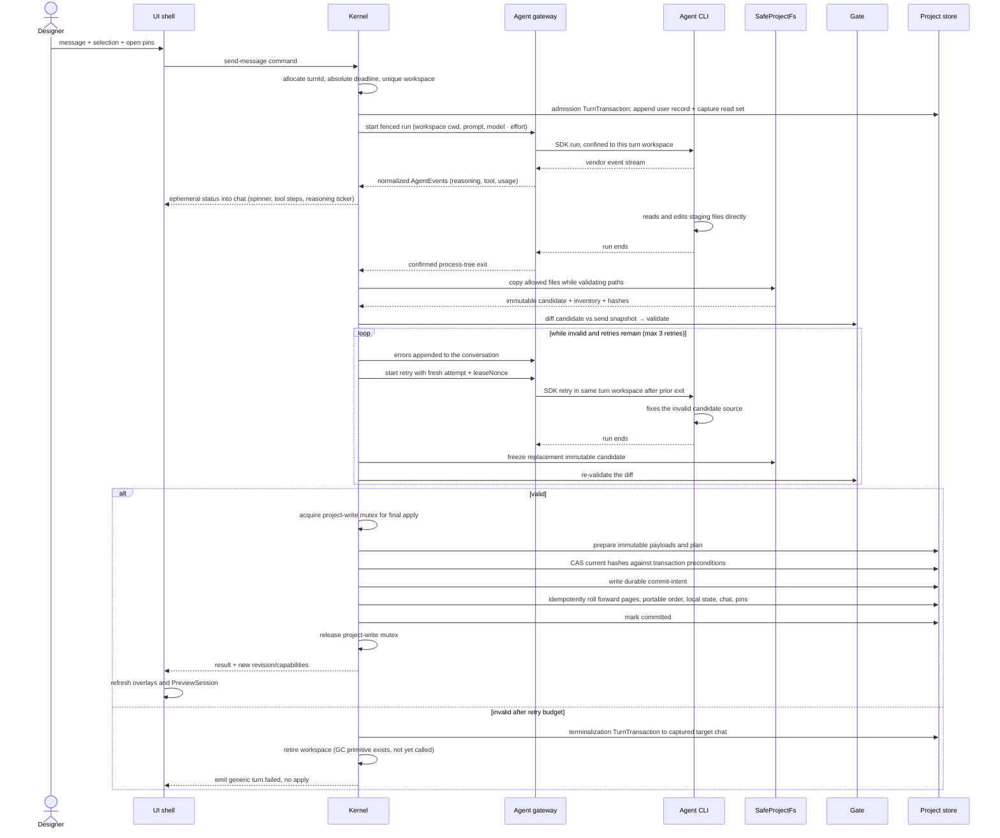

One generation turn: from the designer pressing Enter to validated page-source changes on disk. Covers the staging directory the agent works in, how its edits are confined, the validation Gate with retries, and how changed pages replace their canonical sources.

## Walkthrough

*Every stage below is real, unit-tested code, and the whole sequence is composed and driven
end to end. The turn spine lives in `core/turns` (`runTurn` — admission → the
attempt/freeze/validate retry loop → finalize, or terminalize on any failure branch); the
dispatched `turn.start` command handler (`core/kernel/model/handlers/turn.ts`) builds
`runTurn`'s inputs and runs it inside one operation, and `turn.cancel` drives the same live
attempt's cancel handle. The production adapter graph behind it is wired at the composition
root: `bun start` (`entrypoint/model/create-shell.ts`) builds the real `store`/`gate`/`host`/
`agent` adapters, hands them to `createKernel(deps)`, and the Gate runs against a live host
smoke renderer — no fakes on this path.*

*Honest still-open gaps, flagged where they occur below rather than papered over: the Kernel
resumes a prior SDK session for the second and later turns of one live process (a
durable `workspaceIdentity`, read from the project manifest's `projectId` on every `turn.start` —
`ProjectStore.readManifest()`, the same manifest `core` already reads on every project open —
now feeds `AgentBackend.sessionScope`); cross-restart resume remains structurally unreachable for
Claude, because the backend's own account discriminator is always `null` and the fallback scope is
per-process-random by design (storage-identity §6.2's own escape hatch) — phase-8 WP-7; the
composed system prompt is a placeholder (no
port sources `agent/`'s own prompt text, which sits outside `core`'s import boundary); every
non-committed terminal outcome (cancelled, Gate-exhausted, deadline, backend failure)
publishes a GENERIC `turn.failed`, because neither `core/turns` return type echoes back which
outcome was requested; the Gate's type-check stage stays unwired in production (no
`runtimeDts` source until phase 8); and a retired turn workspace is never actually garbage-
collected (the `retireWorkspace` primitive exists but no caller invokes it in the turn
lifecycle).*

1. Send: dispatching `turn.start` runs admission (`core/turns/model/admission.ts`), which
   mints `turnId` and arms the silence/absolute deadlines. The message goes out with the
   selection chip (only if its element id resolves in the active page's Current
   design at send time) and open pins whose anchors resolve. An admission
   `TurnTransaction` first appends the user record to the captured `targetChatId`; then —
   and only then — the chat's CAS append-base is read (step 1b in `admission.ts`), because
   reading it any earlier captures the chat one record too early and every finalize would
   fail `APPLY_STALE`/`chat`. The complete source, portable manifest, chat, and comments
   CAS read set is snapshotted into the unique workspace — this admission-and-staging path
   is implemented end to end. Local tab/preview/selection
   values are snapshot context, not freshness preconditions. Tab switching later
   does not change this context. Details: `flows/pins-and-selection.md`.
2. Staging: a stable machine-local sandbox parent contains a unique `turns/<turnId>/workspace/` for every turn; no later turn clears or reuses it. Each canonical `page.tsx` is exposed as `pages/<slug>.tsx`, alongside `pages.json` and the `@termcraft/runtime` reference/types — implemented. The backend receives this workspace directory as cwd and only writable root — implemented; the Claude backend sets both from the workspace it is handed. Resume is used only when the backend can rebind the session to it; otherwise a fresh session is seeded from chat — the chat-side resume gate, the bounded fresh-seed selection, and the backend side of both are implemented. The Claude backend declares its sessions rebindable, so a resumed session may move to a new turn workspace between attempts, and it turns the Kernel's resume-or-fresh decision into vendor options rather than making that decision itself. The Kernel now makes that decision (`turn.start`) and resumes within one process once the current project's manifest supplies a `workspaceIdentity` (see step 11). The prompt is meant to carry source-derived metadata, current diagnostics independent of active chat, selection, pins, style guidance, and the message; today the composed system prompt is still a documented placeholder (no port sources `agent/`'s own prompt text), so `turn.start` sends the user message with a placeholder system prompt. All pages remain materialized until benchmarks justify an on-demand protocol.
3. Confinement and freezing: Claude (MVP) receives that cwd plus file-tool permission checks and no Bash/web — implemented; Codex (v1.0) receives workspace-write rooted at the turn work, still design only, with no second backend built. Claude's confinement is a deny-by-default veto consulted on every tool call: a shell or web tool is refused outright, a file tool is allowed only when the path it names resolves inside this turn's workspace, and any tool the backend does not recognise is refused for exactly that reason — an unfamiliar tool is a denial, never a default allow. Relative paths are resolved the way the agent itself resolves them — against its own working directory, which is the workspace — so an agent searching `pages` is not accidentally read as searching termcraft's own directory; a file tool that omits an optional path is treated as naming the workspace itself, while a tool whose path is *required* and missing is refused as malformed. On Windows a second check rejects any path segment between the workspace and the target that turns out to be a junction, since a link on a parent directory leaves the final file looking perfectly ordinary. This is defense-in-depth and is deliberately not the wall — the Gate is (step 7), and it validates a candidate the agent cannot reach at all.
   Every attempt is fenced by `{turnId, attempt, leaseNonce}` — the backend stamps every event it emits and every outcome it reports with the fence it was given, and drops its own late events once an attempt has terminated. `core/turns` now both mints that fence per attempt (`fence.ts`'s `createTurnFence`, minted by `attempt.ts`'s `beginAttempt`) and checks it on receipt: `attempt.ts` drops any event whose fence the live lease does not `accept`. After confirmed process-tree exit, `SafeProjectFs` rejects traversal, links, ambiguous Windows paths, non-regular files, and configured limits while copying allowed bytes into an agent-inaccessible immutable candidate — this candidate assembly is implemented. The Gate never reads the writable workspace.
   - *Failure:* if the backend cannot obtain an owned process tree for an attempt at all, it refuses to run that attempt rather than running it unconfined — the run fails immediately with an error event and a matching failed outcome, and no CLI is started.
4. The backend contract is mechanism-blind: a backend's only obligation is to stream events and leave the turn's proposed changes in staging by run end. Agents with native file tools edit staging directly; a future backend whose agent cannot do that fulfills the same contract by writing the model's structured full-file output into staging itself — the Kernel, diff, Gate, and apply are identical either way. That contract is now real code rather than a sketch: it names no vendor, mentions no SDK, and is written so it can move into the Kernel's own port folder unchanged. It splits the module in two — a shared, backend-agnostic tier (session scope, workspace containment, the deny-by-default rule) and one vendor tier per backend, so adding Codex means adding a sibling of the Claude tier with its own tool vocabulary rather than editing the shared one.
5. While the turn runs: normalized events are accepted only from the active fence. Both halves are now built — the backend maps vendor messages into the five neutral event kinds (reasoning, tool step, final text, error, token usage), stamps each with its attempt's fence, and drops any vendor message it has no mapping for rather than guessing; `core/turns/model/attempt.ts` is the receiving half, dropping any event whose fence the live lease rejects and republishing every accepted event as `turn.progress`. Any event resets the 120-second silence timeout (`deadlines.noteEvent`) but cannot reset the 30-minute default absolute deadline shared by the initial attempt and retries. The UI mirror renders the bounded ephemeral status block from that `turn.progress` stream. Ordinary Send remains disabled, while local slash-command mode keeps `/commit-page`, `/commit-infra`, and `/commit-all` available according to Kernel capability; other turn-locked rows remain dimmed. Final apply serializes through the project-write mutex — implemented. Scoped commit (`/commit-page`, `/commit-infra`, `/commit-all`) would serialize through the same mutex, but no Git integration exists in the codebase yet. Git hooks may change `.termcraft/`, so final apply later compare-and-swaps its preconditions instead of overwriting drift — also implemented.
6. Page management is file management: a new `pages/<slug>.tsx` staging file adds a page and becomes `.termcraft/pages/<slug>/page.tsx` on apply; deleting one unlists the page and removes its canonical source; portable reordering or an optional local `requestedActivePage` is a `pages.json` edit; retitling edits the page's own `meta.title` — implemented. Slugs must match the slug mask and avoid Windows device names — implemented — and never rename an existing page identity — structural, since the finalize step only ever replaces or deletes a slug, never renames one. In a Git repository, deleting a page does not erase its committed path history, and recreating the slug resurrects the same identity — v1 Git-history behavior; no Git integration exists in the codebase yet.
7. The Gate validates the immutable candidate: manifest-slice syntax/order/slugs; the single `@termcraft/runtime` import surface; TypeScript against the generated `@termcraft/runtime` declaration; static meta including supported `kitApiVersion`; default `reatomComponent`; and a disposable supervisor-owned smoke host. Every one of these stages, and the orchestrator's cheap-then-heavy sequencing itself, is implemented. The smoke stage is now wired from a `SmokeRenderer` port: `createSmokeRender` builds a `SmokeRequest` (source path, a locally computed source hash pinned to match the host's own hash of the same bytes, the candidate's declared minimum size, and its `kitApiVersion`) from a candidate's parsed `meta`, renders it once through an injected `SmokeRenderer`, and maps the typed result through `smokeResultToErrors`. The renderer is now real: `host/adapters/smoke-renderer.ts` implements `SmokeRenderer` over `runOneShotSession` in smoke mode, and the composition root wires it into `createGateRunnerAdapter`, so a live one-shot smoke render runs on every validated page. The manifest-slice check is threaded too: the Gate exposes `runManifestSlice(manifestText, presentSlugs)`, and the turn driver's validation stage (`core/turns/model/validation.ts`) calls it once per turn — from the frozen candidate's `pages.json` text and present slug set — before any per-page stage runs. Lints now warn for all five kinds — dropped ids, pointable low-level elements without ids, unguarded timers, unguarded randomness, and navigation to unlisted pages. The dropped-id and unlisted-navigation warnings each need extra context from the caller (the ids currently referenced by selection/open pins, and the manifest's listed page slugs) and are skipped silently when that context is absent — and the production `GateRunner.runPage` port carries neither field, so these two lints stay dormant on a live turn even though the Gate itself is fully wired in. Semantic checks are distinct from `SafeProjectFs` path/object safety.
8. The type check is a subprocess, and three rules keep it honest. The runtime types it checks against are generated from `src/runtime/index.ts` and committed as a string constant (`src/runtime/generated/runtime-dts.ts`); the pinned compiler is still a per-platform native executable, but it is resolved as an ordinary `node_modules` dependency (`resolveCompilerPath`) rather than extracted, and spawned from there. Its verdict is only trustworthy if the Gate unions the compiler's *global* diagnostics into the set — missing-lib errors surface nowhere else, so a check built on the obvious per-file-plus-program union reports clean for a program that has no `Object` type at all; if it dedupes diagnostics on code, file, and position, because those buckets double-report the same error; and if it can tell a crashed compiler apart from a clean page.
   - *Failure:* a compiler that crashes or cannot be launched is a typed Gate failure and never an apply. An empty diagnostic list counts as a pass only when the compiler is known to have run — unguarded, the two are indistinguishable and the wall silently disappears.
   - *Note:* the import allowlist is enforced here by reading the candidate's source text, and again by the host before it links a page. Nothing below those scans enforces it — the host's resolver fails open (see [modules.md](../modules.md)) — so this Gate check is load-bearing rather than one layer of several.
   - *Production gap:* the type-check subprocess itself is fully implemented and tested, but the production `GateRunner` (`gate/adapters/gate-runner.ts`) wires it in only when BOTH a resolved compiler path and an ambient `@termcraft/runtime` `.d.ts` (`runtimeDts`) are supplied. The composition root can resolve the compiler from `node_modules`, but no production `runtimeDts` source exists yet (phase 8's WP-2 generates it), so the type-check stage does not run on a live turn today — an honest omission, `runGate`'s own `typeCheck` port stays optional for exactly this reason.
9. Failure branch: still invalid after the initial attempt plus 3 retries — the turn driver appends an honest error to captured `targetChatId` through a terminalization `TurnTransaction` (`runTurn` → `terminalizeTurn`, implemented) and performs no canonical-source change. Two honest gaps remain here: the unique workspace is *not* retired for quarantine or garbage collection (the `retireWorkspace` primitive now exists on the staging port and adapter, but the turn driver never calls it on terminalization, so retired workspaces accumulate), and the terminal event the `turn.start` handler emits is a GENERIC `turn.failed` — neither `core/turns` terminal return type echoes back which outcome (Gate-exhausted vs. deadline vs. backend failure) was requested, so the handler cannot reconstruct a precise distinction and flags the branch name instead of fabricating one.
10. Failure branch: cancellation by `Esc`, silence, or absolute deadline transitions through graceful abort then hard process-tree kill. The backend half is implemented, in four rungs rather than the five the specification names. Rung one asks the vendor SDK to stop, which closes the CLI's input stream — the CLI's own signal to shut down cleanly — and gives it a short grace period of its own. Rung two waits, up to a budget, for the operating system to report the owned process tree empty; if it empties, the cancellation is reported as confirmed and nothing further happens. Rung three of the specification — a genuinely graceful, tree-wide termination distinct from both of its neighbours — has no Windows primitive to implement it: a job object offers exactly one termination call and it is unconditional, and the alternative signal path is documented by the platform as forcefully killing the process regardless of which signal is named. The graceful window that rung was reaching for already happens inside rung one, so the code implements the remaining rung four — hard-kill the whole tree, then wait for confirmation again — and documents the gap in place rather than adding an inert step. The budget is therefore two waits, not three. Deciding *when* to cancel is now the Kernel's and turn driver's job: the `turn.cancel` command (`core/kernel/model/handlers/turn.ts`) drives `requestCancel` into the live attempt handle registered by `onAttemptStarted`, and the driver itself checks the silence and absolute deadlines (`deadlines.check()`) between attempts and immediately after each completes, terminalizing on expiry. The backend carries out the request.
    - *Failure:* if the tree still cannot be confirmed empty after the hard kill, the run reports an unconfirmed exit instead of a cancellation, and that backend latches unhealthy and refuses further health checks until it is restarted — a fresh probe could only ever attest to a new CLI's health, never to whether the stale tree emptied. A new turn cannot start until exit is confirmed; inability to confirm makes the backend unhealthy, exactly as the specification requires.
    - *Note:* the same confirmation applies to ordinary success, not just cancellation. A run that completes naturally still waits for the tree to empty, escalates to the hard kill if it does not, and downgrades to an unconfirmed exit rather than reporting a clean completion the Kernel would act on. Either way the job is released on every terminal path, which arms the kill-on-close reaper for anything still inside.
    - Before commit intent, cancellation records the terminal outcome and changes no canonical source — the underlying `system:cancelled` terminalization record is implemented. After commit intent, cancellation is disabled and recovery must finish roll-forward — also implemented, by the startup recovery scan.
11. Failure branch: session resume requires the chat UUID, opaque backend session scope, exact record-count/prefix-hash checkpoint, and workspace rebinding capability. The chat-side gate — identity, record-count, and prefix-hash matching, plus the bounded fresh-session seed — is implemented, and so is the backend side: the backend derives the opaque scope string the checkpoint is keyed by, and declares whether its sessions can rebind to a new workspace (Claude's can). The scope changes when the backend, the account, the model, or the workspace identity changes, and deliberately does *not* change when reasoning effort changes, so raising effort never throws away a session. A backend that cannot name a stable account falls back to a value unique to this process, which safely disables resume across restarts instead of resuming into the wrong account. Any mismatch starts a fresh session seeded with a bounded recent-chat excerpt, which the backend prepends to the message as leading context. The Kernel now makes the decision for real: `turn.start` derives `sessionScopeId` via `AgentBackend.sessionScope` once it has read a durable `workspaceIdentity` from the current project's manifest (`ProjectStore.readManifest().projectId`, phase-8 WP-7 — the same manifest `core` already reads on every project open, not a new persisted field), evaluates it through `evaluateSessionPlan` (`core/turns`), and advances the checkpoint after every committed turn. Resume therefore works for the second and later turns of one live process. It remains unreachable across a process restart: Claude's own account discriminator is always `null` (`agent/claude/backend/model/probe.ts`), so the scope's account component falls back to a value random per process (`agent/session/model/session-scope.ts`'s `UNRESUMABLE_ACCOUNT`) — the exact, deliberate escape hatch storage-identity §6.2 describes for a backend that cannot supply one. Other local session entries remain inert until their own checks pass.
12. Apply: under the project-write mutex, `TurnTransaction` first prepares
    immutable payloads for changed canonical pages, portable page-order changes,
    any requested local active-page effect composed from current local state, the
    agent record, and append-only pin status events, and writes the durable plan.
    Under the same write permit the Kernel then verifies every old source,
    portable manifest, chat, and comments precondition from the send snapshot,
    and only with current preconditions writes the durable commit intent.
    After durable commit intent, writes are idempotent and roll-forward-only; a
    committed marker completes the transaction. Startup recovers pending intent
    before Workspace. Unexpected hashes enter recovery conflict without overwrite.
    This whole sequence, including startup recovery, is implemented. Page metadata
    is extracted from source into a rebuildable local cache, never copied into
    `project.toml` — the cache itself is implemented, but nothing yet calls the
    extraction step that would populate it. An empty diff records
    `"changedPages":[]`. The UI mirror (`ui/mirror/model/mirror.ts`) reflects the
    resulting `stateRevision` and the current preview session from the Kernel event
    stream; only the frame-token acknowledgement handshake is still a no-op
    (`FrameAcknowledgeNotWiredError` at the composition root), so the preview streams and
    renders but geometry/hover-pin queries stay unusable.

## Source anchors

The composed turn spine and its command handler:

- `src/core/turns/model/run-turn.ts` — `runTurn`: the composed driver — admission → the attempt/freeze/validate retry loop (up to `MAX_TURN_ATTEMPTS`) → `finalizeTurn` on a passing candidate, or `terminalizeTurn` on any failure branch; owns the phase-bridging edges into `terminalizing`
- `src/core/turns/model/admission.ts` — `runAdmission`: `idle → admitting → workspace-ready`; commits the user record FIRST, then reads the chat CAS append-base immediately after (step 1b) so finalize's precondition is not stale, then stages the workspace and mints the fence
- `src/core/turns/model/attempt.ts` — `startTurnAttempt`: one attempt through the `AgentBackend` port; mints the per-attempt lease, DROPS any event whose fence the live lease rejects, republishes accepted events as `turn.progress`, and exposes the `requestCancel` handle
- `src/core/turns/model/candidate.ts` — `freezeTurnCandidate`: freezes the workspace into the immutable candidate via `snapshotToCandidate` and diffs its page inventory (hash/slug only, never bytes) against the send-time read set
- `src/core/turns/model/validation.ts` — `runTurnValidation`: the Gate stage — `runManifestSlice` once per turn, then `runPage` over every present slug; drives `retryAfterGate` and folds diagnostics, or returns passed/exhausted
- `src/core/turns/model/finalize.ts` — `finalizeTurn`: drives `validating → finalizing → committed`; re-checks the turn deadline, then calls `TurnTransactionService.finalize` (whose adapter owns the mutex/CAS/durable-intent sequence internally)
- `src/core/turns/model/terminalize.ts` — `terminalizeTurn`: drives `terminalizing → terminal → idle`; writes the single terminal chat record (`system:error`/`system:cancelled`) or reports it unrecorded
- `src/core/turns/model/fence.ts`, `src/core/turns/model/deadlines.ts`, `src/core/turns/model/prompt.ts`, `src/core/turns/model/read-set.ts` — the `{turnId, attempt, leaseNonce}` fence primitive (its own CSPRNG nonce, minted per attempt), the silence/absolute deadline clock, the Gate-diagnostics prompt fold applied on retry, and the staged-to-finalize read-set translation
- `src/core/kernel/model/handlers/turn.ts` — the dispatched `turn.start` handler that composes `runTurn` end to end (resolves the live agent selection, builds the read set, threads the chat reader, maps `publish`/`onAttemptStarted` onto the live event and cancel-handle slots) and the `turn.cancel` handler that drives `requestCancel` into the active attempt; resolves the same-process session-resume plan via `evaluateSessionPlan`/`advanceSessionCheckpoint` (phase-8 WP-7) and documents the generic-`turn.failed` divergence

The production adapter graph (composed at `bun start`):

- `src/entrypoint/model/create-shell.ts` — the composition root: opens/creates the project, builds the real `store`/`gate`/`host`/`agent` adapters, assembles `createKernel(deps)`, and adapts it to the UI's `KernelPort`; also home to the documented `FrameAcknowledgeNotWiredError` (the frame-token/geometry-query handshake is still a no-op)
- `src/gate/adapters/gate-runner.ts` — `createGateRunnerAdapter`: the production `GateRunner` over `runGate`/`checkManifestSlice`; wires the live smoke renderer, and wires `typeCheck` ONLY when both a resolved compiler path and a `runtimeDts` are supplied (no production `runtimeDts` exists yet — phase 8's WP-2 — so type-check stays unwired)
- `src/host/adapters/smoke-renderer.ts` — `createSmokeRendererAdapter`: `host`'s real `SmokeRenderer` over `runOneShotSession` in smoke mode — the live renderer the Gate's smoke stage now calls

Send, staging, and the immutable candidate:

- `src/store/sandbox/model/staging-store.ts` — creates the unique `turns/<turnId>/workspace/`, stages every canonical page plus `pages.json` and the runtime docs into it, and durably persists `turn.json` (the send-time read set and staged-file inventory); the create-new discipline is what makes a re-used `turnId` a `workspace_collision`
- `src/store/sandbox/model/project-key.ts` — derives the stable per-project sandbox parent the turn workspace above lives under
- `src/store/transaction/model/wrappers.ts` — `admitTurn`: appends the user record to the captured `targetChatId` and commits it before any agent process starts
- `src/store/safe-fs/model/candidate.ts` — `snapshotToCandidate`: the immutable-candidate step (enumerate → validate → copy-while-hashing into a create-new destination) that produces the inventory and hashes the Gate validates
- `src/store/safe-fs/model/no-follow.ts` — the no-follow walk that refuses to descend through a reparse point/symlink during candidate enumeration
- `src/store/safe-fs/model/path-rules.ts` — the path-grammar rejections (length, component count, NTFS alternate-data-stream colons, trailing dot/space, reserved device names) behind "ambiguous Windows paths"
- `src/store/safe-fs/model/leaf-identity.ts` — non-regular-file and hardlink/identity-drift rejection during candidate copy
- `src/store/safe-fs/model/limits.ts` — the per-namespace/root size limits enforced before and while copying
- `src/entities/page/model/slug.ts` — the slug mask and Windows-reserved-device-name check every page slug is validated against

The Gate:

- `src/gate/model/gate.ts` — the orchestrator: import/contract/lint stages always run; the injected type-check runs next; manifest and smoke run only while nothing fatal has surfaced
- `src/gate/model/smoke.ts` — `createSmokeRender`: builds the `smokeRender` port from an injected `SmokeRenderer`, computing the source hash locally (never by importing `host`) and mapping the typed result through `smokeResultToErrors`
- `src/gate/model/import-scan.ts` — the single `@termcraft/runtime` import-surface allowlist (rejects dynamic import, re-export, and `require`), plus a FATAL dynamic-code rejection (design §5.8) for `eval`/`Function` — a direct call, a bare `eval` reference, and computed-string evasions — skipping JSX children text via `jsx.ts`'s `scanJsx` so a page's own display copy is never mistaken for a reference
- `src/gate/model/jsx.ts` — `scanJsx`: a recursive-descent JSX reader over the installed TypeScript scanner's own JSX language variant, yielding every real element (tag name/id/position) and every genuine children text range in one pass, fail-closed on anything malformed or unterminated. Expression containers, spread attributes and attribute values are read as code, with template literals followed across their interpolations and regular expressions re-scanned as literals so their braces never close a container early. `lints.ts`'s `unpointed-element` consumes the elements directly; `import-scan.ts`'s `computeJsxTextTokenIndices` maps the text ranges onto `lexer.ts`'s CODE-mode token stream. `readHyphenatedName` remains a separate token-array helper for `lints.ts`'s `dropped-id` extraction, which also matches the non-JSX `id: "x"` object-literal form
- `src/gate/model/lexer.ts` — the shared CODE-mode tokenizer (`tokenize`) and the `scanCodeToken` step `jsx.ts` builds on, which keeps a stack of what each open `{` is so the `}` that resumes a template literal is re-scanned as a template token instead of read as a brace
- `src/gate/model/page-contract.ts` — literal-only `meta`/`definePage`, the required fields, supported `kitApiVersion`, and the default `reatomComponent` export
- `src/gate/model/manifest.ts` — the `pages.json` manifest-slice check: parse, slug validity, permutation against the pages actually staged, active-slug reference
- `src/gate/model/lints.ts` — all five warning lints are implemented: the determinism pair (`unguarded-timer`, `unguarded-randomness`), `dropped-id` and `unlisted-navigation` (each needs an extra optional `GateInput` field from the caller — `referencedIds`/`listedSlugs` — and skips silently when it's absent), and `unpointed-element` (a raw/low-level JSX open tag with no `id` prop; a capitalized tag is a Kit component and exempt)
- `src/gate/model/type-check.ts` — the tsc subprocess check: unions the compiler's global diagnostics in, dedupes on `(code, file, position)`, and turns a crashed/unavailable compiler into a fatal error rather than an empty (falsely clean) list
- `src/gate/model/tsc-extract.ts` — `resolveCompilerPath`: resolution of the pinned compiler from the installed `typescript` package under `node_modules`, an ordinary dependency npm distribution supplies (no per-user extraction)
- `src/gate/ports/smoke-renderer.ts` — the `SmokeRenderer` port the Gate declares for the disposable smoke host, plus `smokeResultToErrors`; `src/gate/model/smoke.ts`'s `createSmokeRender` is its driving factory, and `src/host/adapters/smoke-renderer.ts` now implements the port, so a real one-shot render runs on every validated page
- `src/host/supervisor/model/one-shot.ts` — `runOneShotSession`, the disposable one-shot host incarnation (spawn → negotiate → mount → seal one frame → exit; no restart, no pump) the smoke/export port is meant to wrap
- `src/host/session/model/source-mount.ts` — the host's own re-scan of the import surface plus source-hash verification before linking a page — the second, defense-in-depth enforcement point
- `src/host/session/model/resolver.ts` — the runtime-specifier resolver, which fails open by design and relies entirely on the scans above and the Gate

Apply, transaction durability, and recovery:

- `src/store/transaction/model/wrappers.ts` — `finalizeTurn` (changed-page/manifest/local-state/agent-record/pin-resolution plan plus the send-time CAS precondition) and `terminalizeTurn` (the idempotent single-terminal-record guard); also the generic `project-mutation` base and the restore/migration builders (unit-tested, no MVP caller — out of scope) — the export-publish builder now DOES have a real MVP caller (`src/store/adapters/export-publish.ts`, WP-5)
- `src/store/transaction/model/engine.ts` — `runTransaction`/`rollForwardTransaction`: payload install → plan → precondition re-check → durable intent (point of no rollback) → idempotent roll-forward → commit marker
- `src/store/transaction/model/write-mutex.ts` — the in-process project-write mutex and its permit chain
- `src/store/transaction/model/recovery.ts` — the startup scan that classifies every unfinished transaction (discard / roll-forward / already-complete / conflict) before project state is exposed
- `src/store/transaction/model/journal-format.ts` — the whole-journal-namespace format gate, read before recovery ever lists a transaction directory
- `src/store/model/factory.ts` — the launch sequence (lease → `SafeProjectFs` → journal format → recovery → migrations → schemas → orphan-turn sweep → open) and the orphan-turn scan that terminalizes turns left mid-flight by a restart
- `src/store/projections/model/page-meta-cache.ts` — the rebuildable local page-metadata cache `project.toml` is never written into; a get/put primitive today, with no extraction caller wired to populate it yet

The agent backend, confinement, and process-tree exit:

- `src/agent/types.ts` — the mechanism-blind backend contract of step 4: `startTurn`/`cancel`/`healthCheck`/`capabilities`/`sessionScope`, the `AgentTask` a fenced attempt receives, and the four terminal outcomes (`completed`, `backend-error`, `cancelled` with confirmed exit, `unconfirmed-exit`)
- `src/agent/index.ts` — the module's public entry: the port types plus `createProductionClaudeBackend`
- `src/agent/confinement/model/policy.ts` — `createConfinementPolicy`, the shared deny-by-default rule of step 3: denied tools first, unlisted tools next, then the path test; parameterized over a tool table so it names no vendor
- `src/agent/confinement/model/path-containment.ts` — `isInsideStaging`: normalization, the boundary-safe prefix test, relative paths resolved against the workspace, and the reparse-point check applied to every segment from the workspace down to the target
- `src/agent/claude/tools/model/vocabulary.ts` — Claude Code's tool vocabulary: the path-required file tools, the tools whose path is optional and defaults to the working directory, and the shell/web tools denied outright
- `src/agent/claude/query/model/query-options.ts` — `buildQueryOptions`: workspace as cwd and only writable root, no external settings sources, the `canUseTool` veto, and the spawn hook that makes the CLI ours
- `src/agent/claude/query/model/spawn-adopt.ts` — spawn-then-adopt with the membership re-read; records a failed adoption so a later "zero processes" reading can never be mistaken for a confirmed exit
- `src/agent/run/model/engine.ts` — `startAgentRun`: one attempt end to end — the event queue, the single terminal latch, the natural-completion exit confirmation, and the four-rung cancel ladder of step 10 with its documented missing rung. This is now the SHARED engine, not vendor code: a backend supplies only a driver that reads its own stream and reports into it
- `src/agent/run/model/degraded-run.ts` — `createDegradedRun`: the shape a run takes when `startTurn` cannot obtain an owned process tree at all — one error event then a matching `backend-error` outcome, never an unconfined run
- `src/agent/run/model/unconfirmed-exit-latch.ts` — `createUnconfirmedExitLatch`: the sticky per-backend lockout step 10's failure branch sets after an unconfirmed exit, cleared only by restart
- `src/agent/claude/run/model/drive-stream.ts` — `createClaudeDriver`: the vendor stream reader that reads `SDKMessage`s and claims the natural outcome; hands the terminal latch and exit confirmation off to the shared engine above
- `src/agent/claude/backend/model/backend.ts` — the backend instance: a fresh owned tree per attempt, the refusal to run an attempt with no tree, the tree closed on every terminal outcome, and the shared unhealthy latch wired in
- `src/agent/claude/run/model/normalize.ts` — vendor messages into the five `AgentEvent` kinds of step 5, dropping unmapped messages by design
- `src/infrastructure/process/types.ts`, `src/infrastructure/process/model/job-object.ts` — the owned process tree behind "confirmed process-tree exit": kill-on-close creation, adoption, the OS-read live process count, hard termination, and idempotent invalidating release

Session resume and fencing:

- `src/store/jsonl/model/checkpoint.ts` — the session-resume gate: chat identity, `sessionScopeId`, exact record-count/prefix-hash match, and the bounded fresh-session seed built on any mismatch
- `src/store/toml/types.ts` — `SessionCheckpoint`'s machine-local shape (`chatId`, `sessionScopeId`, `sessionId`, `recordCount`, `prefixHash`)
- `src/core/turns/model/session-plan.ts` — `evaluateSessionPlan`/`advanceSessionCheckpoint`: the admission-time resume-or-fresh read and the post-commit checkpoint write-back, both now wired into `turn.start` (phase-8 WP-7) rather than exercised only by their own tests
- `src/core/kernel/model/handlers/project.ts` — `runProjectReadySequence`'s `readManifest()`/`manifest.projectId` read, the SAME manifest read `turn.ts` makes a second time to source `workspaceIdentity` (phase-8 WP-7)
- `src/agent/session/model/session-scope.ts` — the backend half of the same gate: the opaque scope string keyed on backend, account, model, and workspace identity, with effort excluded and a per-process fallback when no stable account exists
- `src/agent/session/model/prompt.ts` — `buildPrompt`: the delta on resume, the bounded seed transcript prepended on fresh — now shared, since nothing about assembling the prompt string is vendor-specific
- `src/agent/claude/query/model/session-options.ts` — `planToSessionOptions`: turning the Kernel's resume-or-fresh decision into vendor SDK `resume`/`forkSession` options
- `src/agent/claude/backend/model/capabilities.ts` — `claudeCapabilities`, which declares Claude's sessions rebindable to a new turn workspace (step 2), alongside the health probe of `flows/launch.md`
- `src/store/lease/model/lease.ts` — `leaseNonce()`, the CSPRNG nonce primitive minted once per project-lease acquisition; distinct from the per-attempt turn fence, which mints its own nonce in `core/turns/model/fence.ts`
- `src/entities/turn/types.ts` — `AgentEvent`/`TurnFence`/`TokenUsage`: the normalized event stream and the `{turnId, attempt, leaseNonce}` fencing shape; the backend produces the events and stamps the fence, and `core/turns/model/attempt.ts` now consumes both — accepting only events whose fence the live lease matches

Design references (the authoritative contract/visual source of truth, or a feature not
yet built). The Kernel and turn spine themselves are real code, anchored above and in
`docs/architecture/modules.md`'s Kernel section:

- `docs/superpowers/specs/2026-07-16-kernel-command-contract-design.md` — the whole Kernel: command/event contracts, capabilities, turn-state guards, revisions, typed results; now a real, tested `core` module — this spec remains the authoritative contract reference, not a "no code yet" citation
- `docs/superpowers/specs/2026-07-16-turn-durability-staging-design.md` — §7.3 the run/retry/candidate-handoff loop and §9 Restore: the run/retry/candidate-handoff loop is now driven for real by `core/turns`'s `runTurn`; Restore has no code yet (out of MVP scope). The Kernel-side half of §6.4's late-event rejection is real too (`core/turns/model/attempt.ts`'s fence check drops a late/stale event). §6.3's backend cwd/confinement and §6.5's cancellation/process-tree-exit handling are anchored to `src/agent/` above, with §6.5's rung 3 documented in `src/agent/run/model/engine.ts` as unimplementable on Windows
- `docs/superpowers/specs/2026-07-13-termcraft-design.md` — §6.1's Codex half (v1.0; no second backend exists); §3.9 chats and context usage; and the *presentation* nuances of §3.2 turn-time streaming status and §9 cancel/hang/sandbox-degradation. §3.2's ephemeral status block and §9's cancel now have real code — the UI's `AgentStatusBlock` (below) and the `turn.cancel` handler (above) — with this spec still the authoritative reference for the finer presentation states. §6.1's backend abstraction and Claude confinement are anchored to `src/agent/` above
- `docs/superpowers/specs/2026-07-16-git-backed-page-history-design.md` — §2 the Git path-history controls on page delete/recreate; §11 v1 acceptance criteria — no Git integration exists in the codebase today
- `design/03-workspace-generating.dc.html` — the visual source of truth for the streaming status presentation, now rendered by `src/ui/chat/ui/AgentStatusBlock.tsx`
- `design/12-errors-edge-states.dc.html` — the visual source of truth for error presentation, now rendered by `src/ui/preview/ui/ErrorPanel.tsx` (and error chat records)
