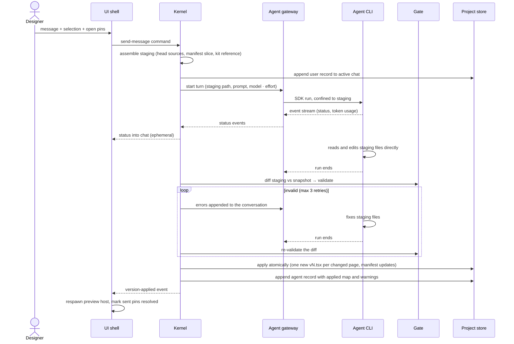

One generation turn: from the designer pressing Enter to a new page version on disk. Covers the staging directory the agent works in, how its edits are confined, the validation gate with retries, and how results apply atomically.

## Walkthrough

1. Send: the message goes out with the selection chip (only if its element id resolves in the active page's head at send time) and open pins whose anchors resolve; the turn's context — heads, active page, selection, pins — is snapshotted into staging at send time, so switching tabs or chats mid-turn does not change what the agent sees. Details: `flows/pins-and-selection.md`.
2. Staging: a scratch directory holding `pages/<slug>.tsx` (the head of every listed page, flat by slug), `pages.json` (the manifest slice: ordered slugs and the active page), and the kit reference (docs plus type declarations). The prompt carries the designer role, the design-code rules, the project manifest (page list with cached titles), the previous turn's gate warnings, selection, pins, and the user message. There is no read protocol and no prefetch policy: the agent reads whatever staging files it wants with its own tools.
3. Confinement: each backend uses its native mechanism to keep the agent inside staging — Codex's workspace-write sandbox rooted there (network restricted by default), Claude Code's permission rules with a per-tool-call veto callback. Confinement is defense-in-depth; correctness rests on the gate only accepting what landed in staging and validated.
4. The backend contract is mechanism-blind: a backend's only obligation is to stream events and leave the turn's proposed changes in staging by run end. Agents with native file tools edit staging directly; a future backend whose agent cannot do that fulfills the same contract by writing the model's structured full-file output into staging itself — the kernel, diff, gate, and apply are identical either way.
5. While the turn runs: status streams into chat as ephemeral text, never persisted; typing the next message is allowed but sending stays disabled; version switching, rollback, export, the agent · model · effort picker, and chat creation and switching are locked, each refusal hinted in the status bar. The composer's context-usage indicator updates from token usage the backend's SDK reports; a backend that reports nothing hides the indicator.
6. Page management is file management: a new `pages/<slug>.tsx` adds a page; deleting one unlists it (history stays on disk; recreating the slug resurrects it); reordering or switching the active page is a `pages.json` edit; retitling is editing the page's own `meta.title`. Slugs must match the slug mask and avoid Windows device names.
7. The gate, when the run ends, validates the staging diff: manifest-slice checks (parse, slug mask, permutation, active page exists); per changed page the import allowlist (only the kit, React, and OpenTUI), a TypeScript check against the embedded types, the page contract (`meta` as a static literal plus a default-export component), and a smoke render — a disposable design host mounts the page once at its minimum size, surfacing import errors and render crashes before anything is applied. Lints come back as warnings, not errors: dropped ids that selection or open pins reference, pointable raw elements without ids, timers or randomness outside the export-flag guard, navigation to unlisted pages.
8. Failure branch: still invalid after the initial attempt plus 3 retries — an honest error is written to chat as a system record, staging is discarded, and head versions are left untouched.
9. Failure branch: cancellation, whether by `Esc` or 120 seconds of stream silence — the SDK run is aborted, a system record is written to chat, staging is discarded, and project state stays intact.
10. Failure branch: session resume fails (a stale session, another machine, or a switched backend) — termcraft silently starts a fresh session seeded with a short excerpt of that chat's recent records. Each chat has its own SDK session (a machine-local chat → session id map); switching chats resumes the target chat's session. Switching agent or model starts a fresh session for the active chat; other chats' stored ids simply fail resume later and take the same fallback.
11. Apply: valid changes apply atomically — each changed page gets exactly one new `vN.tsx` written via tmp-then-rename (create-new numbering), each applied page's evaluated metadata (title, minimum size) is re-cached in the project manifest, manifest-slice edits land in the project manifest, and the chat's agent record carries the applied map and the gate warnings for the next turn's context. An empty diff is a valid outcome — a purely conversational turn writes nothing and the applied map stays empty. The UI shell only switches the active page when the agent changed it in `pages.json` — adding a page alone does not switch. The preview host respawns on the new head.

## Source anchors

- `docs/superpowers/specs/2026-07-13-termcraft-design.md` — §6.1 backend abstraction and confinement, §6.2 staging and the turn protocol, §6.3 the gate, §3.2 turn-time locks, §3.9 chats and context usage, §5.8 design-code rules, §9 cancel, hang, and sandbox-degradation handling
- `design/03-workspace-generating.dc.html` — streaming status presentation
- `design/12-errors-edge-states.dc.html` — error presentation in chat
