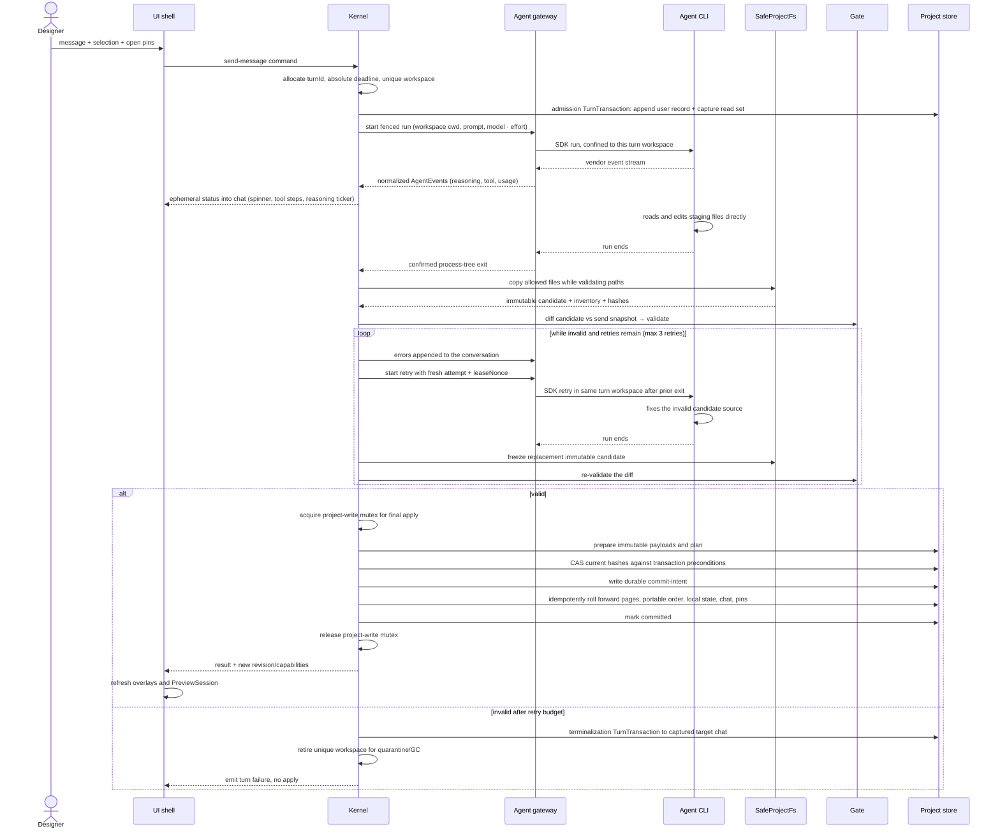

One generation turn: from the designer pressing Enter to validated page-source changes on disk. Covers the staging directory the agent works in, how its edits are confined, the validation Gate with retries, and how changed pages replace their canonical sources.

## Walkthrough

*A step marked "implemented" below is real, unit-tested code inside `store`, `gate`,
or `host`. `store` and `host` compose theirs at their own composition roots (see
Source anchors); `gate` does not — its stages are individually implemented and
tested, but nothing composes or
calls the Gate pipeline yet. None of it yet runs inside a live turn end to end — the
Kernel that would drive this whole sequence does not exist yet.*

1. Send: command acceptance mints `turnId` and starts the absolute deadline — Kernel
   command handling that has not been built yet. The message goes out with the
   selection chip (only if its element id resolves in the active page's Current
   design at send time) and open pins whose anchors resolve. Under the project-write
   mutex, an admission `TurnTransaction` first appends the user record to the
   captured `targetChatId`; the complete source, portable manifest, chat, and
   comments CAS read set is then snapshotted into the unique workspace — this
   admission-and-staging path is implemented end to end. Local tab/preview/selection
   values are snapshot context, not freshness preconditions. Tab switching later
   does not change this context. Details: `flows/pins-and-selection.md`.
2. Staging: a stable machine-local sandbox parent contains a unique `turns/<turnId>/workspace/` for every turn; no later turn clears or reuses it. Each canonical `page.tsx` is exposed as `pages/<slug>.tsx`, alongside `pages.json` and the `@termcraft/runtime` reference/types — implemented. The backend receives this workspace directory as cwd and only writable root. Resume is used only when the backend can rebind the session to it; otherwise a fresh session is seeded from chat — the chat-side resume gate and bounded fresh-seed selection are implemented, but backend rebinding is v1 behavior with no agent module yet to attempt it. The prompt carries source-derived metadata, current diagnostics independent of active chat, selection, pins, style guidance, and the message. All pages remain materialized until benchmarks justify an on-demand protocol.
3. Confinement and freezing: Claude (MVP) receives that cwd plus file-tool permission checks and no Bash/web; Codex (v1.0) receives workspace-write rooted at the turn work — both backends are v1 design, since no agent module exists yet to run them. Every attempt is fenced by `{turnId, attempt, leaseNonce}` — the fence shape is defined, but nothing yet constructs or checks one. After confirmed process-tree exit, `SafeProjectFs` rejects traversal, links, ambiguous Windows paths, non-regular files, and configured limits while copying allowed bytes into an agent-inaccessible immutable candidate — this candidate assembly is implemented. The Gate never reads the writable workspace.
4. The backend contract is mechanism-blind: a backend's only obligation is to stream events and leave the turn's proposed changes in staging by run end. Agents with native file tools edit staging directly; a future backend whose agent cannot do that fulfills the same contract by writing the model's structured full-file output into staging itself — the Kernel, diff, Gate, and apply are identical either way. (No backend exists yet; this is the contract a future one must satisfy.)
5. While the turn runs (the Kernel/UI orchestration in this step is v1 design; neither module exists yet): normalized events are accepted only from the active fence. Any event resets the 120-second silence timeout but cannot reset the 30-minute default absolute deadline shared by the initial attempt and retries. The UI renders the same bounded ephemeral status block. Ordinary Send remains disabled, while local slash-command mode keeps `/commit-page`, `/commit-infra`, and `/commit-all` available according to Kernel capability; other turn-locked rows remain dimmed. Final apply serializes through the project-write mutex — implemented. Scoped commit (`/commit-page`, `/commit-infra`, `/commit-all`) would serialize through the same mutex, but no Git integration exists in the codebase yet. Git hooks may change `.termcraft/`, so final apply later compare-and-swaps its preconditions instead of overwriting drift — also implemented.
6. Page management is file management: a new `pages/<slug>.tsx` staging file adds a page and becomes `.termcraft/pages/<slug>/page.tsx` on apply; deleting one unlists the page and removes its canonical source; portable reordering or an optional local `requestedActivePage` is a `pages.json` edit; retitling edits the page's own `meta.title` — implemented. Slugs must match the slug mask and avoid Windows device names — implemented — and never rename an existing page identity — structural, since the finalize step only ever replaces or deletes a slug, never renames one. In a Git repository, deleting a page does not erase its committed path history, and recreating the slug resurrects the same identity — v1 Git-history behavior; no Git integration exists in the codebase yet.
7. The Gate validates the immutable candidate: manifest-slice syntax/order/slugs; the single `@termcraft/runtime` import surface; TypeScript against embedded runtime types; static meta including supported `kitApiVersion`; default `reatomComponent`; and a disposable supervisor-owned smoke host. Every one of these stages, and the orchestrator's cheap-then-heavy sequencing itself, is implemented. Two stages are implemented but not yet adapted: the one-shot host driver and the Gate's smoke-render port both exist, but nothing yet implements the port, so no live smoke render runs today; and the manifest-slice check (`checkManifestSlice`) has a shape the Gate's `checkManifest` port cannot yet accept — it needs the staged `pages.json` text and the present slug set, which nothing threads into the Gate today. Lints remain warnings for dropped ids, pointable low-level elements without ids, unguarded time/randomness, and navigation to unlisted pages — only the unguarded-timer and unguarded-randomness lints are implemented; the other three await a JSX-aware AST, prior-iteration id tracking, and the manifest, respectively. Semantic checks are distinct from `SafeProjectFs` path/object safety.
8. The type check is a subprocess, and three rules keep it honest. The runtime types it checks against are embedded in the binary, but the pinned compiler is a per-platform native executable that cannot be launched from inside the binary, so it and its lib files are extracted once to a per-user directory and spawned from there. Its verdict is only trustworthy if the Gate unions the compiler's *global* diagnostics into the set — missing-lib errors surface nowhere else, so a check built on the obvious per-file-plus-program union reports clean for a program that has no `Object` type at all; if it dedupes diagnostics on code, file, and position, because those buckets double-report the same error; and if it can tell a crashed compiler apart from a clean page.
   - *Failure:* a compiler that crashes or cannot be launched is a typed Gate failure and never an apply. An empty diagnostic list counts as a pass only when the compiler is known to have run — unguarded, the two are indistinguishable and the wall silently disappears.
   - *Note:* the import allowlist is enforced here by reading the candidate's source text, and again by the host before it links a page. Nothing below those scans enforces it — the host's resolver fails open (see [modules.md](../modules.md)) — so this Gate check is load-bearing rather than one layer of several.
9. Failure branch: still invalid after the initial attempt plus 3 retries — the Kernel appends an honest error to captured `targetChatId` through a terminalization `TurnTransaction` (implemented), retires the unique workspace for bounded quarantine or garbage collection (Kernel cleanup policy; not yet implemented — the staging store creates turn workspaces but nothing yet retires or garbage-collects them), emits turn failure, and performs no canonical-source change.
10. Failure branch: cancellation by `Esc`, silence, or absolute deadline transitions through graceful abort then hard process-tree kill — Kernel/agent-process lifecycle that has not been built yet (no agent module exists to spawn or kill a turn's own process tree). A new turn cannot start until exit is confirmed; inability to confirm makes the backend unhealthy. Before commit intent, cancellation records the terminal outcome and changes no canonical source — the underlying `system:cancelled` terminalization record is implemented. After commit intent, cancellation is disabled and recovery must finish roll-forward — also implemented, by the startup recovery scan.
11. Failure branch: session resume requires the chat UUID, opaque backend session scope, exact record-count/prefix-hash checkpoint, and workspace rebinding capability. The chat-side gate — identity, record-count, and prefix-hash matching, plus the bounded fresh-session seed — is implemented; workspace rebinding is v1 backend behavior with no agent module yet to provide it. Any mismatch starts a fresh session seeded with a bounded recent-chat excerpt. Other local session entries remain inert until their own checks pass.
12. Apply: under the project-write mutex, `TurnTransaction` first prepares
    immutable payloads for changed canonical pages, portable page-order changes,
    any requested local active-page effect composed from current local state, the
    agent record, and append-only pin status events, and writes the durable plan.
    Under the same write permit the Kernel then verifies every old source,
    portable manifest, chat, and comments precondition from the send snapshot,
    and only with current preconditions writes the durable commit intent.
    After durable commit intent, writes are idempotent and roll-forward-only; a
    committed marker completes the transaction. Startup recovers pending intent
    before Workspace. Unexpected hashes enter recovery conflict without overwrite.
    This whole sequence, including startup recovery, is implemented. Page metadata
    is extracted from source into a rebuildable local cache, never copied into
    `project.toml` — the cache itself is implemented, but nothing yet calls the
    extraction step that would populate it. An empty diff records
    `"changedPages":[]`. UI only reflects the resulting revision and opens the new
    `PreviewSession` — Kernel/UI wiring that has not been built yet.

## Source anchors

Send, staging, and the immutable candidate:

- `src/store/sandbox/model/staging-store.ts` — creates the unique `turns/<turnId>/workspace/`, stages every canonical page plus `pages.json` and the runtime docs into it, and durably persists `turn.json` (the send-time read set and staged-file inventory); the create-new discipline is what makes a re-used `turnId` a `workspace_collision`
- `src/store/sandbox/model/project-key.ts` — derives the stable per-project sandbox parent the turn workspace above lives under
- `src/store/transaction/model/wrappers.ts` — `admitTurn`: appends the user record to the captured `targetChatId` and commits it before any agent process starts
- `src/store/safe-fs/model/candidate.ts` — `snapshotToCandidate`: the immutable-candidate step (enumerate → validate → copy-while-hashing into a create-new destination) that produces the inventory and hashes the Gate validates
- `src/store/safe-fs/model/no-follow.ts` — the no-follow walk that refuses to descend through a reparse point/symlink during candidate enumeration
- `src/store/safe-fs/model/path-rules.ts` — the path-grammar rejections (length, component count, NTFS alternate-data-stream colons, trailing dot/space, reserved device names) behind "ambiguous Windows paths"
- `src/store/safe-fs/model/leaf-identity.ts` — non-regular-file and hardlink/identity-drift rejection during candidate copy
- `src/store/safe-fs/model/limits.ts` — the per-namespace/root size limits enforced before and while copying
- `src/entities/page/model/slug.ts` — the slug mask and Windows-reserved-device-name check every page slug is validated against

The Gate:

- `src/gate/model/gate.ts` — the orchestrator: import/contract/lint stages always run; the injected type-check runs next; manifest and smoke run only while nothing fatal has surfaced
- `src/gate/model/import-scan.ts` — the single `@termcraft/runtime` import-surface allowlist (rejects dynamic import, re-export, and `require`)
- `src/gate/model/page-contract.ts` — literal-only `meta`/`definePage`, the required fields, supported `kitApiVersion`, and the default `reatomComponent` export
- `src/gate/model/manifest.ts` — the `pages.json` manifest-slice check: parse, slug validity, permutation against the pages actually staged, active-slug reference
- `src/gate/model/lints.ts` — the implemented determinism warnings (`unguarded-timer`, `unguarded-randomness`); its own header marks `unpointed-element`, `dropped-id`, and `unlisted-navigation` as deferred, needing a JSX-aware AST, prior-iteration id tracking, and the manifest respectively
- `src/gate/model/type-check.ts` — the tsc subprocess check: unions the compiler's global diagnostics in, dedupes on `(code, file, position)`, and turns a crashed/unavailable compiler into a fatal error rather than an empty (falsely clean) list
- `src/gate/model/tsc-extract.ts` — one-time extraction of the pinned compiler and its lib files to a per-user cache directory, since a compiled binary cannot spawn an embedded exe
- `src/gate/ports/smoke-renderer.ts` — the `SmokeRenderer` port the Gate declares for the disposable smoke host; no adapter in `host` implements it yet, so nothing wires this port to a real render today
- `src/host/supervisor/model/one-shot.ts` — `runOneShotSession`, the disposable one-shot host incarnation (spawn → negotiate → mount → seal one frame → exit; no restart, no pump) the smoke/export port is meant to wrap
- `src/host/session/model/source-mount.ts` — the host's own re-scan of the import surface plus source-hash verification before linking a page — the second, defense-in-depth enforcement point
- `src/host/session/model/resolver.ts` — the runtime-specifier resolver, which fails open by design and relies entirely on the scans above and the Gate

Apply, transaction durability, and recovery:

- `src/store/transaction/model/wrappers.ts` — `finalizeTurn` (changed-page/manifest/local-state/agent-record/pin-resolution plan plus the send-time CAS precondition) and `terminalizeTurn` (the idempotent single-terminal-record guard); also the generic `project-mutation` base and the restore/export-publish/migration builders, all unit-tested but with no MVP caller
- `src/store/transaction/model/engine.ts` — `runTransaction`/`rollForwardTransaction`: payload install → plan → precondition re-check → durable intent (point of no rollback) → idempotent roll-forward → commit marker
- `src/store/transaction/model/write-mutex.ts` — the in-process project-write mutex and its permit chain
- `src/store/transaction/model/recovery.ts` — the startup scan that classifies every unfinished transaction (discard / roll-forward / already-complete / conflict) before project state is exposed
- `src/store/transaction/model/journal-format.ts` — the whole-journal-namespace format gate, read before recovery ever lists a transaction directory
- `src/store/model/factory.ts` — the launch sequence (lease → `SafeProjectFs` → journal format → recovery → migrations → schemas → orphan-turn sweep → open) and the orphan-turn scan that terminalizes turns left mid-flight by a restart
- `src/store/projections/model/page-meta-cache.ts` — the rebuildable local page-metadata cache `project.toml` is never written into; a get/put primitive today, with no extraction caller wired to populate it yet

Session resume and fencing:

- `src/store/jsonl/model/checkpoint.ts` — the session-resume gate: chat identity, `sessionScopeId`, exact record-count/prefix-hash match, and the bounded fresh-session seed built on any mismatch
- `src/store/toml/types.ts` — `SessionCheckpoint`'s machine-local shape (`chatId`, `sessionScopeId`, `sessionId`, `recordCount`, `prefixHash`)
- `src/store/lease/model/lease.ts` — `leaseNonce()`, the CSPRNG nonce primitive; today minted once per project-lease acquisition, not yet wired into a per-attempt turn fence
- `src/entities/turn/types.ts` — `AgentEvent`/`TurnFence`/`TokenUsage`: the normalized event stream and the `{turnId, attempt, leaseNonce}` fencing shape a backend and the Kernel would use; defined but currently unconsumed anywhere in the codebase

Design-spec anchors kept because no code exists yet for what they describe:

- `docs/superpowers/specs/2026-07-16-kernel-command-contract-design.md` — the whole Kernel: command/event contracts, capabilities, turn-state guards, revisions, typed results; no `core`/Kernel module exists yet
- `docs/superpowers/specs/2026-07-16-turn-durability-staging-design.md` — §6.3-§6.5 backend cwd/confinement, per-attempt fencing and late-event rejection, and cancellation/process-tree-exit handling; §7.3 the run/retry/candidate-handoff loop; §9 Restore — none of this Kernel/backend orchestration is built (the workspace, candidate, CAS, and recovery mechanics this same spec describes now have real anchors above)
- `docs/superpowers/specs/2026-07-13-termcraft-design.md` — §6.1 the backend abstraction and per-backend confinement (Claude MVP, Codex v1.0); §3.2 turn-time streaming-status presentation (ephemeral block, reasoning ticker); §3.9 chats and context usage; §9 cancel/hang/sandbox-degradation handling — all UI/Kernel/agent-module behavior with no code yet
- `docs/superpowers/specs/2026-07-16-git-backed-page-history-design.md` — §2 the Git path-history controls on page delete/recreate; §11 v1 acceptance criteria — no Git integration exists in the codebase today
- `design/03-workspace-generating.dc.html` — streaming status presentation (no `ui` module exists yet)
- `design/12-errors-edge-states.dc.html` — error presentation in chat (no `ui` module exists yet)
