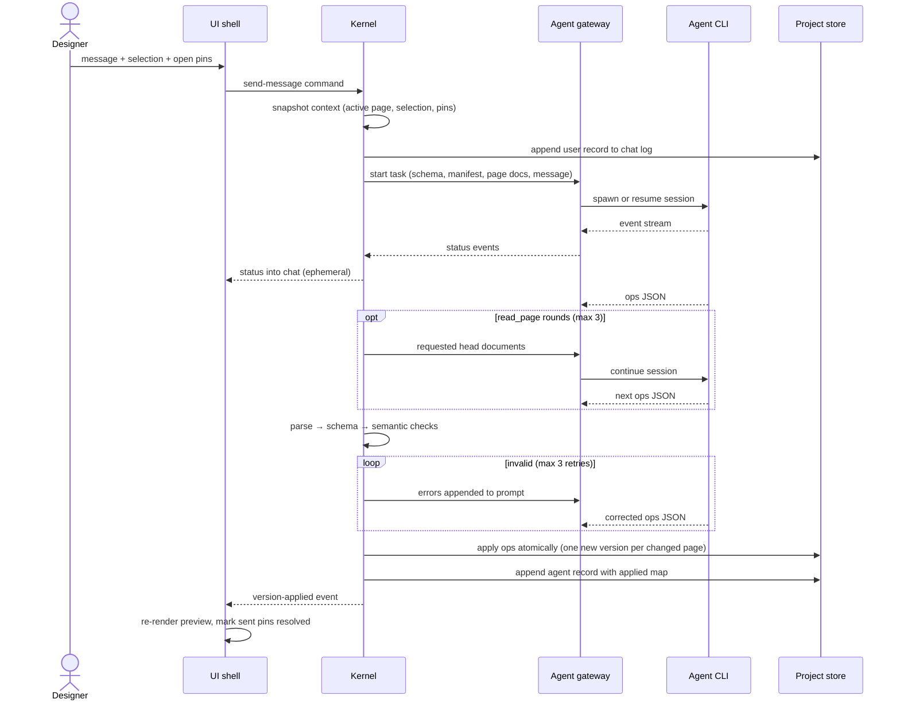

One generation turn: from the designer pressing Enter to a new page version on disk. Covers what the agent receives, the operations protocol it answers with, validation with retries, and how results apply atomically.

## Walkthrough

1. Send: the message goes out with the selection chip (only if its element id resolves in the active page's head at send time) and open pins whose anchors resolve; the turn's context is snapshotted at send time — switching tabs mid-turn does not change what the agent sees.
2. Prompt contents: role system prompt, the design-language schema and output rules, the project manifest, the full active page document, selection, pins, and the user message; if all pages' head documents fit a size threshold (≈32 KB, a per-turn decision), all pages are prefetched instead of just the active one.
3. While the turn runs: status streams into chat as ephemeral text, never persisted; typing the next message is allowed but sending stays disabled; version switching, rollback, export, and the picker are locked, each refusal hinted in the status bar.
4. Read-before-edit: a response of only `read_page` ops continues the turn (up to 3 rounds, then an honest error); mutation ops end the turn; mixing reads and mutations in one response is a validation error. The Kernel tracks, per session and in memory, which head version of each page the agent has seen; an `update_page` against an unseen head fails validation and enters the retry loop.
5. The ops protocol: `read_page`, `add_page`, `update_page`, `remove_page`, `rename_page`, `reorder_pages`, and `set_active_page`; payloads carry full documents, never diffs; `op.page` must equal `doc.page`; page slugs must match the slug mask and avoid Windows device names.
6. Validation pipeline: JSON parse, then schema validation, then semantic checks — unique ids, pages known to the manifest, the slug mask, the unseen-head guard, known palette roles, `tabs.active` naming a real child, `open:`/`close:`/`toggle:` targets, and `goTo:` targets checked against the manifest as it stands after the whole ops list. Hygiene issues (unused variables, sugar targeting a custom `visibleWhen`, `border` on a non-bordered element, a `remove_page` leaving dangling `goTo:` references) come back as warnings, not errors.
7. Failure branch: still invalid after the initial attempt plus 3 retries — an honest error is written to chat as a system record and head versions are left untouched.
8. Failure branch: cancellation, whether by `Esc` or 120 seconds of stream silence — the agent process is killed, a system record is written to chat, and project state stays intact.
9. Failure branch: session resume fails (a stale session, another machine, or a switched backend) — termcraft silently starts a fresh session seeded with a short excerpt of recent chat; switching agent or model also starts a fresh session and resets the seen-versions map.
10. Apply: valid ops apply atomically — each changed page gets exactly one new version file written via tmp-then-rename, and the chat's agent record carries the applied map linking the message to the versions it produced; the UI shell only switches the active page on an explicit `set_active_page` op.

## Source anchors

- `docs/superpowers/specs/2026-07-13-termcraft-design.md` — §6.1 backend abstraction, §6.2 task protocol and sessions, §6.3 validation and application, §3.2 turn-time locks, §9 cancel and hang handling
- `design/03-workspace-generating.dc.html` — streaming status presentation
- `design/12-errors-edge-states.dc.html` — error presentation in chat
