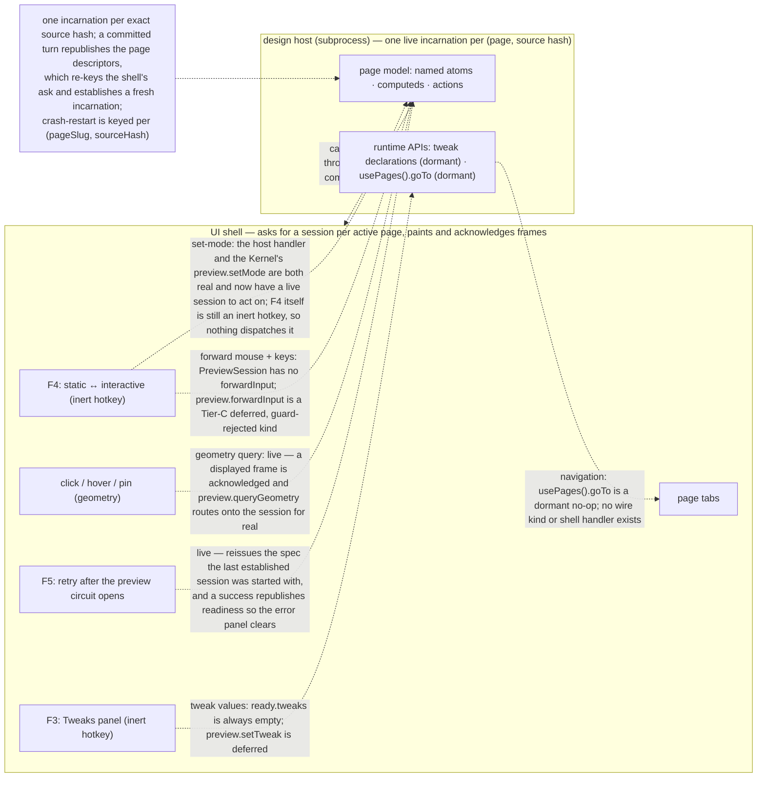

In interactive mode the design stops being a picture: buttons fire, tabs switch, dialogs open, inputs accept typing. Designs are Reatom-first models rendered through `@termcraft/runtime` inside a supervised design host, and that host is now driven end to end in a live run. The session-establishment gap this document used to open on (Gap A) is closed: once trust resolves to `trusted` the Kernel enables the preview machine (`enablePreviewIfTrusted`, `disabled → idle`), the shell's own subscriber asks for a session for whichever page the project's page descriptors name as active — keyed on `(pageSlug, sourceHash)`, so a committed turn that rewrites that page re-keys the ask rather than leaving the old source on screen — the Kernel establishes it through the host supervisor and moves the machine to `live`, and its frames stream back through the composed Kernel to the shell, which paints them and acknowledges each displayed frame. Readiness is now announced as a real event of kind `preview.sessionReady` (carrying the router's own live incarnation identity, read rather than minted) and not merely as an internal machine transition, which is what lets the UI's preview model reach `ready` and leave a `failed` state at all. **What is still not functional is the set of interactive channels layered on top of that session** — the mode toggle, input forwarding, tweaks, and page navigation — each blocked by its own specific, named gap below. Geometry-authorised hover/selection/pins are no longer blocked upstream: a live session and an acknowledged frame both exist, so the round trip can complete. The recovery path is live now as well — a preview that stops after repeated host failures opens a circuit the shell can actually clear, instead of an error panel telling the user to take an action nothing was bound to. This document shows what is meant to cross the `PreviewSession` boundary, what stays private to the page model, and exactly which channels are live versus still dormant.

## Walkthrough

1. Mode toggle: `PreviewSession.setMode()` sends a correlated `set-mode` request over the wire, and the facade's `interactionMode` changes only once the host's accepted response echoes the requested mode back — response-driven, never optimistic. The host-side handler (`handleSetMode`) is implemented end-to-end at the protocol layer. What is *not* yet functional is driving it from the shell: the `F4` hotkey is registered but INERT (`preview.interact` in the UI action registry carries `execution: { kind: "inert" }`), so pressing it does nothing. The Kernel-side half is real (fix-bundle Task 10, spec §2.3): a dispatched `preview.setMode` routes onto `context.previewSessionCommands.setMode` — the retired `blockedBySessionReadback` no-op backstop is gone — and it now has a live session to act on, so the only thing missing on this channel is a dispatcher for the hotkey. The runtime-side `interactionModeAtom` a page reads still has no production writer, so it sits at its MVP default (`static`).
2. Input forwarding and static-mode selection. In static mode input is meant to never be forwarded — the shell interprets it instead, so clicks select elements. In interactive mode the shell is meant to forward mouse and keyboard input to the design host (keeping its own global-tier keys and `Esc` layers), so real handlers, focus traversal, and typing behave as the real application would. **Neither is functional today**: `PreviewSession` — both the host facade (`host/supervisor/types.ts`) and the Kernel-facing `core/ports` port — exposes only `resize`/`setMode`/`setTheme`/`query`/`retry`/`close`, no `forwardInput`; the host's protocol state machine accepts no `input-key`/`input-click`/`input-mousemove` control kind in either phase; and `preview.forwardInput` exists only as a Tier-C DEFERRED command kind that the capability guard rejects unconditionally with `CAPABILITY_UNAVAILABLE`. A historical mount's `set-mode` request is still refused by the host with a typed `HISTORICAL_PREVIEW_READ_ONLY` response, so a historical session can never flip into `interactive`; `preview.selectHistorical` is additionally out of MVP scope in the Kernel (no Git port wired into `KernelDeps`).
   - *Geometry, pins, and hover:* this channel IS live now. The UI wires the full pipeline (`ui/preview/model/interaction.ts` builds a latest-wins geometry request path that dispatches `preview.queryGeometry`, plus hover/select/pin bookkeeping), `acknowledgeDisplay` is wired to a real `Kernel`-owned frame-token ledger (phase-8 Task 16) and the Workspace acknowledges each frame it actually renders, and the Kernel's `preview.queryGeometry` handler verifies that token and routes onto `context.previewSessionCommands.queryGeometry` for real (fix-bundle Task 10). With a live session established, all three halves meet — see `flows/pins-and-selection.md` for what each query resolves into. `F3` (Tweaks) against **Current design** remains an inert hotkey.
   - *Retry after the circuit opens:* live too, and the one recovery the shell offers once a preview has stopped. Two halves had to close for it to work at all. First, the circuit can now actually open: when a session-establishing host call comes back with the typed "restart budget exhausted" refusal, the Kernel applies its own circuit-open transition and publishes a `preview.circuitOpened` carrying the page, the source hash, the final failure, and a retry-capability state read live off the machine — before this, nothing in production ever applied that transition, so the one phase `preview.retry`'s capability guard admits was unreachable and the command could never be issued. Second, a retry now has something to reissue: the session spec is remembered when a session is established, so the retry re-establishes the SAME page, source, size and theme rather than refusing for want of a remembered spec. On success it publishes the real readiness pair — `preview.sessionReady` then `preview.sourceChanged`, the same pair (and the same shared builder) the establishing path uses — because a recovery that published only the internal machine transition left the UI pinned on its error panel while genuinely recovered frames streamed behind it. The shell's half is bound as well: `F5` dispatches `preview.retry` naming the circuit-open session the mirror is holding (never a freshly minted id), the error panel names that key instead of a generic "press retry", and the status bar advertises the key only while the circuit is actually open. The design specifies the affordance in prose but names no key for it, so `F5` is a documented divergence continuing the preview pane's own F-key vocabulary.
     - *Failure:* a retry with no remembered spec — no session was ever established in this process — recovers the preview machine to `failed` instead of stranding it mid-start, so a later page selection can establish normally. A re-establishment that fails publishes its machine transition but no `preview.failed`: that payload needs a page identity this command's own payload does not carry, a narrow documented gap rather than a fabricated payload.
3. No bespoke variable syntax exists: writable state lives in named atoms, derivation in computeds, and handlers/grouped transitions in named actions, all re-exported from Reatom under the `@termcraft/runtime` facade. A page's default export must be a `reatomComponent(...)` call — the Gate's page-contract check enforces this structurally before the page is ever executed. The render path is not continuously live: a frame is (re-)emitted only at mount and on an explicit `resize` — the host state machine's two `emitFrame` call sites are `handleMount` and `handleResize`, never an autonomous re-render loop — so "an animated design animates in static mode too" describes v1 behavior, not what the host does today. The supervisor keeps only the latest pending full frame — a capacity-1, identity-and-sequence-guarded broker per incarnation, relayed across automatic restarts so the UI keeps one stable frame stream; that stream now flows through the composed Kernel (`currentPreview()` → `KernelPort.preview().frames`) to the shell's frame view.
4. Exactly two page behaviors are meant to cross the host boundary as runtime APIs, and both remain dormant:
   - **Tweaks** — a page is meant to export tweak declarations (toggle, select, text) that the host reports to the shell so the Tweaks panel can render them and push edited values back. `defineTweaks` exists and records a declaration's shape, but it is dormant: there is no scoped reactive tweak state, and the host's `ready` response hardcodes its `tweaks` field to an empty array (`ReadyBody.tweaks: readonly never[]`, documented "empty in MVP"). No `set-tweak` wire kind exists in the protocol, and `preview.setTweak` is a Tier-C deferred command kind.
   - **Navigation** — a runtime navigation call is meant to emit a page-navigation event through the host protocol so the shell can switch tabs. `usePages()` exists and returns the design-fixed `{ goTo(slug) }` shape (design §5.5) backed by a named Reatom action, but `goTo` is a no-op: no protocol control kind and no shell tab handler exist anywhere, so calling it records/emits nothing observable.
5. Tweak state and all other prototype state is meant to be session runtime state, reset whenever the host respawns. The host mechanism this depends on is real: each incarnation is verified against one exact source hash at mount (a mismatch is a fatal, typed `SOURCE_HASH_MISMATCH`), and the ready-phase state machine accepts no second `mount` — so loading a different source is only possible by starting an entirely new incarnation, never by reusing the live one. The Kernel drives establishing those incarnations: its preview-select path (`preview.selectPage`/`preview.selectCurrent` → `HostSupervisorPort.preview`) composes a fresh session for a page's *current* source, moves the preview machine through `beginStart`/`beginSwitch` → `sessionReady`, and publishes a `preview.sessionReady` event plus a `preview.sourceChanged` naming the page and source hash. The shell is what asks: its subscriber re-dispatches whenever the active page's `(pageSlug, sourceHash)` key changes, which is exactly what a committed turn's own `page.descriptorsChanged` produces (`flows/generation-turn.md`) — so an edit to the page already on screen establishes a new incarnation against the new bytes rather than leaving the stale one rendering. The crash-restart machinery (step 7) only ever re-spawns the SAME `(pageSlug, sourceHash)`; a source change is a different key and a different incarnation. (Session resume is always fresh — a resumed session does not rehydrate prior live-session state.) The specific reasoning for why a live process can't just re-import a changed path (a stale module-cache read that a query-string cache-bust doesn't fix) is design-level justification, not something asserted in code comments.
6. Focus traversal inside the design is meant to be the UI framework's own focus system, driven by forwarded `Tab`/`Shift+Tab` — the shell would not maintain a parallel focus model for design *content*. The shell does now own a focus model (`ui/workspace/model/focus.ts`: `Tab` toggles composer ↔ preview, plus a layered `Esc` stack), but forwarding `Tab` *into* design content still depends on input forwarding (step 2), which does not exist — so design-content focus traversal is still unwired.
7. Failure branch: design code that crashes or hangs mid-interaction takes down only the host, and this **is** implemented. `HostSupervisor` wraps each incarnation, wires its post-ready fatal outcome to a pure `RestartPolicy` keyed per `(pageSlug, sourceHash)`, and on a budgeted failure closes the old incarnation, waits a base-2 backoff, and respawns; a deterministic/hostile failure (or an exhausted budget) opens the circuit instead, with a manual `retry()` to clear it. The relay in front of the frame broker means a UI consumer keeps one stable frame stream across that automatic restart. The shell, chat, and stored state are untouched by any of this — none of them are wired to a host incarnation's lifecycle. That exhausted budget now reaches the user rather than stopping at the host boundary: the Kernel folds the host's typed refusal into its own circuit-open phase and announces it, the Workspace paints the "preview stopped after repeated failures" panel with the real cause, and the key it names re-runs establishment for the same page (step 2's retry bullet).
8. Failure branch: timers or randomness that would break a deterministic export render. The Gate's determinism lint flags a raw `setTimeout`/`setInterval`/`setImmediate`/`requestAnimationFrame`, a `Date.now()`/`performance.now()`, or a `Math.random()` as a non-fatal warning at its source position. Feeding that warning back to the agent is now **implemented**: on a Gate rejection the run-turn spine folds the two determinism warning kinds (`unguarded-timer`, `unguarded-randomness`) into the RETRY attempt's prompt (`foldGateDiagnosticsIntoPrompt`/`appendPromptFold`, wired in `run-turn.ts` behind a freshness barrier so only the immediately-following attempt consumes them). What remains v1 is the guard-aware narrowing: the lint itself is unscoped — it warns regardless of whether an `isExport()` guard encloses the call, so a correctly guarded page still gets warned; and only those two determinism kinds are folded, never the three UI-contract warnings (`dropped-id`, `unpointed-element`, `unlisted-navigation`).

## Source anchors

- `src/host/supervisor/model/preview-session.ts` — `createPreviewSession`: the UI-facing facade over one, non-restarting `HostSession`; `forwardInput`/`setTheme`/`setCapabilities`/tweaks remain "intentionally absent," while geometry `query()` was added (blocker B1)
- `src/host/supervisor/types.ts` — the `PreviewSession` contract (`resize`/`setMode`/`query`/`retry`/`close`) and the underlying `HostSession` (`resize`/`setMode`/`ping`/`query`), plus the `RestartPolicy`/`PreviewRelay`/`FrameBroker` restart-loop and frame-delivery contracts; `HostSupervisor.preview()` returns a `SupervisedPreviewSession`
- `src/host/supervisor/model/session.ts` — `createHostSession`: drives one incarnation end to end (bounded outbound `control-queue.ts` and inbound `control-mailbox.ts`)
- `src/host/session/model/host-state-machine.ts` — the host-side protocol state machine; `receiveControlPayload` accepts only `mount`/`shutdown` before ready and `resize`/`set-mode`/`ping`/`query-hit`/`query-rect`/`query-describe`/`query-layout`/`shutdown` once ready — no `input-key`/`input-click`/`input-mousemove`/`set-tweak` kind exists; `handleSetMode` is the real accept/refuse logic including the `HISTORICAL_PREVIEW_READ_ONLY` refusal; its only two `emitFrame` call sites are `handleMount` and `handleResize`
- `src/host/session/types.ts` — `ReadyBody.tweaks: readonly never[]`, documented "empty in MVP (set-tweak is a later phase)"
- `src/host/session/model/source-mount.ts` — `loadPage`: verifies the mounted source against its exact `expectedSourceHash` (typed `SOURCE_HASH_MISMATCH` on mismatch), tying one incarnation to one exact source
- `src/host/supervisor/model/frame-broker.ts` — the capacity-1, identity-and-sequence-guarded latest-wins frame broker per incarnation
- `src/host/supervisor/model/preview-relay.ts` — the capacity-1 relay that re-points at a fresh incarnation across automatic restart, so the UI keeps one stable frame stream
- `src/host/supervisor/model/restart-policy.ts` — the per-`(pageSlug, sourceHash)` restart budget, base-2 backoff, and circuit breaker backing the crash/hang failure branch
- `src/host/supervisor/model/supervisor.ts` — `createHostSupervisor`: wires the restart policy to each incarnation's fatal outcome, respawns on a budgeted failure, opens the circuit otherwise
- `src/core/ports/preview-session.ts` — the Kernel-facing `PreviewSession` port (`resize`/`setMode`/`setTheme`/`query`/`retry`/`close`); `query` carries an explicit `TODO(blocker B1)` — not implemented by `host` at the boundary that declares it
- `src/core/kernel/model/handlers/preview-export.ts` — the `preview` family handlers: `selectPage`/`selectCurrent` establish a live session via `HostSupervisorPort.preview` directly (canonical `sourcePath`, fix-bundle Task 10) and publish `preview.sessionReady` + `preview.sourceChanged` in that order, the readiness event first because the source-change fold only applies while the mirror is already `ready`; `setMode`/`queryGeometry`/`resize`/`setThemeCapabilities`/`close` route onto `context.previewSessionCommands`'s own already-tested methods for real (fix-bundle Task 10, spec §2.3 — the retired `blockedBySessionReadback` no-op backstop is gone); `selectHistorical` is out of MVP scope (no Git port). A host call failing with the typed `HOST_CIRCUIT_OPEN` now applies `kernel.preview.openCircuit` and publishes `preview.circuitOpened` alongside `preview.failed` (`failSession`/`openCircuitEvents`) — the production caller that phase, and therefore `preview.retry`, never had. `handleRetry` publishes every transition that actually applied, and on success publishes the readiness pair through the shared `sessionLiveEvents` builder both session-establishing paths use; on a "no remembered spec" refusal it recovers the machine to `failed` rather than leaving it stranded at `starting`
- `src/core/preview/model/session-commands.ts` — the session router; its `currentPreviewSessionId()`/`currentNonce()` getters are what let the readiness event REPORT the live incarnation identity the router already minted, instead of minting a second one beside it, and `currentSpec()`/`currentSession()` are what a recovered session's own readiness event is built from. `noteSessionEstablished(session, spec?)` now records that spec as the router's private `lastSpec` — the ONE value `retry()` reissues — which is what makes a retry able to re-establish anything at all
- `src/ui/app/model/deps.ts` — the shell's own preview-session ask: a subscriber inside the `runtime` connect hook that dispatches `preview.selectPage` for the mirror's active page, memoised on `(pageSlug, sourceHash)` so an edit to the page already on screen re-asks (the slug alone would not), validating the slug through `parsePageSlug` rather than casting, and clearing the memo on a rejection so a later descriptor change retries
- `src/core/kernel/model/handlers/deferred.ts` — `preview.forwardInput` and `preview.setTweak` are two of the ten Tier-C deferred kinds the capability guard rejects unconditionally
- `src/core/turns/model/prompt.ts` — `foldGateDiagnosticsIntoPrompt`: folds the two determinism warning kinds into a retry attempt's prompt behind a freshness barrier; the three UI-contract warnings are deliberately excluded
- `src/core/turns/model/run-turn.ts` — the run-turn spine (admission → attempt → gate-retry → finalize) that applies the Gate-diagnostics fold on a rejection
- `src/gate/model/lints.ts` — the five `GateWarningKind` lints; `lintDeterminism` flags raw timers/`Date.now`/`performance.now`/`Math.random` UNSCOPED, with no `isExport()` guard-awareness
- `src/gate/model/page-contract.ts` — `checkPageContract`: enforces the default export be a `reatomComponent(...)` call, structurally, before the page executes
- `src/runtime/model/reatom.ts` — re-exports `atom`/`computed`/`action`/`reatomComponent` (and the rest of Reatom's core) under the `@termcraft/runtime` facade
- `src/runtime/model/capabilities.ts` — `defineTweaks` (declared, dormant), `hostModeAtom`/`interactionModeAtom` (host-input atoms with no production writer — the mode atom sits at its `static` default), `themeCapability` (single `dark-default`), `usePages().goTo` (design §5.5's shape, backed by a named no-op action), and the viewport/color atoms
- `src/ui/actions/model/registry.ts` — the UI action registry: `preview.interact` (`F4`) and `preview.tweaks` (`F3`) are registered hotkeys with `execution: { kind: "inert" }` / `inert: true`, while `preview.retry` (`F5`) is a real command-executing entry capability-gated on `preview.retry` — the producer the circuit-open panel's instruction had always lacked, with the file's own comment recording why `F5` and why the design's silence on the key makes it a documented divergence
- `src/ui/mirror/model/mirror.ts`, `src/ui/mirror/types.ts` — the preview slice the shell reads: `preview.circuitOpened` folds into a `circuit-open` phase carrying the session id, the page, the final failure, and whether retry is available; `preview.sessionReady` is the only event that moves it back out, which is why a recovery has to publish that event and not just a machine transition
- `src/ui/app/model/intent.ts` — the effectful half of the retry entry: it reads the circuit-open session id out of that slice and dispatches `preview.retry` with it, returning without dispatching when no circuit is open rather than naming a session that does not exist
- `src/ui/workspace/ui/Workspace.tsx` — the circuit-open presentation: the error panel's next-step line names the bound key, and the status-bar hint row filters that key out unless the preview is actually in `circuit-open`, so no live-looking key is advertised for a command the Kernel would refuse
- `src/ui/preview/ui/ErrorPanel.tsx` — the panel itself (headline / cause / next step), the design's own error-state presentation the circuit-open branch renders through
- `src/ui/app/model/keymap.ts` — the shell's key → intent resolver; hotkeys resolve generically through the registry (which is how `F5` reaches `preview.retry`), but its `KeyIntent` union still has no set-mode or forward-input member, so no key drives interaction-mode or input forwarding
- `src/ui/preview/model/interaction.ts` — the UI's latest-wins geometry/hover/select/pin pipeline (dispatches `preview.queryGeometry`), gated on the display acknowledgement `ui/workspace/ui/Workspace.tsx` now performs for every frame it renders
- `src/ui/kernel/types.ts` — the `KernelPort` and `PreviewSessionHandle`; `acknowledgeDisplay` is the broker-adjacent frame acknowledgement geometry authority depends on
- `src/entrypoint/model/create-shell.ts` — the composition root: adapts the composed `Kernel` to `KernelPort`, streams preview frames through `toPreviewSessionHandle`, and wires `acknowledgeDisplay` to a real frame-token ledger (phase-8 Task 16) — reached in a live run now that `kernel.currentPreview()` becomes non-null
- `src/ui/workspace/model/focus.ts` — the shell's own focus model and layered `Esc` stack: `Tab` toggles composer ↔ preview (design §3.8); forwarding `Tab` into design content is not covered here
- `design/11-interactive-mode.dc.html` — interactive-mode visual states (design authority for the not-yet-functional mode toggle)
- `design/04-tweaks-panel.dc.html` — Tweaks panel visual language (design authority for the dormant tweaks channel)
- `design/22-interactive-pin.dc.html` — interactive-pin visual language (design authority for the unusable geometry/pin channel)
