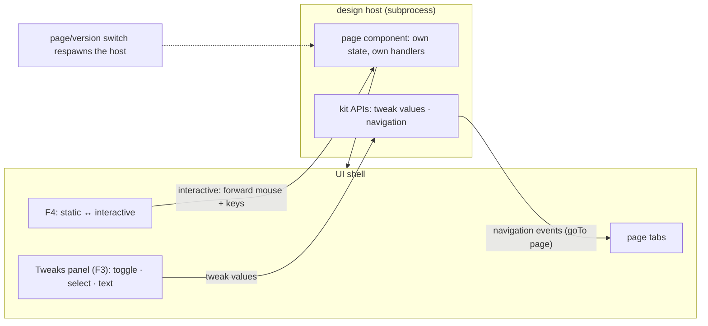

In interactive mode the design stops being a picture: buttons fire, tabs switch, dialogs open, inputs accept typing. Designs are real components, so their behavior is ordinary component state running inside the design host — this document shows what crosses the boundary between the shell and that host, and what stays private to the design.

## Walkthrough

1. Mode toggle: `F4` switches static ↔ interactive. In static mode input is never forwarded — clicks select elements and the design renders its initial frame only. In interactive mode the shell forwards mouse and keyboard input to the design host (keeping its own global-tier keys and `Esc` layers), and the design behaves as the real application would: real handlers, real focus traversal, real typing. Right-click pins keep working mid-flow; `F3` opens Tweaks in either mode.
2. No bespoke variable system exists: everything that "moves" in a prototype is component state private to the design code — `useState`, conditional rendering, controlled inputs. Reactivity is the framework's own re-render, and the host ships a new frame whenever output changes.
3. Exactly two behaviors cross the host boundary, both as kit APIs:
   - **Tweaks** — a page exports its tweak declarations (toggle, select, text); the host reports them to the shell, the Tweaks panel renders them, and flipping a control pushes the value back so the design re-renders with it.
   - **Navigation** — a kit navigation call in design code emits a page-navigation event through the host protocol; the shell switches tabs, exactly as if the designer had clicked the tab.
4. Tweak state and all other prototype state is session runtime state: never written into version files, and reset by the host respawn that page and version switches already perform.
5. Focus traversal inside the design is the UI framework's own focus system, driven by the forwarded `Tab`/`Shift+Tab` — the shell does not maintain a parallel focus model for design content.
6. Failure branch: a navigation call to a page removed since generation → no-op with a quiet notice above the composer.
7. Failure branch: design code that crashes or hangs mid-interaction takes down only the host — the watchdog respawns it and the preview shows an error panel; the shell, chat, and stored state are untouched.
8. Failure branch: timers or randomness outside the export-flag guard → gate warnings fed to the agent next turn (they threaten snapshot determinism, not interactivity).

## Source anchors

- `docs/superpowers/specs/2026-07-13-termcraft-design.md` — §3.5 interactive mode, §5.5 interactivity and kit APIs, §5.6 tweaks, §4.2 the design host and input forwarding, §6.3 lint warnings
- `design/11-interactive-mode.dc.html` — interactive mode states
- `design/04-tweaks-panel.dc.html` — Tweaks panel
- `design/22-interactive-pin.dc.html` — pins during interactive flow
