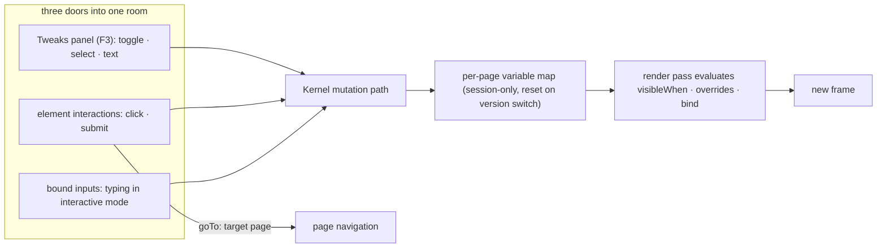

In interactive mode the design stops being a picture: buttons fire, tabs switch, dialogs open, inputs accept typing. Everything that moves reads and writes one per-page variable map — this document shows the three mutation sources, the map, and the render pass that reacts.

## Walkthrough

1. Mode toggle: `F4` switches static ↔ interactive; in interactive mode clicks drive the design instead of selecting; right-click pins keep working mid-flow; `F3` opens Tweaks in either mode.
2. The variable map: one per page, `name → bool | string`, session runtime state — never written into version files, reset on version switch.
3. Implicit variables and initial-value priority: a tweak's default → element-derived initials (input text, tabs' active id, `<id>.visible` defaulting to false) → the type's zero.
4. The four consumers: conditions (`visibleWhen` with truthiness/equals/not), per-element overrides (style/text when a condition holds), interactions (`goTo:`/`open:`/`close:`/`toggle:`/`set:` on click/submit), and bound inputs (typing writes the variable live, Enter fires submit).
5. Element runtime state lives in the same map as auto-variables (`<id>.active`, `<id>.visible`); `open/close/toggle` are pure sugar over `set:<id>.visible` with an implicit `visibleWhen` when the target declares none.
6. All three mutation sources go through the same Kernel code path — tweaks, interactions, bound inputs are three doors into one room.
7. Reactivity is re-render: immediate-mode rendering means every mutation just triggers a new frame; conditions are evaluated during render; no dependency graph.
8. Focus traversal: `Tab` walks elements with `bind` or interactions in document order, `Shift+Tab` reverses.
9. Failure branch: `goTo:` to a page removed since generation → no-op with a quiet notice above the composer.
10. Failure branch: sugar targeting an element with a custom `visibleWhen` → validation warning, agent told to use `set:` directly; variable hygiene (read-never-written / written-never-read) → lint warnings fed to the agent next turn.

## Source anchors

- `docs/superpowers/specs/2026-07-13-termcraft-design.md` — §3.5 interactive mode, §5.5 reactive variable system, §5.6 tweaks, §6.3 hygiene warnings
- `design/11-interactive-mode.dc.html` — interactive mode states
- `design/04-tweaks-panel.dc.html` — Tweaks panel
- `design/22-interactive-pin.dc.html` — pins during interactive flow
