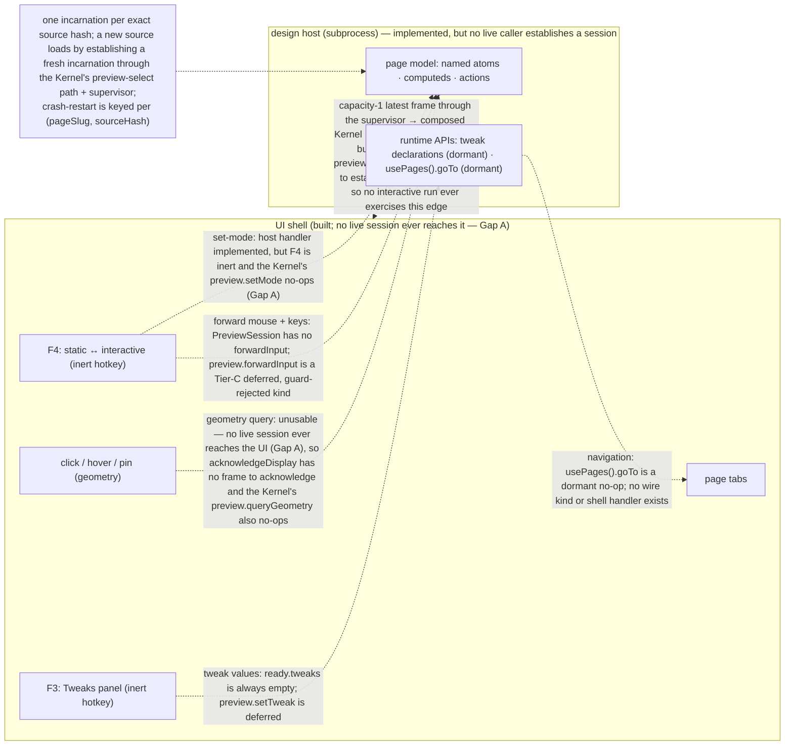

In interactive mode the design stops being a picture: buttons fire, tabs switch, dialogs open, inputs accept typing. Designs are Reatom-first models rendered through `@termcraft/runtime` inside a supervised design host, and the mechanism to drive that host end to end is real code, exercised directly by its own tests: a preview would be established through the Kernel's preview-select path and the host supervisor, and its frames would stream back through the composed Kernel to the built UI shell, which paints whatever it receives. **What is not yet functional in a live interactive run is establishing that session at all** — a pre-existing gap distinct from (and upstream of) the interactive channels this document is otherwise about, narrowed but not closed by fix-bundle Gap A (spec §2.2): `core/kernel/model/handlers/project.ts`'s `enablePreviewIfTrusted` now dispatches `kernel.preview.enable` (`disabled → idle`) once trust resolves to `trusted`, so the Preview state machine no longer stays `disabled` forever through `kernel.dispatch()` alone, and the capability guard now genuinely ADMITS `preview.selectPage`/`preview.selectCurrent`/`preview.selectHistorical`/`preview.close` for a trusted, ready project (`core/capabilities/model/guards.ts`'s `previewFamilyReason`, legal once the machine reaches `idle`/`failed`/`live`). The one blocker that actually remains: nothing in `src/ui` dispatches `preview.selectPage`/`preview.selectCurrent` at all today (verified: no caller under `src/ui`), so the handler that would call `HostSupervisorPort.preview` never runs, and the machine — now reachable at `idle` — never gets driven any further to `live`. The practical consequence is that the Workspace's preview panel shows its no-session state throughout an interactive run — `kernel.currentPreview()` stays `null`, so `KernelPort.preview()` returns `null` and the shell has no frame to paint — even though a page that passes the Gate is validated by a real, separate one-shot smoke render (`flows/generation-turn.md`) and written to canonical storage correctly. What *is* meant to cross the `PreviewSession` boundary once a session is established — the mode toggle, input forwarding, tweaks, navigation, and geometry-authorised pins/hover — is the set of interactive channels this document is about, each blocked today by its own specific, named gap. This document shows what is meant to cross that boundary, what stays private to the page model, and exactly which channels are live versus still dormant, on the understanding that none of them can be observed in a live run until the session-establishment gap above closes first.

## Walkthrough

1. Mode toggle: `PreviewSession.setMode()` sends a correlated `set-mode` request over the wire, and the facade's `interactionMode` changes only once the host's accepted response echoes the requested mode back — response-driven, never optimistic. The host-side handler (`handleSetMode`) is implemented end-to-end at the protocol layer. What is *not* yet functional is driving it from the shell: the `F4` hotkey is registered but INERT (`preview.interact` in the UI action registry carries `execution: { kind: "inert" }`), so pressing it does nothing; and even a dispatched `preview.setMode` command reaches the Kernel handler `blockedBySessionReadback` — a documented no-op (Gap A: `HandlerContext` exposes no getter for the Kernel's own live `PreviewSession`), so no `set-mode` ever reaches a live incarnation. The runtime-side `interactionModeAtom` a page reads still has no production writer, so it sits at its MVP default (`static`).
2. Input forwarding and static-mode selection. In static mode input is meant to never be forwarded — the shell interprets it instead, so clicks select elements. In interactive mode the shell is meant to forward mouse and keyboard input to the design host (keeping its own global-tier keys and `Esc` layers), so real handlers, focus traversal, and typing behave as the real application would. **Neither is functional today**: `PreviewSession` — both the host facade (`host/supervisor/types.ts`) and the Kernel-facing `core/ports` port — exposes only `resize`/`setMode`/`setTheme`/`query`/`retry`/`close`, no `forwardInput`; the host's protocol state machine accepts no `input-key`/`input-click`/`input-mousemove` control kind in either phase; and `preview.forwardInput` exists only as a Tier-C DEFERRED command kind that the capability guard rejects unconditionally with `CAPABILITY_UNAVAILABLE`. A historical mount's `set-mode` request is still refused by the host with a typed `HISTORICAL_PREVIEW_READ_ONLY` response, so a historical session can never flip into `interactive`; `preview.selectHistorical` is additionally out of MVP scope in the Kernel (no Git port wired into `KernelDeps`).
   - *Geometry, pins, and hover:* the UI wires the full pipeline for these (`ui/preview/model/interaction.ts` builds a latest-wins geometry request path that dispatches `preview.queryGeometry`, plus hover/select/pin bookkeeping), but the pipeline is UNUSABLE end to end. `acknowledgeDisplay` is wired to a real `Kernel`-owned frame-token ledger (phase-8 Task 16), but a frame token becomes query-authorising only after acknowledging an actually-displayed frame, and no frame ever reaches the shell in the first place (the opening paragraph's Gap A — `kernel.currentPreview()` stays `null`); the Kernel's own `preview.queryGeometry` handler is also `blockedBySessionReadback` regardless (a narrower, second-order consequence of the same gap). `F3` (Tweaks) against **Current design** is likewise an inert hotkey.
3. No bespoke variable syntax exists: writable state lives in named atoms, derivation in computeds, and handlers/grouped transitions in named actions, all re-exported from Reatom under the `@termcraft/runtime` facade. A page's default export must be a `reatomComponent(...)` call — the Gate's page-contract check enforces this structurally before the page is ever executed. The render path is not continuously live: a frame is (re-)emitted only at mount and on an explicit `resize` — the host state machine's two `emitFrame` call sites are `handleMount` and `handleResize`, never an autonomous re-render loop — so "an animated design animates in static mode too" describes v1 behavior, not what the host does today. The supervisor keeps only the latest pending full frame — a capacity-1, identity-and-sequence-guarded broker per incarnation, relayed across automatic restarts so the UI keeps one stable frame stream; that stream now flows through the composed Kernel (`currentPreview()` → `KernelPort.preview().frames`) to the shell's frame view.
4. Exactly two page behaviors are meant to cross the host boundary as runtime APIs, and both remain dormant:
   - **Tweaks** — a page is meant to export tweak declarations (toggle, select, text) that the host reports to the shell so the Tweaks panel can render them and push edited values back. `defineTweaks` exists and records a declaration's shape, but it is dormant: there is no scoped reactive tweak state, and the host's `ready` response hardcodes its `tweaks` field to an empty array (`ReadyBody.tweaks: readonly never[]`, documented "empty in MVP"). No `set-tweak` wire kind exists in the protocol, and `preview.setTweak` is a Tier-C deferred command kind.
   - **Navigation** — a runtime navigation call is meant to emit a page-navigation event through the host protocol so the shell can switch tabs. `usePages()` exists and returns the design-fixed `{ goTo(slug) }` shape (design §5.5) backed by a named Reatom action, but `goTo` is a no-op: no protocol control kind and no shell tab handler exist anywhere, so calling it records/emits nothing observable.
5. Tweak state and all other prototype state is meant to be session runtime state, reset whenever the host respawns. The host mechanism this depends on is real: each incarnation is verified against one exact source hash at mount (a mismatch is a fatal, typed `SOURCE_HASH_MISMATCH`), and the ready-phase state machine accepts no second `mount` — so loading a different source is only possible by starting an entirely new incarnation, never by reusing the live one. The Kernel now drives establishing those incarnations: its preview-select path (`preview.selectPage`/`preview.selectCurrent` → `HostSupervisorPort.preview`) composes a fresh session for a page's *current* source and moves the preview machine through `beginStart`/`beginSwitch` → `sessionReady`. The crash-restart machinery (step 7) only ever re-spawns the SAME `(pageSlug, sourceHash)`; a source change is a different key and a different incarnation. (Session resume is always fresh — a resumed session does not rehydrate prior live-session state.) The specific reasoning for why a live process can't just re-import a changed path (a stale module-cache read that a query-string cache-bust doesn't fix) is design-level justification, not something asserted in code comments.
6. Focus traversal inside the design is meant to be the UI framework's own focus system, driven by forwarded `Tab`/`Shift+Tab` — the shell would not maintain a parallel focus model for design *content*. The shell does now own a focus model (`ui/workspace/model/focus.ts`: `Tab` toggles composer ↔ preview, plus a layered `Esc` stack), but forwarding `Tab` *into* design content still depends on input forwarding (step 2), which does not exist — so design-content focus traversal is still unwired.
7. Failure branch: design code that crashes or hangs mid-interaction takes down only the host, and this **is** implemented. `HostSupervisor` wraps each incarnation, wires its post-ready fatal outcome to a pure `RestartPolicy` keyed per `(pageSlug, sourceHash)`, and on a budgeted failure closes the old incarnation, waits a base-2 backoff, and respawns; a deterministic/hostile failure (or an exhausted budget) opens the circuit instead, with a manual `retry()` to clear it. The relay in front of the frame broker means a UI consumer keeps one stable frame stream across that automatic restart. The shell, chat, and stored state are untouched by any of this — none of them are wired to a host incarnation's lifecycle.
8. Failure branch: timers or randomness that would break a deterministic export render. The Gate's determinism lint flags a raw `setTimeout`/`setInterval`/`setImmediate`/`requestAnimationFrame`, a `Date.now()`/`performance.now()`, or a `Math.random()` as a non-fatal warning at its source position. Feeding that warning back to the agent is now **implemented**: on a Gate rejection the run-turn spine folds the two determinism warning kinds (`unguarded-timer`, `unguarded-randomness`) into the RETRY attempt's prompt (`foldGateDiagnosticsIntoPrompt`/`appendPromptFold`, wired in `run-turn.ts` behind a freshness barrier so only the immediately-following attempt consumes them). What remains v1 is the guard-aware narrowing: the lint itself is unscoped — it warns regardless of whether an `isExport()` guard encloses the call, so a correctly guarded page still gets warned; and only those two determinism kinds are folded, never the three UI-contract warnings (`dropped-id`, `unpointed-element`, `unlisted-navigation`).

## Source anchors

- `src/host/supervisor/model/preview-session.ts` — `createPreviewSession`: the UI-facing facade over one, non-restarting `HostSession`; `forwardInput`/`setTheme`/`setCapabilities`/tweaks remain "intentionally absent," while geometry `query()` was added (blocker B1)
- `src/host/supervisor/types.ts` — the `PreviewSession` contract (`resize`/`setMode`/`query`/`retry`/`close`) and the underlying `HostSession` (`resize`/`setMode`/`ping`/`query`), plus the `RestartPolicy`/`PreviewRelay`/`FrameBroker` restart-loop and frame-delivery contracts; `HostSupervisor.preview()` returns a `SupervisedPreviewSession`
- `src/host/supervisor/model/session.ts` — `createHostSession`: drives one incarnation end to end (bounded outbound `control-queue.ts` and inbound `control-mailbox.ts`)
- `src/host/session/model/host-state-machine.ts` — the host-side protocol state machine; `receiveControlPayload` accepts only `mount`/`shutdown` before ready and `resize`/`set-mode`/`ping`/`query-hit`/`query-rect`/`query-describe`/`query-layout`/`shutdown` once ready — no `input-key`/`input-click`/`input-mousemove`/`set-tweak` kind exists; `handleSetMode` is the real accept/refuse logic including the `HISTORICAL_PREVIEW_READ_ONLY` refusal; its only two `emitFrame` call sites are `handleMount` and `handleResize`
- `src/host/session/types.ts` — `ReadyBody.tweaks: readonly never[]`, documented "empty in MVP (set-tweak is a later phase)"
- `src/host/session/model/source-mount.ts` — `loadPage`: verifies the mounted source against its exact `expectedSourceHash` (typed `SOURCE_HASH_MISMATCH` on mismatch), tying one incarnation to one exact source
- `src/host/supervisor/model/frame-broker.ts` — the capacity-1, identity-and-sequence-guarded latest-wins frame broker per incarnation
- `src/host/supervisor/model/preview-relay.ts` — the capacity-1 relay that re-points at a fresh incarnation across automatic restart, so the UI keeps one stable frame stream
- `src/host/supervisor/model/restart-policy.ts` — the per-`(pageSlug, sourceHash)` restart budget, base-2 backoff, and circuit breaker backing the crash/hang failure branch
- `src/host/supervisor/model/supervisor.ts` — `createHostSupervisor`: wires the restart policy to each incarnation's fatal outcome, respawns on a budgeted failure, opens the circuit otherwise
- `src/core/ports/preview-session.ts` — the Kernel-facing `PreviewSession` port (`resize`/`setMode`/`setTheme`/`query`/`retry`/`close`); `query` carries an explicit `TODO(blocker B1)` — not implemented by `host` at the boundary that declares it
- `src/core/kernel/model/handlers/preview-export.ts` — the `preview` family handlers: `selectPage`/`selectCurrent` establish a live session via `HostSupervisorPort.preview`; `setMode`/`queryGeometry`/`resize`/`setThemeCapabilities`/`retry` all route to `blockedBySessionReadback` (Gap A — no session read-back); `selectHistorical` is out of MVP scope (no Git port)
- `src/core/kernel/model/handlers/deferred.ts` — `preview.forwardInput` and `preview.setTweak` are two of the ten Tier-C deferred kinds the capability guard rejects unconditionally
- `src/core/turns/model/prompt.ts` — `foldGateDiagnosticsIntoPrompt`: folds the two determinism warning kinds into a retry attempt's prompt behind a freshness barrier; the three UI-contract warnings are deliberately excluded
- `src/core/turns/model/run-turn.ts` — the run-turn spine (admission → attempt → gate-retry → finalize) that applies the Gate-diagnostics fold on a rejection
- `src/gate/model/lints.ts` — the five `GateWarningKind` lints; `lintDeterminism` flags raw timers/`Date.now`/`performance.now`/`Math.random` UNSCOPED, with no `isExport()` guard-awareness
- `src/gate/model/page-contract.ts` — `checkPageContract`: enforces the default export be a `reatomComponent(...)` call, structurally, before the page executes
- `src/runtime/model/reatom.ts` — re-exports `atom`/`computed`/`action`/`reatomComponent` (and the rest of Reatom's core) under the `@termcraft/runtime` facade
- `src/runtime/model/capabilities.ts` — `defineTweaks` (declared, dormant), `hostModeAtom`/`interactionModeAtom` (host-input atoms with no production writer — the mode atom sits at its `static` default), `themeCapability` (single `dark-default`), `usePages().goTo` (design §5.5's shape, backed by a named no-op action), and the viewport/color atoms
- `src/ui/actions/model/registry.ts` — the UI action registry: `preview.interact` (`F4`) and `preview.tweaks` (`F3`) are registered hotkeys with `execution: { kind: "inert" }` / `inert: true`
- `src/ui/app/model/keymap.ts` — the shell's key → intent resolver; its `KeyIntent` union has no set-mode or forward-input member, so no key drives interaction-mode or input forwarding
- `src/ui/preview/model/interaction.ts` — the UI's latest-wins geometry/hover/select/pin pipeline (dispatches `preview.queryGeometry`), gated on a successful display acknowledgement it can never obtain today because no frame ever arrives to acknowledge (Gap A)
- `src/ui/kernel/types.ts` — the `KernelPort` and `PreviewSessionHandle`; `acknowledgeDisplay` is the broker-adjacent frame acknowledgement geometry authority depends on
- `src/entrypoint/model/create-shell.ts` — the composition root: adapts the composed `Kernel` to `KernelPort`, streams preview frames through `toPreviewSessionHandle`, and wires `acknowledgeDisplay` to a real frame-token ledger (phase-8 Task 16) — moot in a live run today, since `kernel.currentPreview()` never becomes non-null in the first place (Gap A)
- `src/ui/workspace/model/focus.ts` — the shell's own focus model and layered `Esc` stack: `Tab` toggles composer ↔ preview (design §3.8); forwarding `Tab` into design content is not covered here
- `design/11-interactive-mode.dc.html` — interactive-mode visual states (design authority for the not-yet-functional mode toggle)
- `design/04-tweaks-panel.dc.html` — Tweaks panel visual language (design authority for the dormant tweaks channel)
- `design/22-interactive-pin.dc.html` — interactive-pin visual language (design authority for the unusable geometry/pin channel)
