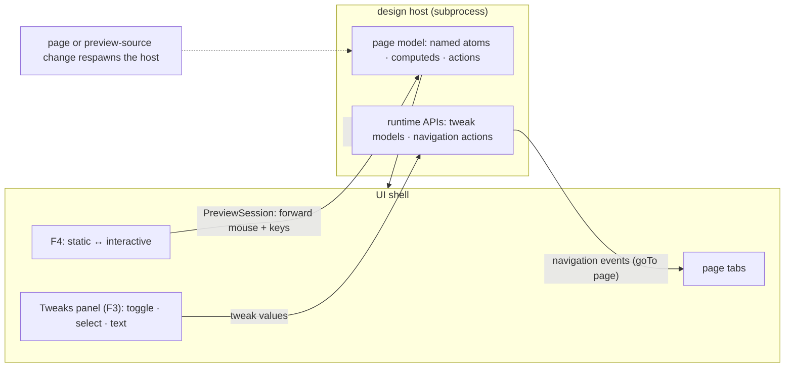

In interactive mode the design stops being a picture: buttons fire, tabs switch, dialogs open, inputs accept typing. Designs are Reatom-first models rendered through `@termcraft/runtime` inside a supervised design host — this document shows what crosses the `PreviewSession` boundary and what stays private to the page model.

## Walkthrough

1. Mode toggle: `F4` sends authoritative `preview.setMode`; `PreviewSession` forwards the accepted change as `set-mode`, and the page's runtime mode atom changes only after the correlated host response. In static mode input is never forwarded — the shell interprets it instead, so clicks select elements. In interactive mode the shell forwards mouse and keyboard input to the design host (keeping its own global-tier keys and `Esc` layers), and the design behaves as the real application would: real handlers, real focus traversal, real typing. The preview stays live in both modes — an animated design animates in static mode too; the modes differ only in where input goes. Right-click pins keep working mid-flow against **Current design**; `F3` opens Tweaks there in either mode. While a read-only historical snapshot is selected, Tweaks and pin mutation are disabled: existing current pins may be overlaid where their ids resolve, but creating pins, reopening pins, or changing pin status remains unavailable until the user returns to **Current design**.
2. No bespoke variable syntax exists: writable state lives in named atoms, derivation in computeds, and handlers/grouped transitions in named actions. `reatomComponent` reads atoms directly; hooks mainly retrieve scoped models from context. The supervisor keeps only the latest pending full frame when output changes.
3. Exactly two page behaviors cross the host boundary, both as runtime APIs:
   - **Tweaks** — a page exports its tweak declarations (toggle, select, text); the host reports them to the shell, the Tweaks panel renders them, and flipping a control pushes the value back so the design re-renders with it.
   - **Navigation** — a runtime navigation call in design code emits a page-navigation event through the host protocol; the shell switches tabs, exactly as if the designer had clicked the tab.
4. Tweak state and all other prototype state is session runtime state: never written into the canonical page source or a historical snapshot. It resets whenever the host respawns for a page switch, historical snapshot selection, return to the exact Current design source from disk, or an apply that replaces the canonical source.
5. Focus traversal inside the design is the UI framework's own focus system, driven by the forwarded `Tab`/`Shift+Tab` — the shell does not maintain a parallel focus model for design content.
6. Failure branch: a navigation action to a page removed since generation → no-op with a quiet notice above the composer.
7. Failure branch: design code that crashes or hangs mid-interaction takes down only the host. `HostSupervisor` applies bounded restart/backoff and opens its circuit after the restart budget; the shell, chat, and stored state are untouched.
8. Failure branch: timers or randomness outside the export-flag guard → gate warnings fed to the agent next turn (they threaten snapshot determinism, not interactivity).

## Source anchors

- `docs/superpowers/specs/2026-07-16-git-backed-page-history-design.md` — historical snapshots are temporary and read-only, Tweaks are disabled while browsing, leaving history returns to the exact current source, and applies replace the canonical source
- `docs/superpowers/specs/2026-07-13-termcraft-design.md` — §3.5 interactive mode, §5.5 interactivity and runtime APIs, §5.6 tweaks, §4.2 the design host and input forwarding, §6.3 lint warnings
- `docs/superpowers/specs/2026-07-16-runtime-api-compatibility-design.md` — Reatom-first page models and runtime capabilities
- `docs/superpowers/specs/2026-07-16-host-supervision-protocol-design.md` — PreviewSession framing, sequencing, and crash-loop control
- `design/11-interactive-mode.dc.html` — interactive mode states
- `design/04-tweaks-panel.dc.html` — Tweaks panel
- `design/22-interactive-pin.dc.html` — pins during interactive flow
