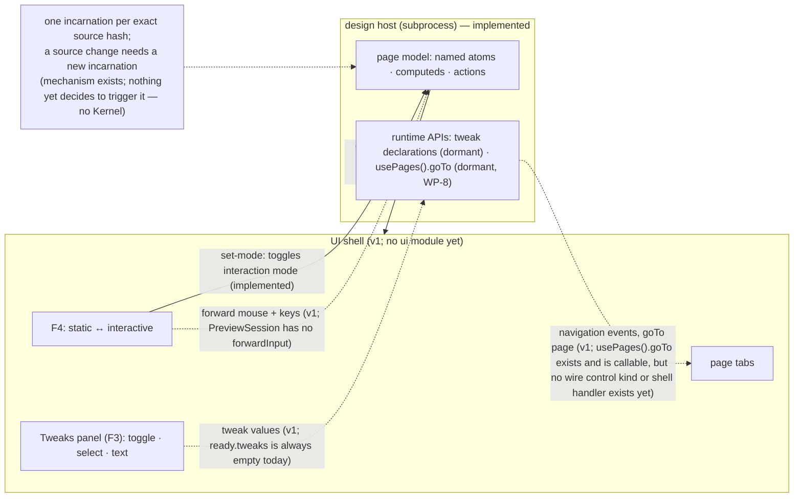

In interactive mode the design stops being a picture: buttons fire, tabs switch, dialogs open, inputs accept typing. Designs are Reatom-first models rendered through `@termcraft/runtime` inside a supervised design host — this document shows what is meant to cross the `PreviewSession` boundary and what stays private to the page model. Today only part of this is built: the host process, its wire protocol, and its crash-recovery machinery exist; the UI shell that would drive them, and the input/tweak/navigation channels the diagram below shows, are still v1 design — see the walkthrough for exactly which arrows are live.

## Walkthrough

1. Mode toggle: `PreviewSession.setMode()` sends a correlated `set-mode` request over the wire, and the facade's `interactionMode` changes only once the host's accepted response echoes the requested mode back — response-driven, never optimistic. This part is implemented end-to-end at the protocol/session layer. What is *not* implemented: the `F4` key itself (no UI shell exists to send it), and the runtime-side `interactionModeAtom` a page reads — its own doc comment states the Kernel is meant to write it from an accepted `ready`/`set-mode` response, and that Kernel wiring doesn't exist yet, so the atom currently just sits at its MVP default (`static`).
2. In static mode input is meant to never be forwarded — the shell interprets it instead, so clicks select elements. In interactive mode the shell is meant to forward mouse and keyboard input to the design host (keeping its own global-tier keys and `Esc` layers), so the design behaves as the real application would: real handlers, real focus traversal, real typing. **None of this is implemented today**: `PreviewSession` and the underlying `HostSession` expose only `resize`/`setMode`/`ping` (plus `retry`/`close` on the facade); the host's own protocol state machine accepts no `input-key`, `input-click`, or `input-mousemove` control kind at all, in either phase. Right-click pins and `F3` Tweaks against **Current design**, and their disablement while browsing a read-only historical snapshot, are likewise UI-shell behavior with no code yet — except the one piece the host protocol already enforces: a historical mount's `set-mode` request is refused with a typed `HISTORICAL_PREVIEW_READ_ONLY` response, so a historical session can never actually flip into `interactive`.
3. No bespoke variable syntax exists: writable state lives in named atoms, derivation in computeds, and handlers/grouped transitions in named actions, all re-exported from Reatom under the `@termcraft/runtime` facade. A page's default export must be a `reatomComponent(...)` call — the Gate's page-contract check enforces this structurally before the page is ever executed. Today's render path itself is not continuously live, though: a frame is (re-)emitted only at mount and on an explicit `resize`, so "an animated design animates in static mode too" describes v1 behavior, not what the host does today. What *is* implemented: the supervisor keeps only the latest pending full frame — a capacity-1, identity-and-sequence-guarded broker per incarnation, relayed across automatic restarts so the UI keeps one stable frame stream.
4. Exactly two page behaviors are meant to cross the host boundary as runtime APIs, and both are v1 today:
   - **Tweaks** — a page is meant to export tweak declarations (toggle, select, text) that the host reports to the shell so the Tweaks panel can render them and push edited values back. `defineTweaks` exists and records a declaration's shape, but it is dormant: there is no scoped reactive tweak state, and the host's `ready` response hardcodes its `tweaks` field to an empty array with a comment noting `set-tweak` is a later phase. No `set-tweak` (or any tweak) wire kind exists in the protocol at all.
   - **Navigation** — a runtime navigation call is meant to emit a page-navigation event through the host protocol so the shell can switch tabs. `usePages()` exists and returns the design-fixed `{ goTo(slug) }` shape (design §5.5) backed by a named Reatom action, but it is dormant like `defineTweaks`: calling `goTo` records/emits nothing observable yet — no protocol control kind or shell handler exists anywhere in the codebase, so the host-protocol emission and shell tab switch remain entirely unbuilt.
5. Tweak state and all other prototype state is meant to be session runtime state, reset whenever the host respawns. The host mechanism this depends on is real: each incarnation is verified against one exact source hash at mount (a mismatch is a fatal, typed `SOURCE_HASH_MISMATCH`), and the ready-phase state machine accepts no second `mount` — so loading a different source is only possible by starting an entirely new incarnation, never by reusing the live one. What is not yet built is the decision to *do* that on a live source edit: `HostSupervisor` already respawns automatically on a **crash** (see step 7), keyed per `(pageSlug, sourceHash)`, but nothing today watches for a canonical-source change during an open preview and requests a fresh incarnation for it — that orchestration is Kernel-level and no Kernel module exists yet. The specific reasoning for why a live process can't just re-import a changed path (a stale module-cache read that a query-string cache-bust doesn't fix) is design-level justification, not something asserted in code comments.
6. Focus traversal inside the design is meant to be the UI framework's own focus system, driven by forwarded `Tab`/`Shift+Tab` — the shell would not maintain a parallel focus model for design content. Since input forwarding does not exist yet (step 2), neither does this.
7. Failure branch: design code that crashes or hangs mid-interaction takes down only the host, and this **is** implemented. `HostSupervisor` wraps each incarnation, wires its post-ready fatal outcome to a pure `RestartPolicy` keyed per `(pageSlug, sourceHash)`, and on a budgeted failure closes the old incarnation, waits a base-2 backoff, and respawns; a deterministic/hostile failure (or an exhausted budget) opens the circuit instead, with a manual `retry()` to clear it. The relay in front of the frame broker means a UI consumer keeps one stable frame stream across that automatic restart. The shell, chat, and stored state are untouched by any of this — none of them are wired to a host incarnation's lifecycle.
8. Failure branch: timers or randomness that would break a deterministic export render. The design spec scopes this warning to timer/randomness use *outside* the export-flag guard (`isExport()`); what is implemented today is unscoped — the Gate's determinism lint flags a raw `setTimeout`/`setInterval`/`setImmediate`/`requestAnimationFrame`, a `Date.now()`/`performance.now()`, or a `Math.random()` as a non-fatal warning at its source position regardless of whether an `isExport()` guard encloses it, so a correctly guarded page still gets warned today. What is v1: the guard-aware narrowing itself, and actually feeding the warning to the agent on its next turn. The backend now accepts a fully assembled prompt for a retry attempt, so the missing piece is squarely Kernel-level — nothing reads a Gate result and folds its warnings into the next attempt's message.

## Source anchors

- `src/host/supervisor/model/preview-session.ts` — `createPreviewSession`: the UI-facing facade over one, non-restarting `HostSession`; its own comment now records blocker B4's decision — `forwardInput`, `setTheme`, `setCapabilities`, and tweaks remain "intentionally absent," but geometry `query()` was added (blocker B1)
- `src/host/supervisor/types.ts` — the UI-facing `PreviewSession` contract (`resize`/`setMode`/`query`/`retry`/`close`) and the underlying `HostSession` it wraps (`resize`/`setMode`/`ping`/`query`), plus the `RestartPolicy`/`PreviewRelay`/`FrameBroker` restart-loop and frame-delivery contracts. `HostSupervisor.preview()` returns a `SupervisedPreviewSession` (the old `PreviewHandle` no longer exists as a separate type — see `supervisor.ts`)
- `src/host/supervisor/model/session.ts` — `createHostSession`: drives one incarnation end to end; every post-ready request now enqueues through the bounded `control-queue.ts` (`HOST_BACKPRESSURED` when full), and unsolicited inbound envelopes drain through `control-mailbox.ts` on a clock-scheduled timer (`CONTROL_BACKPRESSURE` when the consumer falls behind)
- `src/host/session/model/host-state-machine.ts` — the host-side protocol state machine; `receiveControlPayload` accepts only `mount`/`shutdown` before ready and `resize`/`set-mode`/`ping`/`query-hit`/`query-rect`/`query-describe`/`query-layout`/`shutdown` once ready (blocker B1) — no `input-key`, `input-click`, `input-mousemove`, or `set-tweak` kind exists; `handleSetMode` is the real accept/refuse logic, including the `HISTORICAL_PREVIEW_READ_ONLY` refusal for a historical mount; its two `emitFrame` call sites (`handleMount`, `handleResize`) are the only places a frame is emitted, never from an autonomous re-render loop
- `src/host/session/types.ts` — `ReadyBody.tweaks: readonly never[]`, documented "empty in MVP (set-tweak is a later phase)"
- `src/host/session/model/source-mount.ts` — `loadPage`: verifies the mounted source against its exact `expectedSourceHash` (typed `SOURCE_HASH_MISMATCH` on mismatch), the mechanism that ties one incarnation to one exact source and forces a fresh process for any source change
- `src/host/supervisor/model/frame-broker.ts` — the capacity-1, identity-and-sequence-guarded latest-wins frame broker per incarnation
- `src/host/supervisor/model/preview-relay.ts` — the capacity-1 relay that re-points at a fresh incarnation across automatic restart, so the UI keeps one stable frame stream
- `src/host/supervisor/model/restart-policy.ts` — the per-`(pageSlug, sourceHash)` restart budget, base-2 backoff, and circuit breaker backing the crash/hang failure branch
- `src/host/supervisor/model/supervisor.ts` — `createHostSupervisor`: wires the restart policy to each incarnation's fatal outcome, respawns on a budgeted failure, opens the circuit otherwise
- `src/gate/model/lints.ts` — all five `GateWarningKind` warnings are implemented: `lintDeterminism` (`unguarded-timer`, `unguarded-randomness`), `lintDroppedIds` (`dropped-id`, needs a caller-supplied `referencedIds`, skipped when absent), `lintUnpointedElements` (`unpointed-element`, a raw/low-level JSX tag with no `id` prop), and `lintUnlistedNavigation` (`unlisted-navigation`, needs a caller-supplied `listedSlugs`, skipped when absent)
- `src/gate/model/page-contract.ts` — `checkPageContract`: enforces the default export be a `reatomComponent(...)` call, structurally, before the page executes
- `src/runtime/model/reatom.ts` — re-exports `atom`/`computed`/`action`/`reatomComponent` (and the rest of Reatom's core) under the `@termcraft/runtime` facade
- `src/runtime/model/capabilities.ts` — `defineTweaks` (declared, dormant — "the scoped reactive toggle/select/text values ... land with the phase-7 UI"), `hostModeAtom`/`interactionModeAtom` (declared host-write targets with no writer yet), `themeCapability` (always resolves the single `dark-default` theme), `usePages` (design §5.5's `usePages().goTo(slug)` — declared, dormant, backed by a named no-op action; WP-8)
- `docs/superpowers/specs/2026-07-16-host-supervision-protocol-design.md` — §3.2 the full target `PreviewSession` interface (`forwardInput`, `setTweak`, `setTheme`, `query`) and §7 the `input-key`/`input-click`/`input-mousemove`/`query-*`/`set-tweak` wire kinds — none of this is implemented yet
- `docs/superpowers/specs/2026-07-13-termcraft-design.md` — §3.5 interactive mode, §5.5 interactivity and runtime APIs, §5.6 tweaks, §4.2 the design host and input forwarding, §6.3 lint warnings — authority for the UI-shell side of this flow (`F4`/`F3`/tabs, focus traversal, the module-cache-staleness reasoning for respawn) which has no code yet
- `docs/superpowers/specs/2026-07-16-runtime-api-compatibility-design.md` — the navigation runtime API's `usePages().goTo(slug)` shape now has a dormant declaration in `src/runtime` (WP-8); the host-protocol control kind and shell handler it needs remain unimplemented
- `docs/superpowers/specs/2026-07-16-git-backed-page-history-design.md` — historical snapshots are temporary and read-only, Tweaks/pin-mutation disabled while browsing, leaving history returns to the exact current source, and applies replace the canonical source — the UI-level behavior has no code yet; the one piece already enforced at the protocol layer (`HISTORICAL_PREVIEW_READ_ONLY`) is anchored above
- `design/11-interactive-mode.dc.html` — interactive mode states (visual language for the not-yet-built UI shell)
- `design/04-tweaks-panel.dc.html` — Tweaks panel (visual language for the not-yet-built UI shell)
- `design/22-interactive-pin.dc.html` — pins during interactive flow (visual language for the not-yet-built UI shell)
