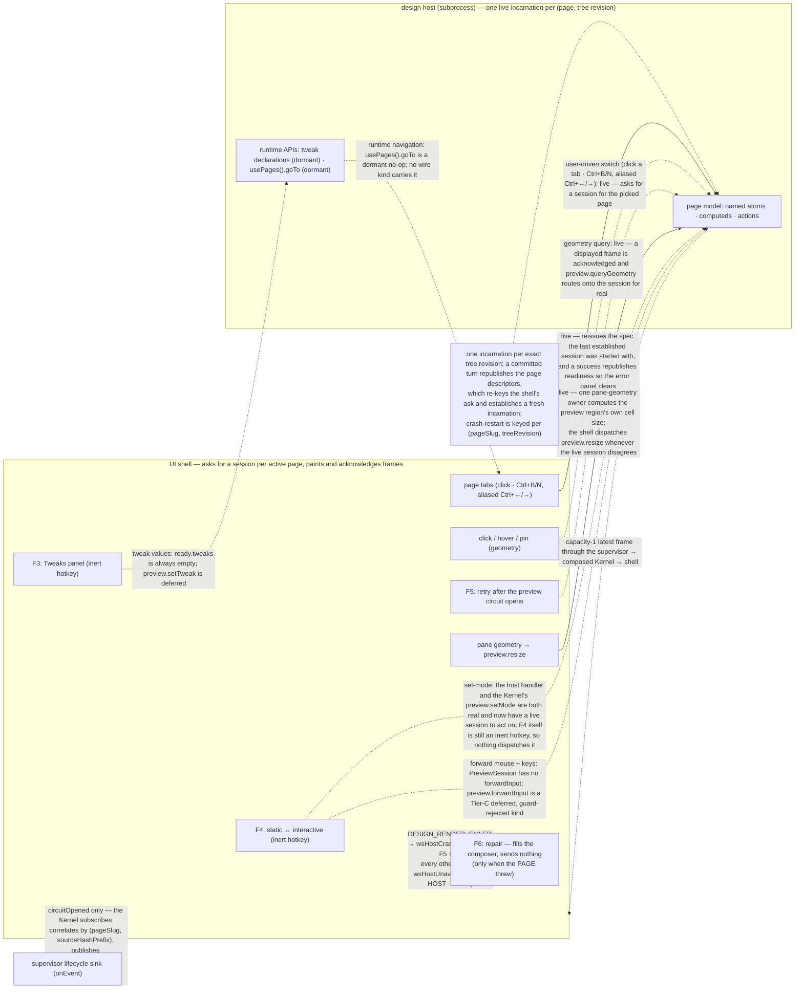

In interactive mode the design stops being a picture: buttons fire, tabs switch, dialogs open, inputs accept typing. Designs are Reatom-first models rendered through `@termcraft/runtime` inside a supervised design host, and that host is now driven end to end in a live run. The session-establishment gap this document used to open on (Gap A) is closed: once trust resolves to `trusted` the Kernel enables the preview machine (`enablePreviewIfTrusted`, `disabled → idle`), the shell's own subscriber asks for a session for whichever page the project's page descriptors name as active — keyed on `(pageSlug, treeRevision)`, so a committed turn that rewrites anything that page renders from, its own entry file or a shared module three pages import, re-keys the ask rather than leaving the old closure on screen — the Kernel establishes it through the host supervisor and moves the machine to `live`, and its frames stream back through the composed Kernel to the shell, which paints them and acknowledges each displayed frame. Readiness is now announced as a real event of kind `preview.sessionReady` (carrying the router's own live incarnation identity, read rather than minted) and not merely as an internal machine transition, which is what lets the UI's preview model reach `ready` and leave a `failed` state at all. **What is still not functional is the set of interactive channels layered on top of that session** — the mode toggle, input forwarding, tweaks, and *runtime-driven* page navigation — each blocked by its own specific, named gap below. Page switching by the USER is live as of 2026-07-27 (click a tab, or `Ctrl+B`/`Ctrl+N`, aliased to `Ctrl+←`/`Ctrl+→` — see `page.prev`/`page.next` on why the arrow chord alone was dead on the maintainer's terminal); what stays dormant is a page asking to navigate from inside the design. Geometry-authorised hover/selection/pins are no longer blocked upstream: a live session and an acknowledged frame both exist, so the round trip can complete. The recovery path is live now as well — a preview that stops after repeated host failures opens a circuit the shell can actually clear, instead of an error panel telling the user to take an action nothing was bound to. The pane-resize channel is live too, and driven by the shell itself rather than left for the host to guess at: the shell computes the preview region's own cell size and dispatches `preview.resize` whenever the live session disagrees with it, so a design fills the pane it is painted into instead of a stale or default size. This document shows what is meant to cross the `PreviewSession` boundary, what stays private to the page model, and exactly which channels are live versus still dormant.

## Walkthrough

1. Mode toggle: `PreviewSession.setMode()` sends a correlated `set-mode` request over the wire, and the facade's `interactionMode` changes only once the host's accepted response echoes the requested mode back — response-driven, never optimistic. The host-side handler (`handleSetMode`) is implemented end-to-end at the protocol layer. What is *not* yet functional is driving it from the shell: the `F4` hotkey is registered but INERT (`preview.interact` in the UI action registry carries `execution: { kind: "inert" }`), so pressing it does nothing. The Kernel-side half is real (fix-bundle Task 10, spec §2.3): a dispatched `preview.setMode` routes onto `context.previewSessionCommands.setMode` — the retired `blockedBySessionReadback` no-op backstop is gone — and it now has a live session to act on, so the only thing missing on this channel is a dispatcher for the hotkey. The runtime-side `interactionModeAtom` a page reads still has no production writer, so it sits at its MVP default (`static`).
2. *Resize (live).* The shell owns the only number that decides how big a design is: `previewRegionSize(terminal, fullscreen)` returns the actual content rectangle — width is `previewPaneWidth(terminal, fullscreen)` (the terminal's own width in fullscreen, else minus the chat column) minus the pane's own two border columns; height is the terminal's height minus the status bar row, the pane's own two border rows, the tab strip row, and `TAB_RULE_ROWS = 2` — the rule row under the tab strip plus the blank gap row before the design starts (design `paneShell`'s `dy = 4`). That size lays out the pane AND is dispatched as `preview.resize` whenever it disagrees with the size the live session was established at, so a design fills the pane it is painted into instead of the `"auto"` preset (80×24) `sizeFromWorkspaceState` falls back to when workspace state names no size. The mirror's `preview.size` reports the ESTABLISHED size and is never updated by a resize (the Kernel's own `preview.resize` handler publishes only `kernel.stateChanged`, no size-carrying event; the host child's same-named handler re-renders and emits a frame, which is a different thing), so the shell memoises per `(previewSessionId, size)` rather than re-reading it. `preview.sessionReady` means the router's session OBJECT exists, not that the spawned child yet accepts control requests — a not-yet-ready incarnation refuses every control request outright — so the shell's very first resize can be dispatched while the incarnation is still negotiating its handshake. The host supervisor buffers exactly that case (Task 11, `host/supervisor/model/supervisor.ts`'s `pendingResize`): last-wins while negotiating, flushed by the incarnation's own ready hook the moment it reaches `ready`, and folded into the NEXT incarnation's own mount spec (never replayed as a stale control request) if this one dies first instead of reaching ready at all — so the race can delay when a design first fills the pane but never silently loses the request. One frame at the establish-time size can still reach the screen before a resize lands; the pane clips it (`overflow="hidden"`), so it is a transient, never an overdraw.
3. Input forwarding and static-mode selection. In static mode input is meant to never be forwarded — the shell interprets it instead, so clicks select elements. In interactive mode the shell is meant to forward mouse and keyboard input to the design host (keeping its own global-tier keys and `Esc` layers), so real handlers, focus traversal, and typing behave as the real application would. **Neither is functional today**: `PreviewSession` carries no `forwardInput` on either side of the boundary — the host facade (`host/supervisor/types.ts`) exposes only `resize`/`setMode`/`query`/`retry`/`close`, and the Kernel-facing `core/ports` port exposes those same five plus `setTheme`, which `host` deliberately does not implement; the host's protocol state machine accepts no `input-key`/`input-click`/`input-mousemove` control kind in either phase; and `preview.forwardInput` exists only as a Tier-C DEFERRED command kind that the capability guard rejects unconditionally with `CAPABILITY_UNAVAILABLE`. A historical mount's `set-mode` request is still refused by the host with a typed `HISTORICAL_PREVIEW_READ_ONLY` response, so a historical session can never flip into `interactive`; `preview.selectHistorical` is additionally out of MVP scope in the Kernel (no Git port wired into `KernelDeps`).
   - *Geometry, pins, and hover:* this channel IS live now. The UI wires the full pipeline (`ui/preview/model/interaction.ts` builds a latest-wins geometry request path that dispatches `preview.queryGeometry`, plus hover/select/pin bookkeeping), `acknowledgeDisplay` is wired to a real `Kernel`-owned frame-token ledger (phase-8 Task 16) and the Workspace acknowledges each frame it actually renders, and the Kernel's `preview.queryGeometry` handler verifies that token and routes onto `context.previewSessionCommands.queryGeometry` for real (fix-bundle Task 10). With a live session established, all three halves meet — see `flows/pins-and-selection.md` for what each query resolves into. `F3` (Tweaks) against **Current design** remains an inert hotkey.
   - *Retry after the circuit opens:* live too, and the one recovery the shell offers once a preview has stopped. Two halves had to close for it to work at all. First, the circuit can now actually open: when a session-establishing host call comes back with the typed "restart budget exhausted" refusal, the Kernel applies its own circuit-open transition and publishes a `preview.circuitOpened` carrying the page, the source hash, the final failure, and a retry-capability state read live off the machine — before this, nothing in production ever applied that transition, so the one phase `preview.retry`'s capability guard admits was unreachable and the command could never be issued. Second, a retry now has something to reissue: the session spec is remembered when a session is established, so the retry re-establishes the SAME page, source, size and theme rather than refusing for want of a remembered spec. On success it publishes the real readiness pair — `preview.sessionReady` then `preview.sourceChanged`, the same pair (and the same shared builder) the establishing path uses — because a recovery that published only the internal machine transition left the UI pinned on its error panel while genuinely recovered frames streamed behind it. The shell's half is bound as well: `F5` dispatches `preview.retry` naming the circuit-open session the mirror is holding (never a freshly minted id), the error panel names that key instead of a generic "press retry", and the status bar advertises the key only while the circuit is actually open. The design specifies the affordance in prose but names no key for it, so `F5` is a documented divergence continuing the preview pane's own F-key vocabulary.
     - *A LIVE session's crash-loop reaches the shell too (2026-07-27).* The bullet above covers only the ESTABLISH-time path — the `HostSupervisorPort.preview` call itself refusing. A session that established fine and crash-looped afterwards used to reach nobody at all: `HostSupervisorPort.onEvent` had no production subscriber, so the supervisor latched its circuit open in silence, the mirror stayed `ready`, no frame ever arrived, and the Workspace sat on `preparing preview…` forever. The Kernel now subscribes to that sink and maps `circuitOpened` — and only `circuitOpened`; `backoff` stays a pure diagnostic, because a restart that succeeds must not have flashed an error on the way. Correlation is by `(pageSlug, sourceHashPrefix)` against the spec the live session was established with, so an event belonging to another session is dropped rather than attributed to whatever happens to be live.
     - *Two screens, by whose fault it was.* The same latched circuit means opposite things to the user, so `finalFailure.details.hostFailureCode` carries the failing incarnation's own code and the shell branches on it. `DESIGN_RENDER_FAILED` — the page passed Gate, was mounted, and threw — draws the design's `wsHostCrash` panel, wears the ` HALTED ` chip, and offers `F6 repair`, which fills the composer with a message naming the file, the error and the attempt count and moves focus there; nothing is sent on the user's behalf. Every other code — a spawn failure, a handshake or mount timeout, a broken pipe, a protocol-class rejection — means the host never ran the design, so it draws `wsHostUnavailable` instead: a green ✓ line explicitly clears the page of blame, the chip reads ` NO HOST `, and no repair key is named, advertised or acted on, because no page edit could start a host. An absent code takes the non-blaming branch: accusing the page requires positive evidence that the page is what failed.
     - *Failure:* a retry with no remembered spec — no session was ever established in this process — recovers the preview machine to `failed` instead of stranding it mid-start, so a later page selection can establish normally. A re-establishment that fails publishes its machine transition but no `preview.failed`: that payload needs a page identity this command's own payload does not carry, a narrow documented gap rather than a fabricated payload.
4. No bespoke variable syntax exists: writable state lives in named atoms, derivation in computeds, and handlers/grouped transitions in named actions, all re-exported from Reatom under the `@termcraft/runtime` facade. A page's default export must be a `reatomComponent(...)` call — the Gate's page-contract check enforces this structurally before the page is ever executed. The render path is not continuously live: a frame is (re-)emitted only at mount and on an explicit `resize` — the host state machine's two `emitFrame` call sites are `handleMount` and `handleResize`, never an autonomous re-render loop — so "an animated design animates in static mode too" describes v1 behavior, not what the host does today. The supervisor keeps only the latest pending full frame — a capacity-1, identity-and-sequence-guarded broker per incarnation, relayed across automatic restarts so the UI keeps one stable frame stream; that stream now flows through the composed Kernel (`currentPreview()` → `KernelPort.preview().frames`) to the shell's frame view.
5. Exactly two page behaviors are meant to cross the host boundary as runtime APIs, and both remain dormant:
   - **Tweaks** — a page is meant to export tweak declarations (toggle, select, text) that the host reports to the shell so the Tweaks panel can render them and push edited values back. `defineTweaks` exists and records a declaration's shape, but it is dormant: there is no scoped reactive tweak state, and the host's `ready` response hardcodes its `tweaks` field to an empty array (`ReadyBody.tweaks: readonly never[]`, documented "empty in MVP"). No `set-tweak` wire kind exists in the protocol, and `preview.setTweak` is a Tier-C deferred command kind.
   - **Navigation** — a runtime navigation call is meant to emit a page-navigation event through the host protocol so the shell can switch tabs. `usePages()` exists and returns the design-fixed `{ goTo(slug) }` shape (design §5.5) backed by a named Reatom action, but `goTo` is a no-op: no protocol control kind carries a navigation request and nothing on the host side ever emits one, so calling it records/emits nothing observable. What DID close (2026-07-27) is the other half of the same destination — *user-driven* page switching, which no longer needs the runtime channel at all: clicking a tab, or `Ctrl+B`/`Ctrl+N` (aliased `Ctrl+←`/`Ctrl+→`), switches pages for real (step 5a). A runtime `goTo` landing later would reuse exactly that path.
   - *5a. User-driven page switching (live).* Each tab is its own hit-testable element carrying a left-click handler, and the two keyboard steps resolve through the action registry like every other global-tier hotkey, so they work while the composer holds focus. Both routes land in one `selectPage`, which writes a UI-LOCAL page override, and one derived "effective active page" (`override ?? the Kernel's own activePageSlug`) is what the tab strip, the status-bar page segment, the pin list, the composer attach line and the preview-session ask all read — so a click cannot move the strip without also moving the session. The override exists because only one of the two events that carry the Kernel's active page can announce a CHANGE mid-session — `kernel.snapshot` seeds it on subscribe, and `page.descriptorsChanged`, the other one, carries a closed eight-member `reason` union with no member for "the user picked a tab"; rather than widen a contract-tested union, the Kernel learns the choice through `preview.selectPage` itself, whose handler persists it as machine-local workspace state — which is what the next project open reads back, and what makes every later descriptor publish agree with the tab the user is on. The override retires by either of two routes, and they are deliberately not interchangeable. Kernel truth retires it UNCONDITIONALLY: when the Kernel publishes an active slug of its own — identical (it caught up) or different (a `pages.json` active-page effect on apply, which per §6.2 wins) — that slug outranks whatever the pick was, so there is nothing to compare against. A terminal refusal of the switch's own `preview.selectPage` retires it too, but only when the pick still on screen is the one that dispatch was made for: two quick clicks leave two dispatches in flight, and the first one's refusal must not wipe the second, still-pending pick. The keyboard steps stop at the ends of the strip rather than wrapping, and neither key is drawn in the status bar — the design names no page key at all, so this is a flagged design extension, not a transcription. *Failure:* an untrusted (read-only) project keeps the preview machine `disabled`, so the `preview.selectPage` behind the switch is refused and nothing is persisted. The strip does not stay on the page that was refused: the refusal retires the pick, the effective slug drops back to the Kernel's own page, and every region of the shell agrees again on the page actually being previewed — a switch that did not happen must never keep marking a tab. So until trust is granted the tab marks the picked page only for as long as the dispatch is in flight, and the cleared memo lets a later descriptor change re-ask once the guard's precondition actually holds.
6. Tweak state and all other prototype state is meant to be session runtime state, reset whenever the host respawns. The host mechanism this depends on is real: at mount the incarnation walks the page's whole CLOSURE — its entry plus every tree file that entry transitively imports — and verifies each member's bytes against the tree inventory the mount named, so a shared module whose bytes drifted is a fatal, typed `SOURCE_HASH_MISMATCH` exactly like the entry's own drift would be; and the ready-phase state machine accepts no second `mount` — so loading a different design is only possible by starting an entirely new incarnation, never by reusing the live one. Before that closure's entry is ever `import()`ed — the first point untrusted page code can run at all — the child denies the eval/Function/Worker family of dynamic-code capabilities in its OWN realm (`capability-denial.ts`'s `denyDynamicCodeCapability()`, wired as the first statements of the `loadPage` DEPENDENCY the child hands `createHostSession` — `host/session/model/entry.ts`, not inside `loadPage` itself, so it fires on the first real `mount` envelope rather than at boot): a runtime backstop for the design §5.8 ban that closes every spelling reaching those objects, including ones the Gate's token scan cannot see textually (an alias, a computed key, a `constructor.constructor` chain). It does not reach an aliased `require`, a separate, still-open gap (`docs/superpowers/red-debt.md`). The incarnation is KEYED on `(pageSlug, treeRevision)` — `computeTreeRevision` over the sorted tree inventory, the same tree the mount verifies against — so the key is now exactly as wide as the closure it verifies. It was `(pageSlug, sourceHash)`, the ENTRY file's own hash, until design-tree phase 2 Task 10, and that was strictly coarser than what a page renders from: an edit confined to a shared module moved no key, so `preview()` returned the LIVE child, whose module registry still held the old module, and nothing re-mounted for the rest of the run. `sourceHash` stays on the spec, and stays the entry's own digest — the mount verifies it against the entry's inventory row — because verifying a mount and identifying a session are different questions. The honest cost of the wider key is stated rather than hidden: after ANY tree change the active page's preview child respawns (spawn + handshake + mount), which is exactly what an entry-file edit already cost, now applied to a wider set of edits; plan 3's warm spare and in-process re-mount are what make that cheap, not what make it correct. The Kernel drives establishing those incarnations: its preview-select path (`preview.selectPage`/`preview.selectCurrent` → `HostSupervisorPort.preview`) composes a fresh session for a page's *current* source, moves the preview machine through `beginStart`/`beginSwitch` → `sessionReady`, and publishes a `preview.sessionReady` event plus a `preview.sourceChanged` naming the page and source hash. The shell is what asks: its subscriber re-dispatches whenever the active page's `(pageSlug, treeRevision)` key changes, and the revision is carried on `page.descriptorsChanged` itself for exactly that purpose (`flows/generation-turn.md`) — so an edit to anything that page renders from establishes a new incarnation against the new bytes rather than leaving the stale one rendering. The crash-restart machinery (step 8) only ever re-spawns the SAME `(pageSlug, treeRevision)`; a tree change is a different key and a different incarnation. (Session resume is always fresh — a resumed session does not rehydrate prior live-session state.) The specific reasoning for why a live process can't just re-import a changed path (a stale module-cache read that a query-string cache-bust doesn't fix) is design-level justification, not something asserted in code comments.
   - *The displaced incarnation is now retired, and the shell follows the successor (2026-07-27).* Re-keying establishes a new session, but nothing used to close the one it displaced: `setActivePreviewSession` overwrote the Kernel's `activePreview` and walked away. Two consequences, both live-observed. The old host subprocess kept running — every page edit leaked one against the §13 ≤10 global limit, so about ten edits ended in `HOST_CAPACITY` — and, because a relay ends only on close, its frame stream stayed open forever. The shell's frame loop leaves a stream only when that stream ENDS, so it stayed parked on the dead predecessor and no frame from the successor ever arrived: the preview froze on `preparing preview…` for the rest of the run, which is the whole agent-edits-the-page loop dead. The Kernel now closes the session it displaces (identity-guarded — `HostSupervisor.preview` returns the SAME stable session for an unchanged key, and a size/theme change re-selects without a swap; fire-and-forget with a logged failure, because every `HandlerContext` mutator is synchronous by contract). The shell keeps its own half: every Kernel envelope re-checks whether `KernelPort.preview()` still reports the handle the loop is attached to, and returns the iterator when it does not — the SAME exit the loop already handles, so a producer that ever abandons a session again costs one stale frame instead of a frozen preview.
7. Focus traversal inside the design is meant to be the UI framework's own focus system, driven by forwarded `Tab`/`Shift+Tab` — the shell would not maintain a parallel focus model for design *content*. The shell does now own a focus model (`ui/workspace/model/focus.ts`: `Tab` toggles composer ↔ preview, plus a layered `Esc` stack), but forwarding `Tab` *into* design content still depends on input forwarding (step 3), which does not exist — so design-content focus traversal is still unwired.
8. Failure branch: design code that crashes or hangs mid-interaction takes down only the host, and this **is** implemented. `HostSupervisor` wraps each incarnation, wires its post-ready fatal outcome to a pure `RestartPolicy` keyed per `(pageSlug, treeRevision)` — the policy takes an opaque key and follows whatever `supervisor.ts`'s `keyOf` produces — and on a budgeted failure closes the old incarnation, waits a base-2 backoff, and respawns; a deterministic/hostile failure (or an exhausted budget) opens the circuit instead, with a manual `retry()` to clear it. The relay in front of the frame broker means a UI consumer keeps one stable frame stream across that automatic restart. The shell, chat, and stored state are untouched by any of this — none of them are wired to a host incarnation's lifecycle. That exhausted budget now reaches the user rather than stopping at the host boundary, by BOTH routes: the Kernel folds the host's typed refusal into its own circuit-open phase when an establishing call is refused, AND it subscribes to the supervisor's own event sink so a session that crash-loops after it went live is announced too. The Workspace paints one of two designed panels depending on whether the page or the host failed, and the keys each names are the ones that actually act there (step 3's retry bullets).
9. Failure branch: timers or randomness that would break a deterministic export render. The Gate's determinism lint flags a raw `setTimeout`/`setInterval`/`setImmediate`/`requestAnimationFrame`, a `Date.now()`/`performance.now()`, or a `Math.random()` as a non-fatal warning at its source position. Feeding that warning back to the agent is now **implemented**: on a Gate rejection the run-turn spine folds the two determinism warning kinds (`unguarded-timer`, `unguarded-randomness`) into the RETRY attempt's prompt (`foldGateDiagnosticsIntoPrompt`/`appendPromptFold`, wired in `run-turn.ts` behind a freshness barrier so only the immediately-following attempt consumes them). What remains v1 is the guard-aware narrowing: the lint itself is unscoped — it warns regardless of whether an `isExport()` guard encloses the call, so a correctly guarded page still gets warned; and only those two determinism kinds are folded, never the other four (`dropped-id`, `unpointed-element`, `unlisted-navigation`, and `silencing-any` — the `any` annotation a page writes to make a type error go away).

## Source anchors

- `src/host/supervisor/model/preview-session.ts` — `createPreviewSession`: the UI-facing facade over one, non-restarting `HostSession`; `forwardInput`/`setTheme`/`setCapabilities`/tweaks remain "intentionally absent," while geometry `query()` was added (blocker B1)
- `src/host/supervisor/types.ts` — the `PreviewSession` contract (`resize`/`setMode`/`query`/`retry`/`close`) and the underlying `HostSession` (`resize`/`setMode`/`ping`/`query`/`mount`), plus the `RestartPolicy`/`PreviewRelay`/`FrameBroker` restart-loop and frame-delivery contracts; `HostSupervisor.preview()` returns a `SupervisedPreviewSession`. `HostSession.mount(page: MountPageV1)` (design-tree phase 3) lets an already-`ready` incarnation switch to a different page in the SAME tree revision — correlated over the wire like `resize`/`setMode`/`ping`, but nothing in the live Kernel/supervisor path calls it yet; it is exercised only by `session.ts`'s own tests until a later task wires page-switching through it. `HostSession.identity` is a live getter, not a snapshot: `sessionId`/`nonce`/`mode` stay fixed for the incarnation's life, while `pageSlug`/`sourceHash`/`kitApiVersion` track whichever page is CURRENTLY mounted and move on every accepted `mount()`.
- `src/host/supervisor/model/session.ts` — `createHostSession`: drives one incarnation end to end (bounded outbound `control-queue.ts` and inbound `control-mailbox.ts`)
- `src/host/session/model/host-state-machine.ts` — the host-side protocol state machine; `receiveControlPayload` accepts only `mount`/`shutdown` before ready and `resize`/`set-mode`/`ping`/`query-hit`/`query-rect`/`query-describe`/`query-layout`/`shutdown` once ready — no `input-key`/`input-click`/`input-mousemove`/`set-tweak` kind exists; `handleSetMode` is the real accept/refuse logic including the `HISTORICAL_PREVIEW_READ_ONLY` refusal; its only two `emitFrame` call sites are `handleMount` and `handleResize`
- `src/host/session/types.ts` — `ReadyBody.tweaks: readonly never[]`, documented "empty in MVP (set-tweak is a later phase)"
- `src/host/session/model/source-mount.ts` — `loadPage`: walks the entry's whole closure over the tree root the mount names and verifies EVERY member against the tree revision's `expectedFiles` inventory (typed `SOURCE_HASH_MISMATCH` on a drifted or missing member), then rescans every source's module edges (`scanClosureImports`) and re-derives the closure with `entities/design-tree`'s `resolveClosure` before anything is linked — tying one incarnation to one exact closure, not one exact file (design §6, §9.2)
- `src/host/session/model/capability-denial.ts` — `denyDynamicCodeCapability()`: the runtime capability-denial backstop wired into `loadPage` at mount (step 6 above), closing the eval/Function/Worker family of §5.8 violations the Gate's token scan cannot see textually; see `docs/architecture/modules.md` for the full mechanism and its acknowledged `require` residual
- `src/host/supervisor/model/frame-broker.ts` — the capacity-1, identity-and-sequence-guarded latest-wins frame broker per incarnation
- `src/host/supervisor/model/preview-relay.ts` — the capacity-1 relay that re-points at a fresh incarnation across automatic restart, so the UI keeps one stable frame stream
- `src/host/supervisor/model/restart-policy.ts` — the per-`(pageSlug, treeRevision)` restart budget, base-2 backoff, and circuit breaker backing the crash/hang failure branch
- `src/host/supervisor/model/supervisor.ts` — `createHostSupervisor`: wires the restart policy to each incarnation's fatal outcome, respawns on a budgeted failure, opens the circuit otherwise. `KeyState.pendingResize` (Task 11) is the pre-ready resize race's fix: `resize()` buffers last-wins instead of calling into a not-yet-ready incarnation (which would just refuse it), `startIncarnation`'s ready callback flushes the buffered size the moment THIS incarnation reaches `ready`, and `onIncarnationFatal` folds a still-buffered size into `ks.spec` so the NEXT incarnation mounts at it directly rather than losing it — only `close()` discards a still-pending size outright, logged rather than silent
- `src/core/ports/preview-session.ts` — the Kernel-facing `PreviewSession` port (`resize`/`setMode`/`setTheme`/`query`/`retry`/`close`); `query` carries an explicit `TODO(blocker B1)` — not implemented by `host` at the boundary that declares it
- `src/core/kernel/model/kernel.ts` — the Kernel's subscription to `HostSupervisorPort.onEvent`, `bind`-wrapped because the supervisor calls it from outside this Kernel's Reatom frame; maps `circuitOpened` only, correlates by `(pageSlug, sourceHashPrefix)`, and unsubscribes in `close()`. `setActivePreviewSession` also closes the session it displaces (identity-guarded, fire-and-forget, failure logged) — the retirement step whose absence leaked a host per page edit and left the shell's frame loop parked on a stream that never ends
- `src/ui/preview/model/failure-class.ts`, `src/ui/preview/ui/HostCrashPanel.tsx`, `src/ui/preview/ui/HostUnavailablePanel.tsx` — the two-screen split: `isDesignRenderFailure` is the single reader of `details.hostFailureCode` that decides which panel, chip, hint, key row, composer attach line and chat notice the shell shows
- `src/core/kernel/model/handlers/preview-export.ts` — the `preview` family handlers: `selectPage`/`selectCurrent` establish a live session via `HostSupervisorPort.preview` directly (canonical `treeRoot`/`entryRelPath`/`expectedFiles`, fix-bundle Task 10 + design-tree Task 15) and publish `preview.sessionReady` + `preview.sourceChanged` in that order, the readiness event first because the source-change fold only applies while the mirror is already `ready`; `setMode`/`queryGeometry`/`resize`/`setThemeCapabilities`/`close` route onto `context.previewSessionCommands`'s own already-tested methods for real (fix-bundle Task 10, spec §2.3 — the retired `blockedBySessionReadback` no-op backstop is gone); `selectHistorical` is out of MVP scope (no Git port). A successful `selectPage`/`selectCurrent` also persists the page as the machine-local active one (`ProjectStore.writeWorkspaceState`), the same best-effort, after-the-fact durability step `handlers/chat.ts` applies to the active chat — which is what makes a tab switch survive a restart and what a later `page.descriptorsChanged` resolves its `activePageSlug` from; a failed select never reaches it, so a page that could not be previewed is never recorded as the one being looked at. A host call failing with the typed `HOST_CIRCUIT_OPEN` now applies `kernel.preview.openCircuit` and publishes `preview.circuitOpened` alongside `preview.failed` (`failSession`/`openCircuitEvents`) — the production caller that phase, and therefore `preview.retry`, never had. `hostCircuitOpenedEvents` is the second, unsolicited entry point for the same end state: a LIVE session whose host crash-looped, fed by the Kernel's supervisor subscription, carrying the supervisor's real attempt count and the failing incarnation's own code in `finalFailure.details.hostFailureCode`. `handleRetry` publishes every transition that actually applied, and on success publishes the readiness pair through the shared `sessionLiveEvents` builder both session-establishing paths use; on a "no remembered spec" refusal it recovers the machine to `failed` rather than leaving it stranded at `starting`
- `src/core/preview/model/session-commands.ts` — the session router; its `currentPreviewSessionId()`/`currentNonce()` getters are what let the readiness event REPORT the live incarnation identity the router already minted, instead of minting a second one beside it, and `currentSpec()`/`currentSession()` are what a recovered session's own readiness event is built from. `noteSessionEstablished(session, spec?)` now records that spec as the router's private `lastSpec` — the ONE value `retry()` reissues — which is what makes a retry able to re-establish anything at all
- `src/ui/workspace/model/preview-geometry.ts` — `previewRegionSize`/`previewFrameOrigin`/`previewPaneWidth`/`chatColumnWidth`/`previewPaneHeight`/`previewTabStripWidth`: the preview pane's cell geometry has exactly one owner here, re-exported from the `ui/workspace` barrel and consumed identically by the Workspace's render, the mouse-to-frame mapping, and `ui/app/model/deps.ts`'s `previewTargetSize` below, so none of the three can size or place the pane against a different rectangle than the others
- `src/ui/app/model/deps.ts` — the shell's own preview-session ask: a subscriber inside the `runtime` connect hook that dispatches `preview.selectPage` for the EFFECTIVE active page (`activePageSlug` = the UI-local tab pick, else the mirror's own slug), memoised on `(pageSlug, treeRevision)` — the mirror's own `treeRevision` slice, folded from `page.descriptorsChanged` — so an edit to anything that page renders from re-asks (the slug alone would not, and the entry file's `sourceHash` would miss a shared-module edit entirely). A `kernel.snapshot` carries no revision, so the mirror reports `null` there and the memo falls back to the slug alone: the fallback is deliberately biased toward one redundant re-ask over a missed one, since a redundant ask costs a re-render and a missed one leaves a stale screen. It validates the slug through `parsePageSlug` rather than casting, and clears the memo on a rejection so a later descriptor change retries. Routing the tab pick through this same subscriber rather than dispatching from the click is what keeps ONE producer of `preview.selectPage`, so a switch and the Kernel's later echo cannot establish the same session twice. The override is retired by two bindings this hook declares side by side: `retirePageOverride`, unconditional, whose one caller is a second subscriber on the project slice — a changed Kernel slug outranks the pick whatever it was — and `retirePageOverrideIfCurrent`, scoped by slug, called from the dispatch's two terminal-refusal branches (a rejected result and a failed one), so a stale refusal cannot wipe a newer pick still in flight. Neither binding touches the memo: it is those same two refusal branches that reset `lastRequestedPageKey` alongside the retirement, so a later descriptor change re-asks. The Kernel-truth route needs no reset — a Kernel slug that differs from the pick changes the effective slug, and therefore the memo key, on its own. The same hook owns the frame loop and its `resyncPreviewSession`: every applied envelope compares `KernelPort.preview()` against the handle the loop is attached to and returns the iterator when they differ, which is what lets a replacement session be picked up at all. `previewTargetSize` — a computed reading `previewRegionSize(terminal(), fullscreen())` against the live session's own established `preview.size` — is declared at `createUiDeps`'s own top level, ahead of the `runtime` atom itself, NOT inside the hook body; it is the hook's subscriber, and the `requestPreviewResize` callback that subscriber calls, that ARE created in the hook body, before any await, per RTM-A04: THE MISSING PRODUCER for `preview.resize`. `requestPreviewResize` deduplicates per `(previewSessionId, size)` so a repeat of the exact same target size is never redispatched — coalescing an actual STREAM of different sizes (a drag) is deliberately left to the host, which reserves no queue slot of its own for it (`PreviewSessionCommands.resize`) and, since Task 11, may itself need to buffer a resize the not-yet-ready incarnation cannot accept
- `src/core/kernel/model/handlers/deferred.ts` — `preview.forwardInput` and `preview.setTweak` are two of the ten Tier-C deferred kinds the capability guard rejects unconditionally
- `src/core/turns/model/prompt.ts` — `foldGateDiagnosticsIntoPrompt`: folds the two determinism warning kinds into a retry attempt's prompt behind a freshness barrier; the other four warning kinds (`dropped-id`, `unpointed-element`, `unlisted-navigation`, `silencing-any`) are deliberately excluded
- `src/core/turns/model/run-turn.ts` — the run-turn spine (admission → attempt → gate-retry → finalize) that applies the Gate-diagnostics fold on a rejection
- `src/gate/model/lints.ts` — the six `GateWarningKind` lints (`silencing-any` joined the original five on 2026-07-27); `lintDeterminism` flags raw timers/`Date.now`/`performance.now`/`Math.random` UNSCOPED, with no `isExport()` guard-awareness
- `src/gate/model/page-contract.ts` — `checkPageContract`: enforces the default export be a `reatomComponent(...)` call, structurally, before the page executes
- `src/runtime/model/reatom.ts` — re-exports `atom`/`computed`/`action`/`reatomComponent` (and the rest of Reatom's core) under the `@termcraft/runtime` facade
- `src/runtime/model/capabilities.ts` — `defineTweaks` (declared, dormant), `hostModeAtom`/`interactionModeAtom` (host-input atoms with no production writer — the mode atom sits at its `static` default), `themeCapability` (single `dark-default`), `usePages().goTo` (design §5.5's shape, backed by a named no-op action), and the viewport/color atoms
- `src/ui/actions/model/registry.ts` — the UI action registry: `preview.interact` (`F4`) and `preview.tweaks` (`F3`) are registered hotkeys with `execution: { kind: "inert" }` / `inert: true`, while `preview.retry` (`F5`) is a real command-executing entry capability-gated on `preview.retry` — the producer the circuit-open panel's instruction had always lacked, with the file's own comment recording why `F5` and why the design's silence on the key makes it a documented divergence. `page.prev`/`page.next` (`ctrl+b`/`ctrl+n` and nothing else — their `ctrl+left`/`ctrl+right` aliases were dropped in 2026-08-03's input-editing work, where those chords became the editor's own word movement. The C0 control bytes remain the deliberate primary chords, per HANDOFF Finding 3 (2026-07-27): a ctrl-arrow only resolves if the terminal encodes the modifier into a CSI sequence, and it did not on the maintainer's terminal, while a single C0 byte like `ctrl+b` always arrives) are the page-step entries; they carry `hint: false`, the flag that keeps a bound-but-undrawn key out of the status-bar row, since the design names no page key at all
- `src/ui/mirror/model/mirror.ts`, `src/ui/mirror/types.ts` — the preview slice the shell reads: `preview.circuitOpened` folds into a `circuit-open` phase carrying the session id, the page, the final failure, and whether retry is available; `preview.sessionReady` is the only event that moves it back out, which is why a recovery has to publish that event and not just a machine transition
- `src/ui/app/model/intent.ts` — the effectful half of the retry entry: it reads the circuit-open session id out of that slice and dispatches `preview.retry` with it, returning without dispatching when no circuit is open rather than naming a session that does not exist
- `src/ui/workspace/ui/Workspace.tsx` — the circuit-open presentation: the error panel's next-step line names the bound key, and the status-bar hint row filters that key out unless the preview is actually in `circuit-open`, so no live-looking key is advertised for a command the Kernel would refuse. Also the tab strip's own left-click handler (one per tab, resolved by OpenTUI's hit target rather than column arithmetic) and the single read of the effective active page every region of the shell derives from
- `src/ui/preview/ui/ErrorPanel.tsx` — the panel itself (headline / cause / next step), the design's own error-state presentation the circuit-open branch renders through
- `src/ui/app/model/keymap.ts` — the shell's key → intent resolver; hotkeys resolve generically through the registry (which is how `F5` reaches `preview.retry` and how `ctrl+b`/`ctrl+n` reach the page steps — their `ctrl+left`/`ctrl+right` aliases were dropped in 2026-08-03's input-editing work, where those chords became the editor's own word movement). It no longer resolves text editing at all: `isClaimedKey` is the single split, and every key it does not claim reaches the focused `TextEditor`. Its `KeyIntent` union still has no set-mode or forward-input member, so no key drives interaction-mode or input forwarding
- `src/ui/workspace/model/page-selection.ts` — `selectPage`: the one page switch both the mouse and the keyboard land in — refuses a slug no descriptor carries, writes the UI-local override, and dispatches `selection.clear` only when a selection actually exists (§3.2: switching tabs clears it)
- `src/ui/workspace/model/tabs.ts` — the tab-strip derivation plus `neighbourTabSlug`, the strip-order step (no wrap-around) the two keyboard steps resolve their target through
- `src/ui/preview/model/interaction.ts` — the UI's latest-wins geometry/hover/select/pin pipeline (dispatches `preview.queryGeometry`), gated on the display acknowledgement `ui/workspace/ui/Workspace.tsx` now performs for every frame it renders
- `src/ui/kernel/types.ts` — the `KernelPort` and `PreviewSessionHandle`; `acknowledgeDisplay` is the broker-adjacent frame acknowledgement geometry authority depends on
- `src/entrypoint/model/create-shell.ts` — the composition root: adapts the composed `Kernel` to `KernelPort`, streams preview frames through `toPreviewSessionHandle`, and wires `acknowledgeDisplay` to a real frame-token ledger (phase-8 Task 16) — reached in a live run now that `kernel.currentPreview()` becomes non-null
- `src/ui/workspace/model/focus.ts` — the shell's own focus model and layered `Esc` stack: `Tab` toggles composer ↔ preview (design §3.8); forwarding `Tab` into design content is not covered here
- `design/11-interactive-mode.dc.html` — interactive-mode visual states (design authority for the not-yet-functional mode toggle)
- `design/04-tweaks-panel.dc.html` — Tweaks panel visual language (design authority for the dormant tweaks channel)
- `design/22-interactive-pin.dc.html` — interactive-pin visual language (design authority for the unusable geometry/pin channel)
