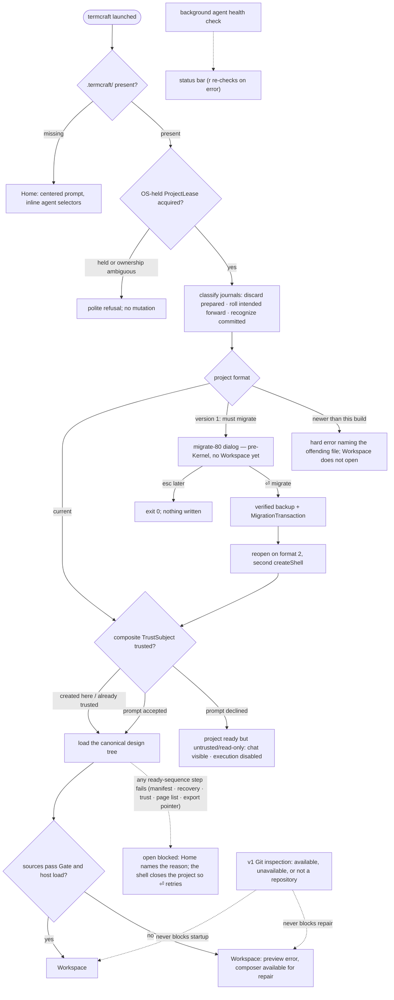
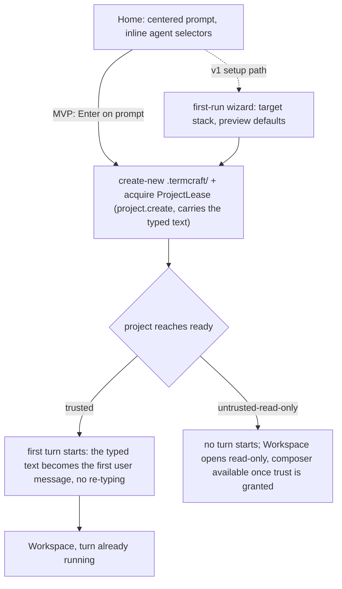

What happens between typing `termcraft` in a directory and working in the Workspace: the single-instance check, project discovery, the workspace-trust gate that guards design-code execution, canonical-source loading, and first generation. Git inspection is optional and never gates startup. termcraft is an npm package run under Bun (master §4.1); the interactive launch is one of three argv modes of the same installed entry (`src/main.tsx`, run through `bun <entry> …`) — an argv scan runs the `_host --stdio` design-render child or the headless `termcraft export [dir]` command ahead of it — and for the interactive mode the composition root opens (or creates) the project on disk and assembles the real Kernel graph the UI drives.

Home's own submit path — creating the project itself — is a self-contained second flow:

**Gap C — CLOSED (fix-bundle spec §3.1).** The designer types a description into Home's
prompt, presses Enter, and the SAME text becomes the first user message of a running turn by
the time the Workspace mounts — no empty composer, no second send. `project.create` already
carried the typed text in its payload; `runProjectReadySequence`
(`src/core/kernel/model/handlers/project.ts`) now reads it and, once the project reaches
`ready` with `trust === "trusted"`, calls `beginTurn` — the SAME function `turn.start`'s own
handler composes, so there is exactly one path into a turn. The chain fires LAST in the ready
sequence, after `finishOpen` and the chat-tail restore: admission reads
`workspace.local.toml`'s `activeChatId`, which only exists once the project is ready.
`project.open` carries the identical optional `text` field for the same reason (a
composition root deciding per launch whether Home's Enter means create-or-open must not have
to fake a `project.create` against an existing project just to keep the first-turn text) — see
Gap D below for the fix that finally makes Home's own dispatch choose between the two. An
untrusted project (declined or not yet granted) never starts a turn: `beginTurn` is gated on
the SAME `trust === "trusted"` condition `kernel.preview.enable` already uses, one check with
two consequences — an untrusted project executes design code neither through preview nor
through the agent.

**Gap D — CLOSED (fix-bundle spec §2.4, Task 12).** Relaunching termcraft in a directory that
already holds a `.termcraft/` — chats, history, canonical pages and all — now lands straight in
the Workspace, not the empty Home prompt. Two things had to change together, because by the
time the UI mounts `.termcraft/` already exists on disk whether the shell just opened it or just
created it, and the UI has no way to tell those two apart after the fact:

- `openOrCreateProject` (`src/entrypoint/model/create-shell.ts`) now RETURNS the open-vs-create
  fact it always computed and threw away, as `ShellLaunchV1 { existing, hasContent }` on the
  returned shell's own `launch` field. `hasContent` — "at least one page, or at least one chat" —
  is evaluated (`probeProjectContent`, one manifest read plus one `ChatStore.list()`) BEFORE the
  Kernel is even constructed, and is the real routing predicate: its purpose is the CLONE case
  (pages present, zero chats, since `chats/` is git-ignored as of fix-bundle §2.5), which is
  exactly the case that most needs the Workspace. `createProject` always mints the first chat
  header, so `existing: false` short-circuits the probe entirely and `hasContent` is always
  `false` — a freshly created project is never routed straight to the Workspace, only ever to
  Home. A read that fails resolves the probe's third outcome, `"unknown"`, not a silent
  `"no-content"` (fix round 1, Finding 1 — the Global Constraints' "never fabricate a fact"
  governs this over the task brief's own snippet): `resolveShellLaunch` folds `"unknown"` into
  `hasContent: true` for an existing project, dispatching `project.open` anyway so the Kernel's
  own open sequence gets the chance to report the real failure through the event stream, rather
  than defaulting to Home on a fact the failed read never established.
- `run-app.ts`'s `runApp` dispatches `project.open` itself, once, right after the shutdown path
  is wired up (moved there in fix round 1: earlier it ran before `boundary.onSignal` registered
  the SIGINT/SIGTERM handlers, so a Ctrl-C during the open sequence had no handler to catch it),
  whenever `shell.launch.hasContent` is true — the ONE interactive caller of `project.open`
  (`run-export.ts`'s headless export driver was previously the only one in the whole of `src`).
  A rejected or failed dispatch is logged, not
  swallowed; Home would otherwise silently stay the destination with no diagnosable trace.
- Home's own Enter (`ui/app/model/intent.ts`'s `home-submit`) now picks `project.open` over
  `project.create` for the SAME fact, carried on `UiEnv.projectExists` (set from
  `ShellLaunchV1.existing` in `resolveEnvWithProjectIdentity`): an exists-but-empty project (rare
  — creation always mints the first chat) still reaches Home, and its Enter must honor the prior
  trust grant rather than implicitly re-granting it the way `project.create` would. Home can stay
  mounted for up to ~30s after the startup `project.open` above is admitted (`deriveScreen` only
  leaves Home once `finishOpen`'s metadata reaches the mirror), so typing there and hitting Enter
  can race a second, rejected `project.open`; `home-submit` clears the typed prompt only once its
  OWN dispatch resolves accepted, never on a rejection (fix round 1, Finding 2 — the identical
  treatment Task 11 already gave `composer-submit`), so that race never silently discards what
  the user typed.

Trust is not a complication here: an existing project opened on the machine that created it
resolves `trusted` and goes straight to the Workspace; a moved or copied workspace resolves
`untrusted-read-only` and lands on the read-only screen — the correct destination, and still not
Home. Interaction with Gap C: once both land, Home is reached only from a genuinely fresh
directory (or an existing-but-empty one), and its Enter is the only entry into the first turn.

## Walkthrough

1. Single-instance check: an existing project acquires `ProjectLease` through an
   OS-held lock before mutation. For a missing project, Home performs no project
   write; first submit creates `.termcraft/` with create-new semantics and then
   acquires its lease. PID, process start time, hostname, and nonce are
   diagnostic only; no lock is reclaimed from any of them. If ownership cannot be
   proved or the filesystem has unreliable lock semantics, writable startup refuses.
   Before either the lease acquire or the create-new `.termcraft/`, a durability
   pre-flight (the cheap volume-type gate composed with a real directory-flush
   probe) refuses a volume that cannot demonstrate durable writes — a network
   drive or a volume with no write-through — before any mutation is attempted.
2. Project discovery has three outcomes: a missing `.termcraft/` opens Home; a
   current project acquires its lease, finishes transaction recovery, and proceeds
   through trust; a version-1 project performs the same lease-and-recovery sequence,
   then fails its manifest read with a typed `ManifestMigrationRequiredError` — BEFORE
   trust, and before any Kernel exists to build a Workspace around. That failure is not
   fatal: the composition root (`entrypoint/model/create-shell.ts`) catches it and
   offers the `migrate-80` dialog as the ONLY thing the process draws, `⏎ migrate` runs
   the verified-backup-then-`MigrationTransaction` protocol, and the project reopens on
   format 2 through a second, ordinary `createShell` call that proceeds through trust
   exactly like any current-format project — the "posttrust" bulk-offer this diagram
   used to draw never happens, because there is no live path that reaches trust while
   still on format 1. There is no project picker. `esc later` exits the process with one
   line and writes nothing (recorded divergence from design §12.1's "returns to Home" —
   `docs/superpowers/red-debt.md`). Migration mechanics: `flows/migration.md`.
3. Before Workspace, prepared plans without commit intent are discarded, every
   durable intent is rolled forward, and committed journals are recognized without
   rechecking targets. Unexpected target hashes stop in recovery conflict and are
   never overwritten. Garbage-collecting a recognized-complete journal's directory
   is a v1 target that has not landed; today its directory is simply left in place.
   After journal recovery, an unconditional orphan-turn scan closes every turn a
   restart left mid-flight exactly once: any chat holding a user record with no
   matching terminal record gets a durable `system:error` record appended —
   "termcraft restarted before this turn finished." — so a crashed turn is visible
   in chat history rather than silently missing; a chat with unresolved corrupt
   trailing bytes is skipped for explicit repair instead. Workspace trust then
   evaluates canonical path, project-root filesystem identity,
   portable `projectId`, and Git repository identity when available — exactly the
   fields the composite `TrustSubject` key is hashed from. Replacing the workspace
   or `.git` invalidates trust; commits or branch switches do not while all
   TrustSubject fields remain unchanged. Declining completes open as ready but
   untrusted/read-only: chat and history remain visible, execution stays disabled,
   and `ProjectLease` remains held until explicit close. Trust resolution and
   read-only enforcement have both landed: the open sequence resolves trust as it runs
   (a fresh project's implicit grant on create; an existing project's prior durable
   grant honored on open, otherwise `untrusted-read-only`), and on an untrusted project
   the guards reject every command except `project.setTrust`, `project.close`, and
   read-only `history.open`. What the one-shot open command still cannot do is block on
   an interactive trust prompt as a round trip, so a never-granted subject opens
   `untrusted-read-only` and the designer's accept/decline is carried by a follow-up
   `project.setTrust`.
4. After trust, termcraft loads each page's canonical entry file under
   `.termcraft/design/`, named by `design/pages.json`,
   by reading and hashing its bytes; it never silently substitutes another source.
   The composition root now assembles the real graph, so the Gate runs over every
   canonical source as part of the open sequence: each page becomes a `ready`
   descriptor or, when its source fails the Gate, an `invalid` one, and the Workspace
   still opens with that error surfaced and the composer available so the designer can
   send a repair turn against the broken source. The Gate's per-page source stages
   (page-contract, lints) run this way today, and so does the whole-tree pass that
   carries the import allowlist and the type check — one `tsc` program per publish
   rather than one per page since design-tree phase 2, and live in the shipped
   configuration (phase-8 Task 7 — a resolved compiler path plus the generated
   `runtimeDts` are always supplied by the composition root). The
   host's own hash-verified page load is composed into the Kernel and runs once a
   preview session is established for a page (`preview.select*`), which now happens at
   launch: trust resolving to `trusted` enables the preview machine, the open sequence's
   own page descriptors name an active page, and the shell's subscriber dispatches
   `preview.selectPage` for it — so a trusted project with at least one readable page
   drives a real host session from the Workspace. The open sequence also
   validates the durable export pointer before finishing (on both open paths); a `null`
   pointer — no export has ever been published — never blocks. In v1, usable Git history also makes explicit Restore
   available after its index, freshness, confirmation, and Gate checks; unavailable
   or unsuitable history leaves the repair path unchanged.
5. Git is an optional v1 capability, not a project prerequisite. A missing Git executable, a directory outside a repository, an unborn repository, or a Git inspection error does not prevent the Workspace or broken-source repair state from opening. Design, generation, preview, pins, chats, migration, and export continue; only history and commit controls show their corresponding unavailable or limited state.
6. The Home screen presents a large, centered prompt input focused on entry; `Esc` or `Tab` unfocuses it, following the same focus rules used everywhere else. Inline selectors beneath the prompt show the current agent · model · effort triple; with no project yet on disk, the choice is held in memory until the project is created.
7. On first submit, termcraft creates portable `project.toml`, machine-local
   `workspace.local.toml`, generated exclusions, and a UUIDv7 chat header through
   one ordinary project transaction, computes the new project's complete
   `TrustSubject`, and records the machine-local implicit trust grant. The turn spine
   is now real end to end — `turn.start` composes admission → attempt → gate-retry →
   finalize, and admission durably appends the first user record before the agent
   starts. What the interactive Home path does on submit is dispatch `project.create`
   (a genuinely fresh directory) or `project.open` (an existing-but-empty project,
   Gap D, spec §2.4) — whichever matches what the composition root actually found on
   disk — carrying the typed text either way; once that project reaches `ready`
   trusted, `runProjectReadySequence` chains straight into `beginTurn` with that SAME
   text (Gap C, spec §3.1, closed) — one keystroke on Home starts both the project and
   its first generation turn, no second send from the Workspace composer. An existing
   project that already holds pages or chats never reaches Home at all: the
   composition root dispatches `project.open` at startup and the Workspace opens
   directly (Gap D). The v1 setup path may first run the target-stack and
   preview-defaults wizard. Turn mechanics: `flows/generation-turn.md`.
8. Failure branch: if the agent exits unsuccessfully or the Gate rejects the proposed sources before apply, no canonical source is changed. The error is written to chat and the designer can send the next message to retry. This pre-apply guarantee does not add crash-safe atomicity to a later multi-file apply.
9. Failure branch: if the agent CLI is missing or not logged in, the background health check — running since startup — surfaces the problem in the status bar; on Home's error state, `r` re-runs the check in place without restarting termcraft. The check itself is implemented. It runs a minimal query and reads the reply until something classifies it: the CLI announcing itself means installed and ready, an authentication signal means not logged in, and a failure to start the process at all means not installed. It is bounded by a deadline so a CLI that connects and then says nothing cannot hang startup, and it never resolves the ambiguous cases as ready — an inconclusive probe reports a problem rather than letting a paid turn start against a broken backend. It never throws, so a launch sequence cannot be taken down by it.
   - *Isolation:* the probe is confined exactly as a real turn is, because it runs before the designer has answered the trust prompt. It loads no project settings, runs in a scratch directory rather than the user's project — otherwise a project's own session-start hook could execute at launch — refuses tool calls under the same deny-by-default veto a turn uses, and has its CLI adopted into an owned process tree that is released on every outcome, so a probe process that ignores the abort is still reaped.
   - *Surfacing:* the Home health line and the `r` re-check are real UI end to end (phase-8 WP-5): `home-recheck` re-runs the injected probe via `refreshHomeHealth`, and the composition root now injects the real background probe (`entrypoint/model/agent-health.ts`'s `createAgentHealthProbe`, wrapping the live `AgentBackend`) at startup, so the launch UI reads the live CLI check rather than a placeholder. `HomeAgentHealth` carries no `version` field at all (phase-8 Task 13 dropped it) — `AgentInfo` never had one to report. The combo's `agent`/`model`/`effort` no longer ride this probe either (finding §2.7, phase-8 Task 13): `resolveDefaultAgentSelection` reads the registry's declared default synchronously at composition and seeds it straight into `UiDeps.local.agentSelection`, so Home's combo paints on the first frame instead of waiting behind this probe's real cold spawn.
   - *v1.0:* once Codex joins as the second backend, the same check additionally write-probes Codex's experimental Windows sandbox and reports a silent workspace-write → read-only downgrade as an explicit error. The health vocabulary already carries that state, but nothing produces it: this does not apply to MVP, which ships Claude Code only.
10. Failure branch: a data file newer than the installed termcraft understands is a hard error naming the offending file — `project.toml`, `workspace.local.toml`, and the transaction journal format are each independently version-gated this way. If the terminal is smaller than the app frame's minimum size, termcraft instead shows an "enlarge the window" placeholder screen — distinct from the status-bar warning shown when only the preview is smaller than a page's minimum size.
11. Failure branch: an open that cannot finish. Nine distinct steps of the ready
    sequence — the manifest read, the workspace-state read, transaction recovery,
    the orphan-turn scan, a corrupt chat found by that scan, trust resolution, the
    page listing, a page-source read, and the export-pointer read — all funnel into
    one `blockOpen`, which leaves the project machine in `blocked`. That state's only
    legal exits are a recovery retry (which needs a domain and action id no screen
    supplies) and a close, so until recently a blocked open was a dead end: Home kept
    looking healthy, and every Enter was rejected `CAPABILITY_UNAVAILABLE` silently.
    Both halves are wired now. The shell mirrors the failure (`openFailure`, plus an
    `opening` flag that distinguishes "no project" from "a project is opening", so the
    same Enter cannot fire a second, rejected open) and renders it on Home as a
    red-bordered panel carrying the Kernel's own `safeMessage` verbatim, and the shell
    dispatches `project.close` to walk the machine back to `closed` — the honest
    recovery, since the project never became ready and closing releases the lease the
    failed open took — which is what makes the panel's "⏎ retries the open" true. The
    panel deliberately survives that close, and the recovery is latched per failure
    object so a second genuine block is recovered again while the many project events
    that merely carry the same failure forward are ignored.

## Source anchors

- `src/main.tsx` — the interactive executable root, the installed package's `bin` target run through Bun: an argv scan dispatches one of three modes of the SAME entry — `_host --stdio` runs the design-host stdio loop, `termcraft export [dir]` runs the headless export CLI, and anything else `bootstrap`s the interactive app; guarded by `import.meta.main` so importing it never seizes the terminal.
- `src/entrypoint/model/bootstrap.ts` — resolves the project root from argv against the working directory, then composes the shell (`createShell`) and the running app (`runApp`). As of design-tree phase 1b, the first `createShell` result can carry `MigrationRequiredV1` instead of a shell (`"kind" in first`); when it does, `bootstrap` routes to `run-migration.ts`'s `runMigrationPrompt` instead of `runApp`, and on success rebuilds `createShell` a SECOND time against the now-migrated project, seeding the track-2 refactor turn (`flows/migration.md` item 12).
- `src/entrypoint/model/create-shell.ts` — the composition root: `openOrCreateProject` opens (or, for a fresh directory, creates) the project on disk BEFORE the Kernel exists, and now returns which one happened (`existing`) alongside the `OpenProject` handle, OR, for a version-1 project, `MigrationRequiredV1` instead of either (`flows/migration.md` item 12); `probeProjectContent` (Gap D, fix-bundle spec §2.4) folds that with one manifest read and one `ChatStore.list()` into a three-way `"has-content" | "no-content" | "unknown"` outcome (fix round 1, Finding 1 — a failed read is never folded into a fabricated `"no-content"`), and `resolveShellLaunch` turns that into `ShellLaunchV1 { existing, hasContent }`, exposed on the shell's own `launch` field and echoed onto `UiEnv.projectExists`. Also wires the 17 store/gate/host/agent adapters into `createKernel`, adapts the composed `Kernel` to `ui`'s `KernelPort`, and closes in reverse-acquisition order (Kernel → host supervisor → project lease) so a teardown rejection can never abandon the lease. `acknowledgeDisplay` is wired to a real frame-token ledger (phase-8 Task 16, via `toPreviewSessionHandle`), and a live run now reaches it — `kernel.preview.enable` fires once trust resolves to `trusted` and the shell dispatches `preview.selectPage` for the active page, so the preview machine reaches `live` (`flows/interactive-prototype.md`).
- `src/entrypoint/model/run-app.ts` — `runApp`'s Gap D startup dispatch: when `shell.launch.hasContent` is true, dispatches `project.open` at the `KernelPort` right after the shutdown path is wired up (after `startShutdownPath`, fix round 1 — so SIGINT/SIGTERM are already handled before this awaits), using a synchronous `peekStateRevision`/`peekSnapshotEnvelope` bootstrap-snapshot peek (shared with the pre-existing `peekRunningTurn`) to build the dispatcher's `expectedRevision`; a rejection or a dispatch failure is logged, never silently left as Home.
- `src/core/kernel/model/handlers/project.ts` — `runProjectReadySequence`, the post-admission "reach ready" spine `project.create`/`project.open`/`project.retryOpen` share: transaction recovery, the orphan-turn scan, trust resolution (implicit grant on create; a prior durable grant honored on open, else `untrusted-read-only`), `enablePreviewIfTrusted` (fix-bundle Gap A, spec §2.2 — applies `kernel.preview.enable` right after trust resolves to `trusted`, before `finishOpen`, so the Preview machine leaves `disabled` for the snapshot the UI first sees; an untrusted project stays `disabled`), per-page Gate descriptors, durable export-pointer validation, `finishOpen`, two independent chat reads (fix-bundle Gap E, `flows/chats.md` for the full picture): `listChatSummaries` publishes the project's FULL on-disk chat listing as `chat.changed`, and `restoreActiveChatTail` restores only the active chat's persisted tail as `chat.records` — a listing failure degrades to the active chat alone, a tail failure costs only the scrollback — and, last, `beginTurn` (fix-bundle Gap C, spec §3.1, closed): when `trustSource` carries a first-turn `text` and trust resolved to `"trusted"`, the SAME function `turn.start`'s own handler uses starts the first turn from it, chained after `finishOpen` and the chat-tail restore because admission reads `workspace.local.toml`'s `activeChatId`. Also `project.setTrust`, the follow-up accept/decline (which calls the SAME `enablePreviewIfTrusted` helper when it grants trust on an already-open project), and the documented no-interactive-prompt gap (a one-shot open command cannot block on a prompt).
- `src/core/kernel/model/handlers/turn.ts` — `beginTurn`: mints the turn id, applies `beginAdmission`, and records the id as the Kernel's active turn, all three synchronously with no `await` between them, then launches the turn's async composition. Both `turn.start`'s own handler and `runProjectReadySequence`'s Gap C chain call this SAME function — there is exactly one path into a turn.
- `src/ui/app/model/deps.ts` — Home's local `prompt` atom and the Workspace's local `composer` atom: two separate pieces of UI state with no carry-over between them; irrelevant to Gap C's fix, since the first turn now starts from the Home text directly at the Kernel, never by pre-filling or copying into the Workspace composer.
- `src/core/capabilities/model/guards.ts` — `projectUntrustedReason`/`projectNotReadyReason`: the read-only enforcement on an untrusted project (only `project.setTrust`/`project.close`/`history.open` survive) that "execution disabled on decline" refers to, plus the pre-ready command gate.
- `src/store/lease/model/lease.ts` — `ProjectLease`: the non-blocking Windows OS lock held for the process lifetime, and the bounded advisory record (pid, process start time, hostname, nonce) that is always diagnostic, never proof of ownership; refuses acquisition when another instance already holds the lock.
- `src/store/model/factory.ts` — `openProject`'s existing-project launch sequence (durability pre-flight → lease → `SafeProjectFs` → journal-format gate → recover transactions → format-too-new gate → read `project.toml`/`workspace.local.toml` → orphan-turn scan → open) and `createProject`'s single project-creation transaction (durability pre-flight → create-new `.termcraft/` → mints `project.toml`, `.gitignore`, `workspace.local.toml`, and the first chat header), followed by the implicit trust grant.
- `src/infrastructure/durability/model/probe.ts` — `probeDurability`: the durability pre-flight both sequences above run before any mutation of the target volume; composes the cheap `assertDurableVolume` gate with a real `flushDir` probe, refusing a network drive or a volume with no write-through.
- `src/store/transaction/model/journal-format.ts` — the separate `transactions.local/format.json` gate, read before any transaction directory is even listed; a newer journal format blocks the Workspace, a missing one is treated as version 1.
- `src/store/transaction/model/recovery.ts` — the startup scan: classifies each prepared transaction directory as discard / roll-forward / already-complete / conflict, in stable lexical order, before any project state is exposed.
- `src/store/transaction/model/engine.ts` — the old/new-image comparison applied during roll-forward: a target matching neither its planned old nor new image writes a conflict marker and is never overwritten.
- `src/store/transaction/model/wrappers.ts` — `admitTurn` (the turn-admission transaction that creates the first user record before an agent starts) is now called by the live turn spine (`turn.start` → `runAdmission`); `buildMigrationTransaction` now has a live caller too (`store/model/factory.ts`'s `TransactionEngine.runMigration`, design-tree phase 1b — `flows/migration.md`); `buildRestoreTransaction` remains built-and-tested with no live caller (Restore stays unwired).
- `src/store/trust/model/trust-store.ts` — `TrustStore`: builds a `TrustSubject` from canonical project path, project-root filesystem identity, `projectId`, and optional Git identity; checks and durably records grants; never fails open on a missing, corrupt, or tampered record.
- `src/store/trust/model/subject.ts` — the exact `TrustSubjectV1` byte encoding and SHA-256 key derivation; HEAD, branch, and commit deliberately never participate in the key.
- `src/store/migration/model/registry.ts` — the format-too-new gate shared by every durable file kind, and the migration chain itself — no longer empty: one step, `project.toml` format 1 -> 2 (design-tree phase 1b — `flows/migration.md`).
- `src/store/migration/model/backup-store.ts` — the verified-backup protocol (copy every file → write manifest → durably flush → reopen and verify → `VERIFIED` marker) a bulk migration runs first; built and unit-tested, and, as of design-tree phase 1b, has a real production caller (`store/model/factory.ts`'s `migrateProject`).
- `src/store/toml/model/project-toml.ts` — `project.toml`'s schema (`project_id`, `name`, `created_at`, `target_stack`, `pages`) and its own format-too-new gate.
- `src/store/toml/model/workspace-toml.ts` — `workspace.local.toml`'s schema and its independent format counter; a corrupt file is preserved and reported, never silently discarded.
- `src/store/toml/model/gitignore.ts` — the generated `.termcraft/.gitignore` exclusion rules written at project creation.
- `src/gate/model/gate.ts` — `runGate`: the page-contract and all six warning-lint checks that always run over a candidate source, plus the two optional stages a caller can inject, `checkManifest` and `smokeRender`; the `dropped-id` and `unlisted-navigation` lints each take an extra optional `GateInput` field (`referencedIds`, `listedSlugs`) and skip silently when the caller omits it. Neither the import allowlist nor the type check is a per-page stage any more (design-tree phase 2 Task 3 deleted the injectable `typeCheck` port outright): both belong to `gate/adapters/gate-runner.ts`'s `runTree`, the single whole-tree pass, because a shared module belongs to no one page. The composition root wires this Gate adapter into the Kernel, so both the per-page stages and that whole-tree pass run over every canonical source at open.
- `src/host/session/model/source-mount.ts` — `loadPage`: the host child's source-hash verification, defense-in-depth import re-scan, dynamic import, and `meta`/default-export validation — the host side of "sources pass Gate and host load". Composed into the Kernel via the host-supervisor adapter and reached at launch, once the shell's preview subscriber (`src/ui/app/model/deps.ts`) dispatches `preview.selectPage` for the active page a trusted project's descriptors name.
- `src/agent/health/model/probe.ts` — `runHealthProbe`: the shared background health-check policy of step 9 — the bounded deadline, closing the adopted process tree on every path, and the refusal to report ready on an ambiguous answer; a backend supplies only its own message classifier
- `src/agent/claude/backend/model/probe.ts` — `probeClaudeHealth`: Claude's half of the same check — the isolated ping's query options and the installed/not-logged-in/ready classification of Claude's own message vocabulary, plus the scratch working directory that keeps a project's own settings from executing before the trust prompt is answered
- `src/agent/types.ts` — `AgentHealthState`: the health vocabulary the status bar would render, including the Codex-only `sandbox-degraded` state nothing produces in MVP
- `src/agent/claude/query/model/spawn-adopt.ts`, `src/infrastructure/process/model/job-object.ts` — the probe's CLI adopted into an owned process tree released on every outcome, the same ownership a real turn gets
- `src/ui/mirror/model/screen.ts` — `deriveScreen`: which screen the app root mounts — `enlarge` below the minimum frame, otherwise `home`/`trust-prompt`/`read-only`/`workspace` from `projectId`/`trust` (an approximation until the typed snapshot lands).
- `src/ui/mirror/model/mirror.ts`, `src/ui/mirror/types.ts` — `ProjectMirror.openFailure`/`opening` (step 11): folded live from `kernel.project.blockOpen`'s own `{reason, failure}` metadata and from `kernel.project.beginOpen`/`beginCreate`, read from the metadata rather than cast, and left unchanged (with a warning) when that metadata is unreadable. `finishOpen` clears both; `finishClose` resets the whole slice EXCEPT `openFailure`, so the panel survives the recovery that closes the project.
- `src/ui/home/ui/HomeOpenFailurePanel.tsx` — the Home panel naming a blocked open: the Kernel's `safeMessage` verbatim, the failure's own `reason` as the title, and the "⏎ retries the open" line the recovery below makes true. The design has no screen for a project that fails to open; the red-bordered `homeErr()` shape is reused from `design/termcraft-engine.js:716-727` rather than invented, with the divergence flagged in-file.
- `src/ui/app/model/deps.ts` — the blocked-open recovery (step 11): dispatches `project.close` when the mirror reports an `openFailure` with a still-null `projectId`, latched by failure-object reference so the recovery's own `finishClose` cannot re-trigger it in a loop.
- `src/ui/app/model/intent.ts` — the launch-relevant dispatches: Home submit → `project.open` when `deps.env.projectExists` is true, otherwise `project.create` (Gap D); the composer's first send → `turn.start`; the trust prompt's accept/decline → `project.setTrust`.
- `src/ui/app/model/deps.ts` — `UiEnv.projectExists` (Gap D): whether `root` was already a project when the process started, set by the composition root and read only by `home-submit`; also the startup agent-health probe injection point (`agentHealthProbe`; the composition root now injects the real probe, phase-8 WP-5) plus the Kernel subscription and preview-frame consumer the mounted app activates. `UiLocalState.agentSelection` (phase-8 Task 13, finding §2.7) is the SEPARATE synchronous fact the composition root seeds at construction — `createUiDeps`'s sixth parameter — never fetched behind a probe.
- `src/entrypoint/model/agent-health.ts` — `homeHealthFromAgentInfo`/`createAgentHealthProbe` (phase-8 WP-5): the pure `AgentInfo -> HomeAgentHealth` mapper and the real probe factory the composition root builds around the live `AgentBackend`, returning health only since phase-8 Task 13. `HomeAgentHealth` carries no `version` field — `AgentInfo` never had one to report. `resolveDefaultAgentSelection` (same file, phase-8 Task 13) is the sibling function delivering the registry's declared agent/model/effort default synchronously into `UiRootOptions.agentSelection`.
- `docs/superpowers/specs/2026-07-16-git-backed-page-history-design.md` — §1 optional Git, §5 broken canonical-source launch and repair, §7 explicit Restore, §9 Git availability states (v1; no Git-inspection code exists yet)
- `docs/superpowers/specs/2026-07-13-termcraft-design.md` — §3.1 Home and the workspace-trust prompt/decline UI, §3.6 picker state before project creation, §8.1 first-run wizard, §9 lock/agent/sandbox/data-file/terminal-size failure *presentation* — the design authority for these screens. Home, the trust prompt, and the health-line surfacing now exist as code (the `src/ui/*` anchors above); the first-run wizard remains a v1 target with no code yet.
- `docs/superpowers/specs/2026-07-16-production-storage-identity-design.md` — §8/§9/§12 source-of-record for `ProjectLease`, `TrustSubject`, and migration backup, which the `store/lease`, `store/trust`, and `store/migration` files above implement
- `docs/superpowers/specs/2026-07-16-turn-durability-staging-design.md` — §4/§10.2 source-of-record for startup transaction recovery, which `store/transaction` above implements
- `design/01-home.dc.html` — Home screen states
- `design/14-first-generation.dc.html` — first generation experience
- `design/16-wizard-migration.dc.html` — the `migrate-80` migration offer screen, transcribed to `src/ui/setup/ui/MigratePrompt.tsx` (design-tree phase 1b — `flows/migration.md`); this file's own first-run wizard screens remain v1, no code yet
