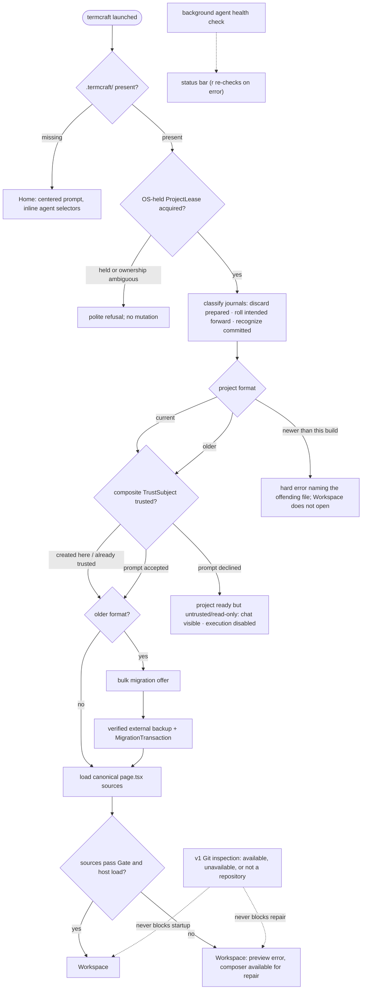
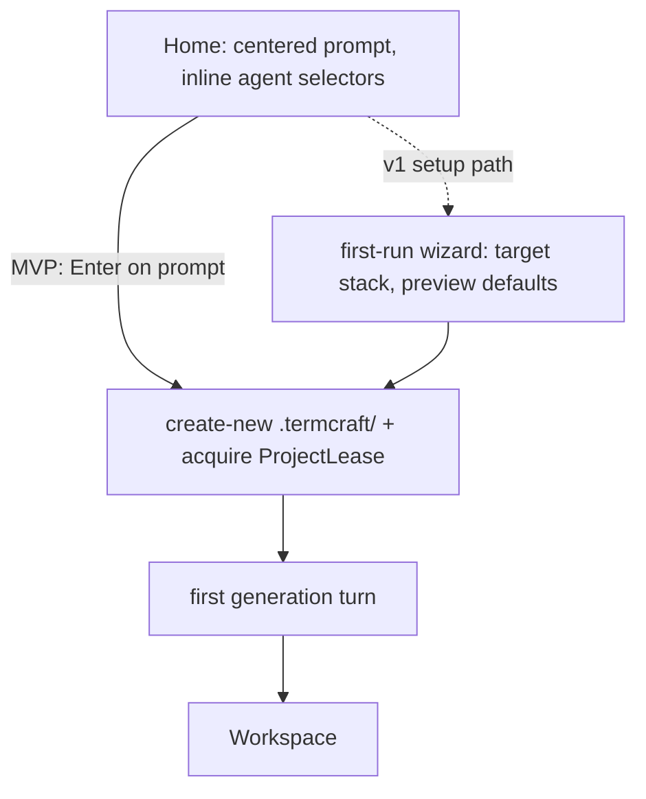

What happens between typing `termcraft` in a directory and working in the Workspace: the single-instance check, project discovery, the workspace-trust gate that guards design-code execution, canonical-source loading, and first generation. Git inspection is optional and never gates startup.

Home's own submit path — creating the project itself — is a self-contained second flow:

## Walkthrough

1. Single-instance check: an existing project acquires `ProjectLease` through an
   OS-held lock before mutation. For a missing project, Home performs no project
   write; first submit creates `.termcraft/` with create-new semantics and then
   acquires its lease. PID, process start time, hostname, and nonce are
   diagnostic only; no lock is reclaimed from any of them. If ownership cannot be
   proved or the filesystem has unreliable lock semantics, writable startup refuses.
2. Project discovery has three outcomes: a missing `.termcraft/` opens Home; a
   current project acquires its lease, finishes transaction recovery, and proceeds
   through trust; an older project performs the same journal recovery, then after
   trust offers bulk migration before design-code execution. There is no project
   picker. The verified-backup-then-`MigrationTransaction` protocol the offer would
   run is built and fault-injection tested, but the shipped migration chain is
   empty — no project format newer than 1 has ever existed, so this branch has
   nothing to migrate yet. Migration mechanics: `flows/migration.md`.
3. Before Workspace, prepared plans without commit intent are discarded, every
   durable intent is rolled forward, and committed journals are recognized without
   rechecking targets. Unexpected target hashes stop in recovery conflict and are
   never overwritten. Garbage-collecting a recognized-complete journal's directory
   is a v1 target that has not landed; today its directory is simply left in place.
   After journal recovery, an unconditional orphan-turn scan closes every turn a
   restart left mid-flight exactly once: any chat holding a user record with no
   matching terminal record gets a durable `system:error` record appended —
   "termcraft restarted before this turn finished." — so a crashed turn is visible
   in chat history rather than silently missing; a chat with unresolved corrupt
   trailing bytes is skipped for explicit repair instead. Workspace trust then
   evaluates canonical path, project-root filesystem identity,
   portable `projectId`, and Git repository identity when available — exactly the
   fields the composite `TrustSubject` key is hashed from. Replacing the workspace
   or `.git` invalidates trust; commits or branch switches do not while all
   TrustSubject fields remain unchanged. Declining completes open as ready but
   untrusted/read-only: chat and history remain visible, execution stays disabled,
   and `ProjectLease` remains held until explicit close. The subject-build/grant/
   check operations themselves are implemented and exercised; deciding when to call
   them during launch, prompting the designer, and enforcing read-only on decline is
   orchestration that has not landed yet.
4. After trust, termcraft loads each page's canonical `.termcraft/pages/<slug>/page.tsx`
   by reading and hashing its bytes; it never silently substitutes another source.
   The Gate's static checks and the host's own hash-verified page load are each
   independently implemented; when a canonical source fails either, the Workspace
   still opens with that error in the preview and the composer available, so the
   designer can send a repair turn against the broken source — but no composition
   root yet runs the Gate and the host together as a launch step, so this check does
   not run end-to-end today. In v1, usable Git history also makes explicit Restore
   available after its index, freshness, confirmation, and Gate checks; unavailable
   or unsuitable history leaves the repair path unchanged.
5. Git is an optional v1 capability, not a project prerequisite. A missing Git executable, a directory outside a repository, an unborn repository, or a Git inspection error does not prevent the Workspace or broken-source repair state from opening. Design, generation, preview, pins, chats, migration, and export continue; only history and commit controls show their corresponding unavailable or limited state.
6. The Home screen presents a large, centered prompt input focused on entry; `Esc` or `Tab` unfocuses it, following the same focus rules used everywhere else. Inline selectors beneath the prompt show the current agent · model · effort triple; with no project yet on disk, the choice is held in memory until the project is created.
7. On first submit, termcraft creates portable `project.toml`, machine-local
   `workspace.local.toml`, generated exclusions, and a UUIDv7 chat header through
   one ordinary project transaction, computes the new project's complete
   `TrustSubject`, and records the machine-local implicit trust grant. It then
   accepts the first turn; that turn's admission transaction creates the first user
   record before the agent starts — the admission-transaction mechanism is
   implemented, though wiring the first submitted message through it is
   orchestration that has not landed yet. The v1 setup path may first run the
   target-stack and preview-defaults wizard. Turn mechanics: `flows/generation-turn.md`.
8. Failure branch: if the agent exits unsuccessfully or the Gate rejects the proposed sources before apply, no canonical source is changed. The error is written to chat and the designer can send the next message to retry. This pre-apply guarantee does not add crash-safe atomicity to a later multi-file apply.
9. Failure branch: if the agent CLI is missing or not logged in, the background health check — running since startup — surfaces the problem in the status bar; on Home's error state, `r` re-runs the check in place without restarting termcraft. In v1.0, once Codex joins as the second backend, the same check additionally write-probes Codex's experimental Windows sandbox and reports a silent workspace-write → read-only downgrade as an explicit error; this does not apply to MVP, which ships Claude Code only.
10. Failure branch: a data file newer than the binary understands is a hard error naming the offending file — `project.toml`, `workspace.local.toml`, and the transaction journal format are each independently version-gated this way. If the terminal is smaller than the app frame's minimum size, termcraft instead shows an "enlarge the window" placeholder screen — distinct from the status-bar warning shown when only the preview is smaller than a page's minimum size.

## Source anchors

- `src/store/lease/model/lease.ts` — `ProjectLease`: the non-blocking Windows OS lock held for the process lifetime, and the bounded advisory record (pid, process start time, hostname, nonce) that is always diagnostic, never proof of ownership; refuses acquisition when another instance already holds the lock.
- `src/store/model/factory.ts` — `openProject`'s existing-project launch sequence (lease → `SafeProjectFs` → journal-format gate → recover transactions → format-too-new gate → read `project.toml`/`workspace.local.toml` → orphan-turn scan → open) and `createProject`'s single project-creation transaction (mints `project.toml`, `.gitignore`, `workspace.local.toml`, and the first chat header), followed by the implicit trust grant.
- `src/store/transaction/model/journal-format.ts` — the separate `transactions.local/format.json` gate, read before any transaction directory is even listed; a newer journal format blocks the Workspace, a missing one is treated as version 1.
- `src/store/transaction/model/recovery.ts` — the startup scan: classifies each prepared transaction directory as discard / roll-forward / already-complete / conflict, in stable lexical order, before any project state is exposed.
- `src/store/transaction/model/engine.ts` — the old/new-image comparison applied during roll-forward: a target matching neither its planned old nor new image writes a conflict marker and is never overwritten.
- `src/store/transaction/model/wrappers.ts` — `admitTurn` (the turn-admission transaction that creates the first user record before an agent starts) and the infrastructure-only `buildRestoreTransaction`/`buildMigrationTransaction`, built and tested but not yet called by any live path.
- `src/store/trust/model/trust-store.ts` — `TrustStore`: builds a `TrustSubject` from canonical project path, project-root filesystem identity, `projectId`, and optional Git identity; checks and durably records grants; never fails open on a missing, corrupt, or tampered record.
- `src/store/trust/model/subject.ts` — the exact `TrustSubjectV1` byte encoding and SHA-256 key derivation; HEAD, branch, and commit deliberately never participate in the key.
- `src/store/migration/model/registry.ts` — the format-too-new gate shared by every durable file kind, and the migration chain itself, which is empty by design (no format newer than 1 has shipped yet).
- `src/store/migration/model/backup-store.ts` — the verified-backup protocol (copy every file → write manifest → durably flush → reopen and verify → `VERIFIED` marker) a bulk migration would run first; built and unit-tested, with no live caller yet.
- `src/store/toml/model/project-toml.ts` — `project.toml`'s schema (`project_id`, `name`, `created_at`, `target_stack`, `pages`) and its own format-too-new gate.
- `src/store/toml/model/workspace-toml.ts` — `workspace.local.toml`'s schema and its independent format counter; a corrupt file is preserved and reported, never silently discarded.
- `src/store/toml/model/gitignore.ts` — the generated `.termcraft/.gitignore` exclusion rules written at project creation.
- `src/gate/model/gate.ts` — `runGate`: the static import-allowlist, page-contract, and determinism-lint checks that always run over a candidate source, plus the optional type-check/manifest/smoke-render stages a caller can inject; no composition root wires the real stages in yet.
- `src/host/session/model/source-mount.ts` — `loadPage`: the host child's source-hash verification, defense-in-depth import re-scan, dynamic import, and `meta`/default-export validation — the host side of "sources pass Gate and host load", not yet connected to a launch flow.
- `docs/superpowers/specs/2026-07-16-git-backed-page-history-design.md` — §1 optional Git, §5 broken canonical-source launch and repair, §7 explicit Restore, §9 Git availability states (v1; no Git-inspection code exists yet)
- `docs/superpowers/specs/2026-07-13-termcraft-design.md` — §3.1 Home and the workspace-trust prompt/decline UI, §3.6 picker state before project creation, §8.1 first-run wizard, §9 lock/agent/sandbox/data-file/terminal-size failures — the authority for Home, the trust prompt, the wizard, and the agent health check, none of which exist as code yet (no `ui`/`agent`/`core` module)
- `docs/superpowers/specs/2026-07-16-production-storage-identity-design.md` — §8/§9/§12 source-of-record for `ProjectLease`, `TrustSubject`, and migration backup, which the `store/lease`, `store/trust`, and `store/migration` files above implement
- `docs/superpowers/specs/2026-07-16-turn-durability-staging-design.md` — §4/§10.2 source-of-record for startup transaction recovery, which `store/transaction` above implements
- `design/01-home.dc.html` — Home screen states
- `design/14-first-generation.dc.html` — first generation experience
- `design/16-wizard-migration.dc.html` — v1 wizard and migration offer screens
