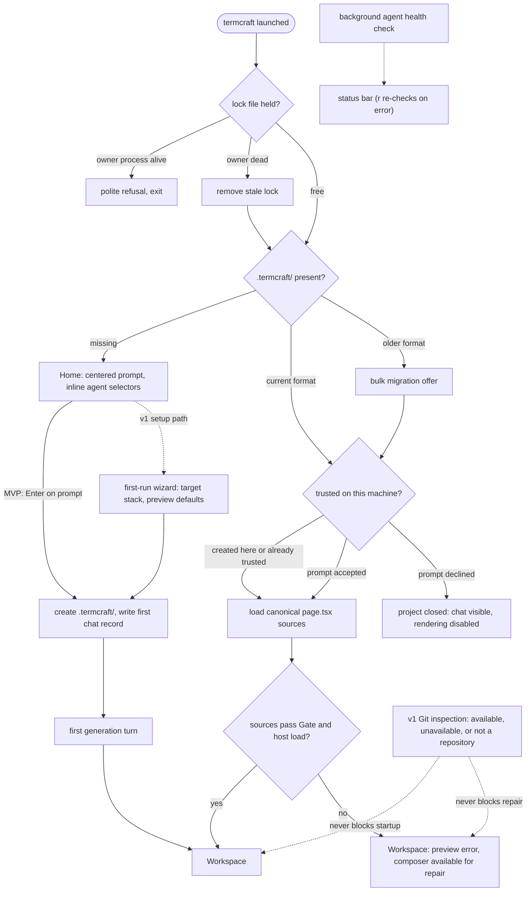

What happens between typing `termcraft` in a directory and working in the Workspace: the single-instance check, project discovery, the workspace-trust gate that guards design-code execution, canonical-source loading, and first generation. Git inspection is optional and never gates startup.

## Walkthrough

1. Single-instance check: the lock file holds the owner process's PID. If the owner is alive, termcraft refuses to start and exits politely; if the owner process is dead, the stale lock is removed automatically and startup continues.
2. Project discovery has three outcomes: a missing `.termcraft/` opens Home; a project in the current format proceeds to the trust check and then the Workspace with its active chat restored; an older format triggers a bulk migration offer first. There is no project picker, since separate projects live in separate directories. Migration mechanics: `flows/migration.md`.
3. Workspace trust: designs are code and rendering executes them, so a project this machine has not trusted yet — created elsewhere, typically arriving via `git clone` — shows a trust prompt before anything renders. Accepting records the decision in machine-local user state outside the project; declining leaves the project closed, with chat history visible but rendering disabled. A project created on this machine is trusted implicitly and never prompts.
4. After trust, termcraft loads each page's canonical `.termcraft/pages/<slug>/page.tsx`. It never silently substitutes another source. When a canonical source fails the current Gate or preview host, the Workspace still opens with that error in the preview and the composer available, so the designer can send a repair turn against the broken source. In v1, usable Git history also makes explicit Restore available after its index, freshness, confirmation, and Gate checks; unavailable or unsuitable history leaves the repair path unchanged.
5. Git is an optional v1 capability, not a project prerequisite. A missing Git executable, a directory outside a repository, an unborn repository, or a Git inspection error does not prevent the Workspace or broken-source repair state from opening. Design, generation, preview, pins, chats, migration, and export continue; only history and commit controls show their corresponding unavailable or limited state.
6. The Home screen presents a large, centered prompt input focused on entry; `Esc` or `Tab` unfocuses it, following the same focus rules used everywhere else. Inline selectors beneath the prompt show the current agent · model · effort triple; with no project yet on disk, the choice is held in memory until the project is created.
7. On the MVP's first submit, termcraft directly creates `.termcraft/` with default config and a zero-page manifest, writes the first `user` record to the first chat, opens the Workspace, and starts the first generation turn. The v1 setup path may first run the target-stack and preview-defaults wizard; the MVP path does not depend on that wizard. Turn mechanics: `flows/generation-turn.md`.
8. Failure branch: if the agent exits unsuccessfully or the Gate rejects the proposed sources before apply, no canonical source is changed. The error is written to chat and the designer can send the next message to retry. This pre-apply guarantee does not add crash-safe atomicity to a later multi-file apply.
9. Failure branch: if the agent CLI is missing or not logged in, the background health check — running since startup — surfaces the problem in the status bar; on Home's error state, `r` re-runs the check in place without restarting termcraft. On Windows the same check write-probes Codex's experimental sandbox and reports a silent workspace-write → read-only downgrade as an explicit error.
10. Failure branch: a data file newer than the binary understands is a hard error naming the offending file. If the terminal is smaller than the app frame's minimum size, termcraft instead shows an "enlarge the window" placeholder screen — distinct from the status-bar warning shown when only the preview is smaller than a page's minimum size.

## Source anchors

- `docs/superpowers/specs/2026-07-16-git-backed-page-history-design.md` — §1 optional Git, §5 broken canonical-source launch and repair, §7 explicit Restore, §9 Git availability states
- `docs/superpowers/specs/2026-07-13-termcraft-design.md` — §3.1 launch, Home, and workspace trust, §3.6 picker state before project creation, §8.1 first-run wizard, §9 lock/agent/sandbox/data-file/terminal-size failures
- `design/01-home.dc.html` — Home screen states
- `design/14-first-generation.dc.html` — first generation experience
- `design/16-wizard-migration.dc.html` — v1 wizard and migration offer screens
