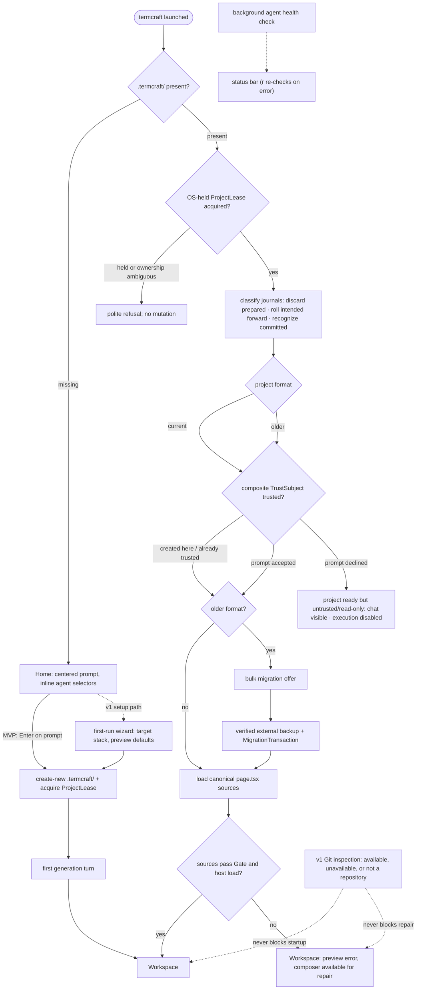

What happens between typing `termcraft` in a directory and working in the Workspace: the single-instance check, project discovery, the workspace-trust gate that guards design-code execution, canonical-source loading, and first generation. Git inspection is optional and never gates startup.

## Walkthrough

1. Single-instance check: an existing project acquires `ProjectLease` through an
   OS-held lock before mutation. For a missing project, Home performs no project
   write; first submit creates `.termcraft/` with create-new semantics and then
   acquires its lease. PID, process-start token, nonce, version, and timestamp are
   diagnostic only; no lock is reclaimed from PID alone. If ownership cannot be
   proved or the filesystem has unreliable lock semantics, writable startup refuses.
2. Project discovery has three outcomes: a missing `.termcraft/` opens Home; a
   current project acquires its lease, finishes transaction recovery, and proceeds
   through trust; an older project performs the same journal recovery, then after
   trust offers bulk migration before design-code execution. There is no project
   picker. Migration mechanics: `flows/migration.md`.
3. Before Workspace, prepared plans without commit intent are discarded, every
   durable intent is rolled forward, and committed journals are recognized without
   rechecking targets. Committed-journal GC waits until startup schema/tree validation
   and reference checks complete. Unexpected target hashes stop in recovery conflict
   and are never overwritten. Workspace trust then evaluates canonical path,
   project-root filesystem identity, portable `projectId`, and Git repository identity
   when available. Replacing the workspace or `.git` invalidates trust; commits or
   branch switches do not while all TrustSubject fields remain unchanged. Declining
   completes open as ready but untrusted/read-only: chat and history remain visible,
   execution stays disabled, and `ProjectLease` remains held until explicit close.
4. After trust, termcraft loads each page's canonical `.termcraft/pages/<slug>/page.tsx`. It never silently substitutes another source. When a canonical source fails the current Gate or preview host, the Workspace still opens with that error in the preview and the composer available, so the designer can send a repair turn against the broken source. In v1, usable Git history also makes explicit Restore available after its index, freshness, confirmation, and Gate checks; unavailable or unsuitable history leaves the repair path unchanged.
5. Git is an optional v1 capability, not a project prerequisite. A missing Git executable, a directory outside a repository, an unborn repository, or a Git inspection error does not prevent the Workspace or broken-source repair state from opening. Design, generation, preview, pins, chats, migration, and export continue; only history and commit controls show their corresponding unavailable or limited state.
6. The Home screen presents a large, centered prompt input focused on entry; `Esc` or `Tab` unfocuses it, following the same focus rules used everywhere else. Inline selectors beneath the prompt show the current agent · model · effort triple; with no project yet on disk, the choice is held in memory until the project is created.
7. On first submit, termcraft creates portable `project.toml`, machine-local
   `workspace.local.toml`, generated exclusions, and a UUIDv7 chat header through
   one ordinary project transaction, computes the new project's complete
   `TrustSubject`, and records the machine-local implicit trust grant. It then
   accepts the first turn; that turn's
   admission transaction creates the first user record before the agent starts. The
   v1 setup path may first run the target-stack and preview-defaults wizard. Turn
   mechanics: `flows/generation-turn.md`.
8. Failure branch: if the agent exits unsuccessfully or the Gate rejects the proposed sources before apply, no canonical source is changed. The error is written to chat and the designer can send the next message to retry. This pre-apply guarantee does not add crash-safe atomicity to a later multi-file apply.
9. Failure branch: if the agent CLI is missing or not logged in, the background health check — running since startup — surfaces the problem in the status bar; on Home's error state, `r` re-runs the check in place without restarting termcraft. On Windows the same check write-probes Codex's experimental sandbox and reports a silent workspace-write → read-only downgrade as an explicit error.
10. Failure branch: a data file newer than the binary understands is a hard error naming the offending file. If the terminal is smaller than the app frame's minimum size, termcraft instead shows an "enlarge the window" placeholder screen — distinct from the status-bar warning shown when only the preview is smaller than a page's minimum size.

## Source anchors

- `docs/superpowers/specs/2026-07-16-git-backed-page-history-design.md` — §1 optional Git, §5 broken canonical-source launch and repair, §7 explicit Restore, §9 Git availability states
- `docs/superpowers/specs/2026-07-13-termcraft-design.md` — §3.1 launch, Home, and workspace trust, §3.6 picker state before project creation, §8.1 first-run wizard, §9 lock/agent/sandbox/data-file/terminal-size failures
- `docs/superpowers/specs/2026-07-16-production-storage-identity-design.md` — ProjectLease, TrustSubject, local state, and migration backup
- `docs/superpowers/specs/2026-07-16-turn-durability-staging-design.md` — startup transaction recovery
- `design/01-home.dc.html` — Home screen states
- `design/14-first-generation.dc.html` — first generation experience
- `design/16-wizard-migration.dc.html` — v1 wizard and migration offer screens
