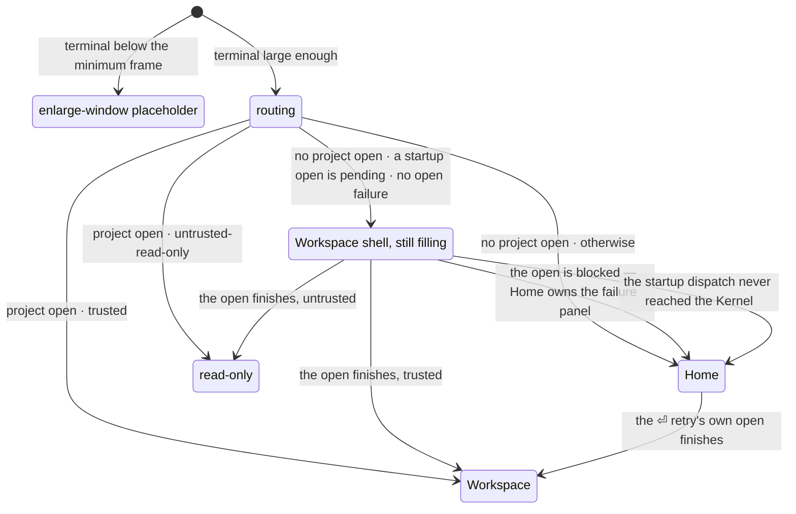
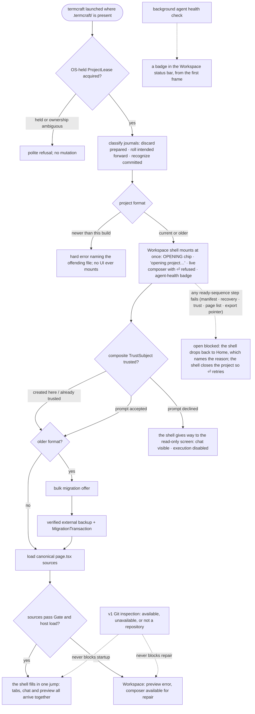
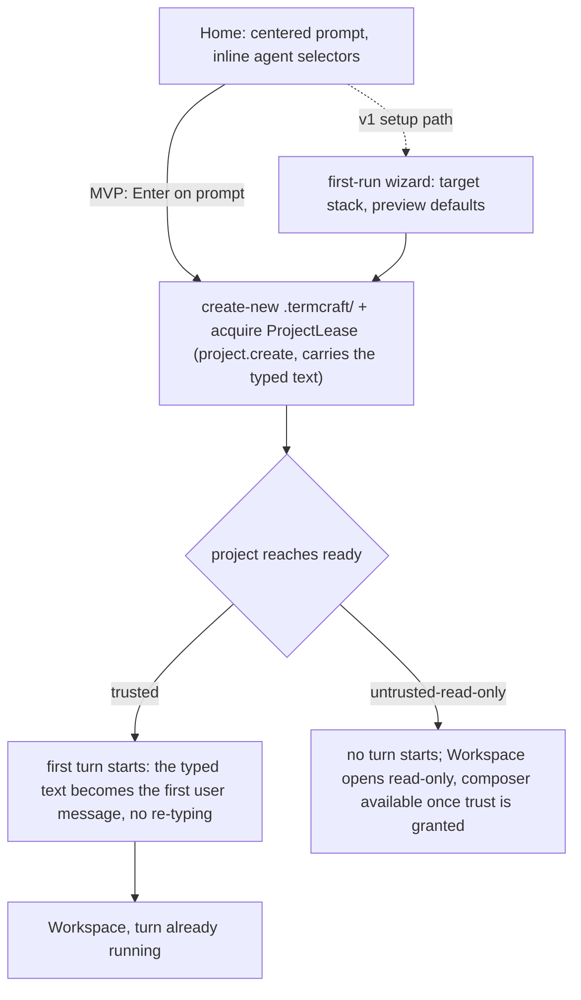

What happens between typing `termcraft` in a directory and working in the Workspace: the single-instance check, project discovery, the workspace-trust gate that guards design-code execution, canonical-source loading, and first generation. Git inspection is optional and never gates startup. termcraft is an npm package run under Bun (master §4.1); the interactive launch is one of three argv modes of the same installed entry (`src/main.tsx`, run through `bun <entry> …`) — an argv scan runs the `_host --stdio` design-render child or the headless `termcraft export [dir]` command ahead of it — and for the interactive mode the composition root opens (or creates) the project on disk and assembles the real Kernel graph the UI drives.

Which screen the app MOUNTS — the first frame, before the Kernel has published anything — is
decided from two facts: the terminal size, measured by the renderer inside `createUiRoot`
(`src/ui/app/model/root.tsx`), and whether a startup open is pending — the one fact the
composition root already holds (`UiEnv.projectExists`, seeded into the UI-local
`startupOpenPending`). `deriveScreen` then re-runs on every mirror change and reads more than
that: `projectId` and `trust` once the open finishes, and `openFailed`, which derives from
`openFailure` and can only ever be set by a Kernel-published `blockOpen` — so at mount time it is
always false.

The diagram omits one outcome `deriveScreen` can in principle return: `trust-prompt`, for a
project open with `trust === null`. That is deliberate, and it matches the spec's own omission —
`trust-prompt` stays exactly as unreachable as it is today, because `kernel.project.finishOpen`
folds `projectId` and `trust` in one `project.set` (`src/ui/mirror/model/mirror.ts`), so there is
no intermediate state where one is known and the other is not. It is listed among the outcomes in
the `deriveScreen` anchor below because the function really does return it; drawing it here would
suggest a transition the launch flow cannot take.

The filling shell is not a fourth screen: it is the Workspace with no project behind it
yet, which is why it becomes the finished Workspace by re-rendering rather than by being
replaced. The sequence below shows where the mount falls. Everything above it — the
durability pre-flight, the lease, journal recovery and the format gates — happens while
the shell is being composed, before any UI exists at all, so a failure there is reported
by the executable root and nothing ever mounts. Everything below it is the Kernel's own
ready sequence, running behind a shell the user is already looking at.

Home's own submit path — creating the project itself — is a self-contained second flow:

**Gap C — CLOSED (fix-bundle spec §3.1).** The designer types a description into Home's
prompt, presses Enter, and the SAME text becomes the first user message of a running turn by
the time the Workspace mounts — no empty composer, no second send. `project.create` already
carried the typed text in its payload; `runProjectReadySequence`
(`src/core/kernel/model/handlers/project.ts`) now reads it and, once the project reaches
`ready` with `trust === "trusted"`, calls `beginTurn` — the SAME function `turn.start`'s own
handler composes, so there is exactly one path into a turn. The chain fires LAST in the ready
sequence, after `finishOpen` and the chat-tail restore: admission reads
`workspace.local.toml`'s `activeChatId`, which only exists once the project is ready.
`project.open` carries the identical optional `text` field for the same reason (a
composition root deciding per launch whether Home's Enter means create-or-open must not have
to fake a `project.create` against an existing project just to keep the first-turn text) — see
Gap D below for the fix that finally makes Home's own dispatch choose between the two. An
untrusted project (declined or not yet granted) never starts a turn: `beginTurn` is gated on
the SAME `trust === "trusted"` condition `kernel.preview.enable` already uses, one check with
two consequences — an untrusted project executes design code neither through preview nor
through the agent.

**Gap D — CLOSED (fix-bundle spec §2.4, Task 12), then rebuilt workspace-first
(workspace-first-launch spec, 2026-08-02).** Relaunching termcraft in a directory that already
holds a `.termcraft/` — chats, history, canonical pages and all — lands in the Workspace
IMMEDIATELY. The first version of this fix still parked on Home for the whole ready sequence
and only switched screens at the end; the shell now mounts before the Kernel has published
anything and fills in one jump when the open finishes. Four things carry it:

- One predicate, `existing`, decides both halves. `openOrCreateProject`
  (`src/entrypoint/model/create-shell.ts`) RETURNS the open-vs-create fact it always computed
  and threw away, as `ShellLaunchV1 { existing, hasContent }` on the returned shell's own
  `launch` field, and both the startup dispatch and the screen routing read `existing` from it.
  They have to read the SAME fact: routing to the Workspace on one while dispatching
  `project.open` on the other would strand an existing-but-empty project in a Workspace that
  never opens. `hasContent` — "at least one page, or at least one chat", from
  `probeProjectContent`'s one manifest read plus one `ChatStore.list()` — is still computed and
  still reported on `launch`, and NOTHING READS IT. Its old job was the CLONE case (pages
  present, zero chats, since `chats/` is git-ignored as of fix-bundle §2.5); `existing` covers
  that case and every other. The `existing && !hasContent → Home` branch is gone with it — the
  branch for an exists-but-empty project, which `createProject` makes practically unreachable
  anyway by always minting the first chat header. A failed read still resolves the probe's third
  outcome, `"unknown"`, never a silent `"no-content"` (fix round 1, Finding 1): `resolveShellLaunch`
  folds `"unknown"` into `hasContent: true`, which now only keeps the reported value honest
  rather than deciding anything.
- `run-app.ts`'s `runApp` dispatches `project.open` itself, once, whenever
  `shell.launch.existing` is true. This is the ordinary way an existing project is opened;
  the only other `project.open` callers in `src` are Home's ⏎ retry (below) and
  `run-export.ts`'s headless export driver, which before this dispatch existed was the only
  one in the whole of `src`. It runs right after the shutdown path is wired up (moved there in fix round 1: earlier it ran
  before `boundary.onSignal` registered the SIGINT/SIGTERM handlers, so a Ctrl-C during the open
  sequence had no handler to catch it). Both failure branches — a dispatch that fails outright
  and one the Kernel rejects — log AND call `root.abandonStartupOpen()`; see walkthrough step 11
  for why the log alone was not a surface.
- `deriveScreen` (`src/ui/mirror/model/screen.ts`) gained two required inputs —
  `startupOpenPending` and `openFailed` — and one branch: with no project open, a pending
  startup open and no open failure, it returns the Workspace instead of Home. `enlarge` still
  outranks it, so a terminal below the minimum frame still gets the placeholder. The opening
  state is NOT a new screen kind: it is the Workspace with a null project id, which is exactly
  why the finished project arrives as a re-render rather than a remount. `startupOpenPending` is
  a UI-local atom seeded synchronously from `UiEnv.projectExists` — not the mirror's own
  `opening` flag, which only turns true once the Kernel ADMITS the command and would therefore
  show Home for a frame.
- Home's own Enter (`ui/app/model/intent.ts`'s `home-submit`) still picks `project.open` over
  `project.create` on `UiEnv.projectExists` (set from `ShellLaunchV1.existing` in
  `resolveEnvWithProjectIdentity`), but that branch now serves exactly one situation: the ⏎
  retry after a startup open that failed. `create` would grant trust implicitly over a project
  whose prior grant is the authority, so the distinction still has to exist. That retry races
  Home's own `project.close` recovery, so `home-submit` clears the typed prompt only once its
  OWN dispatch resolves accepted, never on a rejection (fix round 1, Finding 2 — the identical
  treatment Task 11 already gave `composer-submit`), and the text survives to be re-sent.

**The ~30 s wait does not shrink.** `runProjectReadySequence` is untouched by design (the spec
puts it out of scope: publishing `finishOpen` early, or gating the active page ahead of the
rest, would weaken the "descriptors are complete and ordered at `ready`" invariant the
capability guards rely on). Chat, tabs and preview still all arrive together at `finishOpen`.
What changes is that the user waits on the right screen, watching the one check that is
genuinely running — the agent health probe, which was already parallel and was previously
visible only on Home.

Trust is not a complication here: an existing project opened on the machine that created it
resolves `trusted`, so the mounted shell fills into the Workspace; a moved or copied workspace
resolves `untrusted-read-only`, so the same mounted shell is replaced by the read-only screen
when the open finishes — the correct destination, and still not Home. Interaction with Gap C:
Home is now reached in exactly two situations — a genuinely fresh directory, and a startup open
that did not finish — and in the fresh case its Enter is the only entry into the first turn.

## Walkthrough

1. Single-instance check: an existing project acquires `ProjectLease` through an
   OS-held lock before mutation. For a missing project, Home performs no project
   write; first submit creates `.termcraft/` with create-new semantics and then
   acquires its lease. PID, process start time, hostname, and nonce are
   diagnostic only; no lock is reclaimed from any of them. If ownership cannot be
   proved or the filesystem has unreliable lock semantics, writable startup refuses.
   Before either the lease acquire or the create-new `.termcraft/`, a durability
   pre-flight (the cheap volume-type gate composed with a real directory-flush
   probe) refuses a volume that cannot demonstrate durable writes — a network
   drive or a volume with no write-through — before any mutation is attempted.
2. Project discovery has three outcomes: a missing `.termcraft/` opens Home; a
   current project acquires its lease, finishes transaction recovery, and proceeds
   through trust; an older project performs the same journal recovery, then after
   trust offers bulk migration before design-code execution. There is no project
   picker. The verified-backup-then-`MigrationTransaction` protocol the offer would
   run is built and fault-injection tested, but the shipped migration chain is
   empty — no project format newer than 1 has ever existed, so this branch has
   nothing to migrate yet. Migration mechanics: `flows/migration.md`.
3. Before the Workspace can fill, prepared plans without commit intent are discarded, every
   durable intent is rolled forward, and committed journals are recognized without
   rechecking targets. Unexpected target hashes stop in recovery conflict and are
   never overwritten. Garbage-collecting a recognized-complete journal's directory
   is a v1 target that has not landed; today its directory is simply left in place.
   After journal recovery, an unconditional orphan-turn scan closes every turn a
   restart left mid-flight exactly once: any chat holding a user record with no
   matching terminal record gets a durable `system:error` record appended —
   "termcraft restarted before this turn finished." — so a crashed turn is visible
   in chat history rather than silently missing; a chat with unresolved corrupt
   trailing bytes is skipped for explicit repair instead. Workspace trust then
   evaluates canonical path, project-root filesystem identity,
   portable `projectId`, and Git repository identity when available — exactly the
   fields the composite `TrustSubject` key is hashed from. Replacing the workspace
   or `.git` invalidates trust; commits or branch switches do not while all
   TrustSubject fields remain unchanged. Declining completes open as ready but
   untrusted/read-only: chat and history remain visible, execution stays disabled,
   and `ProjectLease` remains held until explicit close. Trust resolution and
   read-only enforcement have both landed: the open sequence resolves trust as it runs
   (a fresh project's implicit grant on create; an existing project's prior durable
   grant honored on open, otherwise `untrusted-read-only`), and on an untrusted project
   the guards reject every command except `project.setTrust`, `project.close`, and
   read-only `history.open`. What the one-shot open command still cannot do is block on
   an interactive trust prompt as a round trip, so a never-granted subject opens
   `untrusted-read-only` and the designer's accept/decline is carried by a follow-up
   `project.setTrust`.
4. After trust, termcraft loads each page's canonical `.termcraft/pages/<slug>/page.tsx`
   by reading and hashing its bytes; it never silently substitutes another source.
   The composition root now assembles the real graph, so the Gate runs over every
   canonical source as part of the open sequence: each page becomes a `ready`
   descriptor or, when its source fails the Gate, an `invalid` one, and the Workspace
   still opens with that error surfaced and the composer available so the designer can
   send a repair turn against the broken source. The Gate's source-only stages
   (import-allowlist, page-contract, lints) run this way today, and its type-check
   stage runs live too (phase-8 Task 7 — a resolved compiler path plus the generated
   `runtimeDts` are always supplied by the composition root). The
   host's own hash-verified page load is composed into the Kernel and runs once a
   preview session is established for a page (`preview.select*`), which now happens at
   launch: trust resolving to `trusted` enables the preview machine, the open sequence's
   own page descriptors name an active page, and the shell's subscriber dispatches
   `preview.selectPage` for it — so a trusted project with at least one readable page
   drives a real host session from the Workspace. The open sequence also
   validates the durable export pointer before finishing (on both open paths); a `null`
   pointer — no export has ever been published — never blocks. In v1, usable Git history also makes explicit Restore
   available after its index, freshness, confirmation, and Gate checks; unavailable
   or unsuitable history leaves the repair path unchanged.
5. Git is an optional v1 capability, not a project prerequisite. A missing Git executable, a directory outside a repository, an unborn repository, or a Git inspection error does not prevent the Workspace or broken-source repair state from opening. Design, generation, preview, pins, chats, migration, and export continue; only history and commit controls show their corresponding unavailable or limited state.
6. Home is no longer the ordinary landing screen. It is reached in exactly two
   situations: a genuinely fresh directory with no `.termcraft/` on disk, and a startup
   open that did not finish (step 11). Every other launch mounts the Workspace shell
   straight away. When it is reached, Home presents a large, centered prompt input
   focused on entry; `Esc` or `Tab` unfocuses it, following the same focus rules used
   everywhere else. Inline selectors beneath the prompt show the current agent · model ·
   effort triple; in the fresh-directory case there is no project on disk yet, so that
   choice is held in memory until the project is created.
7. On first submit in a fresh directory, termcraft creates portable `project.toml`,
   machine-local `workspace.local.toml`, generated exclusions, and a UUIDv7 chat header
   through one ordinary project transaction, computes the new project's complete
   `TrustSubject`, and records the machine-local implicit trust grant. The turn spine
   is now real end to end — `turn.start` composes admission → attempt → gate-retry →
   finalize, and admission durably appends the first user record before the agent
   starts. What the interactive Home path does on submit is dispatch `project.create`
   for that fresh directory, carrying the typed text; once the project reaches `ready`
   trusted, `runProjectReadySequence` chains straight into `beginTurn` with that SAME
   text (Gap C, spec §3.1, closed) — one keystroke on Home starts both the project and
   its first generation turn, no second send from the Workspace composer. Home's other
   dispatch, `project.open`, is now only the ⏎ retry of a startup open that failed: the
   project is already on disk, so `create` would implicitly re-grant a trust the prior
   durable grant already owns. Neither branch is the ordinary way an existing project is
   opened — the composition root dispatches that `project.open` itself at startup, behind
   an already-mounted Workspace shell (Gap D). The v1 setup path may first run the
   target-stack and preview-defaults wizard. Turn mechanics: `flows/generation-turn.md`.
8. Failure branch: if the agent exits unsuccessfully or the Gate rejects the proposed sources before apply, no canonical source is changed. The error is written to chat and the designer can send the next message to retry. This pre-apply guarantee does not add crash-safe atomicity to a later multi-file apply.
9. Failure branch: if the agent CLI is missing or not logged in, the background health check — running since startup — surfaces the problem in the status bar; on Home's error state, `r` re-runs the check in place without restarting termcraft. Since the Workspace became the launch screen (workspace-first launch, 2026-08-02), the Workspace status bar is the surface that actually matters at launch, and it works differently from Home's: the reading is a badge in the bar's `hint` slot, and that slot has one occupant, chosen by a fixed precedence — read-only, then a running turn, then a halted preview, then agent health, then nothing. Health is the LOWEST of the four, so a badge appears only when nothing more urgent is claiming the slot. Four of the five readings draw one — `checking` included, so the very first frame of a launch carries `⠹ checking <agent>` rather than an empty slot; only `ready` draws nothing, matching Home. When a halted preview and a dead agent collide, the halt keeps the slot — it is the more urgent, more specific fact — and the halt's own panel carries the correction, since its `repair…` route runs a turn the agent cannot serve; that correction is produced only for `blocked` and `missing`, so a `checking` or `advisory` reading is simply not shown while a halt owns the slot. There is NO takeover: `missing` seizes Home's whole screen, but in the Workspace a project is open and works without an agent, so `missing` is a badge like the rest. And there is NO re-check in the Workspace: the badge is the reading the probe took at startup, and it is never refreshed for the life of the process. Signing in to the CLI in another terminal leaves the badge red until termcraft restarts. That staleness is a deliberate trade recorded in the spec, not an oversight — a `/recheck` slash action was considered and declined — and Home's own `r`, the only refresh path there is, is off the launch path now. The check itself is implemented. It runs a minimal query and reads the reply until something classifies it: the CLI announcing itself means installed and ready, an authentication signal means not logged in, and a failure to start the process at all means not installed. It is bounded by a deadline so a CLI that connects and then says nothing cannot hang startup, and it never resolves the ambiguous cases as ready — an inconclusive probe reports a problem rather than letting a paid turn start against a broken backend. It never throws, so a launch sequence cannot be taken down by it.
   - *Isolation:* the probe is confined exactly as a real turn is, because it runs before the designer has answered the trust prompt. It loads no project settings, runs in a scratch directory rather than the user's project — otherwise a project's own session-start hook could execute at launch — refuses tool calls under the same deny-by-default veto a turn uses, and has its CLI adopted into an owned process tree that is released on every outcome, so a probe process that ignores the abort is still reaped.
   - *Surfacing:* the health reading is real UI end to end (phase-8 WP-5): the composition root injects the real background probe (`entrypoint/model/agent-health.ts`'s `createAgentHealthProbe`, wrapping the live `AgentBackend`) at startup, so the launch UI reads the live CLI check rather than a placeholder, and `home-recheck` re-runs that same injected probe via `refreshAgentHealth`. ONE probe now feeds TWO surfaces — Home's health line and panels, and the Workspace status-bar badge — which is why the reading's own type is no longer named after Home: it moved out of `ui/home` into a module of its own (`ui/agent-health`), leaving Home's submit policy behind, since the Workspace composer is deliberately not gated on health. The type carries no `version` field at all (phase-8 Task 13 dropped it) — `AgentInfo` never had one to report. The combo's `agent`/`model`/`effort` no longer ride this probe either (finding §2.7, phase-8 Task 13): `resolveDefaultAgentSelection` reads the registry's declared default synchronously at composition and seeds it straight into `UiDeps.local.agentSelection`, so Home's combo paints on the first frame instead of waiting behind this probe's real cold spawn.
   - *v1.0:* once Codex joins as the second backend, the same check additionally write-probes Codex's experimental Windows sandbox and reports a silent workspace-write → read-only downgrade as an explicit error. The health vocabulary already carries that state, but nothing produces it: this does not apply to MVP, which ships Claude Code only.
10. Failure branch: a data file newer than the installed termcraft understands is a hard error naming the offending file — `project.toml`, `workspace.local.toml`, and the transaction journal format are each independently version-gated this way. If the terminal is smaller than the app frame's minimum size, termcraft instead shows an "enlarge the window" placeholder screen — distinct from the status-bar warning shown when only the preview is smaller than a page's minimum size.
11. Failure branch: an open that cannot finish. Nine distinct steps of the ready
    sequence — the manifest read, the workspace-state read, transaction recovery,
    the orphan-turn scan, a corrupt chat found by that scan, trust resolution, the
    page listing, a page-source read, and the export-pointer read — all funnel into
    one `blockOpen`, which leaves the project machine in `blocked`. That state's only
    legal exits are a recovery retry (which needs a domain and action id no screen
    supplies) and a close, so until recently a blocked open was a dead end: Home kept
    looking healthy, and every Enter was rejected `CAPABILITY_UNAVAILABLE` silently.
    Both halves are wired now. The shell mirrors the failure (`openFailure`, plus an
    `opening` flag that distinguishes "no project" from "a project is opening", so the
    same Enter cannot fire a second, rejected open) and renders it on Home as a
    red-bordered panel carrying the Kernel's own `safeMessage` verbatim, and the shell
    dispatches `project.close` to walk the machine back to `closed` — the honest
    recovery, since the project never became ready and closing releases the lease the
    failed open took — which is what makes the panel's "⏎ retries the open" true. The
    panel deliberately survives that close, and the recovery is latched per failure
    object so a second genuine block is recovered again while the many project events
    that merely carry the same failure forward are ignored.
    - *Falling back from the mounted shell:* since the Workspace now mounts before any
      of this runs, a failure has to unmount it again, and there are two distinct ways
      out. `blockOpen` is the first: the mirrored `openFailure` is exactly the
      `openFailed` input the screen routing reads, so the moment it lands the mounted
      shell drops back to Home and everything above — panel, `project.close` recovery,
      ⏎ retry — happens there unchanged. The second covers the case where the Kernel was
      never reached at all: if the startup `project.open` fails to dispatch, or the
      Kernel rejects it, neither `finishOpen` nor `blockOpen` will ever arrive, so
      `run-app.ts` calls `abandonStartupOpen`, which clears the pending-open flag and
      drops the shell back to Home the same way. Without it the user would sit on an
      empty Workspace shell forever. That second branch lands on Home's ORDINARY prompt,
      not the failure panel: the panel is driven by the Kernel's own `blockOpen`
      metadata, and on this branch the Kernel published none. Its only other trace is a
      `console.error` the renderer's terminal ownership swallows — a known gap in that
      branch's surfacing, not a claim that the panel covers it.

## Source anchors

- `src/main.tsx` — the interactive executable root, the installed package's `bin` target run through Bun: an argv scan dispatches one of three modes of the SAME entry — `_host --stdio` runs the design-host stdio loop, `termcraft export [dir]` runs the headless export CLI, and anything else `bootstrap`s the interactive app; guarded by `import.meta.main` so importing it never seizes the terminal.
- `src/entrypoint/model/bootstrap.ts` — resolves the project root from argv against the working directory, then composes the shell (`createShell`) and the running app (`runApp`).
- `src/entrypoint/model/create-shell.ts` — the composition root: `openOrCreateProject` opens (or, for a fresh directory, creates) the project on disk BEFORE the Kernel exists, and now returns which one happened (`existing`) alongside the `OpenProject` handle; `probeProjectContent` (Gap D, fix-bundle spec §2.4) folds that with one manifest read and one `ChatStore.list()` into a three-way `"has-content" | "no-content" | "unknown"` outcome (fix round 1, Finding 1 — a failed read is never folded into a fabricated `"no-content"`), and `resolveShellLaunch` turns that into `ShellLaunchV1 { existing, hasContent }`, exposed on the shell's own `launch` field and echoed onto `UiEnv.projectExists`. `hasContent` is still computed and still reported here, but since workspace-first launch (2026-08-02) NOTHING READS IT — `existing` is the predicate for both the startup dispatch and the screen routing, and `resolveShellLaunch`'s `"unknown"` fold now only keeps the reported value honest instead of deciding a destination. Also wires the 17 store/gate/host/agent adapters into `createKernel`, adapts the composed `Kernel` to `ui`'s `KernelPort`, and closes in reverse-acquisition order (Kernel → host supervisor → project lease) so a teardown rejection can never abandon the lease. `acknowledgeDisplay` is wired to a real frame-token ledger (phase-8 Task 16, via `toPreviewSessionHandle`), and a live run now reaches it — `kernel.preview.enable` fires once trust resolves to `trusted` and the shell dispatches `preview.selectPage` for the active page, so the preview machine reaches `live` (`flows/interactive-prototype.md`).
- `src/entrypoint/model/run-app.ts` — `runApp`'s Gap D startup dispatch: when `shell.launch.existing` is true (workspace-first launch, 2026-08-02 — the SAME predicate `deriveScreen` routes on, so the dispatch and the screen can never disagree), dispatches `project.open` at the `KernelPort` right after the shutdown path is wired up (after `startShutdownPath`, fix round 1 — so SIGINT/SIGTERM are already handled before this awaits), using a synchronous `peekStateRevision`/`peekSnapshotEnvelope` bootstrap-snapshot peek (shared with the pre-existing `peekRunningTurn`) to build the dispatcher's `expectedRevision`. Both failure branches — a dispatch that fails and one the Kernel rejects — `console.error` AND call `root.abandonStartupOpen()`, which is what actually drops the mounted Workspace shell back to Home; the log alone is swallowed while the renderer owns the terminal.
- `src/core/kernel/model/handlers/project.ts` — `runProjectReadySequence`, the post-admission "reach ready" spine `project.create`/`project.open`/`project.retryOpen` share: transaction recovery, the orphan-turn scan, trust resolution (implicit grant on create; a prior durable grant honored on open, else `untrusted-read-only`), `enablePreviewIfTrusted` (fix-bundle Gap A, spec §2.2 — applies `kernel.preview.enable` right after trust resolves to `trusted`, before `finishOpen`, so the Preview machine leaves `disabled` for the snapshot the UI first sees; an untrusted project stays `disabled`), per-page Gate descriptors, durable export-pointer validation, `finishOpen`, two independent chat reads (fix-bundle Gap E, `flows/chats.md` for the full picture): `listChatSummaries` publishes the project's FULL on-disk chat listing as `chat.changed`, and `restoreActiveChatTail` restores only the active chat's persisted tail as `chat.records` — a listing failure degrades to the active chat alone, a tail failure costs only the scrollback — and, last, `beginTurn` (fix-bundle Gap C, spec §3.1, closed): when `trustSource` carries a first-turn `text` and trust resolved to `"trusted"`, the SAME function `turn.start`'s own handler uses starts the first turn from it, chained after `finishOpen` and the chat-tail restore because admission reads `workspace.local.toml`'s `activeChatId`. Also `project.setTrust`, the follow-up accept/decline (which calls the SAME `enablePreviewIfTrusted` helper when it grants trust on an already-open project), and the documented no-interactive-prompt gap (a one-shot open command cannot block on a prompt).
- `src/core/kernel/model/handlers/turn.ts` — `beginTurn`: mints the turn id, applies `beginAdmission`, and records the id as the Kernel's active turn, all three synchronously with no `await` between them, then launches the turn's async composition. Both `turn.start`'s own handler and `runProjectReadySequence`'s Gap C chain call this SAME function — there is exactly one path into a turn.
- `src/ui/app/model/deps.ts` — Home's local `prompt` atom and the Workspace's local `composer` atom: two separate pieces of UI state with no carry-over between them; irrelevant to Gap C's fix, since the first turn now starts from the Home text directly at the Kernel, never by pre-filling or copying into the Workspace composer.
- `src/core/capabilities/model/guards.ts` — `projectUntrustedReason`/`projectNotReadyReason`: the read-only enforcement on an untrusted project (only `project.setTrust`/`project.close`/`history.open` survive) that "execution disabled on decline" refers to, plus the pre-ready command gate.
- `src/store/lease/model/lease.ts` — `ProjectLease`: the non-blocking Windows OS lock held for the process lifetime, and the bounded advisory record (pid, process start time, hostname, nonce) that is always diagnostic, never proof of ownership; refuses acquisition when another instance already holds the lock.
- `src/store/model/factory.ts` — `openProject`'s existing-project launch sequence (durability pre-flight → lease → `SafeProjectFs` → journal-format gate → recover transactions → format-too-new gate → read `project.toml`/`workspace.local.toml` → orphan-turn scan → open) and `createProject`'s single project-creation transaction (durability pre-flight → create-new `.termcraft/` → mints `project.toml`, `.gitignore`, `workspace.local.toml`, and the first chat header), followed by the implicit trust grant.
- `src/infrastructure/durability/model/probe.ts` — `probeDurability`: the durability pre-flight both sequences above run before any mutation of the target volume; composes the cheap `assertDurableVolume` gate with a real `flushDir` probe, refusing a network drive or a volume with no write-through.
- `src/store/transaction/model/journal-format.ts` — the separate `transactions.local/format.json` gate, read before any transaction directory is even listed; a newer journal format blocks the Workspace, a missing one is treated as version 1.
- `src/store/transaction/model/recovery.ts` — the startup scan: classifies each prepared transaction directory as discard / roll-forward / already-complete / conflict, in stable lexical order, before any project state is exposed.
- `src/store/transaction/model/engine.ts` — the old/new-image comparison applied during roll-forward: a target matching neither its planned old nor new image writes a conflict marker and is never overwritten.
- `src/store/transaction/model/wrappers.ts` — `admitTurn` (the turn-admission transaction that creates the first user record before an agent starts) is now called by the live turn spine (`turn.start` → `runAdmission`); the infrastructure-only `buildRestoreTransaction`/`buildMigrationTransaction` remain built-and-tested with no live caller (Restore and migration stay unwired).
- `src/store/trust/model/trust-store.ts` — `TrustStore`: builds a `TrustSubject` from canonical project path, project-root filesystem identity, `projectId`, and optional Git identity; checks and durably records grants; never fails open on a missing, corrupt, or tampered record.
- `src/store/trust/model/subject.ts` — the exact `TrustSubjectV1` byte encoding and SHA-256 key derivation; HEAD, branch, and commit deliberately never participate in the key.
- `src/store/migration/model/registry.ts` — the format-too-new gate shared by every durable file kind, and the migration chain itself, which is empty by design (no format newer than 1 has shipped yet).
- `src/store/migration/model/backup-store.ts` — the verified-backup protocol (copy every file → write manifest → durably flush → reopen and verify → `VERIFIED` marker) a bulk migration would run first; built and unit-tested, with no live caller yet.
- `src/store/toml/model/project-toml.ts` — `project.toml`'s schema (`project_id`, `name`, `created_at`, `target_stack`, `pages`) and its own format-too-new gate.
- `src/store/toml/model/workspace-toml.ts` — `workspace.local.toml`'s schema and its independent format counter; a corrupt file is preserved and reported, never silently discarded.
- `src/store/toml/model/gitignore.ts` — the generated `.termcraft/.gitignore` exclusion rules written at project creation.
- `src/gate/model/gate.ts` — `runGate`: the static import-allowlist, page-contract, and all five warning-lint checks that always run over a candidate source, plus the optional type-check/manifest/smoke-render stages a caller can inject; the `dropped-id` and `unlisted-navigation` lints each take an extra optional `GateInput` field (`referencedIds`, `listedSlugs`) and skip silently when the caller omits it. The composition root wires this Gate adapter into the Kernel, so the source-only stages AND the type-check stage (phase-8 Task 7) run over every canonical source at open.
- `src/host/session/model/source-mount.ts` — `loadPage`: the host child's source-hash verification, defense-in-depth import re-scan, dynamic import, and `meta`/default-export validation — the host side of "sources pass Gate and host load". Composed into the Kernel via the host-supervisor adapter and reached at launch, once the shell's preview subscriber (`src/ui/app/model/deps.ts`) dispatches `preview.selectPage` for the active page a trusted project's descriptors name.
- `src/agent/health/model/probe.ts` — `runHealthProbe`: the shared background health-check policy of step 9 — the bounded deadline, closing the adopted process tree on every path, and the refusal to report ready on an ambiguous answer; a backend supplies only its own message classifier
- `src/agent/claude/backend/model/probe.ts` — `probeClaudeHealth`: Claude's half of the same check — the isolated ping's query options and the installed/not-logged-in/ready classification of Claude's own message vocabulary, plus the scratch working directory that keeps a project's own settings from executing before the trust prompt is answered
- `src/agent/types.ts` — `AgentHealthState`: the BACKEND-side health vocabulary, which `entrypoint/model/agent-health.ts` maps into the UI's own five-member reading; includes the Codex-only `sandbox-degraded` state nothing produces in MVP
- `src/agent/claude/query/model/spawn-adopt.ts`, `src/infrastructure/process/model/job-object.ts` — the probe's CLI adopted into an owned process tree released on every outcome, the same ownership a real turn gets
- `src/ui/mirror/model/screen.ts` — `deriveScreen`: which screen the app root mounts — `enlarge` below the minimum frame, otherwise `home`/`trust-prompt`/`read-only`/`workspace` from `projectId`/`trust` (an approximation until the typed snapshot lands), plus the workspace-first branch (2026-08-02): with `projectId === null`, a pending `startupOpenPending` and no `openFailed` routes to `"workspace"` rather than `"home"`, so the opening state is the Workspace with a null project id and NOT a new `ScreenKind` — which is why `finishOpen` re-renders it instead of remounting. `createScreenAtom` takes the `startupOpenPending` reader as an injected UI-local fact and derives `openFailed` from the project slice it already reads.
- `src/ui/mirror/model/mirror.ts`, `src/ui/mirror/types.ts` — `ProjectMirror.openFailure`/`opening` (step 11): folded live from `kernel.project.blockOpen`'s own `{reason, failure}` metadata and from `kernel.project.beginOpen`/`beginCreate`, read from the metadata rather than cast, and left unchanged (with a warning) when that metadata is unreadable. `finishOpen` clears both; `finishClose` resets the whole slice EXCEPT `openFailure`, so the panel survives the recovery that closes the project.
- `src/ui/home/ui/HomeOpenFailurePanel.tsx` — the Home panel naming a blocked open: the Kernel's `safeMessage` verbatim, the failure's own `reason` as the title, and the "⏎ retries the open" line the recovery below makes true. The design has no screen for a project that fails to open; the red-bordered `homeErr()` shape is reused from `design/termcraft-engine.js:716-727` rather than invented, with the divergence flagged in-file.
- `src/ui/app/model/deps.ts` — the blocked-open recovery (step 11): dispatches `project.close` when the mirror reports an `openFailure` with a still-null `projectId`, latched by failure-object reference so the recovery's own `finishClose` cannot re-trigger it in a loop.
- `src/ui/app/model/intent.ts` — the launch-relevant dispatches: Home submit → `project.open` when `deps.env.projectExists` is true, otherwise `project.create` (Gap D). Since workspace-first launch (2026-08-02) the `project.open` branch serves ONE situation — the ⏎ retry after a startup open that failed — because every existing project now reaches the Workspace without passing through Home; it stays a separate branch because `create` would implicitly re-grant a trust the project's own prior grant already owns. Also: the composer's first send → `turn.start`, which now REFUSES while `projectId === null` (the opening Workspace), honouring the `dis`-marked `⏎ send` key the status bar draws for that state; and the trust prompt's accept/decline → `project.setTrust`.
- `src/ui/app/model/deps.ts` — `UiEnv.projectExists` (Gap D): whether `root` was already a project when the process started, set by the composition root, read by `home-submit` and used to seed `UiLocalState.startupOpenPending` (workspace-first launch) — a UI-local atom rather than a mirror read, because the mirror's own `opening` flag only turns true once the Kernel ADMITS the command and would show Home for a frame. `UiDeps.abandonStartupOpen` is the one named action that clears it, on the two branches `run-app.ts` calls it from. This file is also the startup agent-health probe injection point (`agentHealthProbe`; the composition root injects the real probe, phase-8 WP-5), holding `UiLocalState.agentHealth` — the atom Home's health line and the Workspace badge both read — and `UiDeps.refreshAgentHealth`, fired once at construction and again on Home's `r`; both were named after Home until the Workspace became the second surface. `UiLocalState.agentSelection` (phase-8 Task 13, finding §2.7) is a SEPARATE synchronous fact the composition root seeds at construction — `createUiDeps`'s sixth parameter — never fetched behind a probe.
- `src/ui/app/model/root.tsx` — `UiRootHandle.abandonStartupOpen`: the one method the composition root uses to tell a mounted UI that its startup `project.open` will never arrive, forwarding to `UiDeps.abandonStartupOpen`. Without it a failed startup dispatch leaves the shell mounted forever, since neither `finishOpen` nor `blockOpen` ever sets `projectId` or `openFailure`.
- `src/ui/workspace/ui/Workspace.tsx` — the opening chrome, all keyed off `mirror.project().projectId === null` and no new flag: the `OPENING` mode chip (design `wsOpening` — not `STATIC`, which would assert a finished design), the `opening project…` page slot (`opening…` below 100 columns, where the size segment is dropped too), a live composer with the `project opening…` placeholder, and a lone `dis`-marked `⏎ send` hint key. Also the status bar's `hint` slot precedence — read-only, running turn, halted preview, agent health, none — and the `agentDead` prop it hands `HostCrashPanel`.
- `src/ui/workspace/model/health-badge.ts` — `agentHealthBadge`: the health reading as a status-bar badge, five readings to four shapes (`ready` draws nothing), with the agent name dropped below 100 columns — the same width the design engine's own `narrow` uses. `agentDeadNotice`: the correction a halted preview's own panel carries when health separately reads `blocked` or `missing`, so the halt keeps the hint slot while the panel still says the repair turn cannot run; `null` for `ready`, `checking` and `advisory`, which are simply not shown while a halt owns the slot.
- `src/ui/preview/ui/HostCrashPanel.tsx` — where step 9's collision actually lands on screen: the halted-preview panel takes that `AgentDeadNotice` structurally (as its own `HostCrashAgentNotice`, so `ui/preview` never imports `ui/workspace`) and draws the correction the `hint` slot deliberately does not — the F6 row's second line where the design supplies one, and the red line under the tee rule. `agentDead: null` renders the panel byte-identically to every frame drawn before design 30's collision frame. Only for a `DESIGN_RENDER_FAILED` circuit-open; every other host failure code gets `HostUnavailablePanel`, which offers no repair at all.
- `src/ui/preview/ui/OpeningState.tsx` — the preview region while the project opens: two static lines, no spinner (a spinner is turn vocabulary and this state has nothing measurable and no cancel), deliberately distinct from both the "no pages yet" empty state and the generating block.
- `src/ui/agent-health/types.ts` — `AgentHealth`: the five-member health reading (`checking`/`ready`/`advisory`/`blocked`/`missing`), and the whole of the module. Extracted from `ui/home` when the Workspace became its second consumer — leaving it there would have made `ui/workspace` depend on `ui/home` and made its name false. Home's own submit policy (`homeSubmitAllowed`) deliberately stayed behind: the Workspace composer is not gated on health.
- `src/entrypoint/model/agent-health.ts` — `agentHealthFromAgentInfo`/`createAgentHealthProbe` (phase-8 WP-5): the pure `AgentInfo -> AgentHealth` mapper and the real probe factory the composition root builds around the live `AgentBackend`, returning health only since phase-8 Task 13. The reading carries no `version` field — `AgentInfo` never had one to report. `resolveDefaultAgentSelection` (same file, phase-8 Task 13) is the sibling function delivering the registry's declared agent/model/effort default synchronously into `UiRootOptions.agentSelection`.
- `docs/superpowers/specs/2026-07-16-git-backed-page-history-design.md` — §1 optional Git, §5 broken canonical-source launch and repair, §7 explicit Restore, §9 Git availability states (v1; no Git-inspection code exists yet)
- `docs/superpowers/specs/2026-07-13-termcraft-design.md` — §3.1 Home and the workspace-trust prompt/decline UI, §3.6 picker state before project creation, §8.1 first-run wizard, §9 lock/agent/sandbox/data-file/terminal-size failure *presentation* — the design authority for these screens. Home, the trust prompt, and the health-line surfacing now exist as code (the `src/ui/*` anchors above); the first-run wizard remains a v1 target with no code yet.
- `docs/superpowers/specs/2026-07-16-production-storage-identity-design.md` — §8/§9/§12 source-of-record for `ProjectLease`, `TrustSubject`, and migration backup, which the `store/lease`, `store/trust`, and `store/migration` files above implement
- `docs/superpowers/specs/2026-07-16-turn-durability-staging-design.md` — §4/§10.2 source-of-record for startup transaction recovery, which `store/transaction` above implements
- `docs/superpowers/specs/2026-08-02-workspace-first-launch-design.md` — the source of record for the screen routing above, for the badge precedence, and for the three trades stated rather than hidden: the ~30 s wait does not shrink, the badge is never re-checked, and a dead agent does not disable ⏎ in the Workspace
- `design/01-home.dc.html` — Home screen states
- `design/14-first-generation.dc.html` — first generation experience
- `design/16-wizard-migration.dc.html` — v1 wizard and migration offer screens
- `design/30-workspace-first-launch.dc.html` — the opening Workspace at 120 and at the 80-column floor, the blocked-open fallback, the badge vocabulary, and the halted-preview/dead-agent collision — the design authority for every phrase and glyph in the opening chrome
