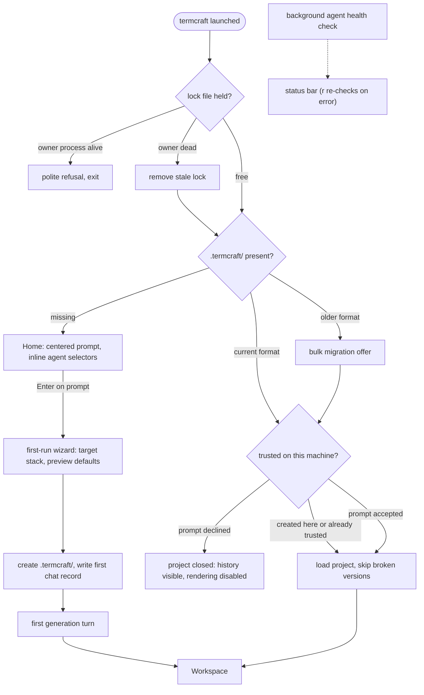

What happens between typing `termcraft` in a directory and working in the Workspace: the single-instance check, finding or creating the project folder, the workspace-trust gate that guards design-code execution, and the first generation.

## Walkthrough

1. Single-instance check: the lock file holds the owner process's PID. If the owner is alive, termcraft refuses to start and exits politely; if the owner process is dead, the stale lock is removed automatically and startup continues.
2. termcraft then looks for `.termcraft/` in the current working directory, with three outcomes: missing opens the Home screen; present and in the current format proceeds to the trust check below and then the Workspace, with the active chat's history restored — there is no project picker, since separate projects live in separate directories; present but in an older format triggers a bulk migration offer first. Migration mechanics: `flows/migration.md`.
3. Workspace trust: designs are code and rendering executes them, so a project this machine has not trusted yet — created elsewhere, typically arriving via `git clone` — shows a trust prompt before anything renders. Accepting records the decision in machine-local user state outside the project (a repository cannot ship its own trust grant); declining leaves the project closed, chat history visible but rendering disabled. A project created on this machine is trusted implicitly and never prompts.
4. The Home screen presents a large, centered prompt input focused on entry; `Esc` or `Tab` unfocuses it, following the same focus rules used everywhere else. Inline selectors beneath the prompt show the current agent · model · effort triple; with no project yet on disk, the choice is held in memory until the project is created.
5. On the first submit, the v1.0 first-run wizard collects the target stack (rust-ratatui, go-bubbletea, js-opentui, or generic) and preview defaults. termcraft then creates `.termcraft/` with that config and a zero-page project manifest, writes the first `user` record to the project's first chat, opens the Workspace, and starts the first generation turn. Turn mechanics: `flows/generation-turn.md`.
6. Failure branch: a failed first turn rolls nothing back — the error is written to chat and the designer simply sends the next message to retry.
7. Failure branch: if the agent CLI is missing or not logged in, the background health check — running since startup — surfaces the problem in the status bar; on Home's error state, `r` re-runs the check in place without restarting termcraft. On Windows the same check write-probes Codex's experimental sandbox and reports a silent workspace-write → read-only downgrade as an explicit error.
8. Failure branch: a page version that fails to load (corrupt, or no longer compiling) is skipped, and the project opens at the last valid version instead; a data file newer than the binary understands is a hard error naming the offending file.
9. Failure branch: if the terminal is smaller than the app frame's minimum size, termcraft shows an "enlarge the window" placeholder screen — distinct from the status-bar warning shown when only the preview is smaller than a page's minimum size.

## Source anchors

- `docs/superpowers/specs/2026-07-13-termcraft-design.md` — §3.1 launch, Home, and workspace trust, §3.6 picker state before project creation, §8.1 first-run wizard, §9 lock/agent/sandbox/corrupt-file/terminal-size failures
- `design/01-home.dc.html` — Home screen states
- `design/14-first-generation.dc.html` — first generation experience
- `design/16-wizard-migration.dc.html` — wizard and migration offer screens
