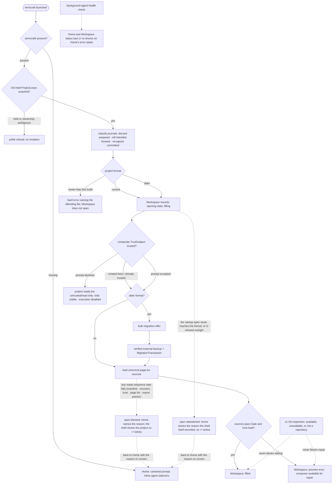
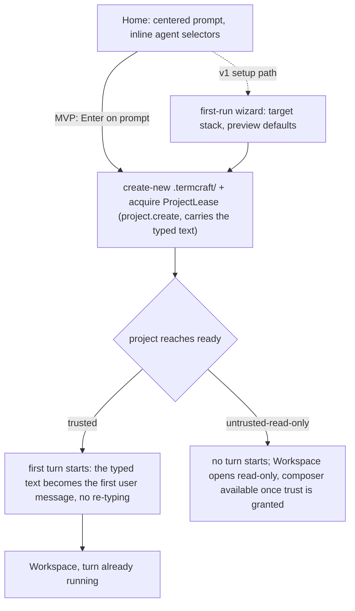

What happens between typing `termcraft` in a directory and working in the Workspace: the single-instance check, project discovery, the workspace-trust gate that guards design-code execution, canonical-source loading, and first generation. Git inspection is optional and never gates startup. termcraft is an npm package run under Bun (master §4.1); the interactive launch is one of three argv modes of the same installed entry (`src/main.tsx`, run through `bun <entry> …`) — an argv scan runs the `_host --stdio` design-render child or the headless `termcraft export [dir]` command ahead of it — and for the interactive mode the composition root opens (or creates) the project on disk and assembles the real Kernel graph the UI drives.

Home's own submit path — creating the project itself — is a self-contained second flow:

**Gap C — CLOSED (fix-bundle spec §3.1).** The designer types a description into Home's
prompt, presses Enter, and the SAME text becomes the first user message of a running turn by
the time the Workspace mounts — no empty composer, no second send. `project.create` already
carried the typed text in its payload; `runProjectReadySequence`
(`src/core/kernel/model/handlers/project.ts`) now reads it and, once the project reaches
`ready` with `trust === "trusted"`, calls `beginTurn` — the SAME function `turn.start`'s own
handler composes, so there is exactly one path into a turn. The chain fires LAST in the ready
sequence, after `finishOpen` and the chat-tail restore: admission reads
`workspace.local.toml`'s `activeChatId`, which only exists once the project is ready.
`project.open` carries the identical optional `text` field for the same reason (a
composition root deciding per launch whether Home's Enter means create-or-open must not have
to fake a `project.create` against an existing project just to keep the first-turn text) — see
Gap D below for the fix that finally makes Home's own dispatch choose between the two. An
untrusted project (declined or not yet granted) never starts a turn: `beginTurn` is gated on
the SAME `trust === "trusted"` condition `kernel.preview.enable` already uses, one check with
two consequences — an untrusted project executes design code neither through preview nor
through the agent.

**Gap D — CLOSED (fix-bundle spec §2.4; narrowed again by spec 2026-08-02, Task 12).**
Relaunching termcraft in a directory that already holds a `.termcraft/` — chats, history,
canonical pages and all, content or not — now mounts the Workspace on the very first frame,
not the empty Home prompt. The ~30s ready sequence itself does NOT shrink —
`runProjectReadySequence` is untouched, so chat, tabs, and preview still all arrive together at
`finishOpen` — what changes is which screen the designer watches it fill: the Workspace's own
opening state (below), not a live-looking Home that has nothing left to do. Two things changed
together the first time (fix-bundle spec §2.4); spec 2026-08-02 then retired the weaker of the
two predicates outright (Task 6) and added the mechanism that lets the Workspace mount before the
Kernel has said anything at all:

- `ShellLaunchV1` (`src/entrypoint/types.ts`) now carries exactly one field, `existing: boolean`
  — the open-vs-create fact `openOrCreateProject` (`src/entrypoint/model/create-shell.ts`) always
  computed and, before fix-bundle §2.4, threw away. Turning `existing` into `ShellLaunchV1` is a
  straight pass-through now, not a fold — inlined directly at `interactiveShell`'s one call site
  (`const launch: ShellLaunchV1 = { existing }`) rather than living in its own named
  `resolveShellLaunch` function, since a single-field pass-through had no remaining logic to name
  (code review 2026-08-03, Finding 6). It used to also fold in a separate CONTENT probe —
  `probeProjectContent`, one manifest read plus one `ChatStore.list()` resolving a three-way
  `"has-content" | "no-content" | "unknown"` outcome, with `"unknown"` folded to `hasContent: true`
  for an existing project so a failed read never fabricated `"no-content"` (fix round 1,
  Finding 1) — into a second field, `hasContent`, that `deriveScreen` used to route on instead of
  `existing`. Spec 2026-08-02 retired both the probe and the field: `deriveScreen` (below) now
  routes on `existing` alone, so the probe could only ever disagree with the predicate that
  actually decides the screen, and the ONE case it existed to separate — an existing-but-empty
  project — was already practically unreachable (`createProject` always mints the first chat
  header on creation, so an existing project is essentially never actually empty).
- `run-app.ts`'s `runApp` dispatches `project.open` itself, once, right after the shutdown path
  is wired up (moved there in fix round 1: earlier it ran before `boundary.onSignal` registered
  the SIGINT/SIGTERM handlers, so a Ctrl-C during the open sequence had no handler to catch it),
  whenever `shell.launch.existing` is true (spec 2026-08-02 narrowed this from `hasContent`) —
  the ONE interactive caller of `project.open` (`run-export.ts`'s headless export driver was
  previously the only one in the whole of `src`). Two failure branches — the dispatch itself
  rejecting (`result instanceof Error`) and the Kernel refusing it (`result.status ===
  "rejected"`) — both `console.error` the cause AND call `root.abandonStartupOpen(failure)`
  (`UiRootHandle`, `src/ui/app/model/root.tsx`), which flips `UiLocalState.startupOpenPending`
  false so the Workspace does not sit "opening" forever. Each branch builds the `failure` it
  passes from what it actually knows — the dispatch error's own message, or the Kernel guard code
  the rejection carried — and `abandonStartupOpen` records it in a SECOND UI-local reading,
  `UiLocalState.startupOpenFailure` (branch review finding 2, 2026-08-03). That reading is what
  the user reads: `App.tsx` composes it with the mirror's own `openFailure` into the single prop
  `HomeOpenFailurePanel` is gated on, so this path lands on a Home that NAMES why the last attempt
  failed and offers the same ⏎ retry (`home-submit` dispatches `project.open` for it, below). It
  is deliberately a separate reading rather than a write into `ProjectMirror.openFailure`: that
  field is Kernel truth, set only by `kernel.project.blockOpen` (which fires from INSIDE the ready
  sequence, step 11 below), and neither branch here was ever admitted, so neither could have been
  blocked. The two can never both hold for one open attempt, which is what makes composing them
  lossless. The `console.error` calls remain a diagnostic only — they reach the trace file
  (tracing on) or a held buffer flushed at quit (tracing off), never the screen — and were never
  the surface.
- `deriveScreen` (`src/ui/mirror/model/screen.ts`) no longer waits for `finishOpen` to leave Home.
  Its `ScreenInput` gained two fields: `startupOpenPending` — seeded from `UiEnv.projectExists`
  (the SAME `existing` fact) into `UiLocalState.startupOpenPending` at UI construction, before any
  Kernel event exists to read — and `openFailed` (`ProjectMirror.openFailure !== null`, this time
  the genuine kind, set only by a real `blockOpen`). `projectId === null && startupOpenPending &&
  !openFailed` now mounts `"workspace"` directly; NOT a new `ScreenKind` — the Workspace's own
  opening state (`Workspace.tsx`'s `filling`, `mirror.project().projectId === null`) is what
  fills in as the ready sequence's events arrive, so the transition to a populated Workspace is a
  re-render, never a remount.
- Home's own Enter (`ui/app/model/intent.ts`'s `home-submit`) still picks `project.open` over
  `project.create` for the SAME `deps.env.projectExists` fact, but what reaches this branch has
  narrowed along with everything else: since the startup dispatch above already tried
  `project.open` once for every existing project before Home could even be showing, the ONLY way
  this branch fires now is the RETRY — the startup dispatch failed to reach the Kernel, was
  rejected, or was later blocked (the three cases the two bullets above and step 11 below each
  cover). `home-submit` clears the typed prompt only once its OWN dispatch resolves accepted,
  never on a rejection (fix round 1, Finding 2 — the identical treatment Task 11 already gave
  `composer-submit`), so a retry racing the composition root's own dispatch never silently
  discards what the user typed.

Trust is not a complication for an already-trusted project: an existing project opened on the
machine that created it resolves `trusted` and goes straight to the Workspace. A moved, copied,
or otherwise never-before-trusted workspace resolves `untrusted-read-only` instead, and —
CORRECTED (trust-prompt-on-open fix, 2026-08-03; spec §3.1 required this from the start) — the
Workspace mounts the existing `TrustPrompt` popup for it before anything else renders, rather
than landing silently on the read-only screen the way it used to: `deriveScreen`
(`src/ui/mirror/model/screen.ts`) now checks a session-scoped `trustPromptDismissed` flag
(`UiLocalState.trustPromptDismissed`, `src/ui/app/model/deps.ts`) alongside `trust`, so an
`untrusted-read-only` resolution shows `"trust-prompt"` until the designer actually answers it,
and only THEN can it become `"read-only"`. Enter (`trust-accept`) grants trust and the Workspace
fills exactly as an already-trusted project would; `Esc` (`trust-decline`) sets the flag and
lands on `"read-only"` for the rest of this run, with the preview pane now naming that state
explicitly instead of hanging on the generic "preparing preview…" text. The decision is
session-scoped only — there is no in-app way to re-open the prompt or grant trust later in the
same run; relaunching termcraft is what re-resolves trust fresh and shows it again. Interaction
with Gap C: once both land, Home is reached only from a genuinely fresh directory or a startup
open that failed (Gap D above, step 11 below) — an existing-but-empty project is no longer a Home
case at all — and its Enter is the only entry into the first turn.

## Walkthrough

1. Single-instance check: an existing project acquires `ProjectLease` through an
   OS-held lock before mutation. For a missing project, Home performs no project
   write; first submit creates `.termcraft/` with create-new semantics and then
   acquires its lease. PID, process start time, hostname, and nonce are
   diagnostic only; no lock is reclaimed from any of them. If ownership cannot be
   proved or the filesystem has unreliable lock semantics, writable startup refuses.
   Before either the lease acquire or the create-new `.termcraft/`, a durability
   pre-flight (the cheap volume-type gate composed with a real directory-flush
   probe) refuses a volume that cannot demonstrate durable writes — a network
   drive or a volume with no write-through — before any mutation is attempted.
2. Project discovery has three outcomes: a missing `.termcraft/` opens Home; a
   current project acquires its lease, finishes transaction recovery, and proceeds
   through trust; an older project performs the same journal recovery, then after
   trust offers bulk migration before design-code execution. There is no project
   picker. The verified-backup-then-`MigrationTransaction` protocol the offer would
   run is built and fault-injection tested, but the shipped migration chain is
   empty — no project format newer than 1 has ever existed, so this branch has
   nothing to migrate yet. Migration mechanics: `flows/migration.md`.
3. Before Workspace, prepared plans without commit intent are discarded, every
   durable intent is rolled forward, and committed journals are recognized without
   rechecking targets. Unexpected target hashes stop in recovery conflict and are
   never overwritten. Garbage-collecting a recognized-complete journal's directory
   is a v1 target that has not landed; today its directory is simply left in place.
   After journal recovery, an unconditional orphan-turn scan closes every turn a
   restart left mid-flight exactly once: any chat holding a user record with no
   matching terminal record gets a durable `system:error` record appended —
   "termcraft restarted before this turn finished." — so a crashed turn is visible
   in chat history rather than silently missing; a chat with unresolved corrupt
   trailing bytes is skipped for explicit repair instead. Workspace trust then
   evaluates canonical path, project-root filesystem identity,
   portable `projectId`, and Git repository identity when available — exactly the
   fields the composite `TrustSubject` key is hashed from. Replacing the workspace
   or `.git` invalidates trust; commits or branch switches do not while all
   TrustSubject fields remain unchanged. Declining completes open as ready but
   untrusted/read-only: chat and history remain visible, execution stays disabled,
   and `ProjectLease` remains held until explicit close. Trust resolution and
   read-only enforcement have both landed: the open sequence resolves trust as it runs
   (a fresh project's implicit grant on create; an existing project's prior durable
   grant honored on open, otherwise `untrusted-read-only`), and on an untrusted project
   the guards reject every command except `project.setTrust`, `project.close`, and
   read-only `history.open`. What the one-shot open command still cannot do is block on
   an interactive trust prompt as a round trip, so a never-granted subject opens
   `untrusted-read-only` and the designer's accept/decline is carried by a follow-up
   `project.setTrust`.
4. After trust, termcraft loads each page's canonical `.termcraft/pages/<slug>/page.tsx`
   by reading and hashing its bytes; it never silently substitutes another source.
   The composition root now assembles the real graph, so the Gate runs over every
   canonical source as part of the open sequence: each page becomes a `ready`
   descriptor or, when its source fails the Gate, an `invalid` one, and the Workspace
   still opens with that error surfaced and the composer available so the designer can
   send a repair turn against the broken source. The Gate's source-only stages
   (import-allowlist, page-contract, lints) run this way today, and its type-check
   stage runs live too (phase-8 Task 7 — a resolved compiler path plus the generated
   `runtimeDts` are always supplied by the composition root). The
   host's own hash-verified page load is composed into the Kernel and runs once a
   preview session is established for a page (`preview.select*`), which now happens at
   launch: trust resolving to `trusted` enables the preview machine, the open sequence's
   own page descriptors name an active page, and the shell's subscriber dispatches
   `preview.selectPage` for it — so a trusted project with at least one readable page
   drives a real host session from the Workspace. The open sequence also
   validates the durable export pointer before finishing (on both open paths); a `null`
   pointer — no export has ever been published — never blocks. In v1, usable Git history also makes explicit Restore
   available after its index, freshness, confirmation, and Gate checks; unavailable
   or unsuitable history leaves the repair path unchanged.
5. Git is an optional v1 capability, not a project prerequisite. A missing Git executable, a directory outside a repository, an unborn repository, or a Git inspection error does not prevent the Workspace or broken-source repair state from opening. Design, generation, preview, pins, chats, migration, and export continue; only history and commit controls show their corresponding unavailable or limited state.
6. Home is now reached in exactly two cases (Gap D above, spec 2026-08-02): a genuinely fresh directory with no `.termcraft/` yet, and a startup open that failed — whether abandoned before the Kernel ever admitted it (Gap D's two failure branches) or blocked partway through the ready sequence (step 11). The screen itself is unchanged for either case: a large, centered prompt input focused on entry; `Esc` or `Tab` unfocuses it, following the same focus rules used everywhere else. Inline selectors beneath the prompt show the current agent · model · effort triple; with no project yet on disk, the choice is held in memory until the project is created. Both failure cases additionally carry the red-bordered failure panel below the prompt, naming what went wrong and offering the ⏎ retry; the two differ only in who authored that reason — the Kernel for a blocked open, the shell itself for an abandoned one (branch review finding 2, 2026-08-03).
7. On first submit, termcraft creates portable `project.toml`, machine-local
   `workspace.local.toml`, generated exclusions, and a UUIDv7 chat header through
   one ordinary project transaction, computes the new project's complete
   `TrustSubject`, and records the machine-local implicit trust grant. The turn spine
   is now real end to end — `turn.start` composes admission → attempt → gate-retry →
   finalize, and admission durably appends the first user record before the agent
   starts. What the interactive Home path does on submit is dispatch `project.create`
   (a genuinely fresh directory) or `project.open` (the RETRY case, spec 2026-08-02 —
   a startup `project.open` that failed to dispatch, was rejected, or was later
   blocked; Gap D above walks through all three) — whichever matches
   `deps.env.projectExists`, the SAME `existing` fact `ShellLaunchV1` carries —
   carrying the typed text either way; once that project reaches `ready`
   trusted, `runProjectReadySequence` chains straight into `beginTurn` with that SAME
   text (Gap C, spec §3.1, closed) — one keystroke on Home starts both the project and
   its first generation turn, no second send from the Workspace composer. An existing
   project never reaches Home at all on a clean open: the composition root dispatches
   `project.open` at startup and the Workspace opens directly (Gap D). The two routes
   back to Home for an existing project are both failures of that same startup open —
   blocked partway through the ready sequence (step 11), or abandoned before the Kernel
   ever admitted it (Gap D above) — and both now arrive with the reason named on screen,
   from two different authors: the Kernel's own `safeMessage` for the blocked open, the
   shell's own account of the dispatch outcome for the abandoned one. The second of those
   two abandon branches (`result.status === "rejected"`) IS a `CommandResultV1` carrying a
   Kernel guard code, so that dispatch DID reach the Kernel and was refused by it — which
   is why its reason quotes that code; only the first (`result instanceof Error`) genuinely
   never got there, and its reason is the dispatch error's own message. The
   v1 setup path may first run the target-stack and preview-defaults wizard. Turn
   mechanics: `flows/generation-turn.md`.
8. Failure branch: if the agent exits unsuccessfully or the Gate rejects the proposed sources before apply, no canonical source is changed. The error is written to chat and the designer can send the next message to retry. This pre-apply guarantee does not add crash-safe atomicity to a later multi-file apply.
9. Failure branch: if the agent CLI is missing or not logged in, the background health check — running since startup — surfaces the problem in the status bar; on Home's error state, `r` re-runs the check in place without restarting termcraft. The check itself is implemented. It runs a minimal query and reads the reply until something classifies it: the CLI announcing itself means installed and ready, an authentication signal means not logged in, and a failure to start the process at all means not installed. It is bounded by a deadline so a CLI that connects and then says nothing cannot hang startup, and it never resolves the ambiguous cases as ready — an inconclusive probe reports a problem rather than letting a paid turn start against a broken backend. It never throws, so a launch sequence cannot be taken down by it.
   - *Isolation:* the probe is confined exactly as a real turn is, because it runs before the designer has answered the trust prompt. It loads no project settings, runs in a scratch directory rather than the user's project — otherwise a project's own session-start hook could execute at launch — refuses tool calls under the same deny-by-default veto a turn uses, and has its CLI adopted into an owned process tree that is released on every outcome, so a probe process that ignores the abort is still reaped.
   - *Surfacing:* the Home health line and the `r` re-check are real UI end to end (phase-8 WP-5): `home-recheck` re-runs the injected probe via `refreshAgentHealth`, and the composition root now injects the real background probe (`entrypoint/model/agent-health.ts`'s `createAgentHealthProbe`, wrapping the live `AgentBackend`) at startup, so the launch UI reads the live CLI check rather than a placeholder. `AgentHealth` (`ui/agent-health`, extracted out of `ui/home` 2026-08-02 so `ui/workspace` can read the same reading without depending on `ui/home`) carries no `version` field at all (phase-8 Task 13 dropped it) — `AgentInfo` never had one to report. The combo's `agent`/`model`/`effort` no longer ride this probe either (finding §2.7, phase-8 Task 13): `resolveDefaultAgentSelection` reads the registry's declared default synchronously at composition and seeds it straight into `UiDeps.local.agentSelection`, so Home's combo paints on the first frame instead of waiting behind this probe's real cold spawn.
   - *Workspace surfacing (spec 2026-08-02):* the SAME `local.agentHealth` atom now also feeds the Workspace's status bar — `ui/agent-health/model/badge.ts`'s `agentHealthBadge` renders it in the `hint` slot, behind read-only, a running turn, and a halted preview in that precedence order (`Workspace.tsx`'s own comment on the slot), since those three are more urgent than an ambient health fact. There is no second probe and no Workspace re-check affordance: `WorkspaceLocalState.agentHealth`'s own doc comment (`ui/workspace/types.ts`) records this as KNOWN and DELIBERATE (design 30 §"The long-lived badge"), not an oversight — the probe runs once at startup (plus Home's manual `r`) and never again, so signing in to the agent CLI in another terminal leaves the Workspace badge exactly as red as it was until termcraft restarts. A `/recheck` action was considered and declined; the design only ever mandated `r` on Home's own error state. The same reading also feeds `HostCrashPanel.tsx`'s `agentBlocked` note (`agentBlockedNote`, `flows/interactive-prototype.md`) — the two lines a halted preview adds when its own F6 repair route cannot run because the agent is `blocked`/`missing`, built from the same badge so the panel and the status bar can never disagree.
   - *v1.0:* once Codex joins as the second backend, the same check additionally write-probes Codex's experimental Windows sandbox and reports a silent workspace-write → read-only downgrade as an explicit error. The health vocabulary already carries that state, but nothing produces it: this does not apply to MVP, which ships Claude Code only.
10. Failure branch: a data file newer than the installed termcraft understands is a hard error naming the offending file — `project.toml`, `workspace.local.toml`, and the transaction journal format are each independently version-gated this way. If the terminal is smaller than the app frame's minimum size, termcraft instead shows an "enlarge the window" placeholder screen — distinct from the status-bar warning shown when only the preview is smaller than a page's minimum size.
11. Failure branch: an open that cannot finish. Nine distinct steps of the ready
    sequence — the manifest read, the workspace-state read, transaction recovery,
    the orphan-turn scan, a corrupt chat found by that scan, trust resolution, the
    page listing, a page-source read, and the export-pointer read — all funnel into
    one `blockOpen`, which leaves the project machine in `blocked`. That state's only
    legal exits are a recovery retry (which needs a domain and action id no screen
    supplies) and a close, so until recently a blocked open was a dead end: Home kept
    looking healthy, and every Enter was rejected `CAPABILITY_UNAVAILABLE` silently.
    Both halves are wired now. The shell mirrors the failure (`openFailure`, plus an
    `opening` flag that distinguishes "no project" from "a project is opening", so the
    same Enter cannot fire a second, rejected open) and renders it on Home as a
    red-bordered panel carrying the Kernel's own `safeMessage` verbatim, and the shell
    dispatches `project.close` to walk the machine back to `closed` — the honest
    recovery, since the project never became ready and closing releases the lease the
    failed open took — which is what makes the panel's "⏎ retries the open" true. The
    panel deliberately survives that close, and the recovery is latched per failure
    object so a second genuine block is recovered again while the many project events
    that merely carry the same failure forward are ignored. Since spec 2026-08-02 (Gap D
    above), this `blockOpen` branch is the only route by which an existing project reaches
    Home *carrying a reason the KERNEL authored*: a startup open that never reaches this
    far — the dispatch itself rejecting, or the Kernel refusing it outright — also drops
    back to Home (Gap D's two abandon branches) and, since branch review finding 2
    (2026-08-03), also with a reason on screen — but one the shell recorded itself, held in
    a separate UI-local reading and composed into the same panel, because `openFailure`
    stays `null` for an open the Kernel never admitted and the UI must not fabricate a
    Kernel fact. Every other existing-project open mounts and fills the Workspace directly.
    The two readings are mutually exclusive for a single open attempt — the composition
    reads Kernel truth first — so exactly one reason is ever on screen.

## Source anchors

- `src/main.tsx` — the interactive executable root, the installed package's `bin` target run through Bun: an argv scan dispatches one of three modes of the SAME entry — `_host --stdio` runs the design-host stdio loop, `termcraft export [dir]` runs the headless export CLI, and anything else `bootstrap`s the interactive app; guarded by `import.meta.main` so importing it never seizes the terminal.
- `src/entrypoint/model/bootstrap.ts` — resolves the project root from argv against the working directory, then composes the shell (`createShell`) and the running app (`runApp`).
- `src/entrypoint/model/create-shell.ts` — the composition root: `openOrCreateProject` opens (or, for a fresh directory, creates) the project on disk BEFORE the Kernel exists, and returns which one happened (`existing`) alongside the `OpenProject` handle; turning that into `ShellLaunchV1 { existing }` (spec 2026-08-02, Task 6) is now a straight pass-through inlined directly at that one call site — `const launch: ShellLaunchV1 = { existing }` — rather than living in its own named `resolveShellLaunch` function, since a single-field pass-through had no remaining logic to name (code review 2026-08-03, Finding 6); the result is exposed on the shell's own `launch` field and echoed onto `UiEnv.projectExists`. The separate content probe this used to fold in — `probeProjectContent`, one manifest read plus one `ChatStore.list()` resolving a three-way `"has-content" | "no-content" | "unknown"` outcome — and the `hasContent` field it fed are BOTH GONE: `deriveScreen` (below) routes on `existing` alone, so the probe could only ever disagree with the predicate that actually decides the screen, and the case it existed to separate — an existing-but-empty project — was already practically unreachable (`createProject` always mints the first chat header). Also wires the 17 store/gate/host/agent adapters into `createKernel`, adapts the composed `Kernel` to `ui`'s `KernelPort`, and closes in reverse-acquisition order (Kernel → host supervisor → project lease) so a teardown rejection can never abandon the lease. `acknowledgeDisplay` is wired to a real frame-token ledger (phase-8 Task 16, via `toPreviewSessionHandle`), and a live run now reaches it — `kernel.preview.enable` fires once trust resolves to `trusted` and the shell dispatches `preview.selectPage` for the active page, so the preview machine reaches `live` (`flows/interactive-prototype.md`).
- `src/entrypoint/model/run-app.ts` — `runApp`'s Gap D startup dispatch: when `shell.launch.existing` is true (spec 2026-08-02 narrowed this from `hasContent`), dispatches `project.open` at the `KernelPort` right after the shutdown path is wired up (after `startShutdownPath`, fix round 1 — so SIGINT/SIGTERM are already handled before this awaits), using a synchronous `peekStateRevision`/`peekSnapshotEnvelope` bootstrap-snapshot peek (shared with the pre-existing `peekRunningTurn`) to build the dispatcher's `expectedRevision`. Its two failure branches — `result instanceof Error` and `result.status === "rejected"` — both call `root.abandonStartupOpen(failure)` (`UiRootHandle`, `root.tsx` below) and log via `console.error`, never silently left as an endlessly-opening Workspace. Each branch composes the `failure` it passes from what it alone knows: a `startup-open-dispatch-failed` reason carrying the dispatch error's own message, or a `startup-open-rejected` reason carrying the Kernel guard code the rejection reported. That value is the screen-level surface (branch review finding 2, 2026-08-03) — it reaches `HomeOpenFailurePanel` through `UiLocalState.startupOpenFailure` and `App.tsx`'s compose — while the `console.error` calls stay what this file's own header comment says they are: a trace-file diagnostic, never a surface.
- `src/core/kernel/model/handlers/project.ts` — `runProjectReadySequence`, the post-admission "reach ready" spine `project.create`/`project.open`/`project.retryOpen` share: transaction recovery, the orphan-turn scan, trust resolution (implicit grant on create; a prior durable grant honored on open, else `untrusted-read-only`), `enablePreviewIfTrusted` (fix-bundle Gap A, spec §2.2 — applies `kernel.preview.enable` right after trust resolves to `trusted`, before `finishOpen`, so the Preview machine leaves `disabled` for the snapshot the UI first sees; an untrusted project stays `disabled`), per-page Gate descriptors, durable export-pointer validation, `finishOpen`, two independent chat reads (fix-bundle Gap E, `flows/chats.md` for the full picture): `listChatSummaries` publishes the project's FULL on-disk chat listing as `chat.changed`, and `restoreActiveChatTail` restores only the active chat's persisted tail as `chat.records` — a listing failure degrades to the active chat alone, a tail failure costs only the scrollback — and, last, `beginTurn` (fix-bundle Gap C, spec §3.1, closed): when `trustSource` carries a first-turn `text` and trust resolved to `"trusted"`, the SAME function `turn.start`'s own handler uses starts the first turn from it, chained after `finishOpen` and the chat-tail restore because admission reads `workspace.local.toml`'s `activeChatId`. Also `project.setTrust`, the follow-up accept/decline (which calls the SAME `enablePreviewIfTrusted` helper when it grants trust on an already-open project), and the documented no-interactive-prompt gap (a one-shot open command cannot block on a prompt).
- `src/core/kernel/model/handlers/turn.ts` — `beginTurn`: mints the turn id, applies `beginAdmission`, and records the id as the Kernel's active turn, all three synchronously with no `await` between them, then launches the turn's async composition. Both `turn.start`'s own handler and `runProjectReadySequence`'s Gap C chain call this SAME function — there is exactly one path into a turn.
- `src/ui/app/model/deps.ts` — Home's local `prompt` atom and the Workspace's local `composer` atom: two separate pieces of UI state with no carry-over between them; irrelevant to Gap C's fix, since the first turn now starts from the Home text directly at the Kernel, never by pre-filling or copying into the Workspace composer.
- `src/core/capabilities/model/guards.ts` — `projectUntrustedReason`/`projectNotReadyReason`: the read-only enforcement on an untrusted project (only `project.setTrust`/`project.close`/`history.open` survive) that "execution disabled on decline" refers to, plus the pre-ready command gate.
- `src/store/lease/model/lease.ts` — `ProjectLease`: the non-blocking Windows OS lock held for the process lifetime, and the bounded advisory record (pid, process start time, hostname, nonce) that is always diagnostic, never proof of ownership; refuses acquisition when another instance already holds the lock.
- `src/store/model/factory.ts` — `openProject`'s existing-project launch sequence (durability pre-flight → lease → `SafeProjectFs` → journal-format gate → recover transactions → format-too-new gate → read `project.toml`/`workspace.local.toml` → orphan-turn scan → open) and `createProject`'s single project-creation transaction (durability pre-flight → create-new `.termcraft/` → mints `project.toml`, `.gitignore`, `workspace.local.toml`, and the first chat header), followed by the implicit trust grant.
- `src/infrastructure/durability/model/probe.ts` — `probeDurability`: the durability pre-flight both sequences above run before any mutation of the target volume; composes the cheap `assertDurableVolume` gate with a real `flushDir` probe, refusing a network drive or a volume with no write-through.
- `src/store/transaction/model/journal-format.ts` — the separate `transactions.local/format.json` gate, read before any transaction directory is even listed; a newer journal format blocks the Workspace, a missing one is treated as version 1.
- `src/store/transaction/model/recovery.ts` — the startup scan: classifies each prepared transaction directory as discard / roll-forward / already-complete / conflict, in stable lexical order, before any project state is exposed.
- `src/store/transaction/model/engine.ts` — the old/new-image comparison applied during roll-forward: a target matching neither its planned old nor new image writes a conflict marker and is never overwritten.
- `src/store/transaction/model/wrappers.ts` — `admitTurn` (the turn-admission transaction that creates the first user record before an agent starts) is now called by the live turn spine (`turn.start` → `runAdmission`); the infrastructure-only `buildRestoreTransaction`/`buildMigrationTransaction` remain built-and-tested with no live caller (Restore and migration stay unwired).
- `src/store/trust/model/trust-store.ts` — `TrustStore`: builds a `TrustSubject` from canonical project path, project-root filesystem identity, `projectId`, and optional Git identity; checks and durably records grants; never fails open on a missing, corrupt, or tampered record.
- `src/store/trust/model/subject.ts` — the exact `TrustSubjectV1` byte encoding and SHA-256 key derivation; HEAD, branch, and commit deliberately never participate in the key.
- `src/store/migration/model/registry.ts` — the format-too-new gate shared by every durable file kind, and the migration chain itself, which is empty by design (no format newer than 1 has shipped yet).
- `src/store/migration/model/backup-store.ts` — the verified-backup protocol (copy every file → write manifest → durably flush → reopen and verify → `VERIFIED` marker) a bulk migration would run first; built and unit-tested, with no live caller yet.
- `src/store/toml/model/project-toml.ts` — `project.toml`'s schema (`project_id`, `name`, `created_at`, `target_stack`, `pages`) and its own format-too-new gate.
- `src/store/toml/model/workspace-toml.ts` — `workspace.local.toml`'s schema and its independent format counter; a corrupt file is preserved and reported, never silently discarded.
- `src/store/toml/model/gitignore.ts` — the generated `.termcraft/.gitignore` exclusion rules written at project creation.
- `src/gate/model/gate.ts` — `runGate`: the static import-allowlist, page-contract, and all five warning-lint checks that always run over a candidate source, plus the optional type-check/manifest/smoke-render stages a caller can inject; the `dropped-id` and `unlisted-navigation` lints each take an extra optional `GateInput` field (`referencedIds`, `listedSlugs`) and skip silently when the caller omits it. The composition root wires this Gate adapter into the Kernel, so the source-only stages AND the type-check stage (phase-8 Task 7) run over every canonical source at open.
- `src/host/session/model/source-mount.ts` — `loadPage`: the host child's source-hash verification, defense-in-depth import re-scan, dynamic import, and `meta`/default-export validation — the host side of "sources pass Gate and host load". Composed into the Kernel via the host-supervisor adapter and reached at launch, once the shell's preview subscriber (`src/ui/app/model/deps.ts`) dispatches `preview.selectPage` for the active page a trusted project's descriptors name.
- `src/agent/health/model/probe.ts` — `runHealthProbe`: the shared background health-check policy of step 9 — the bounded deadline, closing the adopted process tree on every path, and the refusal to report ready on an ambiguous answer; a backend supplies only its own message classifier
- `src/agent/claude/backend/model/probe.ts` — `probeClaudeHealth`: Claude's half of the same check — the isolated ping's query options and the installed/not-logged-in/ready classification of Claude's own message vocabulary, plus the scratch working directory that keeps a project's own settings from executing before the trust prompt is answered
- `src/agent/types.ts` — `AgentHealthState`: the health vocabulary the status bar would render, including the Codex-only `sandbox-degraded` state nothing produces in MVP
- `src/agent/claude/query/model/spawn-adopt.ts`, `src/infrastructure/process/model/job-object.ts` — the probe's CLI adopted into an owned process tree released on every outcome, the same ownership a real turn gets
- `src/ui/mirror/model/screen.ts` — `deriveScreen` (spec 2026-08-02, extended by the trust-prompt-on-open fix, 2026-08-03): which screen the app root mounts — `enlarge` below the minimum frame; with no `projectId` yet, `workspace` when `startupOpenPending` is true and `openFailed` is false, else `home`; otherwise `workspace` when `trust === "trusted"`, `trust-prompt` when `trust === null` OR (`trust === "untrusted-read-only"` and the prompt has not yet been answered this session), and `read-only` once `trust === "untrusted-read-only"` and it has. `ScreenInput` gained three fields that make this work: `startupOpenPending` — whether the composition root's own startup `project.open` (Gap D, `run-app.ts`) is still expected to land, known synchronously (seeded from `UiEnv.projectExists` before the UI even mounts) rather than waited for — `openFailed` (`ProjectMirror.openFailure !== null`, set only by a genuine `kernel.project.blockOpen`) — and `trustPromptDismissed` (trust-prompt-on-open fix, 2026-08-03), read from `UiLocalState.trustPromptDismissed` (`src/ui/app/model/deps.ts`), a session-scoped flag the `trust-accept`/`trust-decline` intents set and nothing else ever clears — the only way to see the prompt again is relaunching termcraft, which rebuilds the flag `false` from scratch. Before this fix, an `untrusted-read-only` resolution mapped straight to `read-only` with no prompt ever shown, silently missing spec §3.1's "before anything renders" trust prompt for exactly the case it exists for — a project never before trusted on this machine+path. `deriveScreen` no longer waits for `finishOpen` to leave Home: an existing project mounts the Workspace on the very first frame, and the ready sequence (steps 2-4 above) fills it in — a re-render, not a remount, since this is the SAME `"workspace"` `ScreenKind` reached earlier, not a new one.
- `src/ui/mirror/model/mirror.ts`, `src/ui/mirror/types.ts` — `ProjectMirror.openFailure`/`opening` (step 11): folded live from `kernel.project.blockOpen`'s own `{reason, failure}` metadata and from `kernel.project.beginOpen`/`beginCreate`, read from the metadata rather than cast, and left unchanged (with a warning) when that metadata is unreadable. `finishOpen` clears both; `finishClose` resets the whole slice EXCEPT `openFailure`, so the panel survives the recovery that closes the project.
- `src/ui/home/ui/HomeOpenFailurePanel.tsx` — the Home panel naming an open that did not happen: the failure's `safeMessage` verbatim, its `reason` as the title, and the "⏎ retries the open" line the recovery below makes true. It serves BOTH failure paths (branch review finding 2, 2026-08-03) — a Kernel-authored `blockOpen` reason and the shell's own account of a startup dispatch that was never admitted — because `App.tsx` (below) composes the two readings into the single prop it is gated on; the panel neither knows nor needs to know which one it was handed. The design has no screen for a project that fails to open; the red-bordered `homeErr()` shape is reused from `design/termcraft-engine.js:716-727` rather than invented, with the divergence flagged in-file.
- `src/ui/app/ui/App.tsx` — where the two open-failure readings become one prop: `mirror.project().openFailure ?? local.startupOpenFailure()`, passed to Home. Kernel truth is read first, and the fallback can only be non-null for an open the Kernel never admitted, so the compose is lossless rather than a precedence choice between competing accounts of the same event.
- `src/ui/app/model/deps.ts` — the blocked-open recovery (step 11): dispatches `project.close` when the mirror reports an `openFailure` with a still-null `projectId`, latched by failure-object reference so the recovery's own `finishClose` cannot re-trigger it in a loop.
- `src/ui/app/model/intent.ts` — the launch-relevant dispatches: Home submit → `project.open` when `deps.env.projectExists` is true, otherwise `project.create` (Gap D). Since spec 2026-08-02 the `project.open` arm is reached only by the RETRY case, never a first landing: an existing project's startup open (`run-app.ts`) already tried once before Home could even be showing, so what reaches this branch is that dispatch having failed to reach the Kernel, been rejected, or later been blocked (`home-submit`'s own comment walks through all three) — the user's Enter here must still dispatch `project.open`, never `project.create`, honoring the prior trust grant rather than re-granting it. The composer's first send → `turn.start`; the trust prompt's accept/decline → `project.setTrust`, and (trust-prompt-on-open fix, 2026-08-03) both arms also set `local.trustPromptDismissed` true, the session-scoped flag `deriveScreen` reads to stop re-showing the prompt for the rest of this run.
- `src/ui/app/model/deps.ts` — `UiEnv.projectExists` (Gap D): whether `root` was already a project when the process started, set by the composition root; read by `home-submit` (to choose `project.open` over `project.create`) AND by `createUiDeps` itself, which seeds `UiLocalState.startupOpenPending` from it directly — the same fact reaching `deriveScreen` (above) before any Kernel event exists. `startupOpenPending` only ever goes `true -> false`, never back (escalated decisions, Item 1, 2026-08-02), and the two ways it does are different in kind. The SUCCESS path is a derivation on the atom itself, recomputing to false whenever `projectId` is non-null, so it stops describing a project that is already open (without that, a later legitimate return to `projectId === null` with no `openFailure` would mount an empty Workspace shell with no exit). It reads that mirror field directly rather than hanging off one chosen subscription, which is what makes EVERY route to a non-null `projectId` clear it — the earlier shape was a guarded branch inside the `mirror.project` subscription in this file's own `runtime` connect hook, and any future route bypassing that one wiring would have stranded the flag (branch review finding 3, 2026-08-03). The FAILURE path is `UiDeps.abandonStartupOpen`, the named Reatom action for the two startup-dispatch failure branches — `entrypoint/model/run-app.ts`'s only callers, reached through `UiRootHandle.abandonStartupOpen(failure)` (`root.tsx` below) — where no `projectId` will ever arrive, so no derivation could see it end; it writes the flag directly AND records the reason in `UiLocalState.startupOpenFailure`, the SEPARATE UI-local reading `App.tsx` composes with `ProjectMirror.openFailure` for Home's failure panel (branch review finding 2, 2026-08-03). That reading is deliberately not folded into the mirror: `openFailure` is Kernel truth, and an open the Kernel never admitted has no Kernel account to report. `UiLocalState.agentHealth` is the SEPARATE probe-fed atom (M15/finding §2.7) both Home and, since spec 2026-08-02, the Workspace status bar read (step 9 above) — seeded with a `"checking"` placeholder, then overwritten by `refreshAgentHealth()`'s real probe result once at startup and again on Home's `r` re-check; nothing re-runs it once the Workspace is showing. Also the startup agent-health probe injection point (`agentHealthProbe`; the composition root now injects the real probe, phase-8 WP-5) plus the Kernel subscription and preview-frame consumer the mounted app activates. `UiLocalState.agentSelection` (phase-8 Task 13, finding §2.7) is the SEPARATE synchronous fact the composition root seeds at construction — `createUiDeps`'s sixth parameter — never fetched behind a probe.
- `src/ui/app/model/root.tsx` — `UiRootHandle.abandonStartupOpen(failure)` (spec 2026-08-02): the one new method on the handle `createUiRoot` returns, forwarding straight to `deps.abandonStartupOpen(failure)` — the seam `run-app.ts` needs because it only gets the handle back, never `UiDeps` itself, and has to reach into it after `createUiRoot` has already returned. It carries the reason as well as the fact (branch review finding 2, 2026-08-03), since that reason is what the resulting Home actually shows.
- `src/entrypoint/model/agent-health.ts` — `homeHealthFromAgentInfo`/`createAgentHealthProbe` (phase-8 WP-5): the pure `AgentInfo -> AgentHealth` mapper and the real probe factory the composition root builds around the live `AgentBackend`, returning health only since phase-8 Task 13. `AgentHealth` carries no `version` field — `AgentInfo` never had one to report. `resolveDefaultAgentSelection` (same file, phase-8 Task 13) is the sibling function delivering the registry's declared agent/model/effort default synchronously into `UiRootOptions.agentSelection`.
- `src/ui/agent-health/types.ts` — `AgentHealth`, the five-outcome union itself (2026-08-02, extracted out of `ui/home` so `ui/workspace`'s status bar can read the same reading without depending on `ui/home`); `ui/home`'s `homeSubmitAllowed` still imports it to decide whether Home's Enter is refused.
- `src/ui/agent-health/model/badge.ts` — `agentHealthBadge` (design 30 §"The badge vocabulary"): the status-bar hint badge for one `AgentHealth` reading — `ready` draws nothing; `checking`/`advisory` read amber-on-line; `blocked`/`missing` read bg-on-red; `options.short` drops the agent name below 100 columns. Its only real consumer is `ui/workspace`'s `Workspace.tsx` (below), reading `local.agentHealth` off the SAME probe result Home's own `r` re-check and startup reading feed. Home does NOT call this function: `ui/home/ui/Home.tsx`'s own `homeStatusBadge` renders the identical `local.agentHealth` atom through separate, hand-written logic, and the two deliberately disagree on wording for two outcomes — `badge.ts`'s own doc comment records why: `latched` reads `✗ {agent} unavailable` here versus Home's `✗ {agent} locked out`, and `checking` reads `⠹ checking {agent}` here versus Home's `⠹ checking {agent} — ⏎ disabled`. `agentBlockedNote` is `agentHealthBadge`'s sibling: the two-line note `HostCrashPanel.tsx` (`flows/interactive-prototype.md`) shows when a halted preview's own F6 repair route cannot actually run because the agent is `blocked`/`missing` — built from this same badge so the panel and the Workspace status bar can never state the fact two different ways.
- `src/ui/workspace/ui/Workspace.tsx` — the opening state (spec 2026-08-02, design 30): `filling = mirror.project().projectId === null`, read once and threaded through the status-bar mode chip (`" OPENING "`, bg-on-amber — `{ text: "OPENING", fg: "bg", bg: "amber" }`), the `page`/`size` segments (Home's own "opening project…"/"opening…" phrasing, verbatim), the hint-key row (a faint `⏎ send`, nothing else — no spinner, since nothing here is measurable or cancellable), the composer placeholder (`"project opening…"`), and the preview region (an amber bold "opening project…" headline, a blank spacer row, then a faint "reading .termcraft — preview arrives when it's ready" detail line — three rows, still no spinner). Enter itself stays refused while `filling`: `ui/app/model/keymap.ts`'s `KeyContext.projectOpen` (`ProjectMirror.projectId !== null`) gates `composerActive`'s `RETURN_NAMES` branch, the same visible-before-the-key-is-pressed `dis` hint-key treatment Home's own `projectOpening` guard already uses. None of this is a new `ScreenKind` — `deriveScreen` already returns `"workspace"` for it (`screen.ts` above), so every branch here is a plain prop threaded through the SAME reactive component, and the transition to a filled Workspace is a re-render.
- `src/ui/home/types.ts` — Home's own module doc comment states its narrowed reach directly (spec 2026-08-02): "Normally shown only before `.termcraft/` exists; an existing project opens straight into Workspace (Gap D)... an open that ends in the project machine's `blocked` state leaves `projectId` null, so `deriveScreen` holds Home over a folder that does have a project" — `HomeProps.openFailure` is what makes that second case legible. `homeSubmitAllowed` (submit refused unless `health.kind` is `"ready"`/`"advisory"`) stays in `ui/home` rather than moving to `ui/agent-health` with the type it reads — it is Home's OWN policy, and the Workspace composer is explicitly not gated on health (spec §"Decisions").
- `docs/superpowers/specs/2026-07-16-git-backed-page-history-design.md` — §1 optional Git, §5 broken canonical-source launch and repair, §7 explicit Restore, §9 Git availability states (v1; no Git-inspection code exists yet)
- `docs/superpowers/specs/2026-07-13-termcraft-design.md` — §3.1 Home and the workspace-trust prompt/decline UI, §3.6 picker state before project creation, §8.1 first-run wizard, §9 lock/agent/sandbox/data-file/terminal-size failure *presentation* — the design authority for these screens. Home, the trust prompt, and the health-line surfacing now exist as code (the `src/ui/*` anchors above); the first-run wizard remains a v1 target with no code yet.
- `docs/superpowers/specs/2026-07-16-production-storage-identity-design.md` — §8/§9/§12 source-of-record for `ProjectLease`, `TrustSubject`, and migration backup, which the `store/lease`, `store/trust`, and `store/migration` files above implement
- `docs/superpowers/specs/2026-07-16-turn-durability-staging-design.md` — §4/§10.2 source-of-record for startup transaction recovery, which `store/transaction` above implements
- `design/01-home.dc.html` — Home screen states
- `design/14-first-generation.dc.html` — first generation experience
- `design/16-wizard-migration.dc.html` — v1 wizard and migration offer screens
