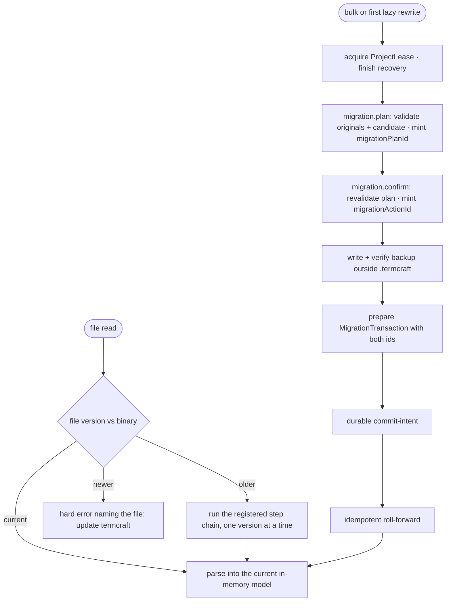

Stored data outlives any single termcraft binary. This document covers how old files are upgraded — lazily on read, or in bulk with a backup — and what happens when a file is newer than the program reading it.

## Walkthrough

1. Versioning ground rules (statics in `storage.md`): every data file kind carries its own independent version counter — `schemaVersion` in JSON, a typed header line in JSONL, `format_version` in TOML. Each canonical `page.tsx` instead declares static integer `kitApiVersion` for `@termcraft/runtime`.
2. The migration registry is an ordered chain of single-step upgrades per file kind. A breaking runtime API change ships a codemod for canonical current page sources. Codemods operate only on `.termcraft/pages/*/page.tsx`; historical Git objects and temporary history snapshots are never rewritten.
3. Lazy trigger: reading an old file may migrate it in memory, but before the first rewritten bytes are persisted `MigrationCoordinator` adds the exact original bytes to the current verified backup generation.
4. Bulk trigger: after trust, opening an old `.termcraft/` offers bulk migration in
   the wizard; the dedicated CLI migrate command dispatches the same
   `migration.plan`/`migration.confirm` Kernel state machine rather than bypassing
   domain guards. Planning mints a UUIDv7 `migrationPlanId` only after the exact
   rewrite set, transformed candidates, Gate result, backup destination, and required
   space are known. Confirmation revalidates that immutable plan and mints the
   UUIDv7 `migrationActionId` used by the backup, journal, events, and any recovery
   retry.
5. Backup policy: every rewrite requires a complete, verified machine-local backup outside `.termcraft`, regardless of Git status. The backup manifest records project identity, termcraft version, source schema versions, relative paths, sizes, and hashes. Failure or insufficient space prevents commit intent.
6. Failure branch: a file newer than the binary understands → hard error naming the file ("update termcraft"), no partial reads.
7. Failure branch: downgrades are unsupported — older binaries refuse newer data rather than guessing.
8. Historical Git sources are immutable inputs. A historical source with unsupported imports or `kitApiVersion` may remain browsable as an error state but is not eligible for Restore.
9. The project is still pre-code, so no users have a shipped numbered page-file layout. No migration from that abandoned design exists or is required; the first implementation starts with one canonical `page.tsx` per page.
10. Safety net: fixtures of every shipped format run through the chain, backup verification, fault injection, startup roll-forward, and current validation. Runtime-codemod fixtures exercise canonical current sources separately.
11. A freshness mismatch before `intent.json` discards the prepared publication and
    returns to idle without changing project bytes. Once intent is durable,
    cancellation and rollback are forbidden: startup routes the exact
    `migrationActionId` into the migration model's recovery transition and rolls the
    same journal forward.

## Source anchors

- `docs/superpowers/specs/2026-07-16-git-backed-page-history-design.md` — §3 canonical storage, §7 current-Gate requirements for Restore, §11 canonical-source acceptance criteria
- `docs/superpowers/specs/2026-07-13-termcraft-design.md` — §7.2 format versioning, runtime compatibility integer, and the migration registry, §3.1 bulk offer, §9 too-new file error, §10 migration fixtures
- `docs/superpowers/specs/2026-07-16-production-storage-identity-design.md` — mandatory external backup and storage identities
- `docs/superpowers/specs/2026-07-16-turn-durability-staging-design.md` — recoverable MigrationTransaction protocol
- `design/16-wizard-migration.dc.html` — migration offer screen
