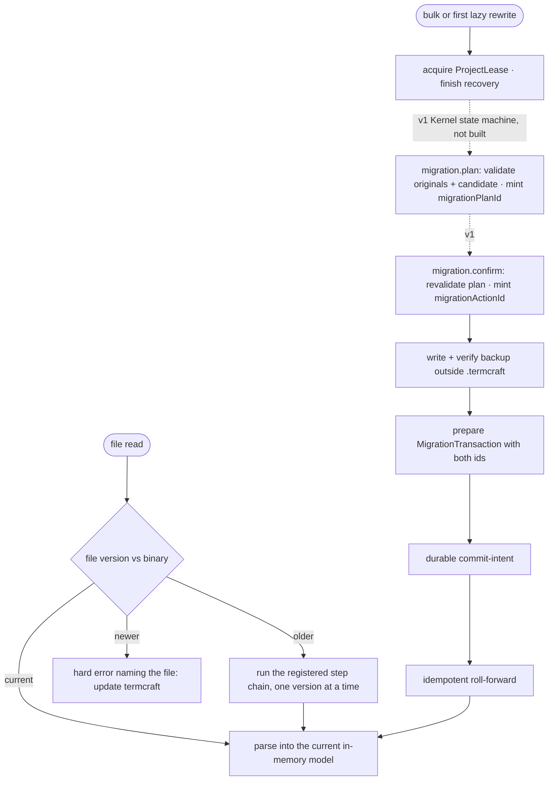

Stored data outlives any single termcraft binary. This document covers how old files are upgraded — lazily on read, or in bulk with a backup — and what happens when a file is newer than the program reading it.

## Walkthrough

1. Versioning ground rules (statics in `storage.md`): every data file kind carries its own independent version counter. Today this is real for three kinds — `project.toml`'s and `workspace.local.toml`'s own `format_version`, and the transaction journal's `journalVersion` (checked twice: once for the whole `transactions.local/` namespace via `format.json`, once per plan via `plan.json`). Chat and comment JSONL headers declare a `formatVersion` field too, but the decoder currently pins it to the literal `1` rather than reading it as an independent counter — see the failure-branch note below. Each canonical `page.tsx` instead declares a static integer `kitApiVersion`, checked by the Gate against a supported set (MVP accepts `1` only) rather than by a file-version gate.
2. The migration registry is an ordered chain of single-step upgrades per file kind, with a shared "too new" gate every kind can reuse. The chain is real, live lookup machinery — but it ships EMPTY: this repository has only ever produced format version 1 of anything, so there is nothing yet to walk. A breaking runtime API change is designed to ship a codemod for canonical current page sources, operating only on `.termcraft/pages/*/page.tsx` and never touching historical Git objects or temporary history snapshots — no such codemod pipeline exists yet.
3. Lazy trigger (v1; not implemented): reading an old file migrating itself in memory, with the original bytes folded into the current verified backup generation before the first rewritten byte is persisted, is design-only. No caller in the codebase invokes the registry's chain lookup outside its own tests, and no `MigrationCoordinator` exists — there is currently no code path that can even observe an "older" file, since no format has ever shipped above version 1.
4. Bulk trigger (v1; not implemented): opening an old `.termcraft/` offering bulk migration in a wizard, and a CLI migrate command dispatching the same `migration.plan`/`migration.confirm` Kernel state machine, both require the not-yet-built `core`/Kernel module and are described only in the Kernel command-contract spec. Planning is meant to mint a UUIDv7 `migrationPlanId` only once the exact rewrite set, transformed candidates, Gate result, backup destination, and required space are known; confirmation is meant to revalidate that immutable plan and mint the UUIDv7 `migrationActionId` used by the backup, journal, events, and any recovery retry. `store/transaction`'s `MigrationTransaction` wrapper already accepts exactly this shape (`migrationPlanId`, `migrationActionId`, `backupManifestDigest`) so the Kernel state machine has a proven target to call — it just has nothing to call it yet.
5. Backup policy: every rewrite requires a complete, verified machine-local backup outside `.termcraft`, regardless of Git status. This part is real and unit-tested: `createBackupStore` copies every file, writes a manifest (project identity, termcraft version, per-file relative path/size/hash/source-format), durably flushes both, reopens every copy and verifies it against both the source bytes and the manifest entry, and only then writes the `VERIFIED` marker — any failure at any step leaves every project file unchanged. What is not implemented is a pre-flight free-space check; a copy that runs out of disk just fails the step it's on, same as any other I/O error. `createBackupStore` itself is wired into production — `store/model/factory.ts` builds one on every `openProject`/`createProject` call and exposes it as `OpenProject.backups` — but nothing calls its `createBackup()` method outside the store's own tests yet, because no migration has ever shipped to trigger one.
6. Failure branch: a file newer than the binary understands → hard error naming the file ("update termcraft"), no partial reads. Implemented today for `project.toml`/`workspace.local.toml` (`ManifestTooNewError`/`WorkspaceStateTooNewError`, checked before the full field schema decodes) and for the transaction journal (`JournalTooNewError`, checked on both `format.json` and every `plan.json`). **Not yet implemented** for chat/pin JSONL headers: `formatVersion` there is schema-pinned to the literal `1`, so any other value — older or newer — surfaces as an ordinary decode/corruption error rather than this distinguished hard-stop.
7. Failure branch: downgrades are unsupported — older binaries refuse newer data rather than guessing. True by construction everywhere the too-new gate above is wired: an older binary sees the same `found > supported` comparison and refuses.
8. Historical Git sources are immutable inputs (v1; no Git-history code exists yet). A historical source with unsupported imports or `kitApiVersion` may remain browsable as an error state but is not eligible for Restore — Restore itself is out of MVP scope; no `system:restore` chat record is ever written by a live code path today, even though its reader shape and transaction wrapper both already exist.
9. No project has ever shipped the old numbered page-file layout that a prior design draft considered — canonical pages have always been implemented as one `page.tsx` per page. No migration from that abandoned design exists or is required.
10. Safety net (partially implemented): there is no fixture matrix running every shipped format through the chain yet, because only format version 1 has ever shipped — the migration chain's own test only asserts it stays empty. What is exercised is narrower: a synthetic, test-only migration proves the shared protocol end to end (backup → verify → transform → `MigrationTransaction` commit, plus the freshness-recheck failure path below), and the transaction engine's mandatory fault-injection crash harness covers the same durable install/intent/roll-forward machinery every `MigrationTransaction` would run through — but it is not migration-specific, since the engine treats every plan `kind` identically. Runtime-codemod fixtures exercising canonical current sources separately do not exist.
11. A freshness mismatch before `intent.json` discards the prepared publication and returns to idle without changing project bytes. This re-check is implemented as `MigrationTransaction`'s optional `precondition` callback, proven by the synthetic test above (`MigrationStaleError` on drift). Once intent is durable, cancellation and rollback are forbidden — this holds for every transaction `kind` by construction, migration included. What is **not** implemented is a migration-specific recovery state: startup's actual recovery scan (`recoverTransactions`) is fully generic, classifying and rolling forward any intended journal — including a `kind: "migration"` one — the same way it would any other; there is no dedicated "migration model" `idle -> recovering` transition routing on `migrationActionId` the way the Kernel command-contract spec describes, because no Kernel exists yet to own that routing.

## Source anchors

- `src/store/migration/model/registry.ts` — the shared "too new" format-counter gate (`checkFormatCounter`/`DataFormatTooNewError`) reusable by any of the three counter field names, and the live migration chain (`MIGRATION_CHAIN`, `findMigrationSteps`) — real lookup machinery, shipped empty by design since only format version 1 has ever existed.
- `src/store/migration/model/backup-store.ts` — `createBackupStore`: the verified-backup protocol (create-new action dir → copy every file → write manifest → durably flush → reopen and verify each copy against source and manifest → write `VERIFIED` last), under `{userStateRoot}/backups/{projectId}/{migrationActionId}/`, outside `.termcraft`. Built and unit-tested; `store/model/factory.ts` constructs it on every project open/create and exposes it as `OpenProject.backups`, but nothing calls its `createBackup()` method in production yet — no migration has ever run.
- `src/store/migration/types.ts` — `BackupManifest`/`MigrationRegistry`/`FormatCounterField` contracts the two files above implement.
- `src/store/model/factory.ts` — `openProject`'s `migrationsGate`: peeks `project.toml`/`workspace.local.toml`'s `format_version` (before either file's full schema decodes) and hard-stops the launch sequence on `DataFormatTooNewError` — the one place the diagram's "newer" branch is wired into a live project-open path today. Also `makeBackupStore`/`assembleOpenProject`: builds `createBackupStore` and exposes both it (`OpenProject.backups`) and the empty `defaultMigrationRegistry` (`OpenProject.migrations`) on every open/create, even though nothing yet calls `createBackup()` or the registry's chain lookup outside tests.
- `src/store/toml/model/project-toml.ts` — `project.toml`'s own `format_version` gate (`ManifestTooNewError`) ahead of its strict field schema.
- `src/store/toml/model/workspace-toml.ts` — `workspace.local.toml`'s independent `format_version` gate (`WorkspaceStateTooNewError`), checked ahead of the strict field schema; `loadWorkspaceLocalState` folds a too-new (or otherwise corrupt) file into the §6.1 preserve-and-report policy (reported, never silently rewritten). At launch this path is moot for the too-new case specifically: `migrationsGate` (`factory.ts`) already hard-stops on a too-new `format_version` before `loadWorkspaceLocalState` is ever called, so `WorkspaceStateTooNewError`'s preserve-and-report branch is reachable only outside the project-open sequence (e.g. direct calls in tests), not through `openProject` today.
- `src/store/transaction/model/journal-format.ts` — the whole-journal-namespace `transactions.local/format.json` gate (`JournalTooNewError`), read before any transaction directory is even listed; a missing file is treated as the implicit version 1.
- `src/store/transaction/model/plan.ts` — the per-plan `journalVersion` gate on each `plan.json` (`TRANSACTION_JOURNAL_FORMAT_VERSION`, the same `JournalTooNewError`).
- `src/store/transaction/model/wrappers.ts` — `buildMigrationTransaction`: a thin `kind: "migration"` pass-through carrying `migrationPlanId`/`migrationActionId`/`backupManifestDigest`, built and unit-tested alongside `buildRestoreTransaction`/`buildExportPublishTransaction`; MVP wires no caller for any of the three.
- `src/store/transaction/model/engine.ts` — `runTransaction`: install payloads → plan → durable intent → idempotent roll-forward → commit marker, the protocol a `MigrationTransaction` runs through, plus the optional `precondition` re-CAS step that implements the freshness recheck before intent.
- `src/store/transaction/model/recovery.ts` — the generic startup classify/act scan over `transactions.local/`; treats a `kind: "migration"` journal exactly like any other plan kind (discard / roll-forward / already-complete / conflict) — there is no migration-specific recovery routing.
- `src/entities/chat/model/decode.ts`, `src/entities/pin/model/decode.ts` — the chat/comments JSONL header decoders; `formatVersion` is currently `z.literal(1)`, so a header declaring any other version fails as ordinary `ChatDecodeError`/`PinDecodeError` corruption rather than a distinguished too-new hard-stop.
- `src/entities/page/types.ts` — `PageMeta.kitApiVersion`, the page-source runtime-compatibility integer.
- `src/gate/model/page-contract.ts` — `checkPageContract`: enforces `kitApiVersion` against `SUPPORTED_KIT_API_VERSIONS` (MVP: `{1}`) as a Gate-time fatal error — a static compatibility check, not a lazy per-file migration.
- `docs/superpowers/specs/2026-07-16-kernel-command-contract-design.md` — the `migration.plan`/`migration.confirm`/`migration.discardPlan`/`migration.retryRecovery` Kernel state machine, `migrationPlanId`/`migrationActionId` minting rules, and the note that the CLI migrate command dispatches the same Kernel path — none of this exists; no `core`/Kernel module.
- `docs/superpowers/specs/2026-07-16-git-backed-page-history-design.md` — §3 canonical storage, §7 current-Gate requirements for Restore, §11 canonical-source acceptance criteria (Restore is out of MVP scope; no Git-history code exists yet)
- `docs/superpowers/specs/2026-07-13-termcraft-design.md` — §7.2 format versioning and the migration registry's design intent, §3.1 bulk offer, §9 too-new file error, §10 the "every shipped format" fixture matrix (not yet built, since only one format has shipped)
- `docs/superpowers/specs/2026-07-16-production-storage-identity-design.md` — §12 mandatory external backup and the too-new hard-stop rule, source-of-record for the `store/migration`/`store/toml`/`store/transaction` files above
- `docs/superpowers/specs/2026-07-16-turn-durability-staging-design.md` — §11 the recoverable `MigrationTransaction` protocol (backup steps, freshness re-CAS before intent), source-of-record for what `wrappers.ts`/`engine.ts` above implement
- `design/16-wizard-migration.dc.html` — migration offer screen (no `ui`/`host` wizard code exists yet)
