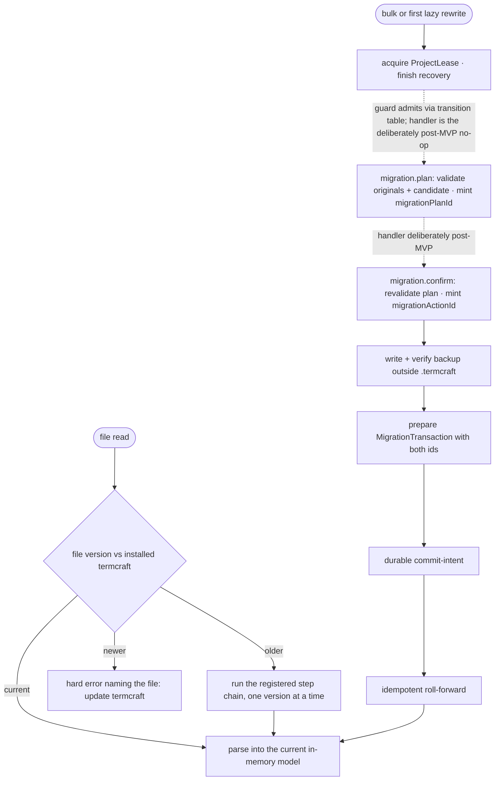

Stored data outlives any single termcraft install. This document covers how old files are upgraded — lazily on read, or in bulk with a backup — and what happens when a file is newer than the program reading it.

**Status (MVP phase-8 task 18):** the bulk-write side of this flow — the four `migration.*` commands (items 4 and 11 below) — is deliberately POST-MVP, not an oversight or a scheduling gap waiting its turn. MVP ships exactly one storage format version (item 1 below — every versioned file kind has only ever produced format version 1), so there is nothing to migrate FROM, and a migration step written against a single known version has no second version to migrate FROM or TO in a test — it would be unexercisable by construction. Building a real `migration` family handler stays out of scope until a second format version actually ships; until then all four kinds route to the well-formed `migrationPostMvpHandler` no-op (`core/kernel/model/handlers/index.ts`). The read side — lazy per-file upgrade and the too-new hard-stop — has its own, unrelated status per item below and is not affected by this note.

## Walkthrough

1. Versioning ground rules (statics in `storage.md`): every data file kind carries its own independent version counter. Today this is real for three kinds — `project.toml`'s and `workspace.local.toml`'s own `format_version`, and the transaction journal's `journalVersion` (checked twice: once for the whole `transactions.local/` namespace via `format.json`, once per plan via `plan.json`). Chat and comment JSONL headers declare a `formatVersion` field too, but the decoder currently pins it to the literal `1` rather than reading it as an independent counter — see the failure-branch note below. `design/pages.json` carries its own `schemaVersion`, and each page's entry file instead declares a static integer `kitApiVersion`, checked by the Gate against a supported set (MVP accepts `1` only) rather than by a file-version gate.
2. The migration registry is an ordered chain of single-step upgrades per file kind, with a shared "too new" gate every kind can reuse. The chain is real, live lookup machinery — but it ships EMPTY: this repository has only ever produced format version 1 of anything, so there is nothing yet to walk. A breaking runtime API change is designed to ship a codemod for canonical current page sources, operating only on the files inside `.termcraft/design/` and never touching historical Git objects or temporary history snapshots — no such codemod pipeline exists yet.
3. Lazy trigger (v1; not implemented): reading an old file migrating itself in memory, with the original bytes folded into the current verified backup generation before the first rewritten byte is persisted, is design-only. No caller in the codebase invokes the registry's chain lookup outside its own tests, and no `MigrationCoordinator` exists — there is currently no code path that can even observe an "older" file, since no format has ever shipped above version 1.
4. Bulk trigger (admitted by the guard; handler deliberately post-MVP, not merely not-yet-built): the `core`/Kernel module is now assembled, and its capability guard admits all four `migration.*` commands (`migration.plan`/`migration.confirm`/`migration.discardPlan`/`migration.retryRecovery`) through the real `MIGRATION_TRANSITION_TABLE` — `migrationFamilyReason` checks actual phase legality (e.g. `migration.plan` is legal from the migration machine's `idle` phase), and `projectNotReadyReason` carves out §7.1's trusted pre-Workspace `migration.plan`/`migration.confirm` exception. These four kinds are deliberately NOT among `core/versions`'s ten Tier-C `DEFERRED_CAPABILITY_KINDS`, so they pass the guard rather than being unconditionally rejected. What is NOT built behind them is a real handler — and, as of MVP phase-8 task 18, that absence is a stated decision, not an open scheduling gap: MVP ships exactly one storage format version (item 1 above — every versioned file kind has only ever produced format version 1), so there is nothing to migrate FROM, and a migration step written against a single known version has no second version to migrate FROM or TO in a test — it would be unexercisable by construction, not merely untested. Writing a real handler stays out of scope until a second format version actually ships, which is a post-MVP event. Until then, all four kinds route to `migrationPostMvpHandler` (`core/kernel/model/handlers/index.ts`) — the same well-formed no-op shape the file's other eight, now-landed families used while they were genuinely still unbuilt — so a dispatched `migration.plan` returns `{disposition: "no-op", events: []}`, never drives the migration machine, mints no `migrationPlanId`, and calls no `MigrationTransaction`. No bulk-migration wizard and no CLI migrate command exist. The design still calls for planning to mint a UUIDv7 `migrationPlanId` only once the exact rewrite set, transformed candidates, Gate result, backup destination, and required space are known, and for confirmation to revalidate that immutable plan and mint the UUIDv7 `migrationActionId` used by the backup, journal, events, and any recovery retry. `store/transaction`'s `MigrationTransaction` wrapper already accepts exactly this shape (`migrationPlanId`, `migrationActionId`, `backupManifestDigest`) so a future migration handler has a proven target to call once a second format version makes one buildable.
5. Backup policy: every rewrite requires a complete, verified machine-local backup outside `.termcraft`, regardless of Git status. This part is real and unit-tested: `createBackupStore` copies every file, writes a manifest (project identity, termcraft version, per-file relative path/size/hash/source-format), durably flushes both, reopens every copy and verifies it against both the source bytes and the manifest entry, and only then writes the `VERIFIED` marker — any failure at any step leaves every project file unchanged. What is not implemented is a pre-flight free-space check; a copy that runs out of disk just fails the step it's on, same as any other I/O error. `createBackupStore` itself is wired into production — `store/model/factory.ts` builds one on every `openProject`/`createProject` call and exposes it as `OpenProject.backups` — but nothing calls its `createBackup()` method outside the store's own tests yet, because no migration has ever shipped to trigger one.
6. Failure branch: a file newer than the installed termcraft understands → hard error naming the file ("update termcraft"), no partial reads. Implemented today for `project.toml`/`workspace.local.toml` (`ManifestTooNewError`/`WorkspaceStateTooNewError`, checked before the full field schema decodes) and for the transaction journal (`JournalTooNewError`, checked on both `format.json` and every `plan.json`). **Not yet implemented** for chat/pin JSONL headers: `formatVersion` there is schema-pinned to the literal `1`, so any other value — older or newer — surfaces as an ordinary decode/corruption error rather than this distinguished hard-stop.
7. Failure branch: downgrades are unsupported — an older install refuses newer data rather than guessing. True by construction everywhere the too-new gate above is wired: an older install sees the same `found > supported` comparison and refuses.
8. Historical Git sources are immutable inputs (v1; no Git-history code exists yet). A historical source with unsupported imports or `kitApiVersion` may remain browsable as an error state but is not eligible for Restore — Restore itself is out of MVP scope; no `system:restore` chat record is ever written by a live code path today, even though its reader shape and transaction wrapper both already exist.
9. No project has ever shipped the old numbered page-file layout that a prior design draft considered. What DOES exist is a real version-1 layout — `project.toml` carrying its own ordered `pages` array, one `pages/<slug>/page.tsx` per page — which `format_version = 2` and the design tree replaced. There is deliberately NO compatibility reader for it anywhere in the system: a version-1 project is refused with a typed "must be migrated" error rather than read leniently, and the real migration is a later plan's. One real version-1 project is preserved verbatim at `test-fixtures/format-v1-project/` as that migration's test subject.
10. Safety net (partially implemented): there is no fixture matrix running every shipped format through the chain yet, because only format version 1 has ever shipped — the migration chain's own test only asserts it stays empty. What is exercised is narrower: a synthetic, test-only migration proves the shared protocol end to end (backup → verify → transform → `MigrationTransaction` commit, plus the freshness-recheck failure path below), and the transaction engine's mandatory fault-injection crash harness covers the same durable install/intent/roll-forward machinery every `MigrationTransaction` would run through — but it is not migration-specific, since the engine treats every plan `kind` identically. Runtime-codemod fixtures exercising canonical current sources separately do not exist.
11. A freshness mismatch before `intent.json` discards the prepared publication and returns to idle without changing project bytes. This re-check is implemented as `MigrationTransaction`'s optional `precondition` callback, proven by the synthetic test above (`MigrationStaleError` on drift). Once intent is durable, cancellation and rollback are forbidden — this holds for every transaction `kind` by construction, migration included. What is **not** implemented is a migration-specific recovery state: startup's actual recovery scan (`recoverTransactions`) is fully generic, classifying and rolling forward any intended journal — including a `kind: "migration"` one — the same way it would any other; there is no `idle -> recovering` routing on `migrationActionId` wired into startup the way the Kernel command-contract spec describes. The migration machine now DEFINES those transitions (`MIGRATION_TRANSITION_TABLE`'s `kernel.migration.beginRecovery`/`retryRecovery` edges into `recovering`), and `createKernel` instantiates it, but nothing drives them: `recoverTransactions` never consults the migration machine or `migrationActionId`, and the `migration.retryRecovery` command's handler is the same deliberately post-MVP `migrationPostMvpHandler` no-op described in item 4 above (task 18).

## Source anchors

- `src/store/migration/model/registry.ts` — the shared "too new" format-counter gate (`checkFormatCounter`/`DataFormatTooNewError`) reusable by any of the three counter field names, and the live migration chain (`MIGRATION_CHAIN`, `findMigrationSteps`) — real lookup machinery, shipped empty by design since only format version 1 has ever existed.
- `src/store/migration/model/backup-store.ts` — `createBackupStore`: the verified-backup protocol (create-new action dir → copy every file → write manifest → durably flush → reopen and verify each copy against source and manifest → write `VERIFIED` last), under `{userStateRoot}/backups/{projectId}/{migrationActionId}/`, outside `.termcraft`. Built and unit-tested; `store/model/factory.ts` constructs it on every project open/create and exposes it as `OpenProject.backups`, but nothing calls its `createBackup()` method in production yet — no migration has ever run.
- `src/store/migration/types.ts` — `BackupManifest`/`MigrationRegistry`/`FormatCounterField` contracts the two files above implement.
- `src/store/model/factory.ts` — `openProject`'s `migrationsGate`: peeks `project.toml`/`workspace.local.toml`'s `format_version` (before either file's full schema decodes) and hard-stops the launch sequence on `DataFormatTooNewError` — the one place the diagram's "newer" branch is wired into a live project-open path today. Also `makeBackupStore`/`assembleOpenProject`: builds `createBackupStore` and exposes both it (`OpenProject.backups`) and the empty `defaultMigrationRegistry` (`OpenProject.migrations`) on every open/create, even though nothing yet calls `createBackup()` or the registry's chain lookup outside tests.
- `src/store/toml/model/project-toml.ts` — `project.toml`'s own `format_version` gate (`ManifestTooNewError`) ahead of its strict field schema.
- `src/store/toml/model/workspace-toml.ts` — `workspace.local.toml`'s independent `format_version` gate (`WorkspaceStateTooNewError`), checked ahead of the strict field schema; `loadWorkspaceLocalState` folds a too-new (or otherwise corrupt) file into the §6.1 preserve-and-report policy (reported, never silently rewritten). At launch this path is moot for the too-new case specifically: `migrationsGate` (`factory.ts`) already hard-stops on a too-new `format_version` before `loadWorkspaceLocalState` is ever called, so `WorkspaceStateTooNewError`'s preserve-and-report branch is reachable only outside the project-open sequence (e.g. direct calls in tests), not through `openProject` today.
- `src/store/transaction/model/journal-format.ts` — the whole-journal-namespace `transactions.local/format.json` gate (`JournalTooNewError`), read before any transaction directory is even listed; a missing file is treated as the implicit version 1.
- `src/store/transaction/model/plan.ts` — the per-plan `journalVersion` gate on each `plan.json` (`TRANSACTION_JOURNAL_FORMAT_VERSION`, the same `JournalTooNewError`).
- `src/store/transaction/model/wrappers.ts` — `buildMigrationTransaction`: a thin `kind: "migration"` pass-through carrying `migrationPlanId`/`migrationActionId`/`backupManifestDigest`, built and unit-tested alongside `buildRestoreTransaction`/`buildExportPublishTransaction`; MVP wires no caller for any of the three.
- `src/store/transaction/model/engine.ts` — `runTransaction`: install payloads → plan → durable intent → idempotent roll-forward → commit marker, the protocol a `MigrationTransaction` runs through, plus the optional `precondition` re-CAS step that implements the freshness recheck before intent.
- `src/store/transaction/model/recovery.ts` — the generic startup classify/act scan over `transactions.local/`; treats a `kind: "migration"` journal exactly like any other plan kind (discard / roll-forward / already-complete / conflict) — there is no migration-specific recovery routing.
- `src/entities/chat/model/decode.ts`, `src/entities/pin/model/decode.ts` — the chat/comments JSONL header decoders; `formatVersion` is currently `z.literal(1)`, so a header declaring any other version fails as ordinary `ChatDecodeError`/`PinDecodeError` corruption rather than a distinguished too-new hard-stop.
- `src/entities/page/types.ts` — `PageMeta.kitApiVersion`, the page-source runtime-compatibility integer.
- `src/gate/model/page-contract.ts` — `checkPageContract`: enforces `kitApiVersion` against `SUPPORTED_KIT_API_VERSIONS` (MVP: `{1}`) as a Gate-time fatal error — a static compatibility check, not a lazy per-file migration.
- `src/core/protocol/model/command-kind.ts` — the four `migration.*` kinds (`migration.plan`/`migration.confirm`/`migration.discardPlan`/`migration.retryRecovery`) as members of the closed 43-kind `COMMAND_KINDS_V1` union and the `migration` command family.
- `src/core/machines/model/migration-machine.ts` — `MIGRATION_TRANSITION_TABLE`/`reatomMigrationStateMachine`: the `MigrationState` graph (§7.7), instantiated by `createKernel` and surfaced as `KernelStateSnapshot.migration.phase`. The `idle -> recovering`/`publishing -> recovering`/`blocked -> recovering` edges exist here but nothing drives them (recovery does not consult this machine; the `migration.retryRecovery` handler is the deliberately post-MVP no-op, task 18).
- `src/core/capabilities/model/guards.ts` — `migrationFamilyReason` admits `migration.*` by real phase legality against `MIGRATION_TRANSITION_TABLE` (e.g. `migration.plan` legal from `idle`), and `projectNotReadyReason` carves out §7.1's trusted pre-Workspace `migration.plan`/`migration.confirm` exception — so these commands pass the guard today.
- `src/core/kernel/model/handlers/index.ts` — `migrationPostMvpHandler`/`migrationPostMvpHandlers`: all four `migration.*` kinds route to a well-formed no-op handler that never drives the migration machine. MVP phase-8 task 18 re-documents this as deliberately post-MVP, not merely not-yet-built — see this file's own header comment: MVP ships exactly one storage format version, so there is nothing to migrate FROM, and a migration step has no second version to be exercised against in a test. They are also deliberately NOT among the ten Tier-C `DEFERRED_CAPABILITY_KINDS` (`src/core/versions/model/deferred-guards.ts`), so the guard admits them rather than rejecting them; a real `migration` family handler module stays out of scope until a second storage format version ships.
- `src/core/kernel/model/kernel.ts` — `createKernel`: instantiates `migrationMachine`, reads its phase into `KernelStateSnapshot`, lists `migration.plan` among the nine bootstrap `SNAPSHOT_CAPABILITY_KINDS`, and wires `totalHandlers` (`./handlers/index.ts`, which spreads in `migrationPostMvpHandlers` for `migration.*`) into the dispatch registry.
- `docs/superpowers/specs/2026-07-16-kernel-command-contract-design.md` — §7.7's migration model, the `migrationPlanId`/`migrationActionId` minting rules, and the note that a CLI migrate command dispatches the same Kernel path. The `MigrationState` graph and its capability guard now exist in code (the `src/core/*` anchors above); the minting rules and the CLI migrate command remain design-only.
- `docs/superpowers/specs/2026-07-16-git-backed-page-history-design.md` — §3 canonical storage, §7 current-Gate requirements for Restore, §11 canonical-source acceptance criteria (Restore is out of MVP scope; no Git-history code exists yet)
- `docs/superpowers/specs/2026-07-13-termcraft-design.md` — §7.2 format versioning and the migration registry's design intent, §3.1 bulk offer, §9 too-new file error, §10 the "every shipped format" fixture matrix (not yet built, since only one format has shipped)
- `docs/superpowers/specs/2026-07-16-production-storage-identity-design.md` — §12 mandatory external backup and the too-new hard-stop rule, source-of-record for the `store/migration`/`store/toml`/`store/transaction` files above
- `docs/superpowers/specs/2026-07-16-turn-durability-staging-design.md` — §11 the recoverable `MigrationTransaction` protocol (backup steps, freshness re-CAS before intent), source-of-record for what `wrappers.ts`/`engine.ts` above implement
- `design/16-wizard-migration.dc.html` — migration offer screen (no `ui`/`host` wizard code exists yet)
