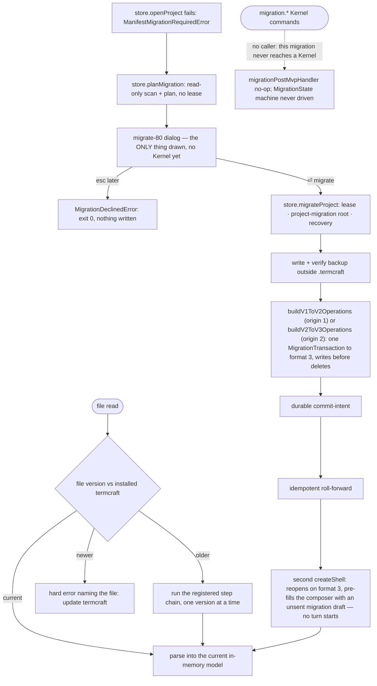

Stored data outlives any single termcraft install. This document covers how old files are upgraded — lazily on read, or in bulk with a backup — and what happens when a file is newer than the program reading it.

**Status (plan P4, `integration-spine`):** two migrations have shipped in `MIGRATION_CHAIN`, both routed through the SAME pre-Kernel offer and both landing a project on today's current `format_version = 3`: `project.toml`'s format 1 -> 2 (design-tree phase 1b — the retired flat `pages/<slug>/page.tsx` layout becoming the `design/` tree) and format 2 -> 3 (plan P4, design-systems §9 — the `design/` tree gaining its required `design/system/` folder, seeded with `design-system.json` and `tokens.ts`, no page source byte touched). A version-1 project takes BOTH steps in one transaction — `store/migration/model/v1-to-v2.ts`'s `buildV1ToV2Operations` now emits `format_version` 3 directly, never landing on the intermediate 2 as an observable state — and a version-2 project takes the second step alone via `store/migration/model/v2-to-v3.ts`'s `buildV2ToV3Operations`. It runs entirely BEFORE any Kernel exists: `entrypoint/model/create-shell.ts`'s composition root detects a pre-3 project (`ManifestMigrationRequiredError`), offers the `migrate-80` dialog (`ui/setup/ui/MigratePrompt.tsx`), and on `⏎ migrate` drives `store/model/factory.ts`'s `migrateProject(root, { kitApiVersion })` — a verified backup, then one `MigrationTransaction` covering whichever origin the project scanned as — with no Kernel command dispatched anywhere in the path. Item 12 below walks the whole flow.

What is STILL true post-MVP, and why that is not an oversight: the four `migration.*` Kernel commands (`migration.plan`/`confirm`/`discardPlan`/`retryRecovery`) and the `MigrationState` machine (§7.7) still route to the well-formed `migrationPostMvpHandler` no-op (`core/kernel/model/handlers/index.ts`) and are never driven (items 4 and 11 below). This is NOT because a second format version has not shipped — TWO have, per above — it is because both migrations are offered BEFORE a Kernel exists (design §12.1: "a pre-3 project never opens"), so nothing in either path ever reaches a point where a Kernel could dispatch one of these commands. A future migration that needs to run against an ALREADY-OPEN project — a lazy per-file upgrade (item 3), or a bulk step past format 3 — is what would actually need this Kernel-command family; neither shipped step does, by construction. The read side — lazy per-file upgrade and the too-new hard-stop — has its own, unrelated status per item below and is not affected by this note.

## Walkthrough

1. Versioning ground rules (statics in `storage.md`): every data file kind carries its own independent version counter. Today this is real for three kinds — `project.toml`'s and `workspace.local.toml`'s own `format_version`, and the transaction journal's `journalVersion` (checked twice: once for the whole `transactions.local/` namespace via `format.json`, once per plan via `plan.json`). Chat and comment JSONL headers declare a `formatVersion` field too, but the decoder currently pins it to the literal `1` rather than reading it as an independent counter — see the failure-branch note below. `design/pages.json` carries its own `schemaVersion`, and each page's entry file instead declares a static integer `kitApiVersion`, checked by the Gate against a supported set (MVP accepts `1` only) rather than by a file-version gate.
2. The migration registry is an ordered chain of single-step upgrades per file kind, with a shared "too new" gate every kind can reuse. The chain is real, live lookup machinery, and as of plan P4 it carries TWO steps (`store/migration/model/registry.ts`'s `MIGRATION_CHAIN`): `{kind: "project.toml", fromVersion: 1, toVersion: 2}` (design-tree phase 1b, the retired flat page layout becoming the `design/` tree) and `{kind: "project.toml", fromVersion: 2, toVersion: 3}` (design-systems §9, the `design/` tree gaining its required `design/system/` folder). A `MigrationStep` is a DECLARATION, not a transform: `findMigrationSteps`/`createMigrationRegistry(...).findSteps` proves a path exists between two versions of one artifact family; the transforms themselves are `store/migration/model/v1-to-v2.ts`'s `planV1ToV2`/`buildV1ToV2Operations` (now emitting `format_version` 3 directly, so a version-1 project takes both steps in one transaction) and `store/migration/model/v2-to-v3.ts`'s `planV2ToV3`/`buildV2ToV3Operations`. A breaking runtime API change is designed to ship a codemod for canonical current page sources, operating only on the files inside `.termcraft/design/` and never touching historical Git objects or temporary history snapshots — no such codemod pipeline exists yet.
3. Lazy trigger (v1; not implemented): reading an old file and migrating it in memory on the spot, with the original bytes folded into the current verified backup generation before the first rewritten byte is persisted, remains design-only. No caller invokes the registry's chain lookup as a per-read, in-place upgrade, and no `MigrationCoordinator` exists. This is a different mechanism from the BULK trigger (items 4 and 12 below), which is what actually shipped: the shipped path detects an old `project.toml` through a dedicated decoder refusal at open time (`ManifestMigrationRequiredError`), not through a lazy chain-lookup call on every read, and it runs once, up front, rather than transforming a file the moment something happens to read it.
4. Bulk trigger via the Kernel command family (admitted by the guard; handler still unreached — not for a missing format, but because this migration bypasses the Kernel entirely): the `core`/Kernel module is assembled, and its capability guard admits all four `migration.*` commands (`migration.plan`/`migration.confirm`/`migration.discardPlan`/`migration.retryRecovery`) through the real `MIGRATION_TRANSITION_TABLE` — `migrationFamilyReason` checks actual phase legality (e.g. `migration.plan` is legal from the migration machine's `idle` phase), and `projectNotReadyReason` carves out §7.1's trusted pre-Workspace `migration.plan`/`migration.confirm` exception. These four kinds are deliberately NOT among `core/versions`'s ten Tier-C `DEFERRED_CAPABILITY_KINDS`, so they pass the guard rather than being unconditionally rejected. What is NOT built behind them is a real handler: all four kinds still route to `migrationPostMvpHandler` (`core/kernel/model/handlers/index.ts`) — the same well-formed no-op shape the file's other, now-landed families used while they were genuinely still unbuilt — so a dispatched `migration.plan` returns `{disposition: "no-op", events: []}`, never drives the migration machine, mints no `migrationPlanId` through this path, and calls no `MigrationTransaction` through the Kernel. No bulk-migration wizard or CLI migrate command dispatches through this family either.

This is now a STRUCTURAL fact, not a scheduling gap. Item 12 below describes the migrations that actually ship, and BOTH run entirely BEFORE a Kernel is constructed (design §12.1 — a pre-3 project's Workspace is never built), so nothing in either path can dispatch a `migration.*` command even in principle. The format-2-to-3 step (plan P4) shipped through this SAME pre-Kernel offer, not as a live-Workspace-triggered step, so it does not change this picture. Wiring a real handler behind this family would matter for a DIFFERENT migration shape — one that needs to run against an already-open project, e.g. a lazy per-file upgrade (item 3) or a future step reached from a live Workspace — neither of which exists yet. `store/transaction`'s `MigrationTransaction` wrapper (`buildMigrationTransaction`) already accepts exactly the shape a Kernel-driven migration would need (`migrationPlanId`, `migrationActionId`, `backupManifestDigest`); item 12's shipped migrations call the SAME transaction engine directly (`store/model/factory.ts`'s `migrateProject`, via `TransactionEngine.runMigration`), just never through this Kernel command surface.
5. Backup policy: every rewrite requires a complete, verified machine-local backup outside `.termcraft`, regardless of Git status. This part is real and unit-tested: `createBackupStore` copies every file, writes a manifest (project identity, termcraft version, per-file relative path/size/hash/source-format), durably flushes both, reopens every copy and verifies it against both the source bytes and the manifest entry, and only then writes the `VERIFIED` marker — any failure at any step leaves every project file unchanged. What is not implemented is a pre-flight free-space check; a copy that runs out of disk just fails the step it's on, same as any other I/O error — and that gap is now reachable in production for the first time (`docs/superpowers/red-debt.md`), since a real migration actually exercises it. `createBackupStore` is wired into production two ways: `store/model/factory.ts` builds one on every `openProject`/`createProject` call and exposes it as `OpenProject.backups` (still uncalled through that handle — a version-1 project never reaches `openProject`), and, as of design-tree phase 1b, `migrateProject` (same file) calls `createBackup()` directly, before running the mechanical migration's transaction — the store's first production caller of a backup, not only its own tests.
6. Failure branch: a file newer than the installed termcraft understands → hard error naming the file ("update termcraft"), no partial reads. Implemented today for `project.toml`/`workspace.local.toml` (`ManifestTooNewError`/`WorkspaceStateTooNewError`, checked before the full field schema decodes) and for the transaction journal (`JournalTooNewError`, checked on both `format.json` and every `plan.json`). **Not yet implemented** for chat/pin JSONL headers: `formatVersion` there is schema-pinned to the literal `1`, so any other value — older or newer — surfaces as an ordinary decode/corruption error rather than this distinguished hard-stop.
7. Failure branch: downgrades are unsupported — an older install refuses newer data rather than guessing. True by construction everywhere the too-new gate above is wired: an older install sees the same `found > supported` comparison and refuses.
8. Historical Git sources are immutable inputs (v1; no Git-history code exists yet). A historical source with unsupported imports or `kitApiVersion` may remain browsable as an error state but is not eligible for Restore — Restore itself is out of MVP scope; no `system:restore` chat record is ever written by a live code path today, even though its reader shape and transaction wrapper both already exist.
9. No project has ever shipped the old numbered page-file layout that a prior design draft considered. What DOES exist is a real version-1 layout — `project.toml` carrying its own ordered `pages` array, one `pages/<slug>/page.tsx` per page — which the `design/` tree replaced (`format_version` moving straight to 3 as of plan P4; there was never a durable format-2 install to migrate FROM this specific layout, since `buildV1ToV2Operations` was rebuilt to emit 3 directly). The ORDINARY open path still refuses it outright: `store/toml/model/project-toml.ts`'s decoder returns a typed `ManifestMigrationRequiredError` rather than reading it leniently, and no page store, Gate, host, or UI code understands the old layout. Outside that refusal, exactly one thing DOES understand THIS retired layout: `store/migration/model/legacy-scan.ts`'s `scanLegacyProject`, called only from the migration path (`store/model/factory.ts`'s `planMigration`/`migrateProject`, item 12 below) — never from `openProject`'s ordinary decode. A second, sibling scanner exists for the OTHER migratable origin: `store/migration/model/format-two-scan.ts`'s `scanFormatTwoProject` reads a real format-2 `project.toml` (the `design/` tree without its `design/system/` folder), also migration-path-only. One real version-1 project is preserved verbatim at `test-fixtures/format-v1-project/`, and it is no longer only a future test subject: `src/store/model/migration-fixture.test.ts` runs the real migration against it and compares the result byte-for-byte against the hand-built `examples/clock/.termcraft/` oracle.
10. Safety net: no longer only synthetic. `src/store/model/migration-fixture.test.ts` proves the real, shipped migration reproduces the hand-built `examples/clock/.termcraft/` portable tree byte-for-byte from the preserved `test-fixtures/format-v1-project/` version-1 project — exact file-set and content equality, the migrated project reopening as an ordinary format-3 project, and the verified backup reconstructing the original bytes. That is one shipped ORIGIN proven end to end in production code from a preserved fixture (version 1, now landing on format 3 in a single transaction); `store/migration/model/v2-to-v3.test.ts` covers the format-2 origin the same way, against a synthetic scan rather than a preserved historical fixture, since no format-2 project predates plan P4. `store/migration/model/registry.test.ts` now asserts `MIGRATION_CHAIN`'s actual two-step content rather than "stays empty". Independent of any one shipped migration, a synthetic, test-only migration still proves the shared protocol end to end (backup → verify → transform → `MigrationTransaction` commit, plus the freshness-recheck failure path below), and the transaction engine's mandatory fault-injection crash harness covers the same durable install/intent/roll-forward machinery every `MigrationTransaction` runs through, migration-specific or not. Runtime-codemod fixtures exercising canonical current sources separately do not exist.
11. A freshness mismatch before `intent.json` discards the prepared publication and returns to idle without changing project bytes. This re-check is implemented as `MigrationTransaction`'s optional `precondition` callback, proven by the synthetic test above (`MigrationStaleError` on drift). Once intent is durable, cancellation and rollback are forbidden — this holds for every transaction `kind` by construction, migration included. What is **not** implemented is a migration-specific recovery state, and this gap is now reachable in production for the first time, since a real migration actually runs (design-tree phase 1b; `docs/superpowers/red-debt.md`): startup's actual recovery scan (`recoverTransactions`) is fully generic, classifying and rolling forward any intended journal — including a `kind: "migration"` one — exactly the way it would any other. A crash after `migrateProject`'s commit intent is durable is therefore rolled forward correctly on the next launch, and a crash BEFORE commit intent is discarded, with the `migrate-80` dialog simply re-offered on the next launch (`scanLegacyProject` re-reads whatever `pages/**` files remain) — both are CORRECT outcomes, but neither is narrated to the user as "a migration was interrupted". There is no `idle -> recovering` routing on `migrationActionId` wired into startup the way the Kernel command-contract spec describes, and `project.retryOpen`'s `{kind: "migration", migrationActionId}` recovery branch has no producer anywhere in `src` — nothing ever constructs that payload. The migration machine still DEFINES those transitions (`MIGRATION_TRANSITION_TABLE`'s `kernel.migration.beginRecovery`/`retryRecovery` edges into `recovering`), and `createKernel` still instantiates it, but nothing drives them, for the same structural reason item 4 gives: this migration never reaches a Kernel to route through in the first place.

12. **The shipped pre-Kernel offer (design-tree phase 1b + plan P4, design §12.1, design-systems §9).** Detection: `store/toml/model/project-toml.ts`'s `decodeProjectManifest` returns a typed `ManifestMigrationRequiredError` — distinct from `ManifestTooNewError` — when `project.toml`'s `format_version` reads BELOW the current `PROJECT_MANIFEST_FORMAT_VERSION` (3), i.e. `1` or `2`; `store/model/factory.ts`'s `openProject` surfaces it unwrapped from its own manifest-read step. The composition-root branch: `entrypoint/model/create-shell.ts`'s `openOrCreateProject` checks for this SPECIFIC error with `errore.findCause(opened, ManifestMigrationRequiredError)` (not `instanceof`, so a later wrapping layer would not break the check) and, on a match, calls `store.planMigration(root)` — a read-only, lease-free scan that branches on the origin (`openMigrationReadFs`, then `scanLegacyProject` + `planV1ToV2` for a version-1 project or `scanFormatTwoProject` + `planV2ToV3` for a version-2 one) — and returns `MigrationRequiredV1 { kind: "needs-migration", root, plan }` instead of the fatal `ShellCompositionError` a pre-3 project used to produce. `entrypoint/model/bootstrap.ts` checks `"kind" in first` and, on a match, calls `entrypoint/model/run-migration.ts`'s `runMigrationPrompt` instead of `runApp` — at this point no Kernel, no adapters, and no `UiDeps` have been built.

    Why the dialog cannot be a Kernel screen: a Kernel is assembled from an already-open `OpenProject` (`entrypoint/model/create-shell.ts`'s `interactiveShell`), and `store.openProject` is exactly what just failed with `ManifestMigrationRequiredError` — design §12.1's own premise is that a pre-3 project never opens, so there is no `OpenProject` to build a Kernel around, and no Kernel to build a Workspace around. `runMigrationPrompt` therefore mounts `ui/setup/ui/MigratePrompt.tsx` directly through `ui/setup/model/migration-root.tsx`'s `createMigrationRoot`, reusing `ui/app`'s `mountRenderRoot` (extracted in Task 8 for exactly this reuse) as the ONLY thing the process draws until the offer is answered.

    `⏎ migrate` calls `store.migrateProject(root, { kitApiVersion })` (`store/model/factory.ts`) — the second `kitApiVersion` parameter plan P4 added, needed to stamp a freshly seeded `design/system/design-system.json`'s own `kitApiVersion` field: `openMigrationContext` acquires the `ProjectLease`, opens a `SafeProjectFs` over the `project-migration` root kind (`store/safe-fs/model/limits.ts` — identical budgets to the ordinary `project` root, since it is the same `.termcraft` directory opened for one migration), and runs recovery before anything else. The origin re-read here (never trusting the earlier `planMigration` read) branches the SAME way `planMigration` did: `scanLegacyProject` + `buildV1ToV2Operations` for a version-1 project (now emitting `format_version` 3 directly — one transaction, no observable stop at 2) or `scanFormatTwoProject` + `buildV2ToV3Operations` for a version-2 one (which seeds `design/system/` alone, touching no page source and moving nothing). Either way exactly one transaction runs — every `replace` precedes every `delete`, order load-bearing for crash safety — `createBackupStore().createBackup()` writes and verifies the backup FIRST, and `TransactionEngine.runMigration` commits it. `esc later` resolves `MigrationDeclinedError` instead: the process exits with one line, and NOTHING is written — a recorded divergence from design §12.1's "returns to Home" (`docs/superpowers/red-debt.md`), since Home only exists inside a Kernel this migration cannot build.

    On success, `bootstrap.ts` builds a SECOND `createShell` call against the now-format-3 project — a real Kernel this time. It no longer passes `ShellOptions.seedTurnText` (plan P4 decision D8: an auto-run turn is actively harmful here, since every page is red on the `Color`/token-name change until the rewrite lands — see item 4 in `flows/generation-turn.md`-adjacent Gate lint coverage). Instead it passes `ShellOptions.seedComposerText`, which lands the text as an UNSENT DRAFT in the composer — nothing is sent, no turn starts. The seed text itself depends on the origin: a version-1 project (which moved pages into `design/` AND gained a design system in one step) gets `agent/prompt/model/format-one-migration-seed.ts`'s `formatOneMigrationSeed({ pageCount })`, bridging both changes in one sentence so they do not read as contradictory; a version-2 project (which already had the multi-file tree) gets `agent/prompt/model/design-system-seed.ts`'s `designSystemMigrationSeed({ pageCount })` alone. The older `agent/prompt/model/migration-seed.ts`'s `migrationRefactorSeed` and the `seedTurnText` plumbing it used are retained as declared, unused surface — `create-shell.ts`'s own doc comment records why the field stays rather than being deleted.

## Source anchors

- `src/store/migration/model/registry.ts` — the shared "too new" format-counter gate (`checkFormatCounter`/`DataFormatTooNewError`) reusable by any of the three counter field names, and the live migration chain (`MIGRATION_CHAIN`, `findMigrationSteps`) — real lookup machinery, now TWO steps: `project.toml` format 1 -> 2 (design-tree phase 1b) and 2 -> 3 (plan P4, design-systems §9). Each `MigrationStep` is a DECLARATION, not a transform.
- `src/store/migration/model/legacy-scan.ts` — `scanLegacyProject`: the system's ONLY reader of the retired `pages/<slug>/page.tsx`/`pages/<slug>/comments.jsonl` layout — version-gated before the field schema, exactly like `decodeProjectManifest`'s own ordering, and refusing a listed page whose source file is missing rather than silently dropping it. Called only from the migration path (`store/model/factory.ts`'s `planMigration`/`migrateProject`), never from `openProject`'s ordinary decode. There are now TWO migration-path scanners, not one: this file reads the version-1 origin, and `format-two-scan.ts` (below) reads the version-2 one — each is the only reader of its own retired shape.
- `src/store/migration/model/format-two-scan.ts` — `scanFormatTwoProject`: the system's ONLY reader of the retired version-2 `project.toml` schema (a format identical in field shape to format 3, differing only in that the project's TREE has not yet gained `design/system/`) — version-gated the same way, called only from the migration path, never from `openProject`'s ordinary decode, which cannot read a format-2 file at all (`decodeProjectManifest`'s `format_version` literal is pinned to the current version). Also probes whether `design/system/design-system.json` already exists, so the 2 -> 3 step never overwrites an existing design system (`FormatTwoProjectV1.hasDesignSystem`).
- `src/store/migration/model/v1-to-v2.ts` — `planV1ToV2` (pure planner: paths and counts from an already-completed scan, no disk I/O) and `buildV1ToV2Operations` (the concrete transaction: every page-source and pin-log move, `design/pages.json` synthesized from `project.toml`'s existing order, the seeded design-system files from `store/model/design-system-seed.ts`, `project.toml` rewritten to drop `pages` and bump `format_version` straight to 3 — plan P4 retargeted this step's own destination rather than adding a second hop through 2 — every `replace` ordered before every `delete`, load-bearing for crash safety).
- `src/store/migration/model/v2-to-v3.ts` — `planV2ToV3` (pure planner, same shape as `planV1ToV2`; `moves` is always empty and `pinLogCount` is always 0, since design-systems §9 moves no page source) and `buildV2ToV3Operations` (the concrete transaction: at most three writes and NO deletes — the two seed files from `store/model/design-system-seed.ts`, unless `scan.hasDesignSystem` is already true, then `project.toml` rewritten to `format_version` 3 with every other field carried forward verbatim; `project.toml` is written LAST, load-bearing the same way `v1-to-v2.ts`'s ordering is).
- `src/store/model/design-system-seed.ts` — `createDesignSystemSeedFiles`: the ONE emitter of `design/system/design-system.json` + `design/system/tokens.ts`'s exact bytes, shared by THREE callers — `createProject` (a brand-new project), `buildV1ToV2Operations`, and `buildV2ToV3Operations` — so a created project and a migrated one are seeded identically; a caller that already has a design system on disk (an already-migrated-once format-2 project) skips the call rather than overwriting it.
- `src/store/migration/model/backup-store.ts` — `createBackupStore`: the verified-backup protocol (create-new action dir → copy every file → write manifest → durably flush → reopen and verify each copy against source and manifest → write `VERIFIED` last), under `{userStateRoot}/backups/{projectId}/{migrationActionId}/`, outside `.termcraft`. Built and unit-tested; and, as of design-tree phase 1b, `store/model/factory.ts`'s `migrateProject` calls its `createBackup()` method directly in production — the store's first production backup caller — before running the mechanical migration's transaction.
- `src/store/migration/types.ts` — `BackupManifest`/`MigrationRegistry`/`FormatCounterField` contracts the two files above implement.
- `src/store/safe-fs/model/limits.ts` — the `project-migration` root kind (`ROOT_LIMITS`): identical budgets to the ordinary `project` root, since it is the same `.termcraft` directory opened for one migration. `classifyNamespace` widens it with `classifyLegacyProject`, admitting the retired `pages/<slug>/{page.tsx,comments.jsonl}` layout ONLY under this root kind — the ordinary `project` grammar refuses every such path.
- `src/store/model/factory.ts` — `openProject`'s `migrationsGate`: peeks `project.toml`/`workspace.local.toml`'s `format_version` (before either file's full schema decodes) and hard-stops the launch sequence on `DataFormatTooNewError` — the one place the diagram's "newer" branch is wired into a live project-open path today. Also `makeBackupStore`/`assembleOpenProject`: builds `createBackupStore` and exposes both it (`OpenProject.backups`) and the now-two-step `defaultMigrationRegistry` (`OpenProject.migrations`) on every open/create. `planMigration` (read-only, via the lease-free `openMigrationReadFs`) and `migrateProject(root, { kitApiVersion })` (the write path, via `openMigrationContext`'s lease-protected `project-migration` root) are the two `Store` methods design-tree phase 1b added; both now branch on `readMigrationOrigin` (1 or 2) between the legacy and format-two scan/build pairs. `migrateProject`'s `stageV1ToV3`/`stageV2ToV3` helpers (plan P4) are what drive `scanLegacyProject`/`buildV1ToV2Operations` or `scanFormatTwoProject`/`buildV2ToV3Operations`, `createBackupStore().createBackup()`, and `TransactionEngine.runMigration` together — ONE `runMigration` call either way (§9 requires one recoverable transaction). `planMigration`'s deliberately narrower, lease-free read is a documented tradeoff in the function's own doc comment, not an oversight — acquiring a lease for a read-only preview would be a permanent side effect (the lease store never deletes its `lock` file), and `migrateProject` re-scans and re-derives rather than trusting a plan carried over from here.
- `src/entrypoint/model/create-shell.ts` — `openOrCreateProject`: catches `ManifestMigrationRequiredError` (via `errore.findCause`, not `instanceof`) and returns `MigrationRequiredV1 { kind: "needs-migration", root, plan }` instead of a fatal `ShellCompositionError`; `ShellOptions.seedTurnText` is retained, declared plumbing that `bootstrap.ts` no longer calls (plan P4 decision D8) — the live post-migration seed threads through the newer `ShellOptions.seedComposerText` instead, landing an UNSENT draft rather than starting a turn.
- `src/entrypoint/model/bootstrap.ts` — the orchestrator: routes on `"kind" in first` to `run-migration.ts`'s `runMigrationPrompt` instead of `runApp` when a migration is required, and, on a successful migration, builds a SECOND `createShell` call carrying `seedComposerText` — `formatOneMigrationSeed({ pageCount })` for a version-1 origin (`first.plan.fromVersion === 1`) or `designSystemMigrationSeed({ pageCount })` for a version-2 one — as an unsent composer draft, never a `seedTurnText`.
- `src/entrypoint/model/run-migration.ts` — `runMigrationPrompt`: mounts the offer, drives `store.migrateProject` on `⏎ migrate`, and resolves `MigrationDeclinedError` on `esc later` (process exits with one line, nothing written — the recorded divergence from design §12.1's "returns to Home"; `docs/superpowers/red-debt.md`).
- `src/ui/setup/model/migration-root.tsx` — `createMigrationRoot`: mounts `MigratePrompt` through `ui/app`'s `mountRenderRoot` with no Kernel, resolves the user's key choice (`migrationChoiceForKey`: `⏎` migrate, `esc`/`ctrl+c` later — `ctrl+c` deliberately mapped rather than left unhandled, since `UI_RENDERER_CONFIG` sets `exitOnCtrlC: false`), and exposes `setWorking` for the `⠹ migrating…` key-row state.
- `src/ui/setup/ui/MigratePrompt.tsx` — the `migrate-80` dialog itself, transcribed from `design/16-wizard-migration.dc.html`; plan P4 updated its bullets to name `design/system/` and `format_version 3` rather than the retired format-2 destination.
- `src/agent/prompt/model/format-one-migration-seed.ts` — `formatOneMigrationSeed`: plan P4's composer-draft text for a version-1 origin, bridging BOTH changes (pages moved into `design/`, and a design system seeded) into one sentence rather than two contradictory ones; states pages already work, forbids a visual change, names `design/` explicitly.
- `src/agent/prompt/model/design-system-seed.ts` — `designSystemMigrationSeed`: plan P4's composer-draft text for a version-2 origin, covering the design-system seed alone since the multi-file tree already existed. Distinct file from `store/model/design-system-seed.ts` above, which emits the seeded FILES rather than PROMPT text.
- `src/agent/prompt/model/migration-seed.ts` — `migrationRefactorSeed`: the pre-P4 track-2 first-turn text. No longer called on the live path (superseded by the two composer-draft seeds above); kept as declared, unused surface alongside the `seedTurnText` plumbing it was written for.
- `src/store/model/migration-fixture.test.ts` — proves the real migration reproduces `examples/clock/.termcraft/` byte-for-byte from `test-fixtures/format-v1-project/`, plus the migrated project reopening as an ordinary format-3 project and the backup reconstructing the original.
- `src/store/toml/model/project-toml.ts` — `project.toml`'s own `format_version` gate (`ManifestTooNewError`) ahead of its strict field schema.
- `src/store/toml/model/workspace-toml.ts` — `workspace.local.toml`'s independent `format_version` gate (`WorkspaceStateTooNewError`), checked ahead of the strict field schema; `loadWorkspaceLocalState` folds a too-new (or otherwise corrupt) file into the §6.1 preserve-and-report policy (reported, never silently rewritten). At launch this path is moot for the too-new case specifically: `migrationsGate` (`factory.ts`) already hard-stops on a too-new `format_version` before `loadWorkspaceLocalState` is ever called, so `WorkspaceStateTooNewError`'s preserve-and-report branch is reachable only outside the project-open sequence (e.g. direct calls in tests), not through `openProject` today.
- `src/store/transaction/model/journal-format.ts` — the whole-journal-namespace `transactions.local/format.json` gate (`JournalTooNewError`), read before any transaction directory is even listed; a missing file is treated as the implicit version 1.
- `src/store/transaction/model/plan.ts` — the per-plan `journalVersion` gate on each `plan.json` (`TRANSACTION_JOURNAL_FORMAT_VERSION`, the same `JournalTooNewError`).
- `src/store/transaction/model/wrappers.ts` — `buildMigrationTransaction`: a thin `kind: "migration"` pass-through carrying `migrationPlanId`/`migrationActionId`/`backupManifestDigest`. As of design-tree phase 1b it has a real production caller: `store/model/factory.ts`'s `TransactionEngine.runMigration` calls it directly, driven by `migrateProject`. `buildExportPublishTransaction` likewise has a real caller (`docs/architecture/storage.md` item 17); `buildRestoreTransaction` remains uncalled — Restore is still out of scope.
- `src/store/transaction/model/engine.ts` — `runTransaction`: install payloads → plan → durable intent → idempotent roll-forward → commit marker, the protocol a `MigrationTransaction` runs through, plus the optional `precondition` re-CAS step that implements the freshness recheck before intent.
- `src/store/transaction/model/recovery.ts` — the generic startup classify/act scan over `transactions.local/`; treats a `kind: "migration"` journal exactly like any other plan kind (discard / roll-forward / already-complete / conflict) — there is no migration-specific recovery routing.
- `src/entities/chat/model/decode.ts`, `src/entities/pin/model/decode.ts` — the chat/comments JSONL header decoders; `formatVersion` is currently `z.literal(1)`, so a header declaring any other version fails as ordinary `ChatDecodeError`/`PinDecodeError` corruption rather than a distinguished too-new hard-stop.
- `src/entities/page/types.ts` — `PageMeta.kitApiVersion`, the page-source runtime-compatibility integer.
- `src/gate/model/page-contract.ts` — `checkPageContract`: enforces `kitApiVersion` against `SUPPORTED_KIT_API_VERSIONS` (MVP: `{1}`) as a Gate-time fatal error — a static compatibility check, not a lazy per-file migration.
- `src/core/protocol/model/command-kind.ts` — the four `migration.*` kinds (`migration.plan`/`migration.confirm`/`migration.discardPlan`/`migration.retryRecovery`) as members of the closed 44-kind `COMMAND_KINDS_V1` union (43 → 44, chat-scroll spec §6.1: `chat.load-older`) and the `migration` command family.
- `src/core/machines/model/migration-machine.ts` — `MIGRATION_TRANSITION_TABLE`/`reatomMigrationStateMachine`: the `MigrationState` graph (§7.7), instantiated by `createKernel` and surfaced as `KernelStateSnapshot.migration.phase`. The `idle -> recovering`/`publishing -> recovering`/`blocked -> recovering` edges exist here but nothing drives them: recovery does not consult this machine, and the `migration.retryRecovery` handler is the still-unreached no-op — see item 4/12's explanation above for why (this migration never dispatches through a Kernel), not "task 18"'s original "no second format has shipped" framing, which no longer holds.
- `src/core/capabilities/model/guards.ts` — `migrationFamilyReason` admits `migration.*` by real phase legality against `MIGRATION_TRANSITION_TABLE` (e.g. `migration.plan` legal from `idle`), and `projectNotReadyReason` carves out §7.1's trusted pre-Workspace `migration.plan`/`migration.confirm` exception — so these commands pass the guard today.
- `src/core/kernel/model/handlers/index.ts` — `migrationPostMvpHandler`/`migrationPostMvpHandlers`: all four `migration.*` kinds route to a well-formed no-op handler that never drives the migration machine. They are also deliberately NOT among the ten Tier-C `DEFERRED_CAPABILITY_KINDS` (`src/core/versions/model/deferred-guards.ts`), so the guard admits them rather than rejecting them. **This file's own header comment (task 18) is now stale**: it still frames the no-op as waiting on "a second storage format version" shipping, but one has (`project.toml` 1 -> 2, design-tree phase 1b) — the real reason this handler stays a no-op is structural, per item 4/12 above: the migration that shipped never reaches a Kernel to dispatch `migration.*` through. Flagged here rather than silently edited, since this closeout's own scope is docs-only.
- `src/core/kernel/model/kernel.ts` — `createKernel`: instantiates `migrationMachine`, reads its phase into `KernelStateSnapshot`, lists `migration.plan` among the nine bootstrap `SNAPSHOT_CAPABILITY_KINDS`, and wires `totalHandlers` (`./handlers/index.ts`, which spreads in `migrationPostMvpHandlers` for `migration.*`) into the dispatch registry.
- `docs/superpowers/specs/2026-07-16-kernel-command-contract-design.md` — §7.7's migration model, the `migrationPlanId`/`migrationActionId` minting rules, and the note that a CLI migrate command dispatches the same Kernel path. The `MigrationState` graph and its capability guard now exist in code (the `src/core/*` anchors above); the minting rules and the CLI migrate command remain design-only.
- `docs/superpowers/specs/2026-07-16-git-backed-page-history-design.md` — §3 canonical storage, §7 current-Gate requirements for Restore, §11 canonical-source acceptance criteria (Restore is out of MVP scope; no Git-history code exists yet)
- `docs/superpowers/specs/2026-07-13-termcraft-design.md` — §7.2 format versioning and the migration registry's design intent, §3.1 bulk offer, §9 too-new file error, §10 the "every shipped format" fixture matrix (one format transition has shipped and is proven by `migration-fixture.test.ts`; a MATRIX across multiple shipped formats has nothing to run against beyond that one transition yet)
- `docs/superpowers/specs/2026-07-16-production-storage-identity-design.md` — §12 mandatory external backup and the too-new hard-stop rule, source-of-record for the `store/migration`/`store/toml`/`store/transaction` files above
- `docs/superpowers/specs/2026-07-16-turn-durability-staging-design.md` — §11 the recoverable `MigrationTransaction` protocol (backup steps, freshness re-CAS before intent), source-of-record for what `wrappers.ts`/`engine.ts` above implement
- `docs/superpowers/specs/2026-07-28-multi-file-design-tree-design.md` — §12 is this migration's own design: §12.1 detection and the offer, §12.2 the two strictly-ordered tracks, §12.3 the consequences (including the recorded backup-location divergence from the dialog mockup)
- `design/16-wizard-migration.dc.html` — the `migrate-80` screen, the visual source of truth `src/ui/setup/ui/MigratePrompt.tsx` transcribes; drawn by `migrate()` in `design/termcraft-engine.js`
