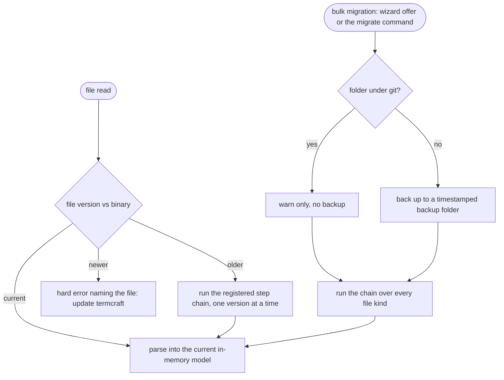

Stored data outlives any single termcraft binary. This document covers how old files are upgraded — lazily on read, or in bulk with a backup — and what happens when a file is newer than the program reading it.

## Walkthrough

1. Versioning ground rules (statics in `storage.md`): every data file kind carries its own independent version counter — `schemaVersion` in JSON, a typed header line in JSONL, `format_version` in TOML. Each page's canonical current `page.tsx` is the exception: it is code, versioned by the embedded design kit's semver rather than a counter in the file.
2. The migration registry: an ordered chain of single-step upgrades per file kind; reading an old file runs the chain to the current model; writing always emits the current version. A breaking kit change ships a codemod for canonical current page sources in the same registry — machinery with zero entries until the first breaking change, like the rest of the registry. Codemods operate only on the current sources in `.termcraft/pages/`; they never rewrite historical Git objects.
3. Lazy trigger: any read of an old file migrates in memory; the file on disk is rewritten in the current format on its next write.
4. Bulk trigger: opening an old `.termcraft/` offers bulk migration in the wizard; a dedicated migrate command does the same from the CLI.
5. Backup policy: bulk migration first backs up the whole folder to a timestamped backup directory — unless the folder is under git, where a warning suffices (backup dirs are gitignored).
6. Failure branch: a file newer than the binary understands → hard error naming the file ("update termcraft"), no partial reads.
7. Failure branch: downgrades are unsupported — older binaries refuse newer data rather than guessing.
8. Historical Git sources are immutable inputs to browsing. A historical source that is incompatible with the current kit may fail the current Gate and remain browsable as an error state, but it is not eligible for Restore through termcraft.
9. The project is still pre-code, so no users have a shipped numbered page-file layout. No migration from that abandoned design exists or is required; the first implementation starts with one canonical `page.tsx` per page.
10. Safety net: fixtures of every shipped historical format of every data-file kind run through the chain in tests, validating against the current schema. Kit-codemod fixtures exercise canonical current sources separately.

## Source anchors

- `docs/superpowers/specs/2026-07-16-git-backed-page-history-design.md` — §3 canonical storage, §7 current-Gate requirements for Restore, §11 canonical-source acceptance criteria
- `docs/superpowers/specs/2026-07-13-termcraft-design.md` — §7.2 format versioning, kit semver, and the migration registry, §3.1 bulk offer, §9 too-new file error, §10 migration fixtures
- `design/16-wizard-migration.dc.html` — migration offer screen
