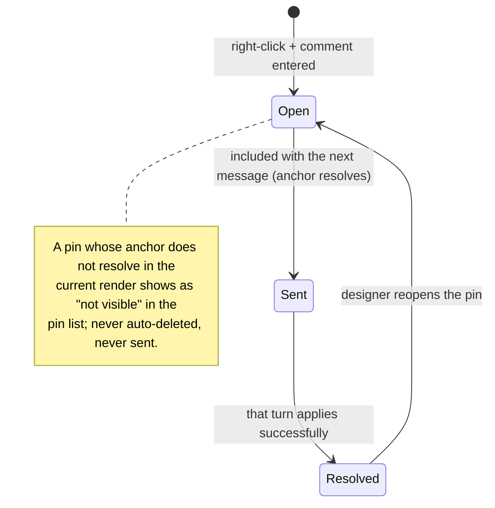

The mouse never edits the design — it annotates it. This document covers element selection (context for the next message) and pin comments (notes anchored to elements), including what happens when the element under a pin disappears.

## Walkthrough

1. Hover, in static mode, highlights element boundaries, resolved through the design host's hit grid — the shell asks which element sits under the cursor and gets back its id and rectangle.
2. Left click selects the deepest element under the cursor; a chip like `gauge "CPU Usage"` (component kind + label, reported by the host) attaches to the composer; `Esc` deselects.
3. Selection is stored as (page, element id); the rectangle is re-queried from the host every frame. On a historical snapshot, its overlay is shown only while that id resolves in the historical render; a missing historical id suppresses the overlay without clearing the selection. Switching page tabs clears the selection. Send is disabled while browsing history, and after returning to Current design the chip is included in the prompt only if the id resolves against the active page's canonical current source at send time.
4. Right click, in static or interactive mode against Current design, drops a pin: a mini input opens over a dimmed preview. The pin anchors to (element id, a fractional position inside the element's rect) and renders clamped inside that rect — pins stay proportionally placed as the element resizes.
5. Pin records persist in the page's comments log (`comments.jsonl`) with a status of open or resolved.
6. Lifecycle: against Current design, open pins whose anchors resolve in the active page's canonical current source at send time are sent with the next message; pins attached to a successfully applied message become resolved; the designer can reopen a resolved pin.
7. Historical overlays and mutation lock: existing current pins are drawn on a historical snapshot only when their element ids resolve in that historical render, using the stored fractional position in the historical element rectangle. While a historical snapshot is selected, creating pins, reopening resolved pins, and changing any pin status are disabled until the user returns to **Current design**. Browsing history never restores pin data and never changes pin records or their open/resolved statuses; Restore also leaves them untouched.
8. Failure branch (unresolved pins): a pin is drawn exactly when its anchor resolves in the host's current render; otherwise it stays in the chat panel's pin list marked "not visible in the current render (hidden or removed)" — no claim about source history, since the design's own state can hide and reveal elements: a pin inside a closed dialog reappears when the dialog opens. Unresolved pins are never auto-deleted and, when Current design is active, are skipped when sending to the agent.
9. History scope: pin-only commits change pin storage rather than a page's canonical `page.tsx`, so they never select or create entries in that page's path-limited history.
10. Scope note: selection and pins are mouse-only in v1.0; keyboard element navigation is backlog.

## Source anchors

- `docs/superpowers/specs/2026-07-16-git-backed-page-history-design.md` — historical overlay resolution, pin/status preservation during browse and Restore, canonical-source send behavior, and exclusion of pin-only commits from page history
- `docs/superpowers/specs/2026-07-13-termcraft-design.md` — §3.2 mouse selection and pin comments, §4.2 host hit and rect queries, §6.2 send-time inclusion, §7.1 comments record schema
- `design/07-selection-hover.dc.html` — hover and selection states
- `design/08-pin-comments.dc.html` — pin placement and pin list
