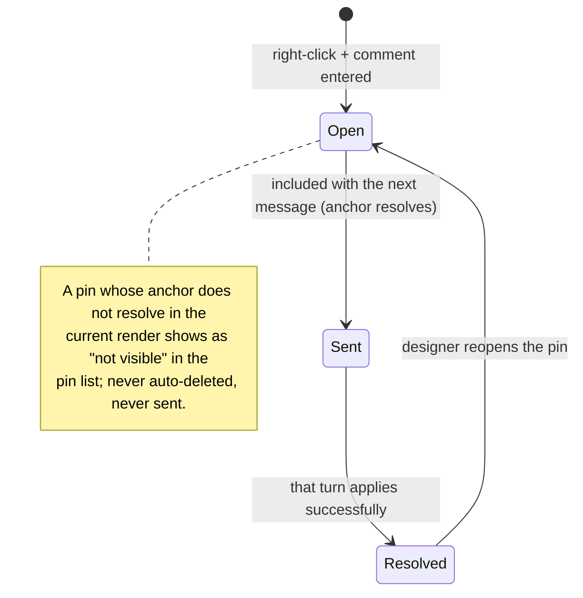

The mouse never edits the design — it annotates it. This document covers element selection (context for the next message) and pin comments (notes anchored to elements), including what happens when the element under a pin disappears.

## Walkthrough

1. Hover, in static mode, highlights element boundaries, resolved through the design host's hit grid — the shell asks which element sits under the cursor and gets back its id and rectangle.
2. Left click selects the deepest element under the cursor; a chip like `gauge "CPU Usage"` (component kind + label, reported by the host) attaches to the composer; `Esc` deselects.
3. Selection is stored as (page, element id); the rectangle is re-queried from the host every frame. It survives version switches while the id resolves in the viewed version, is silently cleared when the element disappears, and is cleared by switching page tabs. The chip is included in the prompt only if the id resolves in the active page's head at send time.
4. Right click, in either mode, drops a pin: a mini input opens over a dimmed preview. The pin anchors to (element id, a fractional position inside the element's rect) and renders clamped inside that rect — pins stay proportionally placed as the element resizes.
5. Pin records persist in the page's comments log (`comments.jsonl`) with a status of open or resolved.
6. Lifecycle: open pins whose anchors resolve are sent with the next message; pins attached to a successfully applied message become resolved; the designer can reopen a resolved pin.
7. Failure branch (unresolved pins): a pin is drawn exactly when its anchor resolves in the host's current render; otherwise it stays in the chat panel's pin list marked "not visible in the current render (hidden or removed)" — no claim about the version, since the design's own state can hide and reveal elements: a pin inside a closed dialog reappears when the dialog opens. Unresolved pins are never auto-deleted and are skipped when sending to the agent.
8. Scope note: selection and pins are mouse-only in v1.0; keyboard element navigation is backlog.

## Source anchors

- `docs/superpowers/specs/2026-07-13-termcraft-design.md` — §3.2 mouse selection and pin comments, §4.2 host hit and rect queries, §6.2 send-time inclusion, §7.1 comments record schema
- `design/07-selection-hover.dc.html` — hover and selection states
- `design/08-pin-comments.dc.html` — pin placement and pin list
