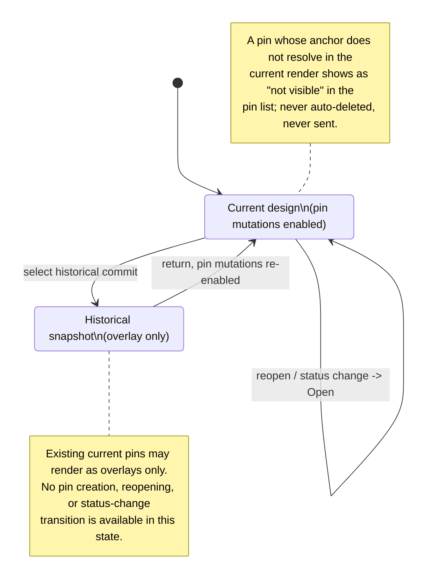

The mouse never edits the design — it annotates it. This document covers element selection (context for the next message) and pin comments (notes anchored to elements), including what happens when the element under a pin disappears.

## Walkthrough

1. Hover, in static mode, would highlight element boundaries through the current `PreviewSession`, with the supervisor answering hit-grid queries (element id, rectangle, full incarnation-local frame identity `(sessionId, nonce, sourceHash, frameSeq)`) and the Kernel converting a right-click hit into a bounded opaque `geometryToken` binding page slug, element id, and fractional coordinates — **(v1; not yet implemented)**. The host wire protocol accepts no `click`/`query-*` control kind today (only `mount`/`resize`/`set-mode`/`ping`/`shutdown`), `PreviewSession` exposes no query method, and there is no Kernel module yet to mint a `geometryToken`. What already exists is the frame-identity fencing this design rides on: every frame carries `(sessionId, nonce, sourceHash, frameSeq)`, and the frame broker rejects any frame whose identity or non-increasing `frameSeq` doesn't match the live incarnation — "stale replies are ignored" already holds at the wire layer.
2. Left click would select the deepest element under the cursor; a chip like `gauge "CPU Usage"` (component kind + label, reported by the host) would attach to the composer; `Esc` deselects — **(v1; not yet implemented)**: no click control kind, composer, or chip UI exists yet.
3. Selection is stored as (page, element id). That exact persisted shape is already implemented: `ChatSelection` (`pageSlug` + `element`) is the optional `selection` field on a `ChatUserRecord`, and turn admission durably appends whatever `ChatSelection` its caller builds before any agent process starts. The live behavior — re-querying the rectangle from the host every frame, historical-overlay suppression when the id doesn't resolve, clearing on tab switch, disabling Send while browsing history, and re-resolving the chip against canonical current source at send time — is Kernel/UI orchestration with no caller yet, so nothing populates `selection` on a real record today **(v1; not yet implemented)**.
4. Right click, in static or interactive mode against Current design, would drop a pin: a mini input opens over a dimmed preview, `pin.create` sends the Kernel-issued `geometryToken` plus text, and the Kernel accepts it only while the token still names the displayed Current source and frame (a stale token is rejected and geometry is queried again) — **(v1; not yet implemented)**: no `pin.create` control kind, mini-input UI, or Kernel exist yet. The anchor shape this would produce is already implemented, though: a pin's `element` id plus a fractional position `(fx, fy)` clamped to `[0,1]`, matching "renders clamped inside that rect, stays proportionally placed as the element resizes" — the storage contract is ready for a UI to fill in.
5. Pin records persist in the page's append-only comments log — implemented. Creation (`pin:created`) and each open/resolved transition (`pin:status`) are separate UUIDv7 records for the stable `pinId`, schema-validated, and folded into current state strictly in file order (`foldPins`); old lines are never rewritten and status is never an in-place field. The store's pin port reads this live, verifying the header's `projectId`/`pageSlug` identity against the containing project/directory before folding, and returns `[]` for a page with no comments log yet rather than distinguishing that from "no open pins." The `pins.changed` Kernel event returning complete affected-pin DTOs is not implemented — there is no Kernel module to emit it **(v1; not yet implemented)**.
6. Lifecycle: against Current design, open pins whose anchors resolve at send time would be sent with the next message. The persisted shape is ready (`ChatUserRecord.pins`, included `pinId` references) but nothing populates it yet, since no UI resolves anchors or decides which pins to include **(v1; not yet implemented)**. What is fully implemented: turn finalization filters every sent-turn's resolved pins down to pages present in non-empty `changedPages`, then batches each page's resolved events into one append operation committed in the same recoverable transaction as the page/chat changes — an empty design diff leaves every pin open, exactly as described. Appending a standalone pin event outside a turn — create, open, or reopen — has a built and unit-tested storage-layer operation builder, but MVP wires no caller for it yet — "the designer can append a reopen event later" is a capability the store already exposes, not yet a reachable user action. UI never persisting status itself holds trivially today, since no UI exists.
7. Historical overlays and mutation lock: the diagram's **Current design** state as the guard for pin creation/reopen/status-change transitions, and per-pin overlay resolution against a historical render, remain Kernel/UI-level design with no implementation **(v1; not yet implemented)** — no pin control kind exists on the wire at all, mutable or not. One narrower piece is already real at the host wire layer: a mount's `mode` is one of `preview | historical | smoke | export`, and a `historical` mount rejects an interactive `set-mode` with `HISTORICAL_PREVIEW_READ_ONLY`. Historical sessions are read-only for interaction today; nothing yet ties that specifically to pin mutation. Browsing history and Restore leaving pin records untouched is consistent with what's implemented — the only code that reads or writes a comments log is the pin-fold read port and the finalize/standalone-append write paths from steps 5-6, and neither Restore nor history-browsing calls any of them (neither exists as a caller yet).
8. Failure branch (unresolved pins): a pin would be drawn exactly when its anchor resolves in the host's current render; otherwise it would stay in the chat panel's pin list marked "not visible in the current render (hidden or removed)" — no claim about source history, since the design's own state can hide and reveal elements: a pin inside a closed dialog reappears when the dialog opens. **(v1; not yet implemented)** — no code renders pins over a host frame or resolves a pin's `element` id against captured output yet. What already holds: an unresolved pin is never auto-deleted by the event fold, which only ever accumulates `pin:created`/`pin:status` events already on disk and never removes one.
9. History scope: pin-only commits change pin storage rather than a page's canonical `page.tsx`, so they never select or create entries in that page's path-limited history. **(v1; not yet implemented)** — no git-backed page-history code exists anywhere in the repo yet; this is entirely a spec-level commitment today. The storage layer does already keep a page's comments log and its canonical source on separate managed paths (`pages/<slug>/comments.jsonl` vs. `pages/<slug>/page.tsx`), giving a future history integration a clean seam to key off.
10. Scope note: selection and pins are mouse-only in v1.0; keyboard element navigation is backlog.

## Source anchors

- `src/entities/chat/types.ts` — `ChatSelection` (`pageSlug` + `element`) and `ChatUserRecord.selection`/`.pins`: the persisted shape for a sent selection and the pinId references included with a message
- `src/entities/chat/model/decode.ts` — validates `ChatSelection` and the `pins` UUIDv7 array on a decoded `ChatUserRecord`
- `src/entities/pin/types.ts` — the comments-log vocabulary: `CommentsHeader`, `PinCreatedEvent` (`element`, fractional `fx`/`fy` anchor), `PinStatusEvent`, and the derived `Pin` (status is a fold, never an in-place field)
- `src/entities/pin/model/decode.ts` — decodes comments-log lines and `foldPins`, the event-sourcing fold (file order is authoritative; duplicate creation or status-before-creation is corruption)
- `src/store/model/factory.ts` — `makePinStore`: the live `Store.pins.fold(pageSlug)` port; verifies the comments header's `projectId`/`pageSlug` identity, folds the log, returns `[]` for a page with no comments log yet
- `src/store/jsonl/model/reader.ts` — `readPinsJsonl`: streams a comments log from byte zero with clean/interrupted-append/corrupt tail classification
- `src/store/jsonl/model/append-builder.ts` — `buildPinAppend`: builds the exactly-once prepared-append descriptor for new comments-log event lines
- `src/store/transaction/model/wrappers.ts` — `finalizeTurn` filters `resolvedPins` to pages present in non-empty `changedPages` and commits their resolved events (`buildPinResolutionOperation`/`groupResolvedPins`) in the same recoverable transaction as page/chat changes; `buildStandalonePinEventOperation` is a built-and-tested but currently uncalled append path for any standalone pin event — user create, open, or reopen — outside a turn's automatic resolution; `pageCommentsPath`/`canonicalPagePath` keep a page's comments log and canonical source on separate managed paths
- `src/host/protocol/types.ts` — `FrameIdentity` (`sessionId`, `nonce`, `sourceHash`, `frameSeq`): the frame-sequenced identity every reply is fenced against
- `src/host/supervisor/model/frame-broker.ts` — rejects any frame whose identity or non-increasing `frameSeq` doesn't match the live incarnation ("stale replies are ignored")
- `src/host/supervisor/types.ts` — `PreviewSession`: today's UI-facing facade exposes only `resize`/`setMode`/`retry`/`close` — no geometry query, click, or pin-create method
- `src/host/session/model/host-state-machine.ts` — the accepted control kinds (`mount`/`resize`/`set-mode`/`ping`/`shutdown` only) and the `historical` mount's `HISTORICAL_PREVIEW_READ_ONLY` refusal, the one implemented piece of the Historical mutation lock
- `docs/superpowers/specs/2026-07-16-git-backed-page-history-design.md` — historical overlay resolution, pin/status preservation during browse and Restore, canonical-source send behavior, and exclusion of pin-only commits from page history (no git-backed browse/history code exists yet)
- `docs/superpowers/specs/2026-07-13-termcraft-design.md` — §3.2 mouse selection and pin-comment UI (hover chip, composer, mini input), §4.2 host hit-grid/rect queries (`checkHit`/`rectOf`/`describe`) (Kernel/UI layer, not yet built)
- `docs/superpowers/specs/2026-07-16-kernel-command-contract-design.md` — the Kernel command/event contract for pins: `geometryToken` minting and single-use consumption, `pin.create`/`pin.setStatus` commands, and the `pins.changed` event carrying complete affected-pin DTOs (no Kernel module exists yet)
- `docs/superpowers/specs/2026-07-16-host-supervision-protocol-design.md` — the `query-*`/`click` control-kind vocabulary for hit-grid geometry queries (designed, not yet on the wire — see the host anchors above for the frame-identity fencing that already is)
- `design/07-selection-hover.dc.html` — hover and selection visual states
- `design/08-pin-comments.dc.html` — pin placement and pin list visuals
