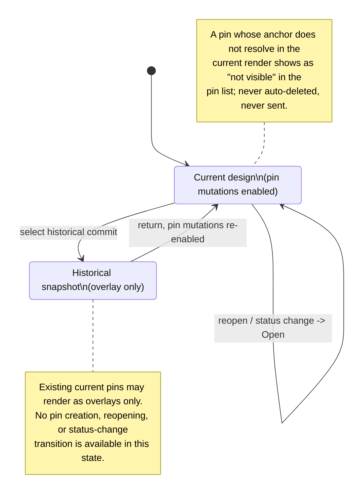

The mouse never edits the design — it annotates it. This document covers element selection (context for the next message) and pin comments (notes anchored to elements), including what happens when the element under a pin disappears.

## Walkthrough

1. **Hover and geometry queries.** Hover in static mode highlights element boundaries through the live `PreviewSession`: the supervisor answers hit-grid queries (element id, rectangle, and the full incarnation-local frame identity `(sessionId, nonce, sourceHash, frameSeq)`), and the Kernel turns a resolved hit into a bounded opaque `geometryToken` binding page slug, element id, and fractional coordinates. This round-trip is built end to end — the host wire protocol carries the `query-hit`/`query-rect`/`query-describe`/`query-layout` control kinds, `PreviewSession.query` correlates them through the same request table as `resize`/`setMode`/`ping` (2 s `QUERY_TIMEOUT` / `SUPERSEDED` / `TOO_MANY_REQUESTS`), and the Kernel's preview session-commands mint a single-use `GeometryTokenV1` for a resolving `hit`/`pin-anchor`. Frame-identity fencing rides underneath: every frame carries `(sessionId, nonce, sourceHash, frameSeq)` and the frame broker rejects any frame whose identity or non-increasing `frameSeq` doesn't match the live incarnation, so stale replies are ignored at the wire layer.
   - *The round trip now completes in a live run.* Its three halves landed separately and only recently met: `core/kernel/model/handlers/project.ts`'s `enablePreviewIfTrusted` moves the Preview model out of `disabled` once trust resolves to `trusted`; the shell's own subscriber dispatches `preview.selectPage` for the active page, so a session is actually established and frames stream; and `PreviewSessionHandle.acknowledgeDisplay`, backed by a real `Kernel`-owned frame-token ledger (phase-8 Task 16), is called by the Workspace for each frame it renders — which is what makes `FrameTokenLedger.currentIdentity()` non-null and a geometry token mintable. Before all three, a query had no session to run against, no frame to authorise from, and a machine still short of `live`.
2. **Left click → selection chip.** Left click selects the deepest element under the cursor: the preview mouse-down handler issues a `hit` geometry query, and a resolved hit dispatches `selection.set` (page slug + element id). The Kernel resolves the page's current `sourceHash` and emits `selection.changed`; the mirror stores it and the composer renders a chip like `▣ gauge-cpu`; `Esc` clears it, and so does switching pages — the selection is stored as (page, element), so it cannot outlive the page it was made on (§3.2), and the shell's page switch dispatches `selection.clear` for it, but only when a selection actually exists, so an ordinary tab click issues no no-op clear. The whole UI path is built — the mouse handlers, the composer, and the page-scoped selection chip (`deriveComposerAttach`, which fires the chip only when the selection's page matches the active page and otherwise falls through to the open-pins line) — and it is reachable now that a live session and an acknowledged frame both exist (step 1).
3. **Selection stored and sent.** Selection is stored as (page, element): `ChatSelection` (`pageSlug` + `element`) is the optional `selection` field on a `ChatUserRecord`, and turn admission durably appends whatever `ChatSelection` its caller builds before any agent process starts. Turn admission now reads the Kernel-held current selection (`context.selection()`) and threads it into the sent user record through `toAdmissionSelection`.
   - *Open nuance:* `selection.set`/`selection.clear` currently only emit `selection.changed`; they do not yet write the Kernel-held selection atom (`context.setSelection`), so `context.selection()` stays `null` and the sent record's `selection` field is unpopulated in a live run — the admission read path is wired ahead of the handler write path.
4. **Right click → pin.** Right click against Current design drops a pin: the mouse-down handler issues a `pin-anchor` geometry query, a resolved anchor opens a mini-input overlay (`pin-input`) over the preview carrying the pending `geometryToken`, and submitting the draft dispatches `pin.create` (`geometryToken` + text). The Kernel's `pin.create` handler consumes the token against the frame currently acknowledged as displayed — rejecting a stale/unknown token as `GEOMETRY_TOKEN_STALE`/`GEOMETRY_TOKEN_INVALID` before appending anything — then appends a `pin:created` event and emits `pins.changed`. The stored anchor is the pin's `element` id plus a fractional `(fx, fy)` clamped to `[0,1]`. This path depends on the same three halves as step 1 and, like it, now has them: a token minted against an acknowledged frame of a live session is accepted rather than refused `GEOMETRY_TOKEN_STALE` for want of any acknowledged frame at all.
5. **Pin records persist; `pins.changed` emitted.** Pin records persist in the page's append-only comments log: creation (`pin:created`) and each open/resolved transition (`pin:status`) are separate UUIDv7 records for the stable `pinId`, schema-validated, and folded into current state strictly in file order (`foldPins`); old lines are never rewritten and status is never an in-place field. The store's pin port reads this live, verifying the header's `projectId`/`pageSlug` identity against the containing project/directory before folding, and returns `[]` for a page with no comments log yet rather than distinguishing it from "no open pins." The `pins.changed` Kernel event — complete affected-pin DTOs plus the `causeId` that produced the change — is emitted by both the `pin.create` and `pin.setStatus` handlers.
6. **Lifecycle: send, resolve, reopen.** Against Current design, open pins whose anchors resolve at send time ride the next message, and this is now real end to end. `turn.start` folds the active page's pins and offers every one whose folded status is `open` as a candidate; admission re-folds and re-checks the same page at the one honest send-time instant and writes the surviving ids onto the durable user record (`ChatUserRecord.pins`), and their append-base enters the turn's CAS read set so a concurrent pin write cannot slip past the precondition. Those admitted ids then reach finalization as `sentPins` — carried across by an admission hook, since finalize's own inputs cannot see admission's verdict — where turn finalization filters them down to pages present in a non-empty `changedPages` and batches each page's resolved events into one append committed in the same recoverable transaction as the page/chat changes; an empty design diff leaves every pin open. Until that hook existed the Kernel handed finalize a hardcoded empty list, which left the resolution rule unreachable in production: a pin the agent had just addressed stayed open forever and had to be closed by hand. Standalone pin events outside a turn — create, open, or reopen — now have a live Kernel caller: `pin.create`/`pin.setStatus` route through `PinMutations.appendStandaloneEvent` → the store's `appendPinEvent` → the header-aware `buildPinEventOperations` (which mints a fresh comments header + event for a page's first pin, or appends onto the existing log).
7. **Historical overlays and mutation lock.** The Historical mutation lock is a capability guard: while a historical snapshot is displayed, `pin.create`/`pin.setStatus` (alongside Send and Tweaks) are refused with `HISTORICAL_PREVIEW_READ_ONLY`; independently, at the host wire layer a `historical` mount refuses an interactive `set-mode` with the same `HISTORICAL_PREVIEW_READ_ONLY`. Per-pin overlay resolution against a historical render is still design-level (see the anchor-resolution gap in step 8). Browsing history and Restore leaving pin records untouched holds trivially: the only code that reads or writes a comments log is the pin-fold read port and the finalize/standalone-append write paths of steps 5-6, and no history-browse or Restore path calls any of them (neither is wired).
8. **Failure branch (unresolved pins).** A pin is drawn exactly when its anchor resolves in the host's current render; otherwise it stays in the chat panel's pin list marked "not visible in the current render (hidden or removed)" — no claim about source history, since the design's own state can hide and reveal elements (a pin inside a closed dialog reappears when the dialog opens). `PreviewOverlays` now draws every open pin over the host frame by its fractional `(fx, fy)`, and `PinList` renders the full open/resolved/"not visible" row structure.
   - *Open gap:* per-pin anchor resolution against captured output has no Kernel source yet — the mirror carries `PinDtoV1` with no per-pin resolution signal, so `derivePinListRows` passes `visible: true` for every pin and the "not visible" marker stays dormant until a render-resolved element-id set reaches the mirror. This is its own missing channel, not step 1's: geometry answers one query at a time (`preview.geometryResult`), and nothing publishes the whole set of ids a frame actually resolved. What already holds: an unresolved pin is never auto-deleted by the fold, which only accumulates `pin:created`/`pin:status` events already on disk.
9. **History scope.** Pin-only commits change pin storage rather than a page's canonical `page.tsx`, so they never select or create entries in that page's path-limited history. No live git-backed page-history or browse path is wired yet — the `git-history`/`git-committer` ports are declared in `core/ports`, but no adapter implements them and no history/Restore caller exists — so this remains a forward commitment. The storage layer already keeps a page's comments log and its canonical source on separate managed paths (`pages/<slug>/comments.jsonl` vs. `pages/<slug>/page.tsx`), giving a future history integration a clean seam to key off.
10. **Scope note:** selection and pins are mouse-only in v1.0; keyboard element navigation is backlog.

## Source anchors

- `src/entities/chat/types.ts` — `ChatSelection` (`pageSlug` + `element`) and `ChatUserRecord.selection`/`.pins`: the persisted shape for a sent selection and the pinId references included with a message
- `src/entities/chat/model/decode.ts` — validates `ChatSelection` and the `pins` UUIDv7 array on a decoded `ChatUserRecord`
- `src/entities/pin/types.ts` — the comments-log vocabulary: `CommentsHeader`, `PinCreatedEvent` (`element`, fractional `fx`/`fy` anchor), `PinStatusEvent`, and the derived `Pin` (status is a fold, never an in-place field)
- `src/entities/pin/model/decode.ts` — decodes comments-log lines and `foldPins`, the event-sourcing fold (file order authoritative; duplicate creation or status-before-creation is corruption)
- `src/store/model/factory.ts` — `makePinStore` (the live `Store.pins.fold(pageSlug)` read port, header-identity verified, `[]` for a missing log) and the `TransactionEngine.appendPinEvent` method the standalone-pin path calls
- `src/store/jsonl/model/reader.ts` — `readPinsJsonl`: streams a comments log from byte zero with clean/interrupted-append/corrupt-tail classification
- `src/store/jsonl/model/append-builder.ts` — `buildPinAppend`: builds the exactly-once prepared-append descriptor for new comments-log event lines
- `src/store/transaction/model/wrappers.ts` — `finalizeTurn` filters `resolvedPins` to pages present in a non-empty `changedPages` and commits their resolved events (`buildPinResolutionOperation`/`groupResolvedPins`) in the same recoverable transaction as page/chat changes; `buildPinEventOperations` is the header-aware standalone append (mint header + event for a page's first pin, else append) the live `pin.create`/`pin.setStatus` path uses; `pageCommentsPath`/`canonicalPagePath` keep a page's comments log and canonical source on separate managed paths
- `src/core/kernel/model/handlers/page-pin.ts` — the `pin.create`/`pin.setStatus` command handlers: compose `createPin`/`setPinStatus`, resolve a standalone `pinId`'s page via `PinReader.findPageForPin`, and emit `pins.changed`
- `src/core/kernel/model/handlers/selection-model.ts` — `selection.set`/`selection.clear`: resolve the active page's `sourceHash` and emit `selection.changed`; the handlers do NOT yet write `context.setSelection` (step 3's open nuance)
- `src/core/kernel/model/handlers/turn.ts` — reads `context.selection()` at admission and threads a `ChatSelection` into the sent user record via `toAdmissionSelection`; folds the active page's open pins into `candidatePins`, reads their append-base into `readSet.pins` only when that fold actually produced one, and turns admission's own resolved ids (captured through `RunTurnDeps.onAdmitted`) into finalize's `sentPins` — a fold or append-base read that fails is a logged refusal, never a silently empty list indistinguishable from "no open pins"
- `src/core/turns/model/admission.ts` — `resolveOpenPins`: the send-time re-fold that decides which candidate pins are still open, and writes exactly those ids onto the durable user record
- `src/core/pins/model/turn-resolution.ts` — `resolveSentPinAppends`: filters the sent pins to pages present in a non-empty `changedPages`, the rule that was unreachable while `sentPins` was hardcoded empty
- `src/core/pins/model/create.ts` — `createPin`: consumes the geometry token against `FrameTokenLedger.currentIdentity()`, appends `pin:created`, and builds the `pins.changed` payload
- `src/core/pins/model/set-status.ts` — `setPinStatus`: appends a user-action `pin:status` event (fresh `actionId`) and builds the `pins.changed` payload
- `src/core/pins/model/pin-projection.ts` — `projectPinEvents`: folds a raw event log into the `PinDtoV1` shape (`createdRecordId`/`latestRecordId`/`updatedAt`) `pins.changed` carries
- `src/core/ports/pin-store.ts` — the pin read/write port `core` consumes: `PinReader.fold`/`readEvents`/`findPageForPin` and `PinMutations.appendStandaloneEvent`
- `src/core/preview/model/session-commands.ts` — `queryGeometry` (mints a single-use `GeometryTokenV1` for a resolving `hit`/`pin-anchor`), `publishFrame` (mints a `FrameTokenV1` beside each frame), and `acknowledgeDisplay`
- `src/core/preview/model/frame-token-ledger.ts` — `currentIdentity()`: the frame identity currently acknowledged as displayed; `null` until an `acknowledgeDisplay` lands
- `src/core/preview/model/geometry-token-ledger.ts` — single-use `mint`/`consume`/`restore` of a geometry token bound to a frame identity
- `src/core/capabilities/model/guards.ts` — the `HISTORICAL_PREVIEW_READ_ONLY` guard listing `pin.create`/`pin.setStatus` (and Send/Tweaks) among the kinds a historical preview refuses
- `src/core/protocol/model/command-payload.ts` — the `preview.queryGeometry`/`selection.set`/`pin.create`/`pin.setStatus` command payload schemas
- `src/core/protocol/model/event-payload.ts` — the `preview.geometryResult`/`selection.changed`/`pins.changed` event DTOs
- `src/host/protocol/types.ts` — `FrameIdentity` (`sessionId`, `nonce`, `sourceHash`, `frameSeq`): the frame-sequenced identity every reply is fenced against
- `src/host/supervisor/model/frame-broker.ts` — rejects any frame whose identity or non-increasing `frameSeq` doesn't match the live incarnation ("stale replies are ignored")
- `src/host/supervisor/types.ts` — `PreviewSession` exposes `resize`/`setMode`/`query`/`retry`/`close`; `GeometryQuery`/`GeometryQueryResult` are host's wire-facing shapes, distinct from the Kernel-level `GeometryToken`/`pin-anchor` vocabulary
- `src/host/session/model/host-state-machine.ts` — the accepted control kinds (`mount`/`resize`/`set-mode`/`ping`/`query-hit`/`query-rect`/`query-describe`/`query-layout`/`shutdown`) and the `historical` mount's `HISTORICAL_PREVIEW_READ_ONLY` refusal
- `src/host/render/model/geometry.ts` — the real `checkHit`/`rectOf`/`describe`/`layoutTree` primitives a `query-*` request resolves against
- `src/ui/preview/model/interaction.ts` — the UI geometry pipeline: mouse-driven `hit`/`pin-anchor` requests, `handleGeometryResult`, the `pin-input` pending-pin overlay, `selection.set`/`pin.create` dispatch, and `acknowledgeFrame`
- `src/ui/workspace/model/attach.ts` — `deriveComposerAttach`: the page-scoped composer selection chip (`▣ <elementId>`) and the "N open pins attached" line
- `src/ui/workspace/model/page-selection.ts` — `selectPage`: the other end of step 2's selection lifecycle — a page switch dispatches `selection.clear` only when a selection actually exists, so the chip cannot survive the page it was made on
- `src/ui/preview/ui/PreviewOverlays.tsx` — draws each open pin over the host frame by fraction, plus hover and pending-pin overlays
- `src/ui/chat/ui/PinList.tsx` — the chat-panel pin list rows, including the dormant "not visible in the current render" marker
- `src/ui/mirror/model/mirror.ts` — folds `selection.changed` into the selection slice and `pins.changed` into `pinsByPage`
- `src/entrypoint/model/create-shell.ts` — `toPreviewSessionHandle` wires `acknowledgeDisplay` to a real `Kernel`-owned frame-token ledger (phase-8 Task 16); the upstream halves steps 1/2/4 depend on are in place too — `kernel.preview.enable` fires from `core/kernel/model/handlers/project.ts`'s `enablePreviewIfTrusted`, and `src/ui/app/model/deps.ts` dispatches `preview.selectPage` for the active page
- `src/ui/workspace/ui/Workspace.tsx` — calls `acknowledgeFrame` for every preview frame it renders: the display acknowledgement that makes a frame token query-authorising
- `design/07-selection-hover.dc.html` — hover and selection visual states
- `design/08-pin-comments.dc.html` — pin placement and pin list visuals
