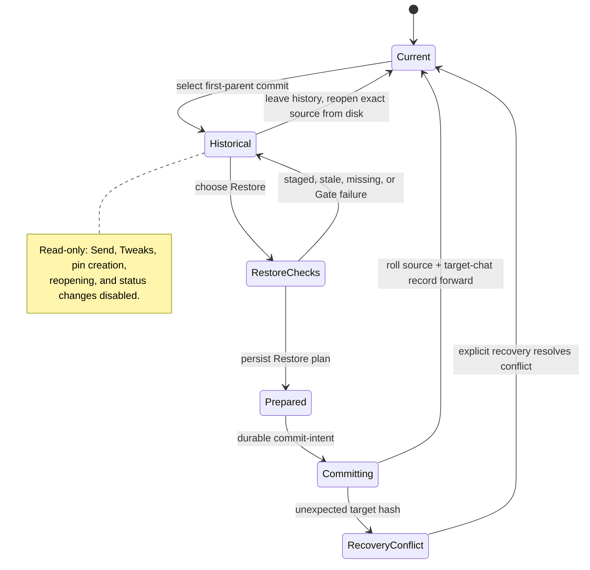

termcraft has no private page-version system. The MVP exposes one canonical
source per page and no history UI; v1 adds optional read-only Git browsing,
explicit recoverable Restore, and user-confirmed scoped commits without branch
or automatic-history management.

## Walkthrough

1. **Product boundary.** The MVP has no numbered sources, version hotkeys,
   history popup, or rollback. Each page has one canonical
   `.termcraft/pages/<slug>/page.tsx`. Git remains optional for generation,
   preview, pins, chats, migration, and export.
2. **History discovery.** `GitHistory` walks the active page path from current
   `HEAD` through first parents. Only commits whose trees changed `page.tsx`
   appear. A merge is one mainline entry; other refs and directory-rename
   detection are excluded. Commands retain full object ids; UI bounds and escapes
   displayed hash, author, committer time, and subject. Shallow history is marked
   partial and never fetched automatically.
3. **Current-row precedence.** An unborn repository or untracked path without
   ancestry shows only **Current design · uncommitted**. An untracked/recreated
   path with ancestry also shows reachable entries. Tracked content equal to the
   `HEAD` tree makes that row **Current design**; other content places a separate
   uncommitted row above history.
4. **Historical preview.** Selecting a commit reads exact source bytes into a
   temporary read-only snapshot outside `.termcraft/` and opens a supervised
   historical `PreviewSession`. No checkout or project/Git write occurs. Existing
   selection and pin overlays render only where ids resolve; no pin mutation,
   Send, or Tweaks are enabled. Leaving history reopens exact Current design bytes
   from disk.
5. **Compatibility errors.** A missing/corrupt Git object names commit and path.
   A historical source with forbidden imports, unsupported `kitApiVersion`, or a
   Gate/host failure remains a read-only error row but cannot be restored.
6. **Restore planning.** Restore is unavailable during a turn. Planning captures
   canonical source hash, selected full object/blob hash, and index state, and mints
   only `restorePlanId`. A staged source blocks Restore; an unstaged source requires
   an exact-path overwrite warning. When the Kernel accepts `restore.confirm`, it
   captures the then-active UUIDv7 chat as `targetChatId` and mints one UUIDv7
   `restoreActionId`.
7. **Freshness and Gate.** The immutable blob passes the current
   `@termcraft/runtime` Gate and matching host before the write mutex is acquired.
   Under the project-write mutex, Restore revalidates source hash, index, full
   object/blob hash, and the hash-bound Gate attestation. Any mismatch releases the
   mutex without commit intent or project write.
8. **Durable finalization.** `RestoreTransaction` prepares the source payload and
   exactly-one target-chat system record. The record contains `recordId`,
   `restoreActionId`, page slug, and full source commit; its containing chat is the
   persisted chat identity. After durable commit intent, source replacement and
   append roll forward idempotently. Replay checks only the captured target chat
   for `restoreActionId`, never repeats Gate/source replacement, and is unaffected
   by later active-chat or page changes. Startup completes pending intent before
   Workspace. Unexpected target hashes enter recovery conflict and are not
   overwritten. The wrapper (source replace + exactly-one target-chat append,
   `releaseAfterApplied` on the source operation) and the generic commit-intent /
   roll-forward / recovery-conflict machinery it runs through are already built and
   unit-tested, and the same reader-side `system:restore` record shape is already
   decodable — but nothing calls the wrapper yet, so no live path ever writes one.
9. **Restore result.** Branch, `HEAD`, index, other pages, pins, other chats, and
   application files remain untouched. The canonical source becomes Current
   design and is uncommitted unless equal to `HEAD`. Restore creates neither a Git
   commit nor an overwrite backup; the user's confirmation remains the boundary
   for intentionally discarded unstaged page bytes.
10. **Commit commands.** `/commit-page` selects only the active canonical
    `page.tsx`. `/commit-infra` selects portable `project.toml`, generated
    `.gitignore`, and future explicitly portable project-level files.
    `/commit-all` selects every eligible non-ignored portable or derived path under
    `.termcraft/`, including pages, chats, pin logs, and export. Local workspace,
    sessions, `transactions.local/`, caches, logs, lock metadata, and backups are
    hard-excluded — the generated `.termcraft/.gitignore` already encodes this exact
    exclusion list as a courtesy mirror, though it is not itself the authority and no
    live commit-scope planner or commit command exists yet. There is no persistent
    button or mouse twin.
11. **Status and confirmation.** Each `/commit-*` row owns its dirty indicator,
    changed-file count, accessible scope text, and clean-scope disabled state.
    Every command opens the same editable-message/exact-path confirmation. The
    plan records expected `HEAD`, selected paths/states, and hashes; execution
    revalidates them and requires a new confirmation when stale.
12. **Git behavior.** `GitCommitter` uses argument arrays, bounded output/time,
    honors hooks and signing, passes the confirmed message without an editor, and
    preserves unrelated staged/unstaged state absent hook side effects. Detached
    `HEAD` adds explicit warning; active merge/rebase/cherry-pick/revert disables
    commit. Status always refreshes after attempts because hooks may mutate files.
13. **Turn concurrency.** While an agent runs, local slash-command mode keeps the
    three commit commands available by Kernel capability while ordinary Send and
    other project actions stay locked. Actual commit and final apply serialize
    through the project-write mutex. Git may commit current on-disk design before
    apply; the later result becomes uncommitted. If hooks modify any turn
    precondition, final apply's compare-and-swap fails typed stale/source-changed
    and never overwrites the hook result.
14. **Repository limits.** termcraft does not initialize repositories, create or
    switch refs, stash, fetch, pull, push, or correlate commits with prompts/chats.
    Deleting and recreating a slug resurrects the same page path identity and
    reachable history.

## Source anchors

No Git-history reader, Restore orchestration, or `/commit-*` command surface
exists in code yet (no `core`/Kernel, `agent`, or `ui` module has landed) — steps
1-3 and 5-7 and 9-14 below remain governed entirely by the design spec and design
files. Steps 4 and 8 are partial exceptions. Step 4's read-only invariant is
host-layer reality, not just spec: `HostMode` already carries `"historical"`, a
historical mount is always forced to the static interaction mode, an interactive
`set-mode` request against it is refused with the typed
`HISTORICAL_PREVIEW_READ_ONLY` code, and the `PreviewSession` facade a historical
mount returns has no `forwardInput`, `setTheme`, `setCapabilities`, or tweaks
channel to begin with. What is still missing is everything around that host: the
Git-history reader, the temporary read-only snapshot directory, and the UI that
would open a historical session. Step 8's durable-finalization mechanics are
likewise a partial exception: the record shape and the transaction wrapper it
would use are already built as tested, uncalled infrastructure — see the anchors
below.

- `docs/superpowers/specs/2026-07-16-git-backed-page-history-design.md` —
  governing history rows, first-parent semantics, Git behavior, and commit commands
- `docs/superpowers/specs/2026-07-16-turn-durability-staging-design.md` —
  recoverable Restore transaction and commit-during-turn preconditions
- `docs/superpowers/specs/2026-07-16-production-storage-identity-design.md` —
  UUID records, local exclusions, and portable commit scopes
- `docs/superpowers/specs/2026-07-16-runtime-api-compatibility-design.md` —
  historical compatibility and current Gate requirements
- `design/05-version-history.dc.html` — version history popup states
- `design/09-version-browse.dc.html` — Browse mode presentation
- `design/25-git-commit-controls.dc.html` — commit controls and scoped commits
- `design/26-restore.dc.html` — Restore confirmation flow
- `design/27-git-availability.dc.html` — Git availability and degraded states
- `src/host/types.ts` — `HostMode` includes `"historical"` alongside
  `preview`/`smoke`/`export`, the type step 4's session rests on
- `src/host/session/model/host-state-machine.ts` — a historical mount's
  `interactionMode` is always forced to `static` regardless of the request, and
  an interactive `set-mode` against it is refused with the typed
  `HISTORICAL_PREVIEW_READ_ONLY` code; backs step 4's and the diagram's
  `Historical` read-only note
- `src/host/supervisor/types.ts` — `PreviewSession.mode: "preview" | "historical"`
  on the UI-facing facade type
- `src/host/supervisor/model/preview-session.ts` — `createPreviewSession` derives
  `mode` from the spec and, by construction, exposes no `forwardInput`,
  `setTheme`, `setCapabilities`, or tweaks channel — the concrete shape of step
  4's "no pin mutation, Send, or Tweaks are enabled"
- `src/entities/chat/types.ts` — `ChatSystemRestoreRecord`: the target-chat restore
  audit shape (`recordId`, `restoreActionId`, `pageSlug`, `sourceCommit`) step 8
  describes; defined for reader completeness only, no writer exists
- `src/entities/chat/model/decode.ts` — `decodeChatRecord`'s `system:restore`
  schema, and the shared `turnId`/`actionId` mutual-exclusion rule step 8's sibling
  terminal-record kinds rely on
- `src/store/transaction/model/wrappers.ts` — `buildRestoreTransaction`: the
  built-and-unit-tested `RestoreTransaction` wrapper (source replace +
  exactly-one target-chat append) step 8 describes; explicitly has no MVP or live
  caller
- `src/store/transaction/types.ts` — `TransactionOperation.releaseAfterApplied` and
  the `record-pending` `TransactionState` member: schema fields reserved for
  Restore, carried for completeness but unused by every other transaction kind
- `src/store/transaction/model/engine.ts` — the generic commit-intent /
  roll-forward machinery and `TransactionRecoveryConflictError` a Restore
  transaction runs through (backs the diagram's `RecoveryConflict` state), plus the
  `releaseAfterApplied` exemption from post-apply drift checks
- `src/store/transaction/model/recovery.ts` — startup transaction classification
  and resolution that would apply to a pending Restore transaction the same as any
  other kind, before project state is exposed
- `src/store/model/factory.ts` — `openProject`'s launch sequence, where recovery
  completes before the store's sub-facades are returned; backs step 8's "Startup
  completes pending intent before Workspace"
- `src/store/toml/model/gitignore.ts` — `PROJECT_GITIGNORE_RULES`: the actual
  generated `.termcraft/.gitignore` exclusion list backing step 10's hard-excluded
  paths; a courtesy mirror, not the live Git-commit-scope planner the design names
