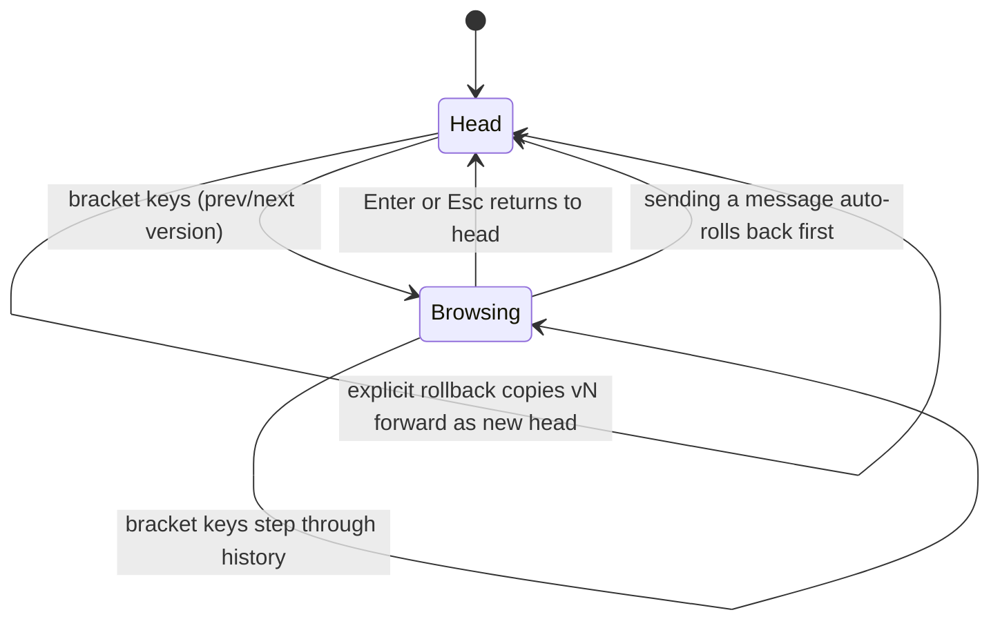

Every applied agent turn writes a new numbered version per changed page; history is linear and append-only. This document covers browsing old versions read-only, the history popup, and rollback — which copies an old version forward instead of deleting anything.

## Walkthrough

1. Version creation: one new version file (a page's TSX module) per page changed by an applied turn; versions map 1:1 to chat messages via the agent record's applied map; the head of a page is simply its highest version — no head pointer. Retitling a page edits its own metadata export, so it versions like any content change.
2. Browsing: bracket keys switch prev/next read-only; the status bar shows a caution-tinted `vN/total ‹read-only›`; nothing is written; `Enter` (no input focused) or `Esc` returns to head.
3. History popup (v1.0): opened with `v` or by clicking the status bar's version segment; lists versions with timestamps and prompt excerpts (found by scanning the project's chats for the agent record whose applied map names the version); offers explicit rollback; renders over a dimmed backdrop.
4. Rollback semantics: "make v3 the head" copies v3 forward as the new highest version — the git-revert model; auto and explicit rollbacks are recorded as system entries in the active chat.
5. Auto-rollback: sending a message while viewing a non-head version first rolls that version back to head — the agent always edits what the designer sees.
6. Switching the viewed version kills and respawns the preview's design host on the target version — which is also what resets any prototype state, since that state lives inside the host process.
7. Failure branch: version switching and rollback are locked while a turn runs; each refused action hints why in the status bar.
8. Failure branch: a version that no longer loads (corrupt, or no longer compiling) shows an error panel in the preview naming the failure; browsing other versions keeps working.
9. Interaction with selection and pins: selection survives version switches while its element id resolves in the viewed version; pins draw only where their element exists (details: `flows/pins-and-selection.md`).

## Source anchors

- `docs/superpowers/specs/2026-07-13-termcraft-design.md` — §3.4 versions/browsing/rollback/history popup, §3.2 turn-time locks, §4.2 host respawn on version switch, §7.1 append-only version files, §9 broken-version handling
- `design/05-version-history.dc.html` — history popup
- `design/09-version-browse.dc.html` — read-only browsing states
