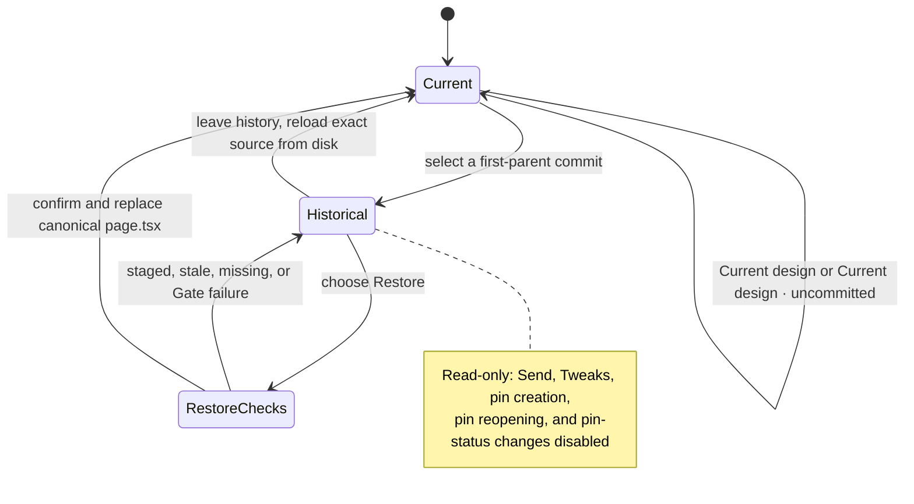

termcraft has no private page-version system. The MVP exposes only each page's canonical source and has no history UI; v1 adds optional, read-only Git browsing, explicit Restore, and user-confirmed scoped commits without changing branches or managing repository history automatically.

## Walkthrough

1. Product boundary: the MVP has no history UI, numbered source files, version hotkeys, history popup, or rollback action. Every page has one canonical `.termcraft/pages/<slug>/page.tsx`. Git is not required for MVP or v1 design, generation, preview, pins, chats, migration, or export; when Git is unavailable or the project is outside a repository, only history and commit controls are unavailable and explain why.
2. History discovery in v1: opening history for the active page asks the `GitHistory` port for repository/page state and a path-limited walk from the current `HEAD` through its first-parent chain. Only commits whose trees changed that page's `page.tsx` appear. A merge is one mainline entry; commits reachable only through another parent do not appear, other refs are never searched, and directory-rename detection is not attempted. Each row keeps the full object id for commands and displays a bounded short hash, author, committer timestamp, and subject. A shallow repository labels its reachable local entries `partial history`; termcraft never fetches missing history.
3. Current rows use explicit precedence. An unborn repository shows only **Current design · uncommitted**, with no commit rows. An untracked path with no first-parent ancestry also shows only that row. An untracked or recreated path with first-parent ancestry shows **Current design · uncommitted** plus the reachable historical entries. When tracked content equals the page source at `HEAD`, the `HEAD` row is **Current design** rather than a duplicate; other tracked changes put **Current design · uncommitted** above reachable commits.
4. Historical preview: selecting a commit reads that commit's page source into a temporary, read-only snapshot outside `.termcraft/` and respawns the design host on it. No checkout occurs; the canonical file, branch, `HEAD`, and index are unchanged. The UI shows `<short-hash> · read-only`, disables Send, Tweaks, pin creation, pin reopening, and pin-status changes, and keeps the current selection or existing current-pin overlay only where its element id resolves. Historical overlays cannot mutate pin lifecycle state. Leaving history kills the historical host and respawns it on the exact Current design source from disk, where those actions are re-enabled.
5. Historical errors: a missing or corrupt Git object names the commit and path and changes nothing. A historical source that no longer passes the current Gate or host remains selectable as an error state, but Restore is disabled for it. Browsing itself performs no project write.
6. Restore checks: Restore is explicit and unavailable during an agent turn. Before showing confirmation, the Kernel records the canonical source hash, checks the selected page's index state, and confirms the historical object is readable. A staged page source blocks Restore without replacing or unstaging it. Unstaged changes are allowed only after a warning that names the exact canonical path and says those current page-design changes will be lost.
7. Restore freshness, apply, and partial failure: after confirmation the Kernel acquires the project-write mutex, repeats the source-hash and index checks, verifies the same full selected object id is readable, and passes that source through the current Gate. A failed check releases the mutex without a project write. The Project store then replaces only the selected canonical `page.tsx` through a temporary file plus rename and appends one Restore system record naming the page and full source commit to the active chat; other chats remain untouched. These two writes are serialized in that order under the mutex but are not one crash-atomic transaction. The Kernel releases the mutex and refreshes the source, host, chat, and Git status. If the page replacement succeeds but the chat append fails, the restored page stays active, a persistence error says Restore was not fully recorded, and Retry stays bound to the same page and full source commit rather than silently applying another selection. Branch, `HEAD`, index, other pages, pins, other chats, and application files remain untouched. The result is `Current design · uncommitted` unless it happens to equal `HEAD`; Restore creates neither a commit nor a hidden backup.
8. Commit control: v1 history adds `[ ● Commit current page ][ ▾ ● ]`. The primary **Commit current page** scope includes only `.termcraft/pages/<active-slug>/page.tsx` and commits the latest source from disk even when an older copy was staged. The dropdown adds **Commit infrastructure** for `project.toml`, `config.toml`, generated `.gitignore`, and future portable project-level schema/metadata files, plus **Commit entire project** for every non-ignored added, modified, or deleted path under `.termcraft/`, including pages, chats, pins, and export artifacts. Locks, backups, `*.local.*`, ignored paths, and every path outside `.termcraft/` are excluded.
9. Scope status: a dot on the primary action means the active page differs from `HEAD`; a dot beside the dropdown arrow means another `.termcraft/` path differs. Each dropdown action has its own dot and changed-file count. Clean scopes have no dot and are disabled. Tooltips and accessible labels name each dirty scope so color is not the only signal; a separately committed new page can therefore leave infrastructure visibly dirty.
10. Commit confirmation: every scope opens a dialog with an editable message and the exact added, modified, and deleted file preview. The page template is `design(<slug>): update <title>`; infrastructure and whole-project templates are scope-specific and never copy chat or prompt text. An empty message disables Commit. The plan records expected `HEAD`, selected paths, path states, and content hashes; execution revalidates all of them and requires a fresh preview and confirmation if anything changed. Absent hook side effects, a successful current-page commit leaves the active source clean relative to the new `HEAD`, and the adapter's own operations preserve unrelated staged and unstaged state.
11. Git behavior and refresh: termcraft invokes Git only through the adapter, honors hooks and signing, passes the confirmed message without opening an editor, and never bypasses verification or signing. Hooks remain free to modify the active source or other files; termcraft neither suppresses nor rewrites their effects. A detached `HEAD` allows history and Restore but adds a second warning and confirmation before commit. An active merge, rebase, cherry-pick, or revert disables commit controls. Missing identity, signing, hook, timeout, output-limit, and index-lock failures surface bounded Git output and an appropriate hint or Retry action. Status refreshes after every user-initiated Git operation or commit attempt and after Kernel apply, exposing hook-induced dirty state and every other changed file; inspection commands used by refresh do not recursively trigger another refresh.
12. Concurrency: commit controls remain usable while an agent turn runs. Scoped commit execution, the short final generation apply, and Restore's ordered page-and-chat write sequence share the project-write mutex; agent work and generation Gate retries do not hold it. A commit that wins the mutex before apply records the current on-disk design, and the later apply becomes a new uncommitted change. Restore stays locked for the whole turn.
13. Repository limits: termcraft does not initialize repositories, create or switch refs, stash, check out, fetch, pull, push, or correlate commits with prompts or chats. History begins where the immutable page path was introduced. Deleting and later recreating a slug resurrects that page identity and its reachable Git history.

## Source anchors

- `docs/superpowers/specs/2026-07-16-git-backed-page-history-design.md` — governing MVP/v1 split, Current design terminology, first-parent browsing, Restore checks, scoped commits, availability states, and acceptance criteria
- `docs/architecture/modules.md` — Git adapter boundary, Kernel ownership, historical host snapshots, and project-write mutex coordination
- `docs/architecture/storage.md` — canonical source path, commit scopes and exclusions, Restore record schema, and optional-Git storage behavior
