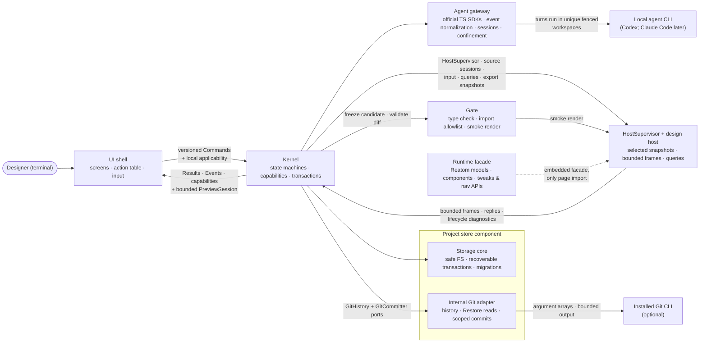

termcraft is one program built from seven components with strict boundaries and two deliberate process seams: the transport-neutral command/result/event boundary between the UI shell and the Kernel, and the design-host subprocess that is the only place agent-written design code ever executes. The Git adapter is an internal Project-store port, not an eighth top-level component. This document names the components, what each owns, and the runtime loop that connects them.

## Walkthrough

1. Seven components, each with a single responsibility:

   | Component | Owns |
   |------|----------------|
| **UI shell** | Screens; input interpretation (keys, mouse, composer slash menu); preview compositing; `/commit-page`, `/commit-infra`, and `/commit-all` command-row status plus shared confirmation presentation; the action table as the registry of triggers, labels, hints, and local screen/focus/modal applicability. Domain availability comes from Kernel capabilities and every command is revalidated by the Kernel. |
| **Kernel** | The only domain decision-maker: versioned commands in, typed results/events/capabilities out; explicit named Reatom state machines for turns, Restore, commits, export, preview, and migration; transaction and project-write coordination; confirmation-time `targetChatId` capture and `restoreActionId` binding; Git decisions through `GitHistory` and `GitCommitter`. |
| **Agent gateway** | Backends over vendors' official TypeScript SDKs: start, stream, confirmed process-tree cancel, health-check; normalization into backend-neutral events; per-chat session checkpoints; per-backend confinement to a unique turn workspace; fencing by turn, attempt, and lease nonce. |
| **Runtime facade** | `@termcraft/runtime`, the only saved-page import: selected Reatom v1001 primitives, `reatomComponent`, themed components with stable ids, tokens, tweaks, navigation, and runtime capabilities; embedded so projects need no `node_modules`. |
   | **Gate** | Validation of the staging diff: manifest checks, TypeScript checking against embedded types, the import allowlist, page-contract checks, smoke rendering, id lints |
| **HostSupervisor** | Owns the isolated design-host subprocess and versioned length-prefixed protocol for preview, Gate smoke, export, and historical snapshots. `PreviewSession` exposes bounded latest-frame delivery, ordered input/query replies, timeouts, restart budgets, and a circuit breaker; UI never owns the process. |
| **Project store** | Portable ProjectState, local workspace/session state, canonical sources, chats, append-only pin events, `SafeProjectFs`, OS-held `ProjectLease`, recoverable transaction engine, verified migration backups, rebuildable projections, and the internal Git adapter implementing `GitHistory`/`GitCommitter`; trust remains machine-local outside the project. |

2. The runtime loop merges terminal events, Kernel results/events/capabilities, and a dedicated bounded preview stream. The UI translates input through the action table; the Kernel revalidates commands and answers with typed results. Host frames reach the UI only through `PreviewSession`, with at most the latest pending full frame, so they cannot block domain events. Kernel, UI, and saved page models use named Reatom atoms, computeds, and actions; only DTOs cross the UI–Kernel boundary.
3. The Kernel boundary is transport-neutral. Commands and events are serializable and versioned, with `commandId`, `stateRevision`, and `eventSeq`, but daemon authentication, reconnect, multi-client subscriptions, and distributed locking are deliberately unspecified.
4. The design host is the second deliberate seam — the cage where agent-written code runs. Isolation is layered: process isolation, scrubbed environment and cwd, runtime-only imports, and workspace trust. `HostSupervisor` owns handshake and message limits, heartbeats, request deadlines, graceful/hard shutdown, backoff, and a restart circuit breaker. A crash or hang kills only the host; the preview shows a bounded error state and the app keeps working.
5. The UI shell never touches the Project store or host process directly. Stored state flows through Kernel commands and events; preview input, frames, and queries flow through the Kernel-owned `PreviewSession` facade.
6. The same supervisor opens source sessions for preview, Gate smoke, deterministic export, and Git-history snapshots. Export captures a fresh host per page and size through a bounded worker pool; Gate reads immutable candidate snapshots. Respawning resets Reatom prototype state scoped to that source session.
7. Prototype interactivity crosses the host boundary in exactly two runtime APIs: navigation events and tweak models. Everything else that moves is private Reatom state in the saved page model.
8. Git interaction does not share the agent-turn lock wholesale. In v1 local slash-command mode keeps `/commit-page`, `/commit-infra`, and `/commit-all` available by capability while other turn-locked rows stay dimmed. Actual commit and final apply serialize through the project-write mutex. Because Git hooks may modify `.termcraft/`, final apply compare-and-swaps all source and record preconditions under that mutex before writing commit intent; drift fails without overwrite. Restore remains locked during the turn. Its durable `RestoreTransaction` preserves the captured `targetChatId` and UUIDv7 `restoreActionId`: source replacement and exactly-one audit append roll forward across restart without repeating Gate or source replacement.
9. Failure-isolation note: agent rejection, Gate rejection, or interruption before commit intent changes no canonical source. After durable intent, `TurnTransaction` idempotently rolls all planned page, portable manifest, local active-page, agent-record, and pin-event writes forward; startup completes recovery before opening the Workspace. Unexpected target hashes enter a recovery conflict and are never overwritten. A canonical source already broken at launch remains available for an agent repair turn or explicit Git Restore.

## Source anchors

- `docs/superpowers/specs/2026-07-13-termcraft-design.md` — §4.1 components and the kernel boundary, §4.2 the design host and isolation layers, §3.8 action table and hotkey tiers, §3.10 slash menu, §5.7 rendering determinism, §6.1 backend abstraction and confinement, §6.3 the gate
- `docs/superpowers/specs/2026-07-16-git-backed-page-history-design.md` — governing canonical-source model, optional Git adapter and Kernel ports, history/Restore flow, scoped commit orchestration, and export-source rule
- `docs/superpowers/specs/2026-07-16-production-hardening-decisions-design.md` — seven-component boundary and production precedence
- `docs/superpowers/specs/2026-07-16-kernel-command-contract-design.md` — authoritative Reatom state machines, DTOs, revisions, capabilities, and command concurrency
- `docs/superpowers/specs/2026-07-16-host-supervision-protocol-design.md` — HostSupervisor, PreviewSession, framing, limits, backpressure, and restart policy
- `docs/superpowers/specs/2026-07-16-runtime-api-compatibility-design.md` — runtime-only saved-page boundary and Reatom-first page models
- `docs/superpowers/specs/2026-07-16-turn-durability-staging-design.md` — transaction, mutex, workspace, fencing, and recovery ownership
- `docs/superpowers/specs/2026-07-16-projections-observability-scale-design.md` — projection ownership, bounded operations, and performance budgets
