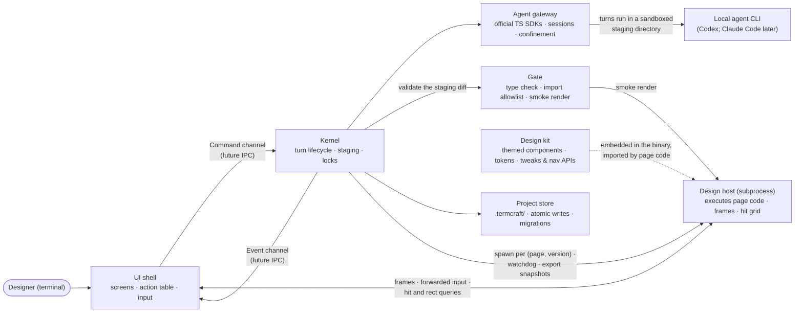

termcraft is one program built from seven components with strict boundaries and two deliberate process seams: the command/event channel between the UI shell and the Kernel (designed to become an inter-process protocol later), and the design-host subprocess that is the only place agent-written design code ever executes. This document names the components, what each owns, and the runtime loop that connects them.

## Walkthrough

1. Seven components, each with a single responsibility:

   | Component | Owns |
   |------|----------------|
   | **UI shell** | Screens; input interpretation (keys, mouse, the composer slash menu); preview compositing of host frames; the action table — the single registry of user actions: hotkey or slash command, availability predicate, dispatched command |
   | **Kernel** | The only decision-maker: commands in, events out, the agent-turn lifecycle (staging assembly → turn → gate → apply), the turn-time locks, the design host's lifecycle |
   | **Agent gateway** | Backends over the vendors' official TypeScript SDKs: start, stream, cancel, health-check; per-chat session continuity; mapping (model, effort) to SDK options; per-backend confinement of the turn to the staging directory |
   | **Design kit** | `@termcraft/kit`, the design system agent code composes from: themed components with mandatory stable ids, palette tokens, the tweaks and navigation APIs; embedded in the binary so projects need no `node_modules` |
   | **Gate** | Validation of the staging diff: manifest checks, TypeScript checking against embedded types, the import allowlist, page-contract checks, smoke rendering, id lints |
   | **Design host** | An isolated subprocess that executes one page version headlessly: styled frames out, forwarded input and tweak changes in, hit/rect/describe queries answered, the page's evaluated metadata and tweak declarations reported after mount; killed and respawned on page/version switch |
   | **Project store** | Everything under `.termcraft/`: manifest, versions, chats, pins, config; atomic writes; the migration registry; the machine-local trust ledger kept outside the project |

2. The runtime loop: terminal events (keys, mouse, resize), Kernel events, and design-host frames merge into one loop. The UI shell translates input into commands through the action table; the Kernel answers with events; host frames blit into the preview region; the UI shell redraws. No other channel exists between the layers.
3. The Kernel boundary is the future IPC: when daemon mode arrives, the command/event channel contract becomes the wire protocol and the UI shell does not change.
4. The design host is the second deliberate seam — the cage where agent-written code runs. Isolation is layered: process isolation with a heartbeat watchdog (stability, the load-bearing layer), scrubbed environment and scratch working directory, the import allowlist re-checked at load, and the workspace-trust gate before anything renders at all. A crash or hang kills only the host; the preview shows an error panel and the app keeps working.
5. The UI shell never touches the Project store directly — everything it needs from stored state flows through Kernel commands and events. Preview traffic (frames, input forwarding, hit and rect queries) is the one UI ↔ host exchange, brokered by the Kernel at spawn.
6. Why the Kernel owns the host lifecycle: export renders deterministic snapshots in a fresh host at each page's minimum size, the gate smoke-renders candidate pages before they are applied, and the preview host is killed and respawned on every page/version switch — all Kernel decisions. Respawning is also what resets prototype state, since that state is ordinary React state inside the host process.
7. Prototype interactivity crosses the host boundary in exactly two places, both kit APIs: navigation calls emitted by design code (the shell switches tabs) and tweak values pushed in from the Tweaks panel. Everything else that "moves" in a prototype is component state private to the design.
8. Failure-isolation note: an agent process dying, producing code that does not compile, or producing code that crashes never corrupts stored state. The gate validates the staging diff — including a smoke render in a disposable host — before the Kernel writes anything; new versions are written atomically, so the last valid version always survives.

## Source anchors

- `docs/superpowers/specs/2026-07-13-termcraft-design.md` — §4.1 components and the kernel boundary, §4.2 the design host and isolation layers, §3.8 action table and hotkey tiers, §3.10 slash menu, §5.7 rendering determinism, §6.1 backend abstraction and confinement, §6.3 the gate
