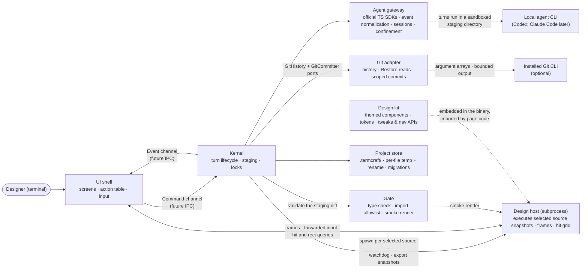

termcraft is one program built from eight components with strict boundaries and two deliberate process seams: the command/event channel between the UI shell and the Kernel (designed to become an inter-process protocol later), and the design-host subprocess that is the only place agent-written design code ever executes. This document names the components, what each owns, and the runtime loop that connects them.

## Walkthrough

1. Eight components, each with a single responsibility:

   | Component | Owns |
   |------|----------------|
   | **UI shell** | Screens; input interpretation (keys, mouse, the composer slash menu); preview compositing of host frames; the commit split-button and scope/status presentation; the action table — the single registry of user actions: hotkey or slash command, availability predicate, dispatched command |
   | **Kernel** | The only decision-maker: commands in, events out, the agent-turn lifecycle (staging assembly → turn → gate → apply), the turn-time locks, the design host's lifecycle; Git history/Restore decisions and scoped-commit planning, freshness revalidation, confirmation orchestration, and project-write mutex coordination through the `GitHistory` and `GitCommitter` ports |
   | **Agent gateway** | Backends over the vendors' official TypeScript SDKs: start, stream, cancel, health-check; normalization of each vendor's event stream into the backend-neutral turn events (reasoning chunks, tool steps, final message, token usage) — the Kernel and UI shell never see vendor event shapes; per-chat session continuity; mapping (model, effort) to SDK options; per-backend confinement of the turn to the staging directory |
   | **Design kit** | `@termcraft/kit`, the design system agent code composes from: themed components with mandatory stable ids, palette tokens, the tweaks and navigation APIs; embedded in the binary so projects need no `node_modules` |
   | **Gate** | Validation of the staging diff: manifest checks, TypeScript checking against embedded types, the import allowlist, page-contract checks, smoke rendering, id lints |
   | **Design host** | An isolated subprocess that executes one selected page-source snapshot headlessly — the canonical current source, a staging candidate, an export source, or a historical snapshot: styled frames out, forwarded input and tweak changes in, hit/rect/describe/layout-tree queries answered, the page's evaluated metadata and tweak declarations reported after mount; killed and respawned when the selected page or source changes |
   | **Project store** | Everything under `.termcraft/`: manifest, canonical page sources, chats, pins and their persisted statuses, config; per-file replacement through a temporary file plus rename; the migration registry; the machine-local trust ledger kept outside the project |
   | **Git adapter** | The only module that invokes the installed Git CLI; implements the Kernel's `GitHistory` and `GitCommitter` ports for optional first-parent page history, historical source reads, index inspection, and explicit scoped commits while preserving repository state outside the confirmed scope |

2. The runtime loop: terminal events (keys, mouse, resize), Kernel events, and design-host frames merge into one loop. The UI shell translates input into commands through the action table; the Kernel answers with events; host frames blit into the preview region; the UI shell redraws. No other channel exists within this UI–Kernel–host runtime loop. Internally each side keeps its state and orchestration in Reatom (atoms, computeds, actions); only commands and events cross the UI–Kernel boundary — the UI shell mirrors Kernel state from events, never shares reactive state with it.
3. The Kernel boundary is the future IPC: when daemon mode arrives, the command/event channel contract becomes the wire protocol and the UI shell does not change.
4. The design host is the second deliberate seam — the cage where agent-written code runs. Isolation is layered: process isolation with a heartbeat watchdog (stability, the load-bearing layer), scrubbed environment and scratch working directory, the import allowlist re-checked at load, and the workspace-trust gate before anything renders at all. A crash or hang kills only the host; the preview shows an error panel and the app keeps working.
5. The UI shell never touches the Project store directly — everything it needs from stored state flows through Kernel commands and events. Preview traffic (frames, input forwarding, hit and rect queries) is the one UI ↔ host exchange, brokered by the Kernel at spawn.
6. Why the Kernel owns the host lifecycle: export renders deterministic snapshots from canonical current sources in a fresh host per page and export size (the page's minimum size plus a fixed ladder of larger sizes), capturing the frame and the resolved layout tree from the same render pass, the gate smoke-renders candidate pages before they are applied, and the preview host is killed and respawned whenever the active page or selected source snapshot changes — all Kernel decisions. Respawning is also what resets prototype state, since that state is ordinary React state inside the host process.
7. Prototype interactivity crosses the host boundary in exactly two places, both kit APIs: navigation calls emitted by design code (the shell switches tabs) and tweak values pushed in from the Tweaks panel. Everything else that "moves" in a prototype is component state private to the design.
8. Git interaction does not share the agent-turn lock wholesale. In v1 the commit split-button remains available while an agent turn runs; scoped commit execution and the short final apply phase serialize through the project-write mutex. Restore remains locked during the turn. While a historical snapshot is selected, Send, Tweaks, pin creation, pin reopening, and pin-status changes are disabled until the user returns to Current design; existing current pins are only overlaid where their ids resolve.
9. Failure-isolation note: agent rejection, Gate rejection, or interruption before apply begins changes no canonical source. After the Gate accepts a candidate, the Kernel asks the Project store to replace each persisted file through a temporary file plus rename. Page, manifest, chat, and pin replacements serialize under the project-write mutex, but they are not one crash-safe transaction: a crash during multi-file apply can leave a partially applied turn until a separate Turn Transaction design exists. A canonical source already broken when termcraft launches is not replaced automatically: the Workspace shows its preview error, keeps repair turns available, and in v1 offers explicit Git Restore when usable history exists.

## Source anchors

- `docs/superpowers/specs/2026-07-13-termcraft-design.md` — §4.1 components and the kernel boundary, §4.2 the design host and isolation layers, §3.8 action table and hotkey tiers, §3.10 slash menu, §5.7 rendering determinism, §6.1 backend abstraction and confinement, §6.3 the gate
- `docs/superpowers/specs/2026-07-16-git-backed-page-history-design.md` — governing canonical-source model, optional Git adapter and Kernel ports, history/Restore flow, scoped commit orchestration, and export-source rule
