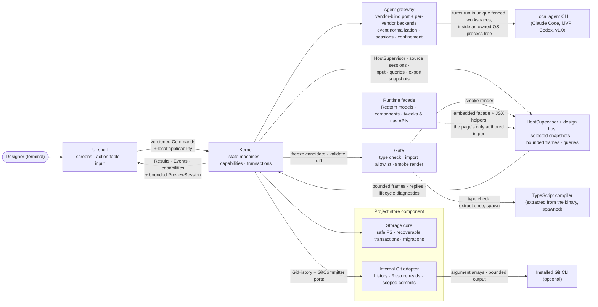

termcraft is one program built from seven components with strict boundaries and two deliberate process seams: the transport-neutral command/result/event boundary between the UI shell and the Kernel, and the design-host subprocess that is the only place agent-written design code ever executes. The Git adapter is an internal Project-store adapter behind Kernel ports, not an eighth top-level component. This document names the components, what each owns, and the runtime loop that connects them.

## Walkthrough

1. Seven components, each with a single responsibility:

   | Component | Owns |
   |------|----------------|
| **UI shell** | Screens; input interpretation (keys, mouse, composer slash menu); preview compositing; `/commit-page`, `/commit-infra`, and `/commit-all` command-row status plus shared confirmation presentation; the action table as the registry of triggers, labels, hints, and local screen/focus/modal applicability. Domain availability comes from Kernel capabilities and every command is revalidated by the Kernel. |
| **Kernel** | The only domain decision-maker: versioned commands in, typed results/events/capabilities out; explicit named Reatom state machines for turns, Restore, commits, export, preview, and migration; transaction and project-write coordination; confirmation-time `targetChatId` capture and `restoreActionId` binding; Git decisions through `GitHistory` and `GitCommitter`. |
| **Agent gateway** | Backends over vendors' official TypeScript SDKs: start, stream, confirmed process-tree cancel, health-check; normalization into backend-neutral events; per-chat session checkpoints; per-backend confinement to a unique turn workspace; fencing by turn, attempt, and lease nonce. Built today, in two tiers: a vendor-blind port plus a backend-agnostic shared tier — session-scope derivation, staging containment, the deny-by-default confinement rule, and the run loop itself (the terminal latch, the event queue, and both exit-confirmation ladders) — and one vendor tier, the Claude Code backend, behind it. The shared tier imports no vendor SDK at all. A second vendor (Codex, v1.0) becomes a sibling of that tier supplying only its own stream driver, message classifier, and tool vocabulary, not a change to the shared one. Each attempt runs inside an owned OS process tree, and every terminal outcome resolves only after that tree is confirmed exited. What is still missing is above the gateway, not inside it: no Kernel drives a turn, chooses resume-versus-fresh, or consumes the normalized events, and no composition root selects a backend. |
| **Runtime facade** | `@termcraft/runtime`, the only import a saved page's author may write: selected Reatom v1001 primitives, `reatomComponent`, themed components with stable ids, tokens, tweaks, navigation, and runtime capabilities; embedded so projects need no `node_modules`. It also owns the JSX helper surface the compiler's transform emits against — never named by a page. Built today: the token palette, page contract, and the full component catalog. Not yet: `defineTweaks` is a dormant declaration-only stub, interactive props (`onPress`/`onChange`/`onSelect`) are wired to the right handler but stay inert in the static render, no page-facing navigation API exists, and the host resolver still serves the JSX helpers via the underlying `react/jsx-runtime` specifiers rather than a `@termcraft/runtime`-qualified path — all phase-7/phase-8 work. |
| **Gate** | Validation of the staging diff: manifest checks, TypeScript checking against embedded runtime types, the import allowlist, page-contract checks, smoke rendering, and lints. The type checker itself is not embedded-and-called: at the pinned TypeScript major it is a per-platform native executable, extracted once to a per-user directory and spawned. Today only the two determinism lints (unguarded timers, unguarded randomness) are implemented — the id/navigation lints are declared but not built — and the type-check, manifest, and smoke stages are wired as optional injected ports with no composition root to call them until the Kernel exists. |
| **HostSupervisor** | Owns the isolated design-host subprocess and versioned length-prefixed protocol for preview, Gate smoke, export, and historical snapshots. `HostSupervisor.preview()` returns a `SupervisedPreviewSession` (blocker B4) — bounded latest-frame delivery, resize/set-mode/query/retry/close, and request timeouts, with the restart budget/circuit breaker composed in rather than sitting behind a separate handle type; UI never owns the process. Geometry queries (`checkHit`/`rectOf`/`describe`/`layoutTree`) are wired end to end (blocker B1). Ordered input forwarding and tweak/theme control are still part of the target `PreviewSession` contract but not yet implemented — today's facade deliberately omits them. |
| **Project store** | Portable ProjectState, local workspace/session state, canonical sources, chats, append-only pin events, `SafeProjectFs`, OS-held `ProjectLease`, recoverable transaction engine, verified migration backups, rebuildable projections, and the internal Git adapter implementing `GitHistory`/`GitCommitter`; trust remains machine-local outside the project. Every piece here is implemented and tested except the Git adapter, which has no code yet — it is v1 scope, governed by the Git-backed history design. |

2. The runtime loop merges terminal events, Kernel results/events/capabilities, and a dedicated bounded preview stream. The UI translates input through the action table; the Kernel revalidates commands and answers with typed results. Host frames reach the UI only through `PreviewSession`, with at most the latest pending full frame, so they cannot block domain events. Kernel, UI, and saved page models use named Reatom atoms, computeds, and actions; only DTOs cross the UI–Kernel boundary.
3. The Kernel boundary is transport-neutral. Commands and events are serializable and versioned, with `commandId`, `stateRevision`, and `eventSeq`, but daemon authentication, reconnect, multi-client subscriptions, and distributed locking are deliberately unspecified.
4. The design host is the second deliberate seam — the cage where agent-written code runs. Isolation is layered: process isolation, scrubbed environment and cwd, runtime-only imports, and workspace trust. The runtime-only import rule is carried entirely by source scans — the Gate's, and the host's own rescan before it links a page — with nothing underneath them: the host's module resolver must also serve the compiler-generated JSX helper specifiers, and it fails open, so a page smuggling an explicit helper import past both scans would run rather than fail to load. The specs record this as a defense-in-depth gap, not a broken rule; anything that weakens a scan removes the only thing enforcing it. `HostSupervisor` owns handshake and message limits, heartbeats, request deadlines, graceful/hard shutdown, backoff, and a restart circuit breaker. A crash or hang kills only the host; the preview shows a bounded error state and the app keeps working.
5. The UI shell never touches the Project store or host process directly. Stored state flows through Kernel commands and events; preview input, frames, and queries flow through the Kernel-owned `PreviewSession` facade.
6. The same supervisor opens source sessions for preview, Gate smoke, deterministic export, and Git-history snapshots. Export captures a fresh host per page and size through a bounded worker pool; Gate reads immutable candidate snapshots. Respawn per source is a correctness requirement, not merely an isolation preference: the runtime's module cache hands back the stale module for a re-imported path and query cache-busting does not cure it, so a host that outlived a source edit would render the previous source while reporting success. Nothing short of a fresh process fixes that. Respawning also resets Reatom prototype state scoped to that source session.
7. Prototype interactivity crosses the host boundary in exactly two runtime APIs: navigation events and tweak models. Everything else that moves is private Reatom state in the saved page model. (v1/phase-7 target; not yet implemented — today's interactive component props are wired to the correct handler but stay inert in the static headless render, tweaks are a declaration-only stub, and no navigation API exists yet in the runtime facade.)
8. Git interaction does not share the agent-turn lock wholesale. In v1 local slash-command mode keeps `/commit-page`, `/commit-infra`, and `/commit-all` available by capability while other turn-locked rows stay dimmed. Actual commit and final apply serialize through the project-write mutex. Because Git hooks may modify `.termcraft/`, final apply compare-and-swaps all source and record preconditions under that mutex before writing commit intent; drift fails without overwrite. Restore remains locked during the turn. Its durable `RestoreTransaction` preserves the captured `targetChatId` and UUIDv7 `restoreActionId`: source replacement and exactly-one audit append roll forward across restart without repeating Gate or source replacement. (`buildRestoreTransaction` is already implemented and unit-tested inside the store's transaction engine, but MVP wires no caller — Restore itself, and every Git-commands paragraph above, is v1 scope with no Kernel or Git adapter yet to drive it.)
9. Agent confinement is defense-in-depth, and it is deliberately not the wall. The Gate is load-bearing: it validates an immutable candidate the agent cannot reach, and nothing the agent does inside its workspace can bypass it. On top of that the gateway adds a second, weaker layer around the running CLI — a deny-by-default veto on every tool call, allowing only file tools whose resolved path stays inside that turn's workspace and refusing shell and web tools outright — so a misbehaving agent is stopped early rather than merely caught late. Two properties make it hold: the backend also binds the CLI's working directory and only writable root to the same workspace, and the containment test resolves relative paths the way the agent itself would, then rejects any path segment that turns out to be a filesystem junction. The health probe is isolated the same way as a turn — its own settings-free session, a scratch working directory instead of the user's project, and the same veto — so nothing a project could plant can execute before the designer has answered the trust prompt.
10. Every attempt owns its process tree. The gateway creates one OS-level job for each attempt, spawns the vendor CLI itself so it can adopt the process into that job, and verifies the adoption actually landed rather than assuming it. From then on "did the run stop?" is a real question to the operating system — a live count of processes the job owns — not a guess from a process id. No outcome, successful or cancelled, is reported until that count reaches zero; if it cannot, the run reports an unconfirmed exit and the backend latches unhealthy until it is restarted, because a workspace with a possibly-live writer in it must not be snapshotted or reused. The job is released on every terminal path, which is also the last-resort reaper: releasing it kills anything still inside.
11. Failure-isolation note: agent rejection, Gate rejection, or interruption before commit intent changes no canonical source. After durable intent, `TurnTransaction` idempotently rolls all planned page, portable manifest, local active-page, agent-record, and pin-event writes forward; startup completes recovery before opening the Workspace. Unexpected target hashes enter a recovery conflict and are never overwritten. A canonical source already broken at launch remains available for an agent repair turn or explicit Git Restore.

## Source anchors

Five of the seven components are real, tested code today (Runtime facade, Gate,
HostSupervisor, Project store, Agent gateway); UI shell and Kernel have no module yet
(`ui/` and `core/` do not exist under `src/`) and stay anchored to spec only.

**UI shell — no code yet:**

- `docs/superpowers/specs/2026-07-13-termcraft-design.md` — §3.8 action table and hotkey tiers, §3.10 slash menu
- `docs/superpowers/specs/2026-07-16-kernel-command-contract-design.md` — the commands, results, events, and capabilities the shell will consume

**Kernel — no code yet:**

- `docs/superpowers/specs/2026-07-13-termcraft-design.md` — §4.1 components and the kernel boundary
- `docs/superpowers/specs/2026-07-16-kernel-command-contract-design.md` — authoritative Reatom state machines, DTOs, revisions, capabilities, and command concurrency
- `docs/architecture/code-structure.md` — where `core/ports/` will sit and which already-built adapters (store, gate, host, agent) it will inject

**Agent gateway — `src/agent/` (port + shared tier: `confinement`, `session`, `health`, `run`) and `src/agent/claude/` (the one vendor tier: `backend`, `query`, `run`, `tools`, `errors`):**

- `src/agent/types.ts` — the vendor-blind `AgentBackend` port and its vocabulary (`AgentTask`, `AgentRun`, `AgentRunOutcome`, `AgentHealthState`, `BackendCapabilities`, `SessionPlan`); imports no vendor SDK, so phase 6 lifts it into `core/ports/` unchanged
- `src/agent/index.ts` — the module's public entry: the port types plus `createProductionClaudeBackend()`, the only production wiring that exists
- `src/agent/confinement/model/policy.ts` — the backend-agnostic deny-by-default rule behind the tool veto; parameterized over a tool-name table so it holds no vendor names itself
- `src/agent/confinement/model/path-containment.ts` — the staging-containment test: normalize, boundary-safe prefix compare, relative paths resolved against the workspace (not termcraft's own cwd), and a reparse-point check on every segment from the workspace down to the target
- `src/agent/session/model/session-scope.ts` — the opaque per-`(backend, account, model, workspace)` scope string the store checkpoint is keyed by; effort is deliberately excluded so changing effort never invalidates a session
- `src/agent/health/model/probe.ts` — the backend-agnostic health-probe policy: a bounded deadline, closing the adopted process tree on every path, and never classifying an ambiguous read as ready; a backend supplies only its own message classifier
- `src/agent/run/model/engine.ts` — the shared run loop: one terminal latch that decides between natural completion and cancellation, the event queue, and both exit-confirmation ladders — moved out of the vendor tier so a second backend gets the same guarantees for free; a backend supplies only a stream-reading driver
- `src/agent/run/model/unconfirmed-exit-latch.ts` — the sticky per-backend lockout an unconfirmed exit sets, cleared only by restart
- `src/agent/claude/tools/model/vocabulary.ts` — Claude Code's own tool vocabulary fed into that shared rule: which file tools require a path, which default to the working directory, and which tools are denied outright
- `src/agent/claude/query/model/query-options.ts` — the per-attempt SDK options: workspace as cwd and only writable root, no external settings sources, the deny-by-default veto, and the spawn hook that makes the CLI ours to own
- `src/agent/claude/query/model/spawn-adopt.ts` — spawn-then-adopt into the owned tree, shared verbatim by a real turn and the health probe, with the membership re-read that turns "adopted" into a verified fact
- `src/agent/claude/run/model/drive-stream.ts` — the vendor stream driver: reads `SDKMessage`s, normalizes them, and claims the natural outcome; the run loop itself now lives in `agent/run` above
- `src/agent/claude/backend/model/backend.ts` — the backend instance: per-run tree ownership, closing the tree on every terminal outcome, and wiring the shared unhealthy latch in
- `src/agent/claude/backend/model/probe.ts` — the vendor half of health: a minimal isolated query classified into installed / not-logged-in / ready, backed by the shared deadline/close policy above
- `src/agent/claude/run/model/normalize.ts` — vendor messages into `AgentEvent`s (reasoning, tool, final, error, usage), dropping anything with no mapping
- `src/infrastructure/process/model/job-object.ts`, `src/infrastructure/process/types.ts` — the owned process tree itself: a domain-free Windows Job Object with kill-on-close, an OS-read live process count, hard termination, and idempotent invalidating release
- `src/entities/turn/types.ts` — `AgentEvent` (the normalization target) and `TurnFence` (`turnId`/`attempt`/`leaseNonce`); the backend now stamps every event and outcome with the fence, but no Kernel consumes them yet
- `src/store/sandbox/model/staging-store.ts` — the unique per-turn workspace (`{userStateRoot}/sandboxes/<projectKey>/turns/<turnId>/workspace/`) a backend is confined to; the store creates it, and nothing yet hands one to a live turn
- `src/store/lease/model/lease.ts` — `leaseNonce()` mints a 128-bit base64url nonce in the shape a `TurnFence.leaseNonce` is meant to carry; nothing wires a store lease nonce into a turn fence yet
- `docs/superpowers/specs/2026-07-13-termcraft-design.md` — §6.2 the turn protocol above the backend (Kernel-side; no `core/` module drives it yet)

**Runtime facade — `src/runtime/`:**

- `src/runtime/index.ts`, `src/runtime/types.ts` — the public facade entry point and shared page-contract types (`ThemeId`, `Size`, `ThemeTokens`, `PageMeta`)
- `src/runtime/model/define-page.ts` — `definePage`, read by the Gate from the AST without executing the page
- `src/runtime/model/reatom.ts` — Reatom v1001 re-exports (`atom`, `computed`, `action`, `wrap`, the `withAsync*` family, `reatomComponent`) under the facade's own names
- `src/runtime/model/tokens.ts` — the `dark-default` palette taken 1:1 from `design/termcraft-engine.js`; `light-default` is declared as v1.0 scope but not built
- `src/runtime/model/capabilities.ts` — `defineTweaks` (dormant declaration-only stub), `hostModeAtom`/`interactionModeAtom` (host-writable, but nothing writes them yet), `isExport`, `themeCapability` (resolves `dark-default` only)
- `src/runtime/model/jsx.ts` — the JSX helper re-exports a page compiles against; the module's own comment records that the `@termcraft/runtime`-qualified jsx-runtime specifier isn't wired end to end yet (see `src/host/session/model/resolver.ts` below)
- `src/runtime/ui/` (14 components — primitive, row, column, panel, separator, spacer, text, button, input, tabs, list, table, gauge, sparkline) — the themed component catalog; every component is real, but `Button.onPress`/`Input.onChange`/`Tabs.onSelect`/`List.onSelect` are wired to the correct OpenTUI handler and stay inert in the current static render, and `Separator` renders a plain color band where the design specifies glyph rules with weld tees (documented in-file as a divergence pending the phase-7 UI pass)
- `docs/superpowers/specs/2026-07-16-runtime-api-compatibility-design.md` — the target navigation API and the v1 preview theme-override path, neither of which exists in code yet

**Gate — `src/gate/`:**

- `src/gate/index.ts`, `src/gate/types.ts` — public entry point and the `GateError`/`GateWarning`/`GateResult` vocabulary
- `src/gate/model/gate.ts` — the orchestrator (`runGate`): always runs the import scan, page contract, and determinism lints; `typeCheck`/`checkManifest`/`smokeRender` are optional injected ports, unwired until a composition root exists
- `src/gate/model/import-scan.ts` — the static `@termcraft/runtime`-only import allowlist scan (tokenizer-based, not regex)
- `src/gate/model/page-contract.ts` — literal-only `meta`/default-export contract check
- `src/gate/model/lints.ts` — only `unguarded-timer` and `unguarded-randomness` are implemented; `dropped-id`, `unpointed-element`, and `unlisted-navigation` are declared in `GateWarningKind` but explicitly deferred (need a JSX-aware AST, prior-iteration ids, and the manifest respectively)
- `src/gate/model/manifest.ts` — the staged `pages.json` slice check (built, unwired)
- `src/gate/model/type-check.ts`, `src/gate/model/tsc-extract.ts` — the embedded-tsc type-check port and its extract-once-to-a-per-user-directory mechanics (built, unwired)
- `src/gate/ports/smoke-renderer.ts` — the `SmokeRenderer` port the gate declares; `src/host/supervisor/model/one-shot.ts` implements the one-shot session it needs, but no adapter literally satisfying `SmokeRenderer` exists yet

**HostSupervisor / design host — `src/host/`:**

- `src/host/protocol/` — the versioned wire codecs: hello, control envelope, frame, strict JSON, and the hard size/geometry limits
- `src/host/render/` — the headless OpenTUI renderer and its span-row/color/attribute mapping to the wire format, plus `model/geometry.ts`'s real `checkHit`/`rectOf`/`describe`/`layoutTree` primitives over the live renderable tree (a deterministic tree-walk, not OpenTUI's own native hit-grid — see that file's doc comment for why); `describe`'s `kind` and `layoutTree`'s nodes are honestly incomplete until `@termcraft/runtime`'s component catalog assigns semantic kinds/labels
- `src/host/session/model/host-state-machine.ts` — the in-child protocol state machine; accepts only `mount`/`shutdown` before `ready` and `resize`/`set-mode`/`ping`/`query-hit`/`query-rect`/`query-describe`/`query-layout`/`shutdown` after (blocker B1) — no `key`/`click`/`set-tweak` kinds exist yet; a query whose carried `frameIdentity` no longer matches the current sealed frame gets the typed `STALE_FRAME` refusal (§7.1), not a fatal
- `src/host/session/model/source-mount.ts` — `loadPage`: source-hash verification and the import re-scan (`scanPageImports`), a documented defense-in-depth backstop with an acknowledged residual gap (a literal `require("react")` is indistinguishable from the transform's own phantom require)
- `src/host/session/model/resolver.ts` — the `Bun.plugin` runtime resolver; serves `@termcraft/runtime` plus the underlying `react/jsx-runtime`/`react/jsx-dev-runtime` specifiers, and fails open by design (no allowlist check of its own — enforced only by the scans above and beside it)
- `src/host/session/model/entry.ts` — `runHostStdio`: real stdio wiring, the 1 s heartbeat timer, the `FrameDecoder` pump, process exit
- `src/host/supervisor/model/spawn.ts` — the production `Bun.spawn` adapter: env allowlist, fresh scratch cwd
- `src/host/supervisor/model/handshake.ts` — pre-handshake negotiation and limit agreement
- `src/host/supervisor/model/heartbeat-watchdog.ts` — the 5 s liveness watchdog plus the unresponsive-request-count trip
- `src/host/supervisor/model/restart-policy.ts` — per-`(pageSlug, sourceHash)` restart budget, base-2 backoff, circuit breaker
- `src/host/supervisor/model/frame-broker.ts`, `preview-relay.ts` — the capacity-1 latest-wins frame delivery and its across-restart relay
- `src/host/supervisor/model/session.ts` — `createHostSession`: one incarnation end-to-end (spawn → negotiate → mount → ready → pump → resize/setMode/ping/query → stop). Every post-ready request now enqueues through `control-queue.ts` (a full outbound queue rejects a new discrete command with `HOST_BACKPRESSURED`, and `HostSessionDeps.onBackpressureChange` observes the backpressured/writable edges); every unsolicited inbound envelope now offers into `control-mailbox.ts`, drained on a clock-scheduled timer decoupled from the pump so a slow/absent consumer can genuinely trip `CONTROL_BACKPRESSURE` (blocker wiring, phase 6 slice 6D)
- `src/host/supervisor/model/supervisor.ts` — `createHostSupervisor`: the multi-session owner (restart/backoff/circuit, ≤10 global host cap, bounded start queue). `preview()` returns a `SupervisedPreviewSession` (blocker B4) — the restart-surviving identity/frames/retry/close the old `PreviewHandle` provided, composed with `resize`/`setMode`/`query`/`interactionMode` that rebind to whichever incarnation is currently live (`sessionFor`'s doc comment); there is no separate `PreviewHandle` type anymore
- `src/host/supervisor/model/preview-session.ts` — `createPreviewSession`, the UI-facing facade over one SINGLE, non-restarting `HostSession`; exposes `identity`/`mode`/`interactionMode`/`frames`/`resize`/`setMode`/`query`/`retry`/`close` — its own doc comment records the B4 decision and why `supervisor.ts` follows the same pattern rather than reusing this function directly; `forwardInput`/`setTheme`/`setCapabilities`/tweaks remain intentionally absent, and `retry()` is a no-op stub (there is no restart/backoff/circuit to act on for a single incarnation)
- `src/host/supervisor/model/control-queue.ts`, `control-mailbox.ts` — the bounded ordered outbound/inbound control primitives; now wired into `session.ts`'s live path (see above)
- `src/host/supervisor/model/one-shot.ts` — `runOneShotSession`: the smoke/export one-shot driver (no pump, no restart); its `frame` reply is a documented non-conformant MVP stand-in for the real `capture` + layout-tree reply
- `src/host/supervisor/model/export-pool.ts` — `createExportPool`: the bounded per-page/size worker pool, results published in manifest order
- `docs/superpowers/specs/2026-07-16-host-supervision-protocol-design.md` — blocker B1 closed the geometry-query wire kind + `query()` correlation + the child's real `checkHit`/`rectOf`/`describe`/`layoutTree` (§4.2, §7.1); `forwardInput`/`setTheme`/`setCapabilities`/tweaks/`key`/`click`/`set-tweak` remain unbuilt, and `describe`/`layoutTree`'s semantic kind/label vocabulary awaits `@termcraft/runtime`'s component catalog

**Project store — `src/store/`:**

- `src/store/index.ts`, `src/store/types.ts` — the Store port contract; the shape phase 6 lifts verbatim into `core/ports/`
- `src/store/model/factory.ts` — `createStore`/`openProject`/`createProject`: the launch sequence (lease → `SafeProjectFs` → journal format → recover transactions → migrations → schemas → orphan-turn scan → open) and the creation sequence
- `src/store/safe-fs/model/` — `SafeProjectFs`: the no-follow path walk (`no-follow.ts`), managed-path grammar (`path-rules.ts`), file-type/hardlink checks (`leaf-identity.ts`), per-namespace size limits (`limits.ts`), hashed candidate snapshots (`candidate.ts`)
- `src/store/lease/model/lease.ts` — the Windows OS-held `ProjectLease`: advisory-only metadata, never force-broken
- `src/store/trust/model/trust-store.ts`, `subject.ts` — the machine-local `TrustStore`, keyed by canonical path + filesystem identity + `projectId` + Git identity
- `src/store/toml/model/project-toml.ts`, `workspace-toml.ts` — `project.toml`/`workspace.local.toml` schema, decode/encode, and the too-new-format gate
- `src/store/toml/model/gitignore.ts` — the generated `.termcraft/.gitignore`; a courtesy mirror only — `StoragePathPolicy`, the live commit-scope planner it mirrors, is out of MVP scope and has no code
- `src/store/jsonl/model/reader.ts`, `line-codec.ts`, `chat-index.ts` — the from-byte-zero streaming reader with three-way tail classification, and the rebuildable paginated chat index
- `src/store/transaction/model/engine.ts`, `plan.ts`, `write-mutex.ts` — the core commit protocol (install payload → plan → intent → roll forward → commit marker) and its chained write-mutex permit guard
- `src/store/transaction/model/recovery.ts` — the startup scan that classifies and resolves every unfinished transaction before project state is exposed
- `src/store/transaction/model/wrappers.ts` — `admitTurn`/`finalizeTurn`/`terminalizeTurn` (the real `TurnTransaction`, exercised by the full test matrix) plus `buildRestoreTransaction`/`buildExportPublishTransaction`/`buildMigrationTransaction`, which are built and unit-tested but have no MVP caller
- `src/store/transaction/model/crash-harness.ts` — the mandatory fault-injection harness: a real child process crashes at each durability boundary and the parent asserts recovery lands correctly
- `src/store/sandbox/model/staging-store.ts` — the per-turn workspace store
- `src/store/migration/model/registry.ts` — the migration chain, deliberately empty (format version 1 is the first shipped format), and the shared too-new-format-counter check
- `src/store/migration/model/backup-store.ts` — the verified external backup protocol every future migration must complete first
- `src/store/projections/model/page-meta-cache.ts`, `diagnostics-store.ts`, `render-cache.ts` — the three independently quota'd rebuildable caches
- `docs/superpowers/specs/2026-07-16-projections-observability-scale-design.md` — the operations log and partial Gate/host diagnostics merge, neither of which has code yet

**Git adapter — no code yet (an internal Project-store adapter per `docs/architecture/code-structure.md`, not an eighth component):**

- `docs/superpowers/specs/2026-07-16-git-backed-page-history-design.md` — governing canonical-source model, `GitHistory`/`GitCommitter` ports, history/Restore flow, scoped commit orchestration, and export-source rule

**Cross-cutting:**

- `docs/superpowers/specs/2026-07-13-termcraft-design.md` — §4.1 components and the kernel boundary, §4.2 the design host and isolation layers, §5.7 rendering determinism, §6.3 the gate
- `docs/superpowers/specs/2026-07-16-production-hardening-decisions-design.md` — seven-component boundary and production precedence
- `docs/superpowers/specs/2026-07-16-turn-durability-staging-design.md` — transaction, mutex, workspace, fencing, and recovery ownership at the turn/Kernel level beyond what `store/transaction`'s code anchors above cover
