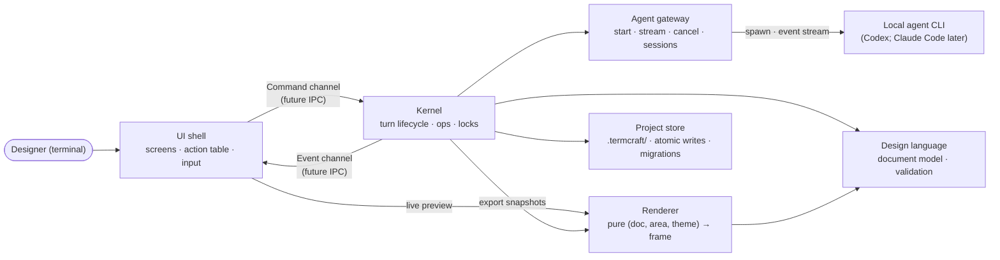

termcraft is one program built from six components with strict boundaries; the seam between the UI shell and the Kernel is a command/event channel pair designed to become an inter-process protocol later. This document names the components, what each owns, and the single runtime loop that connects them.

## Walkthrough

1. Six components, each with a single responsibility:

   | Component | Owns |
   |------|----------------|
   | **UI shell** | Screens, input interpretation, and the action table — the single registry of user actions: hotkey, availability predicate, dispatched command |
   | **Kernel** | The only decision-maker: commands in, events out, the agent-turn lifecycle, the turn-time locks, applying operations |
   | **Agent gateway** | Start, stream, cancel, and health-check local agent CLIs; per-chat session continuity; mapping (model, effort) to CLI flags |
   | **Design language** | The document model: types, schema, structural and semantic validation, format version |
   | **Renderer** | A pure function of (document, area, theme) → frame: layout, drawing, color degradation, hit-testing |
   | **Project store** | Everything under `.termcraft/`: manifest, versions, chats, pins, config; atomic writes; the migration registry |

2. The runtime loop: terminal events (keys, mouse, resize) and Kernel events merge into one loop. The UI shell translates input into commands through the action table; the Kernel answers with events; the UI shell redraws. No other channel exists between the layers.
3. The Kernel boundary is the future IPC: when daemon mode arrives, the command/event channel contract becomes the wire protocol and the UI shell does not change.
4. The UI shell never touches the Project store directly — everything it needs from stored state flows through Kernel commands and events.
5. Why the Kernel depends on the Renderer: export renders deterministic ASCII snapshots, and export is a Kernel operation, so the Kernel calls the Renderer directly rather than only the UI shell doing so. This is why the Renderer must stay a pure function with no terminal coupling — it has no dependency on an attached terminal or on the UI shell to produce a frame. The legacy module diagram lacked this edge, showing the Renderer hanging off the UI shell alone; this diagram corrects that.
6. The reactive variable store (v1.0) belongs to the Kernel: all three mutation sources — tweaks, interactions, and bound inputs — go through one Kernel code path, and the Renderer reads the variable map during evaluation. Details: `flows/interactive-prototype.md`.
7. Failure-isolation note: an agent process dying or producing invalid output never corrupts stored state. New versions are written atomically and only after validation succeeds, so the last valid version always survives.

## Source anchors

- `docs/superpowers/specs/2026-07-13-termcraft-design.md` — §4 architecture and module boundaries, §3.8 action table and hotkey tiers, §5.7 rendering determinism, §6.1 backend abstraction
