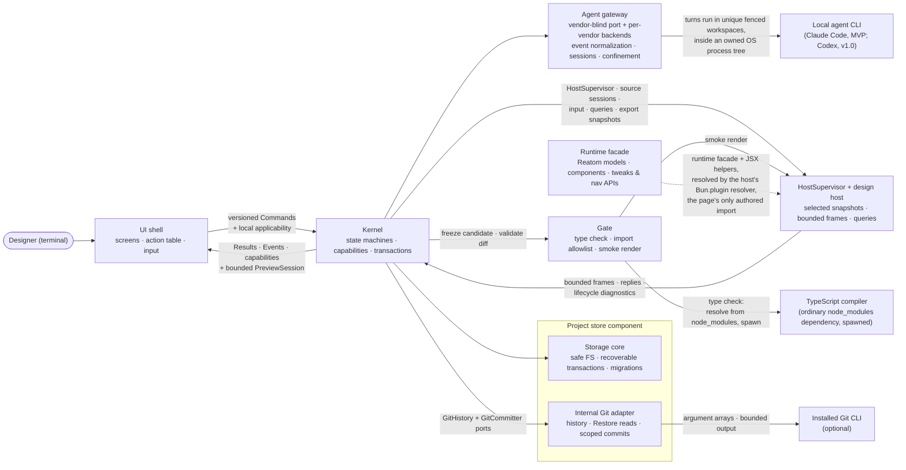

termcraft is one program built from seven components with strict boundaries and two deliberate process seams: the transport-neutral command/result/event boundary between the UI shell and the Kernel, and the design-host subprocess that is the only place agent-written design code ever executes. The Git adapter is an internal Project-store adapter behind Kernel ports, not an eighth top-level component. This document names the components, what each owns, and the runtime loop that connects them.

## Walkthrough

1. Seven components, each with a single responsibility:

   | Component | Owns |
   |------|----------------|
| **UI shell** | Screens; input interpretation (keys, mouse, composer slash menu); preview compositing; `/commit-page`, `/commit-infra`, and `/commit-all` command-row status plus shared confirmation presentation; the action table as the registry of triggers, labels, hints, and local screen/focus/modal applicability. Domain availability comes from Kernel capabilities and every command is revalidated by the Kernel. |
| **Kernel** | The only domain decision-maker: versioned commands in, typed results/events/capabilities out; explicit named Reatom state machines for turns, Restore, commits, export, preview, and migration; transaction and project-write coordination; confirmation-time `targetChatId` capture and `restoreActionId` binding; Git decisions through `GitHistory` and `GitCommitter`. |
| **Agent gateway** | Backends over vendors' official TypeScript SDKs: start, stream, confirmed process-tree cancel, health-check; normalization into backend-neutral events; per-chat session checkpoints; per-backend confinement to a unique turn workspace; fencing by turn, attempt, and lease nonce. Built today, in two tiers: a vendor-blind port plus a backend-agnostic shared tier — session-scope derivation, staging containment, the deny-by-default confinement rule, and the run loop itself (the terminal latch, the event queue, and both exit-confirmation ladders) — and one vendor tier, the Claude Code backend, behind it. The shared tier imports no vendor SDK at all. A second vendor (Codex, v1.0) becomes a sibling of that tier supplying only its own stream driver, message classifier, and tool vocabulary, not a change to the shared one. Each attempt runs inside an owned OS process tree, and every terminal outcome resolves only after that tree is confirmed exited. The Kernel now drives a turn end to end — admission, attempt, Gate validation with retry, and finalize (`core/turns`'s `runTurn`, composed for real by `turn.start`) — and consumes the normalized events as they stream. The MVP composition root (`src/entrypoint/model/create-shell.ts`, WP-4) now selects the one production backend (`createProductionAgentRegistry`) for a running Kernel. Session resume now works within one live process (phase-8 WP-7): `turn.start` reads a durable `workspaceIdentity` from `ProjectStore.readManifest().projectId` — the same manifest `core` already reads on every project open — and feeds it into `AgentBackend.sessionScope`. Cross-restart resume remains structurally unreachable for Claude: the backend's own account discriminator is always `null`, so the scope's account component falls back to a value random per process (storage-identity §6.2's own deliberate escape hatch), which is a stated design limit, not an open gap. |
| **Runtime facade** | `@termcraft/runtime`, the only import a saved page's author may write: selected Reatom v1001 primitives, `reatomComponent`, themed components with stable ids, tokens, tweaks, navigation, and runtime capabilities; resolved at runtime through the host's `Bun.plugin` resolver against termcraft's own installed dependency, so a design project never grows a `node_modules` of its own (master §4.1). It also owns the JSX helper surface the compiler's transform emits against — never named by a page. Built today: the token palette, page contract, and the full component catalog. Not yet: `defineTweaks` is a dormant declaration-only stub, interactive props (`onPress`/`onChange`/`onSelect`) are wired to the right handler but stay inert in the static render, the page-facing navigation API (`usePages().goTo(slug)`) is present but a dormant no-op — its host-protocol emission is unbuilt, so nothing carries a page's own navigation request out of the host, though the shell-side tab switch such a request would land in does now exist (`ui/workspace/model/page-selection.ts`, driven today by the user's own click/keys) — and the host resolver still serves the JSX helpers via the underlying `react/jsx-runtime` specifiers rather than a `@termcraft/runtime`-qualified path — all phase-7/phase-8 work. |
| **Gate** | Validation of the staging diff: `design/pages.json` manifest checks (including that every `entry` resolves to a real file in the tree), TypeScript checking against the generated `@termcraft/runtime` declaration, a WHOLE-TREE import allowlist that scans every code file once and resolves each entry's closure from the same pass, page-contract checks, smoke rendering, and lints. Scanning the tree rather than the entry files is what catches a forbidden import in a shared module no page's own source names, and reports it once instead of once per reaching page; the closures that pass falls out of are what every downstream cache, change report and invalidation is keyed on. The type checker itself is resolved, not embedded: at the pinned TypeScript major it is a per-platform native executable, an ordinary `node_modules` dependency resolved from the installed `typescript` package and spawned. Today all five lints are implemented: the determinism pair (unguarded timers, unguarded randomness), a dropped-id warning and an unlisted-navigation warning that each need extra context from the caller and skip silently without it, and an unpointed-element warning for a raw low-level element with no id. The smoke stage is fully wired end to end: the composition root (`src/entrypoint/model/create-shell.ts`, WP-4) builds `host`'s `SmokeRenderer` adapter over `runOneShotSession` and injects it into `createGateRunnerAdapter`, which drives `createSmokeRender`'s `SmokeRequest`/`smokeResultToErrors` mapping for real. The type-check stage is wired too (phase-8 Task 7): the composition root resolves a compiler path via `resolveCompilerPath()` and passes `src/runtime/generated/runtime-dts.ts`'s `RUNTIME_DTS` as `runtimeDts` on every construction, so the check runs live in the shipped configuration — a failed compiler resolution aborts shell construction rather than shipping a Gate that silently skips the check. Since design-tree phase 2 it runs as ONE `tsc` program over the whole tree, inside the same `GateRunner.runTree` pass as the allowlist scan and the closure walk, rather than one program per entry file inside `runGate`: the per-file program served a virtual FS holding only that file, so every page importing a shared module failed with a spurious `TS2307`. Each diagnostic is attributed to every page whose closure — from that same pass — contains the file it names. `checkManifest`, by contrast, is threaded a different way: the turn driver's own validation stage (`core/turns/model/validation.ts`) calls `runManifestSlice` directly once per turn, so the manifest-slice check runs on every live turn even though `GateRunner.runPage`'s own optional `checkManifest` port stays unused on that path. |
| **HostSupervisor** | Owns the isolated design-host subprocess and versioned length-prefixed protocol for preview, Gate smoke, export, and historical snapshots. `HostSupervisor.preview()` returns a `SupervisedPreviewSession` (blocker B4) — bounded latest-frame delivery, resize/set-mode/query/retry/close, and request timeouts, with the restart budget/circuit breaker composed in rather than sitting behind a separate handle type; UI never owns the process. Geometry queries (`checkHit`/`rectOf`/`describe`/`layoutTree`) are wired end to end (blocker B1). Ordered input forwarding and tweak/theme control are still part of the target `PreviewSession` contract but not yet implemented — today's facade deliberately omits them. |
| **Project store** | Portable ProjectState (`project.toml` at `format_version = 2`, carrying no page array), the canonical `design/` tree and its `pages.json` manifest, local workspace/session state, chats, append-only pin events under `pins/<slug>.jsonl`, `SafeProjectFs`, OS-held `ProjectLease`, recoverable transaction engine, verified migration backups, rebuildable projections, and the internal Git adapter implementing `GitHistory`/`GitCommitter`; trust remains machine-local outside the project. Every piece here is implemented and tested except the Git adapter, which has no code yet — it is v1 scope, governed by the Git-backed history design. |

2. The runtime loop merges terminal events, Kernel results/events/capabilities, and a dedicated bounded preview stream. The UI translates input through the action table; the Kernel revalidates commands and answers with typed results. Host frames reach the UI only through `PreviewSession`, with at most the latest pending full frame, so they cannot block domain events. Kernel, UI, and saved page models use named Reatom atoms, computeds, and actions; only DTOs cross the UI–Kernel boundary.
3. The Kernel boundary is transport-neutral. Commands and events are serializable and versioned, with `commandId`, `stateRevision`, and `eventSeq`, but daemon authentication, reconnect, multi-client subscriptions, and distributed locking are deliberately unspecified.
4. The design host is the second deliberate seam — the cage where agent-written code runs. Isolation is layered: process isolation, scrubbed environment and cwd, runtime-only imports, workspace trust, and — since the design-tree phase-1 closeout — realm-level capability denial inside the preview child (`src/host/session/model/capability-denial.ts`), which removes the eval/Function/Worker family from the realm a page executes in rather than trying to detect it in the source. The runtime-only import rule is carried entirely by source scans — the Gate's, and the host's own rescan before it links a page — with nothing underneath them: the host's module resolver must also serve the compiler-generated JSX helper specifiers, and it fails open, so a page smuggling an explicit helper import past both scans would run rather than fail to load. The specs record this as a defense-in-depth gap, not a broken rule; anything that weakens a scan removes the only thing enforcing it. `HostSupervisor` owns handshake and message limits, heartbeats, request deadlines, graceful/hard shutdown, backoff, and a restart circuit breaker. A crash or hang kills only the host; the preview shows a bounded error state and the app keeps working.
5. The UI shell never touches the Project store or host process directly. Stored state flows through Kernel commands and events; preview input, frames, and queries flow through the Kernel-owned `PreviewSession` facade.
6. The same supervisor opens source sessions for preview, Gate smoke, deterministic export, and Git-history snapshots. Export captures a fresh host per page and size through a bounded worker pool; Gate reads immutable candidate snapshots. Respawn per source is a correctness requirement, not merely an isolation preference: the runtime's module cache hands back the stale module for a re-imported path and query cache-busting does not cure it, so a host that outlived a source edit would render the previous source while reporting success. Nothing short of a fresh process fixes that. Respawning also resets Reatom prototype state scoped to that source session.
7. Prototype interactivity crosses the host boundary in exactly two runtime APIs: navigation events and tweak models. Everything else that moves is private Reatom state in the saved page model. (v1/phase-7 target; not yet implemented — today's interactive component props are wired to the correct handler but stay inert in the static headless render, tweaks are a declaration-only stub, and `usePages().goTo(slug)` is present in the runtime facade but still a dormant no-op — its host-protocol emission is unbuilt.)
8. Git interaction does not share the agent-turn lock wholesale. In v1 local slash-command mode keeps `/commit-page`, `/commit-infra`, and `/commit-all` available by capability while other turn-locked rows stay dimmed. Actual commit and final apply serialize through the project-write mutex. Because Git hooks may modify `.termcraft/`, final apply compare-and-swaps all source and record preconditions under that mutex before writing commit intent; drift fails without overwrite. Restore remains locked during the turn. Its durable `RestoreTransaction` preserves the captured `targetChatId` and UUIDv7 `restoreActionId`: source replacement and exactly-one audit append roll forward across restart without repeating Gate or source replacement. (`buildRestoreTransaction` is already implemented and unit-tested inside the store's transaction engine, but MVP wires no caller — Restore itself, and every Git-commands paragraph above, is v1 scope: the assembled Kernel deliberately DEFERS their `restore.*`/`commit.*` commands (Tier-C, rejected `CAPABILITY_UNAVAILABLE`), and there is no Git adapter yet to drive them.)
9. Agent confinement is defense-in-depth, and it is deliberately not the wall. The Gate is load-bearing: it validates an immutable candidate the agent cannot reach, and nothing the agent does inside its workspace can bypass it. On top of that the gateway adds a second, weaker layer around the running CLI — a deny-by-default veto on every tool call, allowing only file tools whose resolved path stays inside that turn's workspace and refusing shell and web tools outright — so a misbehaving agent is stopped early rather than merely caught late. Two properties make it hold: the backend also binds the CLI's working directory and only writable root to the same workspace, and the containment test resolves relative paths the way the agent itself would, then rejects any path segment that turns out to be a filesystem junction. The health probe is isolated the same way as a turn — its own settings-free session, a scratch working directory instead of the user's project, and the same veto — so nothing a project could plant can execute before the designer has answered the trust prompt.
10. Every attempt owns its process tree. The gateway creates one OS-level job for each attempt, spawns the vendor CLI itself so it can adopt the process into that job, and verifies the adoption actually landed rather than assuming it. From then on "did the run stop?" is a real question to the operating system — a live count of processes the job owns — not a guess from a process id. No outcome, successful or cancelled, is reported until that count reaches zero; if it cannot, the run reports an unconfirmed exit and the backend latches unhealthy until it is restarted, because a workspace with a possibly-live writer in it must not be snapshotted or reused. The job is released on every terminal path, which is also the last-resort reaper: releasing it kills anything still inside.
11. Failure-isolation note: agent rejection, Gate rejection, or interruption before commit intent changes no canonical source. After durable intent, `TurnTransaction` idempotently rolls all planned page, portable manifest, local active-page, agent-record, and pin-event writes forward; startup completes recovery before opening the Workspace. Unexpected target hashes enter a recovery conflict and are never overwritten. A canonical source already broken at launch remains available for an agent repair turn or explicit Git Restore.

## Source anchors

All seven components are real, tested code today (Runtime facade, Gate, HostSupervisor,
Project store, Agent gateway, the Kernel — as of kernel-assembly WP-1 — and, as of phase 7,
the UI shell). The Kernel (`core/`) is anchored below; its own doc status is tracked with
the Kernel section.

**UI shell — `src/ui/` (phase 7):** a leaf presentation module that imports only `core`'s
boundary DTOs and the `PreviewSession` facade, declares the `KernelPort` the composition root
satisfies, and keeps its own Reatom read-model ("mirror") fed by the Kernel event stream
(design §3.2/§3.3, two graphs). `main.tsx`/`demo.tsx` now mount `<App>` through
`src/entrypoint/` (terminal lifetime, signal shutdown, mode selection). The Kernel itself is
now real and assembled (`createKernel`, kernel-assembly WP-1 — see the Kernel section below),
and interactive mode now runs behind a REAL `KernelPort` (MVP gap closeout WP-4): `createShell`
opens (or creates) the caller's on-disk project, composes the production adapter graph
(`store`/`agent`/`gate`/`host` mapped onto `core/ports/`, WP-2) around it, assembles the
Kernel, and adapts it to `KernelPort` — `demo` mode alone still runs `ui/testing`'s in-memory
`FakeKernel`. Live agent-health derivation now runs for real (phase-8 WP-5): the composition
root's `createAgentHealthProbe` wraps the live `AgentBackend` and feeds Home's `r` re-check and
startup reading. Home's `agent`/`model`/`effort` combo no longer rides that probe (phase-8 Task
13, finding §2.7): `resolveDefaultAgentSelection` reads the registry's declared default
synchronously at composition and seeds `UiDeps.local.agentSelection` directly, so the combo
paints on the first frame rather than waiting behind the probe's cold spawn.
`KernelPort.preview()`'s `acknowledgeDisplay` is wired too (phase-8 Task 16):
`Kernel`'s public surface now exposes `publishFrame`/`acknowledgeDisplay` backed by a real
frame-token ledger, and `entrypoint/model/create-shell.ts`'s `toPreviewSessionHandle` pairs
every frame with a genuine `FrameIdentityV1`. Still open: full preview-frame streaming (the
consumer exists; session-change re-subscription is minimal).

- `src/ui/index.ts` — the module's public surface: `App`, `createUiDeps`, `KernelPort`, and the boundary types phase 8 injects
- `src/ui/kernel/` — the ui-declared `KernelPort`/`PreviewSessionHandle`, the single `EventEnvelopeV1` re-export (`model/events.ts`, the one tolerated `core/mailbox` type import) with its distributed `AnyEventEnvelope`, and `createDispatcher` (mints `commandId`, stamps `expectedRevision`)
- `src/ui/mirror/` — the UI-owned Reatom read-model: named `ui.mirror.*` atoms fed by a pure event reducer seeded from `kernel.snapshot` (`model/mirror.ts`), plus the UI-derived `screenAtom` (`model/screen.ts`, the D6 approximation until the typed snapshot lands). Four narrow, targeted exceptions live from `kernel.stateChanged` rather than staying merely advisory: the project slice's `projectId`/`trust` update from `kernel.project.finishOpen`/`setTrust`/`finishClose`'s own `metadata` (smoke-bugs closeout, `handlers/project.ts`) — the one channel an already-subscribed client has, since `kernel.snapshot` is never re-sent after bootstrap (kernel-command-contract §9); the turn slice's `phase`, which moves to `"running"` from `kernel.turn.beginAdmission`'s own `correlation.turnId`, so `turnRunning` (composer gating, Esc-to-cancel) is already true through the whole admission window, not only from `turn.started` (fix-bundle Task 11 fix round 1, `handlers/turn.ts`); and the project slice's two open-outcome fields — `openFailure`, folded from `kernel.project.blockOpen`'s own `{reason, failure}` metadata (read, never cast; unreadable metadata leaves the field alone with a warning) and deliberately preserved across `finishClose`, and `opening`, set by `kernel.project.beginOpen`/`beginCreate` and cleared by whichever outcome ends them. Those two are what turn a blocked open from a silent dead end into a named panel plus a recovery (`flows/launch.md` step 11); every other model/action stays advisory until the typed snapshot lands.
- `src/ui/theme/` — `SHELL_PALETTE` (the design `pal` object verbatim) and the `shellAttrs` bitmask helper; the shell carries its own palette because `ui` may not import `runtime`
- `src/ui/actions/` — the single action table: the slash-command registry, the hotkey registry, and the capability-driven availability/hint computation (`available`/`locked`/`unavailable`) the status bar and slash menu are views over (design §3.8/§3.10)
- `src/ui/status-bar/`, `src/ui/slash-menu/`, `src/ui/home/`, `src/ui/chat/`, `src/ui/preview/`, `src/ui/popups/`, `src/ui/spinner/` — the props-driven presentation components (status bar, slash menu, Home, chat parts, preview frame/panels + overlay geometry, the four popups, and the shared animated spinner, which is its own `reatomComponent` so its 80 ms tick repaints one line rather than the block around it), each design-faithful with documented flexbox-vs-canvas divergences
- `src/ui/text-input/` — the one shared insertion-point input `TextInput` (finding §2.6, phase-8 Task 18): the caret, the value-or-placeholder text, and the cursor cell, overlapping the placeholder's first cell while empty exactly as the design's own `text(...)` then `put(...)` at the same column does. Home's prompt box and the Workspace composer's input row both render through it now instead of two divergent copies; `PinInputPopup` keeps its own private cursor placement (its design source draws the cursor one column past a fixed-length value, never over a placeholder)
- `src/ui/workspace/` — the reactive Workspace shell (`ui/Workspace.tsx`) plus its pure logic: the layered `Esc` stack + focus model (`model/focus.ts`), tab-strip derivation and step order (`model/tabs.ts`), and the page switch itself (`model/page-selection.ts`: writes the UI-local page override and clears a selection made on the page being left)
- `src/ui/app/` — the composition: `createUiDeps` (`model/deps.ts`, whose connect-hook `runtime` atom owns the Kernel subscription, the frame consumer, the preview-session ask — a `preview.selectPage` dispatch memoised on the EFFECTIVE active page's `(slug, sourceHash)`, where "effective" is the UI-local tab pick when there is one and the Kernel's own active slug otherwise, so both a user's tab switch and an edit to the page already on screen re-ask through one producer — and the blocked-open recovery that dispatches `project.close` to walk the project machine out of `blocked`), the `App` root (`ui/App.tsx`), and the pure keymap + effectful intent layer (`model/keymap.ts`, `model/intent.ts`)
- `src/ui/testing/` — `FakeKernel`/`FakePreviewSession` and the typed event builders every `ui` test drives; `demo` mode is the only production caller left (MVP gap closeout WP-4)
- `src/entrypoint/model/create-shell.ts` — the composition root (WP-4): `interactiveShell` opens or creates the on-disk project (`store.openProject`/`createProject`), builds the production `store`/`gate`/`host`/`agent` adapter ring around it plus the injected host-spawn seam (`createHostSpawnCommand`/`createBunSpawn`), assembles `createKernel(deps)`, and adapts the result to `KernelPort`; `demoShell` still seeds `ui/testing`'s fakes. `openOrCreateProject` also returns whether the project already existed, and `probeProjectContent` folds that with a manifest read plus a chat listing into a three-way outcome (`resolveShellLaunch` turns it into `ShellLaunchV1` on the shell's own `launch` field, echoed onto `UiEnv.projectExists`) — a read failure resolves `"unknown"`, never a fabricated `"no-content"` (Gap D, fix-bundle spec §2.4, fix round 1)
- `src/entrypoint/model/bootstrap.ts`, `run-app.ts`, `process-boundary.ts` — mode/argv resolution, terminal acquisition and the one idempotent shutdown path, and the process signal/panic boundary (`uncaughtException`/`unhandledRejection` restore the terminal, report, then terminate the process via an injectable `ProcessExit` seam so the still-live renderer cannot re-corrupt the just-restored terminal and the project lease/host children release with it, M9). `run-app.ts` also dispatches `project.open` at startup, once, whenever `shell.launch.hasContent` is true — the one interactive caller of `project.open` (Gap D)
- `src/entrypoint/model/run-export.ts` — `runHeadlessExport`/`parseExportArgs`: the headless `termcraft export [dir]` CLI driver (WP-5 Phase D). It acquires NO renderer — it composes the SAME real interactive graph (`createShell("interactive", env)`), dispatches `project.open` then `export.start` straight at the `KernelPort`, awaits the terminal export event, then closes the shell on every exit path; the trust/zero-page/turn-running refusals and the resolved package directory are decided here, and `main.tsx`'s `termcraft export` argv branch is the only caller
- `docs/superpowers/specs/2026-07-13-termcraft-design.md` — §3.x the shell behaviour (action table, slash menu, focus/Esc, status bar) the components implement
- `docs/superpowers/specs/2026-07-16-kernel-command-contract-design.md` — §8/§9/§10 the commands, events, and capabilities the shell consumes

**Kernel — `src/core/` (kernel-assembly WP-1 — real, tested code today):** the only
domain decision-maker, fully self-assembled behind one public entry
(`createKernel`/`core/index.ts`): the seven named Reatom state machines, the command
mailbox (decode → dedupe → revision check → guard → handler → event publication), the
capability guard/projector, and a real command handler registry answering all 43
`CommandKindV1` members — deferred (Tier-C), not-yet-built, or composed for real, per
kind. The production adapter graph mapping `store`/`agent`/`gate`/`host` onto
`core/ports/` (WP-2) and the composition root that builds a real `KernelDeps` from it
(WP-4, `src/entrypoint/model/create-shell.ts`) have both landed: `bun start` now
constructs a real `Kernel` for interactive mode, and `demo` mode alone still runs
`ui`'s in-memory kernel double.

- `src/core/index.ts`, `src/core/types.ts` — the Kernel's public entry: `createKernel`
  plus every boundary type `ui` imports (the Command/Result/Event DTOs, `KernelDeps`) —
  nothing internal leaks through it (proven by `src/core/index.test.ts`)
- `src/core/kernel/index.ts`, `src/core/kernel/model/kernel.ts` — `createKernel`'s own
  assembly: the seven machines, the Kernel-held facts beyond their bare phases, the
  event bus wired to the capability-growth tracker, the dedupe ledger, and the dispatch
  pipeline, all inside one Reatom `context.start(...)` frame
- `src/core/mailbox/model/dispatch.ts`, `src/core/mailbox/model/event-bus.ts` — the
  command mailbox (decode → dedupe → revision guard → capability guard → handler →
  event publication) and the event bus (bootstrap `kernel.snapshot`, ordered `eventSeq`,
  schema-validated delivery)
- `src/core/machines/index.ts` — the shared state-machine factory and the seven
  `reatom*StateMachine` factories (project, turn, restore, commit, export, preview,
  migration)
- `src/core/capabilities/model/guards.ts`, `src/core/capabilities/model/projector.ts` —
  the one real capability guard and the projector the Kernel's own snapshot and growth
  events are built from
- `src/core/kernel/model/handlers/index.ts` (`createHandlerRegistry`) and its nine
  per-family modules (`project`, `chat`, `turn`, `page`+`pin`, `preview`+`export`,
  `selection`+`model`, plus the Tier-C `deferred` backstop) — every `CommandKindV1`
  resolves to a real handler, a Tier-C deferred rejection, or a documented
  not-yet-built no-op; `turn.start` composes `core/turns`'s `runTurn` for real
  (admission → attempt → Gate retry → finalize), publishes the real terminal outcome
  (`turn.cancelled` for a cancel, `turn.failed` otherwise) and, on the committed
  branch, the turn's own `page.descriptorsChanged` before `turn.completed`;
  `preview.selectPage`/`selectCurrent` establish a live session and publish a real
  `preview.sessionReady` naming the router's own live incarnation identity, and a
  host call refused for an exhausted restart budget now opens the preview circuit
  for real and announces it (`preview.circuitOpened`), which is what finally makes
  `preview.retry` reachable — the retry reissues the spec the established session
  was started with and republishes the same readiness pair on success, so a
  recovered preview leaves the shell's error panel instead of streaming behind it;
  the Kernel additionally SUBSCRIBES to `HostSupervisorPort.onEvent`, the sink that
  had no production consumer at all, so a session that established fine and then
  crash-looped reaches the shell as the same `preview.circuitOpened` instead of
  latching open in silence behind an endless `preparing preview…`, carrying the
  failing incarnation's own code so the shell can tell a page that threw from a host
  that never ran it;
  `export.start` composes
  `core/export`'s capture → render → assemble → publish chain for real (MVP gap
  closeout, Gap B), driving `HandlerContext.exportRunner.machine` (the full export
  `StateMachine`, mirroring `turnRunner`'s own precedent) and streaming
  `export.started`/`export.progress`/`export.completed`/`export.failed` live
- `src/core/kernel/model/handlers/page-descriptors.ts` — the tenth handler-folder
  module, and the only one that is not a command family: the shared
  `page.descriptorsChanged` producer (`buildPageDescriptors`, moved here out of
  `handlers/project.ts`, plus `publishPageDescriptorsChanged`) that both the project
  family on open and the turn family after a commit publish through. Its `before` list
  is `HandlerContext.currentPageDescriptors()`, tracked in `kernel.ts` off the Kernel's
  own published events, so §9's "every change carries its exact before/after
  source-hash binding" holds without a second source of truth
- `src/core/turns/index.ts` — the turn lifecycle `runTurn` composes: admission, attempt,
  candidate freeze, Gate validation, finalize/terminalize
- `src/core/protocol/index.ts` — the closed Command/Event DTO surface, per-kind payload
  schemas, and the canonical hash/id primitives underneath
- `src/core/ports/index.ts`, `src/core/ports/fakes/` — every port contract the Kernel
  consumes, and the full in-memory fake set `core`'s own tests are verified against;
  every port except `git-history`/`git-committer` (v1.0, out of MVP scope) now also
  has a real production adapter (WP-2), composed for the interactive path by
  `src/entrypoint/model/create-shell.ts` (WP-4)
- `src/core/project/index.ts` — the project startup surface (open sequence, trust,
  orphan-turn scan, recovery routing, page mutations, the page-remove-plan ledger)
- `docs/superpowers/specs/2026-07-13-termcraft-design.md` — §4.1 components and the
  kernel boundary this section's code now implements
- `docs/superpowers/specs/2026-07-16-kernel-command-contract-design.md` — authoritative
  Reatom state machines, DTOs, revisions, capabilities, and command concurrency
- `docs/architecture/code-structure.md` — the module DAG (`core` imports only
  `entities/` and its own `ports/`) and where the landed adapter graph maps
  `store`/`agent`/`gate`/`host` onto `core/ports/`

**Agent gateway — `src/agent/` (port + shared tier: `confinement`, `session`, `health`, `run`) and `src/agent/claude/` (the one vendor tier: `backend`, `query`, `run`, `tools`, `errors`):**

- `src/agent/types.ts` — the vendor-blind `AgentBackend` port and its vocabulary (`AgentTask`, `AgentRun`, `AgentRunOutcome`, `AgentHealthState`, `BackendCapabilities`, `SessionPlan`); imports no vendor SDK, so phase 6 lifts it into `core/ports/` unchanged
- `src/agent/index.ts` — the module's public entry: the port types plus `createProductionClaudeBackend()`, the only production wiring that exists
- `src/agent/confinement/model/policy.ts` — the backend-agnostic deny-by-default rule behind the tool veto; parameterized over a tool-name table so it holds no vendor names itself
- `src/agent/confinement/model/path-containment.ts` — the staging-containment test: normalize, boundary-safe prefix compare, relative paths resolved against the workspace (not termcraft's own cwd), and a reparse-point check on every segment from the workspace down to the target
- `src/agent/session/model/session-scope.ts` — the opaque per-`(backend, account, model, workspace)` scope string the store checkpoint is keyed by; effort is deliberately excluded so changing effort never invalidates a session
- `src/agent/health/model/probe.ts` — the backend-agnostic health-probe policy: a bounded deadline, closing the adopted process tree on every path, and never classifying an ambiguous read as ready; a backend supplies only its own message classifier
- `src/agent/run/model/engine.ts` — the shared run loop: one terminal latch that decides between natural completion and cancellation, the event queue, and both exit-confirmation ladders — moved out of the vendor tier so a second backend gets the same guarantees for free; a backend supplies only a stream-reading driver
- `src/agent/run/model/unconfirmed-exit-latch.ts` — the sticky per-backend lockout an unconfirmed exit sets, cleared only by restart
- `src/agent/claude/tools/model/vocabulary.ts` — Claude Code's own tool vocabulary fed into that shared rule: which file tools require a path, which default to the working directory, and which tools are denied outright
- `src/agent/claude/query/model/query-options.ts` — the per-attempt SDK options: workspace as cwd and only writable root, no external settings sources, the deny-by-default veto, and the spawn hook that makes the CLI ours to own
- `src/agent/claude/query/model/spawn-adopt.ts` — spawn-then-adopt into the owned tree, shared verbatim by a real turn and the health probe, with the membership re-read that turns "adopted" into a verified fact
- `src/agent/claude/run/model/drive-stream.ts` — the vendor stream driver: reads `SDKMessage`s, normalizes them, and claims the natural outcome; the run loop itself now lives in `agent/run` above
- `src/agent/claude/backend/model/backend.ts` — the backend instance: per-run tree ownership, closing the tree on every terminal outcome, and wiring the shared unhealthy latch in
- `src/agent/claude/backend/model/probe.ts` — the vendor half of health: a minimal isolated query classified into installed / not-logged-in / ready, backed by the shared deadline/close policy above
- `src/agent/claude/run/model/normalize.ts` — vendor messages into `AgentEvent`s (reasoning, tool, tool-failed, final, error, usage), dropping anything with no mapping; the tool-failure kind comes from a vendor `user` message's error-marked tool-result blocks and carries that result's own bounded error text, a hop that previously mapped to nothing and then to an id with no reason
- `src/infrastructure/process/model/job-object.ts`, `src/infrastructure/process/types.ts` — the owned process tree itself: a domain-free Windows Job Object with kill-on-close, an OS-read live process count, hard termination, and idempotent invalidating release
- `src/entities/design-tree/index.ts` — the design tree's shared vocabulary: the
  `design/pages.json` schema, `resolveDesignSpecifier`'s two legal import edges and its
  `.tsx`-then-`.ts` resolution, `resolveClosure`/`computeClosureHash`/`computeTreeRevision`,
  and the measured `isCodeFile`/`parsesJsx` predicates `gate` and `host` both key on
- `src/entities/turn/types.ts` — `AgentEvent` (the normalization target) and `TurnFence` (`turnId`/`attempt`/`leaseNonce`); the backend stamps every event and outcome with the fence, and `core/turns`'s `runTurn` now consumes both for real (fenced re-entry, terminal-outcome classification). A tool step carries the vendor's own tool-call id so the separate tool-failure event can name the step it belongs to by id rather than by position (the design's third step state, `✗ failed`); successes are deliberately not mirrored back
- `src/store/sandbox/model/staging-store.ts` — the unique per-turn workspace (`{userStateRoot}/sandboxes/<projectKey>/turns/<turnId>/workspace/`) a backend is confined to; the store creates it, and a live turn now gets one — `core/turns`'s `runAdmission` calls `StagingService.createTurnWorkspace`, satisfied by the production `createStagingAdapter` (WP-2) over this store and composed into `KernelDeps.staging` by the composition root (WP-4)
- `src/store/lease/model/lease.ts` — `leaseNonce()` mints a 128-bit base64url nonce in the shape a `TurnFence.leaseNonce` is meant to carry; nothing wires a store lease nonce into a turn fence yet
- `docs/superpowers/specs/2026-07-16-kernel-command-contract-design.md` — §7.2 the turn protocol above the backend, now driven for real by `core/turns`'s `runTurn` (see the Kernel section above)

**Runtime facade — `src/runtime/`:**

- `src/runtime/index.ts`, `src/runtime/types.ts` — the public facade entry point and shared page-contract types (`ThemeId`, `Size`, `ThemeTokens`, `PageMeta`)
- `src/runtime/model/define-page.ts` — `definePage`, read by the Gate from the AST without executing the page
- `src/runtime/model/reatom.ts` — Reatom v1001 re-exports (`atom`, `computed`, `action`, `wrap`, the `withAsync*` family, `reatomComponent`) under the facade's own names, plus a thin `withConnectHook` wrapper narrowing Reatom's raw `MaybeUnsubscribe` callback return to the facade's own `ConnectionHookResult` (§3.2) with no cast
- `src/runtime/model/tokens.ts` — the `dark-default` palette taken 1:1 from `design/termcraft-engine.js`; `light-default` is declared as v1.0 scope but not built
- `src/runtime/model/capabilities.ts` — `defineTweaks` (dormant declaration-only stub), `hostModeAtom`/`interactionModeAtom` (host-writable, but nothing writes them yet), `isExport`, `themeCapability` (resolves `dark-default` only), `usePages` (design §5.5's `usePages().goTo(slug)`, backed by a named dormant no-op action — the shell tab switch it would drive has since landed as the user-driven page switch (`ui/workspace/model/page-selection.ts`); the host-protocol emission that would reach it has not), `viewportSizeAtom`/`colorDepthAtom` (host-input atoms carrying fixed MVP defaults — 80x24 and 24-bit/truecolor — until a real host handshake seeds them)
- `src/runtime/model/jsx.ts` — the JSX helper re-exports a page compiles against; the module's own comment records that the `@termcraft/runtime`-qualified jsx-runtime specifier isn't wired end to end yet (see `src/host/session/model/resolver.ts` below)
- `src/runtime/ui/` (14 components — primitive, row, column, panel, separator, spacer, text, button, input, tabs, list, table, gauge, sparkline) — the themed component catalog; every component is real, but `Button.onPress`/`Input.onChange`/`Tabs.onSelect`/`List.onSelect` are wired to the correct OpenTUI handler and stay inert in the current static render, and `Separator` renders a plain color band where the design specifies glyph rules with weld tees (documented in-file as a divergence pending the phase-7 UI pass)
- `docs/superpowers/specs/2026-07-16-runtime-api-compatibility-design.md` — the v1 preview theme-override path, which does not exist in code yet (`usePages` above now carries the dormant navigation shape this spec fixes)

**Gate — `src/gate/`:**

- `src/gate/index.ts`, `src/gate/types.ts` — public entry point and the `GateError`/`GateWarning`/`GateResult` vocabulary
- `src/gate/model/gate.ts` — the PER-PAGE orchestrator (`runGate`): runs the page contract and all warning lints against the source; `checkManifest`/`smokeRender` are optional injected ports, so the gate still runs standalone with no kernel behind it. Neither the import scan nor the type check runs here — both belong to the whole-tree pass (`runTreeImports` in this same file, and the type check inside the adapter's `runTree`), because a shared module belongs to no single page. `smokeRender` (`model/smoke.ts`'s `createSmokeRender`) is real end to end in production — the composition root (`entrypoint/model/create-shell.ts`, WP-4) wires `host`'s `SmokeRenderer` adapter through it. `checkManifest` stays unwired on THIS port specifically — the turn driver reaches the manifest-slice check through a different entry point instead (`runManifestSlice`, called directly by `core/turns/model/validation.ts` once per turn). `GateInput` carries two further optional fields — `referencedIds` (feeds `dropped-id`) and `listedSlugs` (feeds `unlisted-navigation`) — and each lint skips silently when its field is absent, because the production `GateRunner.runPage` port carries neither field today. It also carries a REQUIRED `smoke: "run" | "skip"` with no default anywhere in the chain (port, adapter, model): design §8 step 8 scopes the smoke render to the pages whose closure actually changed, and either default would fail silently — `"skip"` would stop smoke-testing everything, `"run"` would make a caller that forgot to scope indistinguishable from one that scoped correctly. The turn's validation stage sets it from `selectChangedPages` over the closures the whole-tree pass just resolved; `page-descriptors.ts` passes `"run"` unconditionally, having no send-time read set to diff against
- `src/gate/model/import-scan.ts` — the static `@termcraft/runtime`-only import allowlist scan (tokenizer-based, not regex), plus a FATAL dynamic-code rejection (design §5.8) for `eval`/`Function` — a direct call, a call reached through parentheses or through a global receiver (`globalThis.eval(…)`), a bare reference, and the computed-string evasions (`globalThis["eval"]`). It applies NO suppression for a page's own display copy, and that is a deliberate trade rather than an omission: three separate suppression rules were each measured to hide a REAL call whenever the JSX reader confirmed an element the runtime does not see, so the ban over-approximates uniformly and display copy containing those words is refused (the author rephrases). Its doc comment records, for each evasion it still cannot catch, whether the runtime actually executes that shape — measured, not asserted. Those un-catchable evasions are what the runtime backstop below (`host/session/model/capability-denial.ts`) exists for: detection here, denial there
- `src/gate/model/jsx.ts` — `scanJsx`: a small recursive-descent JSX reader built directly on the installed TypeScript scanner's own JSX language variant (`scanJsxToken`/`scanJsxIdentifier`/`scanJsxAttributeValue`), replacing an earlier code-token heuristic outright. Over one pass of the whole source it yields every real element (tag name — dotted member expressions included, `id` presence, position) and every genuine children text range, fail-closed on anything malformed or unterminated — an unclosed tag or a mismatched close contributes nothing, never masking real code as "text". Inside a `{…}` expression container it lexes the code that is actually there: template literals are followed across their interpolations and a `/` that cannot be division is re-scanned as a regular expression, so neither construct's `}`-looking characters close the container early — and a `<` that is a relational operator is told apart from one this reader is re-lexing out of a failed element attempt, so a regular expression after a comparison is read as one. `lints.ts`'s `unpointed-element` lint consumes `scanJsx`'s elements directly; `readJsxTextRanges` hands the same read's text ranges to the tokenizer, which lexes around them instead of through them — one notion of where JSX text is, shared by both. `readHyphenatedName` stays a standalone token-array helper, used only by `lints.ts`'s `dropped-id` extraction (which also has to recognize the non-JSX `id: "x"` object-literal form). A DELIBERATE recursion ceiling (`MAX_JSX_NESTING_DEPTH = 64`) throws `JsxNestingTooDeepError` before nesting can reach the engine's own call-stack limit; `gate/model/tree-scan.ts` converts that throw, like any other per-file scan failure, into a fail-closed `UNSCANNABLE_SOURCE` diagnostic rather than letting it escape the synchronous whole-tree scan, and its second phase closes a related gap by computing the fixed point of files that cannot vouch for an import (a file whose own scan failed, or that transitively resolves into one)
- `src/gate/model/lexer.ts` — the gate's shared tokenizer (`tokenize`, the token stream every source scan reads) and the home of the perimeter's invariant: **no classification uncertainty may make executable code invisible to the scan.** A span it cannot confidently classify is scanned as CODE — never silently skipped, and never consumed by a token that runs past it. Both halves matter and both have been shipped broken once: lexing a page's prose as code let an apostrophe or an unterminated `/*` swallow the rest of the file, and then skipping what the JSX reader called prose made real code vanish wherever that reader saw an element the runtime does not. Classification is therefore demoted to deciding where token BOUNDARIES are forced: the source is lexed in WINDOWS delimited by the reader's children-text runs, so no token crosses one in either direction, and every character is lexed either way. INSIDE a window nothing is treated specially — prose and code are lexed identically, because a run the reader called text is code whenever it mis-read a type annotation as an element, and reading `/` as division there was measured to let a quote inside a real regular expression swallow an `import`, an `eval` and a closure edge at once. On top of that: the caller says whether the runtime parses this file as JSX at all (a `.ts` file has none, and a reader asked there invents it — and an invented run changes the EDGE LIST, not merely the lexing); a `/` is re-scanned as a regular expression wherever one can legally start, so a brace in a character class cannot desynchronise the brace stack; and anything the stream cannot account for — an unterminated literal, a comment the scanner walked past, a span it declined to lex — is re-lexed one character on. Tokens carry no prose mark, deliberately: a mark exists only to suppress findings, and every suppression rule tried on this branch was measured to hide a real one. And the boundaries themselves are not trusted alone — a run ending inside a genuine string literal flips this stream's quote parity against the runtime's, so the import allowlist and the closure-edge reader lex each JSX source TWICE, once with boundaries and once linearly, and union what they find
- `src/gate/model/scanner.ts` — the raw TypeScript-scanner primitives (`SK`, the token record — whose value is the scanner's COOKED text, so a unicode-escaped identifier is compared as the name it really is — `scanCodeToken`, an offset-to-line mapper) that both `jsx.ts` and `lexer.ts` build on. `scanCodeToken` threads a stack of what each open `{` actually is, so the `}` that resumes a template literal is re-scanned as a template token rather than read as a brace (left unresolved, the scanner takes the literal's closing backtick as the start of a fresh template and swallows the code after it). It is a separate file precisely so the tokenizer can depend on the JSX reader — scanner → jsx → lexer, a chain rather than a cycle; `lexer.ts` re-exports every symbol, so no call site had to move
- `src/gate/model/lexer.oracle.test.ts` — the differential oracle that decides whether the invariant above actually holds. For every input it compares what Bun does with the file (accept/reject, and Bun's own parse of the module's runtime import edges) against what the gate saw (the real whole-tree perimeter and the real closure-edge reader), across the repository's own sources, a systematic grid of the constructs a TypeScript lexer and a JSX parser read differently — generated for BOTH loaders, because half the differential space is the file kinds the runtime parses without JSX — every code point in a wide range, and seeded fuzz. It reports a failure when Bun accepts and executes a file whose import or `eval` the gate could not see, and the opposite one when the gate rejects legal input; a reproduction of the pre-fix reading is asserted to be flagged, so the oracle cannot pass by measuring nothing
- `src/gate/model/page-contract.ts` — literal-only `meta`/default-export contract check
- `src/gate/adapters/gate-runner.ts` — the production `core/ports` `GateRunner`: `runPage` (the full pipeline), `runManifestSlice`, and `extractPageMeta` — the page-contract stage alone, no type check and no smoke child, so a caller that only needs a page's declared size/theme/kit version neither pays for those stages nor is blocked by them. `core/kernel`'s `resolvePageSettings` is its one caller, filling a `PageMetaCache` miss
- `src/gate/model/lints.ts` — all five `GateWarningKind` lints are implemented: `unguarded-timer`/`unguarded-randomness` (a raw timer call, or a `Date`/`performance`/`Math.random` time source), `dropped-id` (a caller-supplied referenced id absent from the candidate's own declared literal ids), `unpointed-element` (a raw/low-level JSX open tag with no `id` prop — a capitalized tag is a Kit component and exempt), and `unlisted-navigation` (a navigation call whose literal target slug isn't in the caller-supplied listed slugs); `dropped-id` and `unlisted-navigation` each take an optional extra input and skip silently when the caller omits it
- `src/gate/model/manifest.ts` — the staged `pages.json` slice check (built, unwired)
- `src/gate/model/type-check.ts`, `src/gate/model/tsc-extract.ts` — `createTreeTypeChecker` (ONE `tsc` program over the whole tree, consumed by the adapter's `runTree`) and `resolveCompilerPath`'s resolution of the installed `typescript` package's compiler executable from `node_modules` (no per-user extraction); wired live in production (phase-8 Task 7) — the composition root's `createGateRunnerAdapter` call passes both the resolved compiler path and `src/runtime/generated/runtime-dts.ts`'s `RUNTIME_DTS` as `runtimeDts` on every construction
- `src/gate/ports/smoke-renderer.ts` — the `SmokeRenderer` port the gate declares, plus its `smokeResultToErrors` result mapper; `src/gate/model/smoke.ts`'s `createSmokeRender` is the driving factory that turns an injected `SmokeRenderer` into the gate's `smokeRender` port (source hash computed locally, parity-pinned by test against the host's own `computeSourceHash`); `src/host/adapters/smoke-renderer.ts`'s `createSmokeRendererAdapter` implements the port over `src/host/supervisor/model/one-shot.ts`'s `runOneShotSession`, and the composition root (WP-4) builds and injects it

**HostSupervisor / design host — `src/host/`:**

- `src/host/protocol/` — the versioned wire codecs: hello, control envelope, frame, strict JSON, and the hard size/geometry limits; `model/embedded-declaration.ts` holds this process's own `EMBEDDED_RUNTIME_DECLARATION` constant — an in-module handshake-identity literal, unrelated to npm distribution — shared by `main.tsx`'s `_host` branch and, since WP-4, every `HostSupervisorDeps`/`SmokeRendererAdapterDeps`/`ExportRenderAdapterDeps.runtimeDeclaration` the composition root builds
- `src/host/render/` — the headless OpenTUI renderer and its span-row/color/attribute mapping to the wire format, plus `model/error-capture.ts`'s render-error boundary (mounted inside the React renderer's own, which otherwise swallows a page's throw and paints the stack trace as if the page had rendered) and `model/geometry.ts`'s real `checkHit`/`rectOf`/`describe`/`layoutTree` primitives over the live renderable tree (a deterministic tree-walk, not OpenTUI's own native hit-grid — see that file's doc comment for why); `describe`'s `kind` and `layoutTree`'s nodes are honestly incomplete until `@termcraft/runtime`'s component catalog assigns semantic kinds/labels
- `src/host/session/model/host-state-machine.ts` — the in-child protocol state machine; accepts only `mount`/`shutdown` before `ready` and `resize`/`set-mode`/`ping`/`query-hit`/`query-rect`/`query-describe`/`query-layout`/`shutdown` after (blocker B1) — no `key`/`click`/`set-tweak` kinds exist yet; a query whose carried `frameIdentity` no longer matches the current sealed frame gets the typed `STALE_FRAME` refusal (§7.1), not a fatal
- `src/host/session/model/source-mount.ts` — `loadPage`: whole-closure hash verification against the tree revision's inventory and the graph-aware import re-scan (`scanClosureImports`), a documented defense-in-depth backstop with an acknowledged residual gap (a literal `require("react")` is indistinguishable from the transform's own phantom require)
- `src/host/session/model/capability-denial.ts` — `denyDynamicCodeCapability()`: a runtime backstop for the design §5.8 dynamic-code ban, called from `entry.ts` as the first statements of the `loadPage` dependency — i.e. immediately before a page's own source is ever `import()`ed, the first point untrusted page code can run. Replaces `eval`, the `Function` global (which also closes the `[].constructor.constructor` chain), the three sibling "function kind" intrinsics (`AsyncFunction`/`GeneratorFunction`/`AsyncGeneratorFunction`), and `Worker` with callable-but-throwing stand-ins in this realm, closing every spelling that reaches those objects through an alias, a computed key, a parenthesis nest, or a constructor chain — not only the ones `gate/model/import-scan.ts`'s token scan can see textually. `entry.ts` also calls `warmPageMetaValidator()` immediately before it, to force-compile Zod's lazily-JIT'd `pageMetaSchema` while `Function` still works, since that schema's own first parse happens only after this point. Does NOT close an aliased `require` (`const r = require; r("node:vm")…`) — invisible to the import scanner and not a `globalThis` property this function can replace — tracked open in `docs/superpowers/red-debt.md`
- `src/host/session/model/resolver.ts` — the `Bun.plugin` runtime resolver; serves `@termcraft/runtime` plus the underlying `react/jsx-runtime`/`react/jsx-dev-runtime` specifiers, and fails open by design (no allowlist check of its own — enforced only by the scans above and beside it)
- `src/host/session/model/entry.ts` — `runHostStdio`: real stdio wiring, the 1 s heartbeat timer, the `FrameDecoder` pump, process exit; driven by `src/main.tsx`'s first `import.meta.main` branch when its argv is `_host --stdio` (`parseHostArgs`)
- `src/host/supervisor/model/spawn-command.ts` — `createHostSpawnCommand`: the one `SpawnCommand` shape termcraft's npm distribution needs (`[execPath, srcRoot, "_host", "--stdio"]`, the same shape `package.json`'s `start` script uses) — the earlier compiled-vs-dev branch is gone (phase 8, master §4.1); called by the composition root (WP-4) to build the one spawn command its `HostSupervisorPort`/`SmokeRenderer`/`ExportRenderPort` adapters share
- `src/host/supervisor/model/spawn.ts` — the production `Bun.spawn` adapter: env allowlist, fresh scratch cwd. The allowlist forwards exactly one variable beyond locale/timezone — the parent's resolved diagnostic-trace path — because the child is a re-invocation of this same binary and would otherwise resolve that setting against its own scratch cwd, writing the design host's diagnostics somewhere nobody reads. The scratch cwd's lifecycle is now closed at both ends (phase-8 Task 7): `createBunSpawn` deletes a child's own scratch directory once `proc.exited` resolves (clean exit, forced stop, or crash alike), and `sweepStaleScratchDirs` — called once by the composition root (`src/entrypoint/model/create-shell.ts`), never per spawn — removes `termcraft-host-*` directories older than a day, catching the ones a run that died without reaping could never clean up itself. That sweep is bounded per run (`SCRATCH_SWEEP_MAX_DELETIONS`, 64, oldest first): it is synchronous and runs before the renderer exists, so an inherited backlog would be dead time on the boot path, and a cap turns that into a delay of a few launches instead. A truncated sweep says so on `console.warn` rather than reading like a complete one. Before this, nothing ever removed them; HANDOFF Finding 5 flagged the accumulation, and a one-time sweep run for this fix found 922 stragglers in `%TEMP%` (586 empty, 336 holding a single leftover debug-log trace file), of which the 645 already older than a day were removed on the spot.
- `src/host/supervisor/model/handshake.ts` — pre-handshake negotiation and limit agreement
- `src/host/supervisor/model/heartbeat-watchdog.ts` — the 5 s liveness watchdog plus the unresponsive-request-count trip
- `src/host/supervisor/model/restart-policy.ts` — per-`(pageSlug, sourceHash)` restart budget, base-2 backoff, circuit breaker
- `src/host/supervisor/model/frame-broker.ts`, `preview-relay.ts` — the capacity-1 latest-wins frame delivery and its across-restart relay
- `src/host/supervisor/model/session.ts` — `createHostSession`: one incarnation end-to-end (spawn → negotiate → mount → ready → pump → resize/setMode/ping/query → stop). Every post-ready request now enqueues through `control-queue.ts` (a full outbound queue rejects a new discrete command with `HOST_BACKPRESSURED`, and `HostSessionDeps.onBackpressureChange` observes the backpressured/writable edges); every unsolicited inbound envelope now offers into `control-mailbox.ts`, drained on a clock-scheduled timer decoupled from the pump so a slow/absent consumer can genuinely trip `CONTROL_BACKPRESSURE` (blocker wiring, phase 6 slice 6D)
- `src/host/supervisor/model/supervisor.ts` — `createHostSupervisor`: the multi-session owner (restart/backoff/circuit, ≤10 global host cap, bounded start queue). `preview()` returns a `SupervisedPreviewSession` (blocker B4) — the restart-surviving identity/frames/retry/close the old `PreviewHandle` provided, composed with `resize`/`setMode`/`query`/`interactionMode` that rebind to whichever incarnation is currently live (`sessionFor`'s doc comment); there is no separate `PreviewHandle` type anymore
- `src/host/supervisor/model/preview-session.ts` — `createPreviewSession`, the UI-facing facade over one SINGLE, non-restarting `HostSession`; exposes `identity`/`mode`/`interactionMode`/`frames`/`resize`/`setMode`/`query`/`retry`/`close` — its own doc comment records the B4 decision and why `supervisor.ts` follows the same pattern rather than reusing this function directly; `forwardInput`/`setTheme`/`setCapabilities`/tweaks remain intentionally absent, and `retry()` is a no-op stub (there is no restart/backoff/circuit to act on for a single incarnation)
- `src/host/supervisor/model/control-queue.ts`, `control-mailbox.ts` — the bounded ordered outbound/inbound control primitives; now wired into `session.ts`'s live path (see above)
- `src/host/supervisor/model/one-shot.ts` — `runOneShotSession`: the smoke/export one-shot driver (no pump, no restart); the child now seals the REAL resolved layout tree into the `ready` body, decoded here via `decodeLayoutNode` (WP-5 Phase A) — no longer the `{}` stub — while the bulk `frame` snapshot itself stays a documented non-conformant MVP stand-in never routed to a preview stream
- `src/host/supervisor/model/export-pool.ts` — `createExportPool`: the bounded per-page/size worker pool, results published in manifest order
- `docs/superpowers/specs/2026-07-16-host-supervision-protocol-design.md` — blocker B1 closed the geometry-query wire kind + `query()` correlation + the child's real `checkHit`/`rectOf`/`describe`/`layoutTree` (§4.2, §7.1); `forwardInput`/`setTheme`/`setCapabilities`/tweaks/`key`/`click`/`set-tweak` remain unbuilt, and `describe`/`layoutTree`'s semantic kind/label vocabulary awaits `@termcraft/runtime`'s component catalog

**Project store — `src/store/`:**

- `src/store/index.ts`, `src/store/types.ts` — the Store port contract; the shape phase 6 lifts verbatim into `core/ports/`
- `src/store/model/factory.ts` — `createStore`/`openProject`/`createProject`: the launch sequence (durability pre-flight → lease → `SafeProjectFs` → journal format → recover transactions → migrations → schemas → orphan-turn scan → open) and the creation sequence (durability pre-flight → create-new `.termcraft/` → ...)
- `src/store/safe-fs/model/` — `SafeProjectFs`: the no-follow path walk (`no-follow.ts`), managed-path grammar (`path-rules.ts`), file-type/hardlink checks (`leaf-identity.ts`), per-namespace size limits (`limits.ts`), hashed candidate snapshots (`candidate.ts`)
- `src/store/lease/model/lease.ts` — the Windows OS-held `ProjectLease`: advisory-only metadata, never force-broken
- `src/store/trust/model/trust-store.ts`, `subject.ts` — the machine-local `TrustStore`, keyed by canonical path + filesystem identity + `projectId` + Git identity
- `src/store/toml/model/project-toml.ts`, `workspace-toml.ts` — `project.toml`/`workspace.local.toml` schema, decode/encode, and the too-new-format gate
- `src/store/toml/model/gitignore.ts` — the generated `.termcraft/.gitignore`; a courtesy mirror only — `StoragePathPolicy`, the live commit-scope planner it mirrors, is out of MVP scope and has no code
- `src/store/jsonl/model/reader.ts`, `line-codec.ts`, `chat-index.ts` — the from-byte-zero streaming reader with three-way tail classification, and the rebuildable paginated chat index
- `src/store/transaction/model/engine.ts`, `plan.ts`, `write-mutex.ts` — the core commit protocol (install payload → plan → intent → roll forward → commit marker) and its chained write-mutex permit guard
- `src/store/transaction/model/recovery.ts` — the startup scan that classifies and resolves every unfinished transaction before project state is exposed
- `src/store/transaction/model/wrappers.ts` — `admitTurn`/`finalizeTurn`/`terminalizeTurn` (the real `TurnTransaction`, exercised by the full test matrix); `buildExportPublishTransaction` now has a real MVP caller too (`src/store/adapters/export-publish.ts`, WP-5), while `buildRestoreTransaction`/`buildMigrationTransaction` remain built and unit-tested with no MVP caller (Restore/migration are out of MVP scope)
- `src/store/transaction/model/crash-harness.ts` — the mandatory fault-injection harness: a real child process crashes at each durability boundary and the parent asserts recovery lands correctly
- `src/store/sandbox/model/staging-store.ts` — the per-turn workspace store
- `src/store/migration/model/registry.ts` — the migration chain, deliberately empty (format version 1 is the first shipped format), and the shared too-new-format-counter check
- `src/store/migration/model/backup-store.ts` — the verified external backup protocol every future migration must complete first
- `src/store/projections/model/page-meta-cache.ts`, `diagnostics-store.ts`, `render-cache.ts` — the three independently quota'd rebuildable caches
- `docs/superpowers/specs/2026-07-16-projections-observability-scale-design.md` — the operations log and partial Gate/host diagnostics merge, neither of which has code yet

**Git adapter — no code yet (an internal Project-store adapter per `docs/architecture/code-structure.md`, not an eighth component):**

- `docs/superpowers/specs/2026-07-16-git-backed-page-history-design.md` — governing canonical-source model, `GitHistory`/`GitCommitter` ports, history/Restore flow, scoped commit orchestration, and export-source rule

**Cross-cutting:**

- `docs/superpowers/specs/2026-07-13-termcraft-design.md` — §4.1 components and the kernel boundary, §4.2 the design host and isolation layers, §5.7 rendering determinism, §6.3 the gate
- `docs/superpowers/specs/2026-07-16-production-hardening-decisions-design.md` — seven-component boundary and production precedence
- `docs/superpowers/specs/2026-07-16-turn-durability-staging-design.md` — transaction, mutex, workspace, fencing, and recovery ownership at the turn/Kernel level beyond what `store/transaction`'s code anchors above cover
